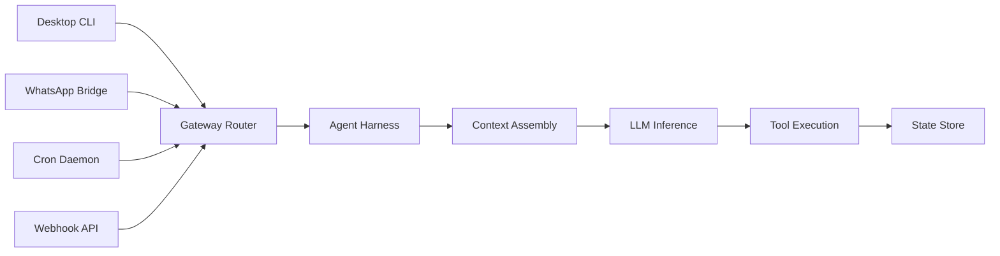
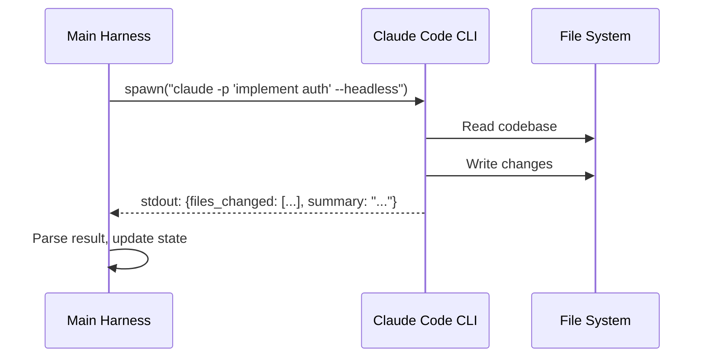

## Introduction

In previous lessons, we examined how models reason, how tools give agents hands, and how orchestrators coordinate multi-agent flows. But where does the agent actually execute? What protects your database when an agent decides to drop a table? What feeds observations back into the model, measures latency, records execution traces, and stops runaway spending?

That infrastructure is the **agent harness**.

An LLM on its own is just a probability engine predicting next tokens. When you ask a model to solve a problem, it generates text. But to turn that text generation into an autonomous, safe, and reliable agent, you need a software environment that wraps around the model.

If the model is the engine, the harness is the chassis, transmission, dashboard, seatbelt, and telemetry black box all in one.

### ELI5: The flight simulator and cockpit harness

Imagine hiring an elite pilot. You wouldn't test their skills by throwing them into the open sky without instruments, radios, or controls. And when they fly a real aircraft, they don't operate the jet engines with bare hands.

Instead, they sit inside a **cockpit harness**:
- A standardized dashboard displaying fuel levels and altitude (Context & State)
- Flight sticks and pedals that safely translate intentions into hydraulic movement (Tool Registry & Sandboxes)
- Circuit breakers and stall warnings that prevent fatal maneuvers (Guardrail Interceptors)
- A black-box flight recorder logging every decision and instrument reading (Trajectory Telemetry)

When training, that same pilot sits in a **flight simulator harness** where weather, engine failures, and turbulence can be safely introduced, measured, and replayed.

In agent engineering, the harness is that cockpit and testing simulator.

> **Key takeaway:** The agent harness is the foundational software environment that decouples model reasoning from system execution. In production systems, harness design determines reliability far more than switching between model checkpoints.

---

## The formal harness architecture: H = (E, T, C, S, L, V)

In modern agent engineering, a production-grade harness is defined as a tuple of six interconnected subsystems:

```
+-----------------------------------------------------------------------+
|                             AGENT HARNESS                             |
|                                                                       |
|  +--------------------+   +-------------------+   +----------------+  |
|  | Context Manager    |   | Execution Loop    |   | State Store    |  |
|  | (C) Window & Budget|-->| (E) Reason & Act  |<--| (S) Memory &   |  |
|  +--------------------+   +---------+---------+   | Checkpoints    |  |
|                                     |             +----------------+  |
|                                     v                                 |
|                       +-------------+-------------+                   |
|                       | Lifecycle Interceptors    |                   |
|                       | (L) Hooks, Policies, Auth |                   |
|                       +-------------+-------------+                   |
|                                     |                                 |
|                                     v                                 |
|  +----------------------------------+------------------------------+  |
|  | Tool Registry & Sandboxes (T)                                   |  |
|  | Isolated Execution, Rate Limits, Container Boundaries           |  |
|  +----------------------------------+------------------------------+  |
|                                     |                                 |
|                                     v                                 |
|  +-----------------------------------------------------------------+  |
|  | Verification & Evaluation Interface (V)                         |  |
|  | Trajectory Recorder, Assertions, Benchmarking, Mocks            |  |
|  +-----------------------------------------------------------------+  |
+-----------------------------------------------------------------------+
```

### 1. Execution Loop ($E$)
The core driving loop that invokes the LLM, parses structured tool call arguments, handles malformed JSON outputs, and feeds observations back into the reasoning flow.

### 2. Tool Registry & Sandboxes ($T$)
The security-bounded catalog of capabilities exposed to the model. Rather than giving an agent raw shell access or direct production database credentials, the harness routes tool calls through isolated execution sandboxes (e.g., Docker containers, gVisor, or WebAssembly runtimes) with strict permission policies.

### 3. Context Manager ($C$)
The component responsible for prompt hydration, system instruction assembly, dynamic retrieval injection, and sliding-window token management. It ensures that the model sees the right information without exceeding the context window or diluting attention.

### 4. State Store ($S$)
Maintains session state, message history, intermediate tool outputs, and execution checkpoints. When an agent run fails or gets paused for human approval, the state store allows the harness to resume execution without losing progress.

### 5. Lifecycle Interceptors ($L$)
Middleware hooks that run before and after every agent turn and tool invocation:
- `pre_turn`: Validate user permissions, inspect input for prompt injection.
- `pre_tool`: Enforce rate limits, ask for human confirmation on dangerous operations (e.g., file deletion, money transfers).
- `post_tool`: Sanitize tool return values, scrub sensitive secrets before they enter the model's context.
- `post_turn`: Enforce output safety policies and calculate token cost.

### 6. Verification & Evaluation Interface ($V$)
The telemetry and benchmarking layer. It captures the agent's full execution trajectory (thoughts, actions, inputs, outputs, timestamps, token counts) and runs automated assertions to verify whether the agent achieved its goal.

---

## Why harness engineering matters more than model upgrades

Many engineering teams fall into the "model-first trap": when an agent fails in testing, their first reaction is to upgrade to a larger model, adjust the temperature, or tweak prompt phrasing.

However, empirical research and real-world post-mortems show that most production agent failures are **harness failures**:

| Observed Failure | Initial (Flawed) Diagnosis | Real Harness Cause | Harness Solution |
|------------------|---------------------------|-------------------|------------------|
| Agent hallucinates non-existent API fields | "Model is hallucinating" | Tool schema documentation is ambiguous or untyped | Strict Pydantic schemas in the tool registry ($T$) |
| Agent deletes an unintended database table | "Model went rogue" | Tool executed with unrestrained admin privileges | Sandboxing with read-only replicas and permission interceptors ($L$) |
| Agent gets stuck repeating the same search | "Model lacks reasoning depth" | Zero-delta observations not detected by execution loop | Harness stagnation detector & loop circuit breaker ($E$) |
| Runaway costs on complex requests | "Model is too verbose" | No token budget caps or window pruning in runtime | Dynamic token budgeter in Context Manager ($C$) |
| Flaky evaluation scores | "Model is non-deterministic" | Eval harness had unmocked external dependencies | Isolated, reproducible sandbox with mock tools ($V$) |

> **The Golden Rule of Agent Engineering:** Treat the model as a swappable commodity reasoning engine. Build all guarantees—safety, determinism, isolation, and cost control—into the harness.

---

## Runtime harness vs. evaluation harness

A crucial distinction in agent development is the difference between running an agent in production and evaluating an agent in testing.

```
                           +-------------------+
                           |  Agent Definition |
                           |  (Prompt + Tools) |
                           +---------+---------+
                                     |
               +---------------------+---------------------+
               |                                           |
               v                                           v
    +-----------------------+                   +-----------------------+
    |    RUNTIME HARNESS    |                   |  EVALUATION HARNESS   |
    | (Production Serving)  |                   |  (Testing & Benchmarks)
    +-----------------------+                   +-----------------------+
    | Real APIs & Sandboxes |                   | Mocked / Seeded Env   |
    | Real User Auth & ACLs |                   | Golden Test Datasets  |
    | Production Streaming  |                   | Trajectory Assertions |
    | Live Circuit Breakers |                   | Regression Scoring    |
    | Cloud Observability   |                   | SWE-bench Benchmarks  |
    +-----------------------+                   +-----------------------+
```

### The Runtime Harness (Production Serving)
The runtime harness is built for latency, throughput, reliability, and security. It handles:
- Multi-tenant authentication and tenant isolation
- Streaming tool execution tokens to frontend user interfaces
- Rate limiting and distributed circuit breakers
- Live database transactions and third-party API integration

### The Evaluation Harness (Testing & Benchmarks)
The evaluation harness (exemplified by industry benchmarks like SWE-bench, GAIA, and AgentBench) is built for **reproducibility** and **precision**. It provides:
- **Hermetic environments:** Isolated test sandboxes spun up per test case (e.g., fresh container per git repository).
- **Mocked time and tools:** Deterministic tool responses so that tests do not fail due to network blips.
- **Trajectory recording:** Capturing every intermediate LLM call, token count, and tool output for automated scoring.
- **Grading assertions:** Programmatic validation (unit test pass rates, database state diffs, rubric-based LLM-as-a-judge).

---

## Building a modular agent harness in Python

Here is an architectural implementation of a production harness demonstrating interceptors, context budgeting, and sandboxed tool execution:

```python
import time
from typing import Any, Callable, Dict, List, Optional
from dataclasses import dataclass, field

@dataclass
class TrajectoryStep:
    step_number: int
    thought: str
    tool_name: Optional[str]
    tool_args: Optional[Dict[str, Any]]
    observation: Optional[str]
    latency_ms: float
    tokens_used: int

@dataclass
class HarnessState:
    session_id: str
    goal: str
    history: List[Dict[str, str]] = field(default_factory=list)
    trajectory: List[TrajectoryStep] = field(default_factory=list)
    total_tokens: int = 0
    max_token_budget: int = 20000

class ToolExecutionError(Exception):
    """Raised when a tool fails or violates sandbox policies."""
    pass

class AgentHarness:
    def __init__(self, model_client: Any, max_steps: int = 10, max_token_budget: int = 25000):
        self.model = model_client
        self.max_steps = max_steps
        self.max_token_budget = max_token_budget
        self.tools: Dict[str, Callable] = {}
        self.pre_tool_interceptors: List[Callable] = []
        self.post_tool_interceptors: List[Callable] = []

    def register_tool(self, name: str, fn: Callable):
        """Register a tool with the harness."""
        self.tools[name] = fn

    def add_pre_tool_interceptor(self, hook: Callable[[str, Dict[str, Any]], None]):
        """Interceptors that validate or mutate tool calls before execution."""
        self.pre_tool_interceptors.append(hook)

    def add_post_tool_interceptor(self, hook: Callable[[str, Any], Any]):
        """Interceptors that sanitize or transform tool outputs."""
        self.post_tool_interceptors.append(hook)

    def execute_tool_sandboxed(self, tool_name: str, args: Dict[str, Any]) -> str:
        """Executes a tool within safety boundaries and interceptors."""
        if tool_name not in self.tools:
            raise ToolExecutionError(f"Tool '{tool_name}' is not in the approved registry.")

        # Run pre-tool interceptors (e.g. security checks, rate limits)
        for hook in self.pre_tool_interceptors:
            hook(tool_name, args)

        start_time = time.perf_counter()
        try:
            # Execute in sandbox
            raw_result = self.tools[tool_name](**args)
        except Exception as e:
            raw_result = f"Error executing {tool_name}: {str(e)}"
        
        # Run post-tool interceptors (e.g. secret redaction, output formatting)
        result = raw_result
        for hook in self.post_tool_interceptors:
            result = hook(tool_name, result)

        return str(result)

    def run(self, goal: str, system_instructions: str) -> Dict[str, Any]:
        """Main execution loop with context budgeting and telemetry."""
        state = HarnessState(session_id="sess_001", goal=goal, max_token_budget=self.max_token_budget)
        state.history.append({"role": "system", "content": system_instructions})
        state.history.append({"role": "user", "content": goal})

        for step in range(1, self.max_steps + 1):
            if state.total_tokens >= state.max_token_budget:
                return {"status": "error", "reason": "Token budget exceeded", "state": state}

            step_start = time.perf_counter()
            
            # 1. Model Reasoning Turn
            response = self.model.generate(messages=state.history)
            state.total_tokens += response.tokens_used

            if response.is_final_answer:
                state.trajectory.append(TrajectoryStep(
                    step_number=step,
                    thought=response.thought,
                    tool_name=None,
                    tool_args=None,
                    observation=None,
                    latency_ms=(time.perf_counter() - step_start) * 1000,
                    tokens_used=response.tokens_used
                ))
                return {"status": "success", "result": response.final_answer, "state": state}

            # 2. Tool Execution via Sandboxed Harness
            tool_name = response.tool_call_name
            tool_args = response.tool_call_args
            observation = self.execute_tool_sandboxed(tool_name, tool_args)

            # 3. Record Trajectory & Update Context
            elapsed = (time.perf_counter() - step_start) * 1000
            state.trajectory.append(TrajectoryStep(
                step_number=step,
                thought=response.thought,
                tool_name=tool_name,
                tool_args=tool_args,
                observation=observation,
                latency_ms=elapsed,
                tokens_used=response.tokens_used
            ))

            state.history.append({"role": "assistant", "content": f"Called {tool_name}"})
            state.history.append({"role": "user", "content": f"Observation: {observation}"})

        return {"status": "incomplete", "reason": "Max steps reached", "state": state}
```

---

## Interactive Harness Diagnostic & Interceptor Playground

Test how harness interceptors protect systems from common failure modes. Toggle interceptors on and off and run test requests to observe the harness telemetry:


```html
<div id="harness-playground" style="font-family: -apple-system, BlinkMacSystemFont, 'Segoe UI', Roboto, sans-serif; max-width: 900px; margin: 2rem auto; background: #f8f9fa; border-radius: 16px; box-shadow: 0 4px 24px rgba(0,0,0,0.08); padding: 24px; box-sizing: border-box;">
  <h3 style="margin: 0 0 6px 0; color: #1a1a2e; font-size: 1.25rem;">Interactive Agent Harness Diagnostic Lab</h3>
  <p style="margin: 0 0 16px 0; color: #666; font-size: 0.88rem;">Enable or disable harness interceptors, select an incoming test payload, and watch how the harness responds.</p>

  <!-- Control Row -->
  <div style="display: grid; grid-template-columns: 1fr 1fr; gap: 16px; margin-bottom: 16px;">
    <!-- Interceptors Toggle Box -->
    <div style="background: white; border-radius: 12px; border: 1px solid #e2e8f0; padding: 14px;">
      <div style="font-weight: 700; font-size: 0.85rem; color: #1e293b; margin-bottom: 10px;">🛡️ Active Harness Interceptors</div>
      <div style="display: flex; flex-direction: column; gap: 8px;">
        <label style="display: flex; align-items: center; gap: 8px; font-size: 0.82rem; cursor: pointer;">
          <input type="checkbox" id="h-sandbox" checked style="accent-color: #3b82f6;">
          <span><strong>Sandbox Isolation</strong> (blocks destructive system calls)</span>
        </label>
        <label style="display: flex; align-items: center; gap: 8px; font-size: 0.82rem; cursor: pointer;">
          <input type="checkbox" id="h-budget" checked style="accent-color: #3b82f6;">
          <span><strong>Token Budget Guard</strong> (caps max token consumption)</span>
        </label>
        <label style="display: flex; align-items: center; gap: 8px; font-size: 0.82rem; cursor: pointer;">
          <input type="checkbox" id="h-redact" checked style="accent-color: #3b82f6;">
          <span><strong>PII & Secret Redactor</strong> (scrubs API keys from observations)</span>
        </label>
        <label style="display: flex; align-items: center; gap: 8px; font-size: 0.82rem; cursor: pointer;">
          <input type="checkbox" id="h-stagnation" checked style="accent-color: #3b82f6;">
          <span><strong>Stagnation Circuit Breaker</strong> (detects repetitive loops)</span>
        </label>
      </div>
    </div>

    <!-- Payload Selector Box -->
    <div style="background: white; border-radius: 12px; border: 1px solid #e2e8f0; padding: 14px;">
      <div style="font-weight: 700; font-size: 0.85rem; color: #1e293b; margin-bottom: 10px;">🎯 Select Test Scenario</div>
      <select id="h-scenario" style="width: 100%; padding: 8px 10px; border-radius: 8px; border: 1px solid #cbd5e1; font-size: 0.82rem; margin-bottom: 12px;">
        <option value="benign">1. Normal Task: Search product inventory</option>
        <option value="destructive">2. Malicious Task: 'rm -rf /' via code interpreter</option>
        <option value="secret_leak">3. Accidental Leak: Tool returns AWS/GCP access token</option>
        <option value="stagnant">4. Stagnant Loop: Agent repeats identical query 5x</option>
        <option value="budget_blowout">5. Token Drowning: Massive 100K token response</option>
      </select>
      <button id="h-run-btn" style="width: 100%; padding: 10px; background: #3b82f6; color: white; border: none; border-radius: 8px; font-weight: 600; font-size: 0.85rem; cursor: pointer; transition: background 0.2s;">
        Execute Through Harness
      </button>
    </div>
  </div>

  <!-- Telemetry Console Output -->
  <div style="background: #0f172a; border-radius: 12px; padding: 16px; color: #e2e8f0; font-family: ui-monospace, SFMono-Regular, Menlo, Monaco, Consolas, monospace; font-size: 0.8rem; min-height: 180px; box-shadow: inset 0 2px 8px rgba(0,0,0,0.5);">
    <div style="display: flex; justify-content: space-between; border-bottom: 1px solid #334155; padding-bottom: 6px; margin-bottom: 10px; color: #94a3b8; font-size: 0.75rem;">
      <span>HARNESS TELEMETRY LOG</span>
      <span id="h-status-badge" style="padding: 2px 8px; border-radius: 10px; background: #1e293b; color: #38bdf8;">READY</span>
    </div>
    <div id="h-console-log" style="line-height: 1.6; white-space: pre-wrap;">Select a scenario above and click 'Execute Through Harness' to see telemetry events.</div>
  </div>
</div>

<script>
(function() {
  const btn = document.getElementById('h-run-btn');
  const consoleLog = document.getElementById('h-console-log');
  const badge = document.getElementById('h-status-badge');
  const scenarioSelect = document.getElementById('h-scenario');

  btn.addEventListener('click', function() {
    const sandbox = document.getElementById('h-sandbox').checked;
    const budget = document.getElementById('h-budget').checked;
    const redact = document.getElementById('h-redact').checked;
    const stagnation = document.getElementById('h-stagnation').checked;
    const scenario = scenarioSelect.value;

    let logs = [];
    logs.push(`[${new Date().toLocaleTimeString()}] INGRESS: Initializing execution frame...`);
    logs.push(`[INFO] Model: gemini-2.5-pro | Context Window Allocated: 32,768 tokens`);

    if (scenario === 'benign') {
      badge.textContent = 'SUCCESS (200 OK)';
      badge.style.background = '#065f46';
      badge.style.color = '#34d399';
      logs.push(`[EXEC] Step 1: Model generated thought -> 'Need to query catalog API for item SKU'`);
      logs.push(`[TOOL-PRE] Interceptor: Permission check -> PASSED (Tool: query_catalog)`);
      logs.push(`[SANDBOX] Dispatching query to isolated read-only catalog worker...`);
      logs.push(`[TOOL-POST] Observation returned: 24 items in stock. Latency: 64ms`);
      logs.push(`[EGRESS] Final Answer delivered safely. Total Tokens: 412 | Budget Consumed: 1.6%`);
    } else if (scenario === 'destructive') {
      logs.push(`[EXEC] Step 1: Model generated thought -> 'Need to clear directory caches using shell'`);
      logs.push(`[CALL] Invoking tool: execute_shell(command='rm -rf /')`);
      if (sandbox) {
        badge.textContent = 'BLOCKED (403 FORBIDDEN)';
        badge.style.background = '#7f1d1d';
        badge.style.color = '#f87171';
        logs.push(`[SECURITY ALERT] Sandbox Interceptor fired! Destructive pattern detected: 'rm -rf'`);
        logs.push(`[ACTION] Tool execution aborted. Error returned to model: 'Command rejected by security policy'`);
        logs.push(`[AUDIT] Security event logged to SIEM. Agent state preserved cleanly.`);
      } else {
        badge.textContent = 'FATAL EXPLOIT';
        badge.style.background = '#450a0a';
        badge.style.color = '#ef4444';
        logs.push(`[CRITICAL WARNING] Sandbox is DISABLED! Executing raw command on host...`);
        logs.push(`[DISASTER] Host filesystem corrupted! System crash simulation.`);
      }
    } else if (scenario === 'secret_leak') {
      logs.push(`[EXEC] Step 1: Querying legacy internal config service...`);
      logs.push(`[TOOL-RAW] Observation: 'db_host=prod-db; token=AIzaSyD-EXAMPLE998234SK'`);
      if (redact) {
        badge.textContent = 'REDACTED & SAFE';
        badge.style.background = '#075985';
        badge.style.color = '#38bdf8';
        logs.push(`[PRIVACY INTERCEPTOR] Detected high-entropy GCP API key in tool response.`);
        logs.push(`[SANITIZED] Replaced secret with '[REDACTED_API_KEY]'.`);
        logs.push(`[CONTEXT] Safe observation appended to model history.`);
      } else {
        badge.textContent = 'DATA LEAK';
        badge.style.background = '#7c2d12';
        badge.style.color = '#fb923c';
        logs.push(`[LEAK DETECTED] Secret entered LLM context unredacted! Risk of exfiltration.`);
      }
    } else if (scenario === 'stagnant') {
      logs.push(`[EXEC] Step 1..3: Agent querying weather API with identical arguments 'location=paris'`);
      if (stagnation) {
        badge.textContent = 'CIRCUIT BROKEN';
        badge.style.background = '#78350f';
        badge.style.color = '#fbbf24';
        logs.push(`[CIRCUIT BREAKER] Stagnation Interceptor: 3 consecutive zero-delta tool calls!`);
        logs.push(`[RECOVERY] Injecting directive: 'Observation unchanged. Pick an alternative strategy.'`);
        logs.push(`[EGRESS] Graceful fallback executed. Loop terminated safely.`);
      } else {
        badge.textContent = 'INFINITE LOOP';
        badge.style.background = '#450a0a';
        badge.style.color = '#ef4444';
        logs.push(`[LOOP] Iteration 15.. 20.. Agent stuck in cognitive loop. 14,000 tokens wasted.`);
      }
    } else if (scenario === 'budget_blowout') {
      logs.push(`[EXEC] Step 1: External API returned 85,000 tokens of raw HTML table dumps.`);
      if (budget) {
        badge.textContent = 'BUDGET ENFORCED';
        badge.style.background = '#065f46';
        badge.style.color = '#34d399';
        logs.push(`[BUDGET GUARD] Response exceeds 8,000 token per-observation limit!`);
        logs.push(`[COMPACTION] Summarizing payload into key structural facts (reduced to 320 tokens).`);
        logs.push(`[CONTEXT] Token window preserved. Total session budget usage: 14%.`);
      } else {
        badge.textContent = 'BUDGET EXHAUSTED';
        badge.style.background = '#7f1d1d';
        badge.style.color = '#f87171';
        logs.push(`[OUT OF MEMORY] Context window exceeded 32,768 limit. Model threw 400 Bad Request.`);
      }
    }

    consoleLog.textContent = logs.join('\n');
  });
})();
</script>
```


---

## Harnesses on Google Cloud & Vertex AI

When deploying agents on Google Cloud, the **Agent Development Kit (ADK)** and **Vertex AI Agent Engine** provide a production-ready harness stack:

- **Vertex AI Agent Engine:** Provides a managed runtime environment that handles session persistence, multi-tenant authentication, and scalable execution across Google Cloud infrastructure.
- **Code Execution Sandboxes:** Vertex AI offers managed code interpreter sandboxes that execute agent-written Python in secure, isolated containers with no access to internal VPC resources.
- **ADK Interceptors:** ADK supports pre-step and post-step middleware hooks for auditing, cost estimation, and content filtering.
- **Cloud Trace & Cloud Logging Integration:** Every tool call and model reasoning step can be automatically emitted as distributed OpenTelemetry spans, giving you end-to-end visibility into agent trajectories.

---

## Harness components: automations, worktrees, spine

Beyond the runtime and evaluation halves, production harnesses standardize three shared components:

| Component | What it is | Why it matters |
|---|---|---|
| **Automations** | Scheduled or event-driven jobs the harness owns ("nightly memory consolidation", "weekly eval run") | The harness maintains and improves itself without a human typing commands ([Event-driven and scheduled agents](../event-driven-and-scheduled-agents/)) |
| **Worktrees** | An isolated workspace per task - separate git worktree, directory or container | Parallel agents never fight over the same files; a failed run is discarded by deleting its worktree |
| **Spine** | One ordered, append-only log of every action across all agents | The ground truth when two agents disagree; enables replay, audit and post-mortems |

A useful test of a harness: *can I explain, from one file, exactly what every agent did yesterday?* Automations keep it running, worktrees keep it safe, and the spine keeps it explainable.

### Multi-Channel Gateway Architecture

In production harnesses, agents are rarely limited to a single chat interface. Production harnesses can accept input from multiple channels simultaneously, acting as a gateway router:

- **Desktop CLI**: Direct terminal interaction (e.g., an interactive TUI).
- **WhatsApp/Messaging Bridge**: Mobile messaging integration for non-technical users.
- **Cron Daemon**: Scheduled background tasks like daily reports, monitoring, or data syncs.
- **Webhook Listener**: Event-driven triggers from external systems (e.g., a GitHub PR being opened).

All channels feed into the *same* harness runtime. The agent doesn't care where the message came from; the harness unifies the context and handles the execution.



### Headless CLI Integration Pattern

Harnesses do not need to do everything themselves. A powerful pattern is delegating complex, domain-specific tasks to external coding agents running as headless background processes. 

For example, a harness might spawn:
- **Claude Code CLI** (`claude -p "task" --headless`)
- **Aider** (`aider --message "task" --yes`)
- **Pi Agent** (`pi -p "task"`)

These tools run as non-interactive subprocesses. The main harness captures their `stdout`, parses the results, and integrates the findings into the main workflow. This `delegate_task` pattern allows a coordinating agent to utilize specialized, pre-packaged coding tools without reinventing their specific execution loops.



### Local-First Architecture Emphasis

While cloud-first architectures (like Vertex AI or AWS Bedrock) dominate enterprise deployments, **local-first** agent architectures are gaining massive traction for privacy and latency reasons.

In a local-first harness:
- **100% On-Device Execution:** No cloud API calls are made for orchestration or state management.
- **Local Memory Stores:** Memory is stored in local, readable files (e.g., `SOUL.md`, `MEMORY.md`, or a local `state.db`).
- **Maximum Privacy:** Sensitive codebase information or personal data never leaves the machine.
- **Offline Capability:** The system continues to work without internet access (except for external LLM API calls, unless using local models).

Local-first harnesses trade the seamless scalability of cloud infrastructure for unmatched security and developer ergonomics.

## Best practices & common anti-patterns

### Best practices
1. **Enforce hard token and step budgets:** Never allow an agent to run with unbound loops. Always set `max_steps` and `max_token_budget`.
2. **Isolate tool execution:** Run shell commands, code evaluation, and SQL queries in dedicated sandboxes or read-only replicas.
3. **Redact secrets at the boundary:** Never allow raw database credentials, internal bearer tokens, or user PII into the model's conversation history.
4. **Log the full trajectory:** Store timestamps, raw model inputs, tool arguments, and parsed outputs to enable regression testing and replay debugging.

### Common anti-patterns

| Anti-Pattern | Why It Fails | What to Do Instead |
|--------------|--------------|--------------------|
| **Naked Model Calls** | Calling `gemini.generate_content()` in application code without a harness wrapper | Wrap all LLM interactions in a harness with timeouts and error handling |
| **Direct Execution** | Executing agent-generated code directly in the web server process | Use containerized sandboxes or isolated serverless runners |
| **Trusting Model Termination** | Assuming the model will stop calling tools when it finishes | Enforce programmatic completion verification in the harness |
| **Un-scrubbed Error Cascades** | Passing full stack traces and internal database schemas into LLM context | Sanitize error messages before feeding them back as observations |

---

## Key takeaways

- The **harness** is the runtime and evaluation environment that wraps around the model. It handles execution, tools, context, state, lifecycle hooks, and verification.
- The formal architecture is expressed as $H = (E, T, C, S, L, V)$.
- Production reliability is primarily a function of **harness engineering**, not model capability.
- **Runtime harnesses** optimize for security, latency, and throughput; **evaluation harnesses** optimize for determinism, isolation, and reproducible scoring.
- Never execute agent tools without boundary interceptors: sandboxes, token budgets, secret redactors, and circuit breakers.

---

## Further reading

- [Google Cloud Vertex AI Agent Engine Overview](https://docs.cloud.google.com/agent-builder/agent-engine/overview)
- [ADK Middleware and Callbacks Guide](https://adk.dev/)
- [SWE-bench: Can Language Models Resolve Real-World GitHub Issues?](https://www.swebench.com/)
- [Anthropic Research: Building Effective Agents](https://www.anthropic.com/research/building-effective-agents)
- [OpenTelemetry Semantic Conventions for Generative AI](https://opentelemetry.io/docs/specs/semconv/gen-ai/)

---

[Previous Lesson: Orchestrators](../18-orchestrators/) | [Next Lesson: Looping ->](../20-looping/)
