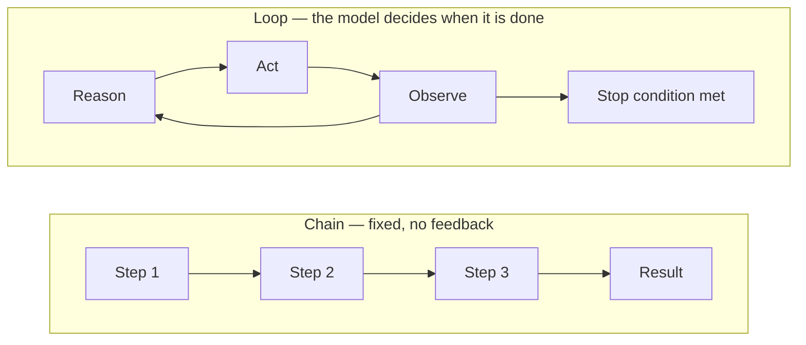
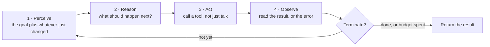
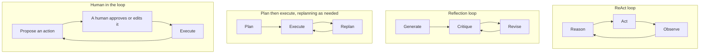
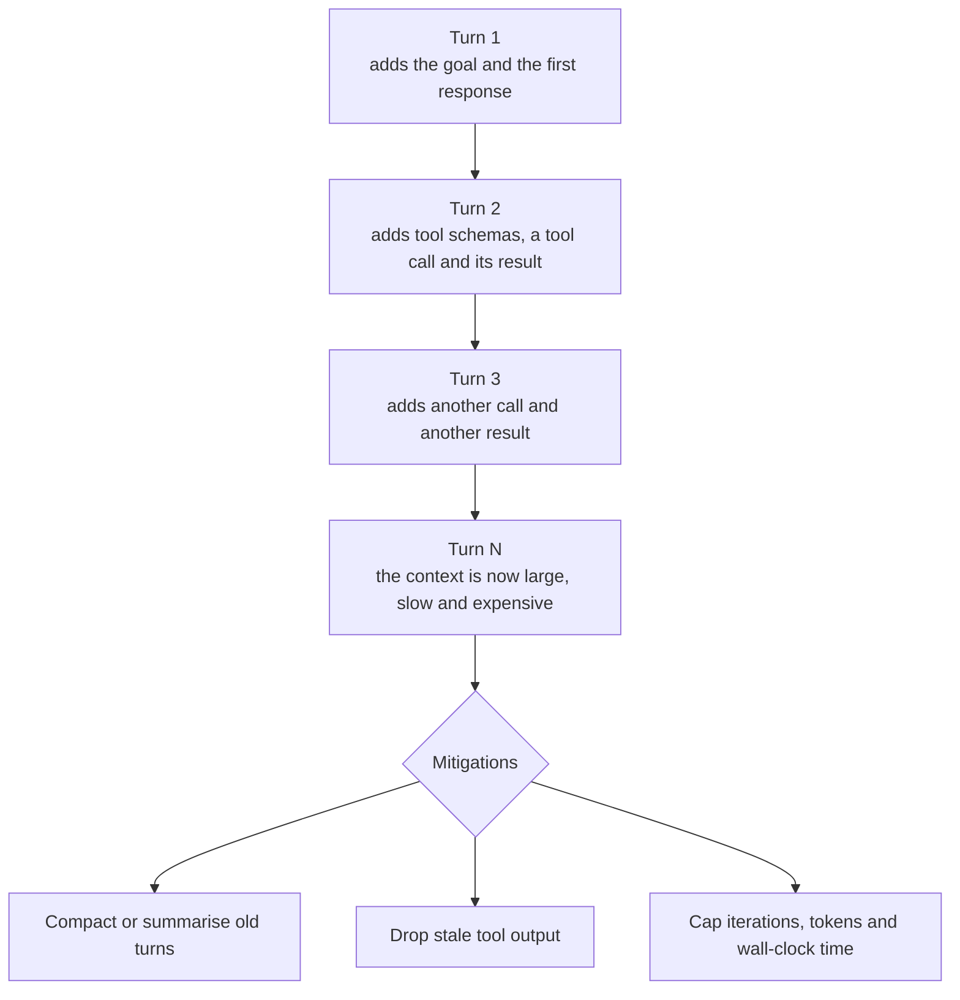

## Introduction

In the early days of working with Large Language Models, developers wrote single prompts. If they needed a multi-step task completed, they chained a few prompts together in a fixed sequence: Prompt A $\to$ Prompt B $\to$ Prompt C.

That works well for predictable workflows. But real-world problem solving is rarely linear.

When a human software engineer debugs a broken build, they do not follow an unalterable checklist. They look at the error log, formulate a hypothesis, inspect a file, apply a tentative fix, run the test suite, see if new errors appear, and repeat this cycle until the tests pass.

The capability that transforms a language model into an autonomous agent is **the loop**.

### ELI5: The Roomba vs. the model train

Think about two automated toys:

A **model train** runs on a fixed track. It moves forward smoothly and reliably, but if a toy block is sitting across the tracks, the train will derail. It cannot see the block, cannot decide to slow down, and cannot steer around it. That is a traditional linear script or prompt chain.

A **robot vacuum (like a Roomba)** operates in a continuous loop:
1. **Perceive:** Move forward until a bump sensor clicks or a laser detects a wall.
2. **Reason:** "I hit an obstacle on the front-right; rotating 45 degrees left will clear it."
3. **Act:** Spin wheels to turn.
4. **Observe:** Check if the path ahead is now clear.
5. **Repeat:** Continue until the entire floor plan has been cleaned.

An AI agent loop operates on the exact same principle. Instead of wheel motors and bumper switches, it uses LLM reasoning and API tools.

> **Key takeaway:** A prompt is a single question. A chain is a fixed sequence. A loop is an autonomous control system where an agent repeatedly reasons, acts, and observes until its goal is achieved.

---

## The evolution from chains to loops

To understand why loops are so powerful, consider how our interaction with AI models has evolved:

```
1. Single Turn:
   Input ------------> [ LLM ] ------------> Output

2. Linear Chain:
   Input -> [LLM 1: Draft] -> [LLM 2: Polish] -> [LLM 3: Format] -> Output

3. Autonomous Loop:
            +--------------------------------------------+
            |                                            |
            v                                            |
   Input -> [Perceive & Reason] -> [Act: Call Tool] -> [Observe Result]
            |
            +--> Goal Met? ---> Final Answer
```

| Paradigm | Control Logic | Can It Handle Unexpected Errors? | Best Use Case |
|---|---|---|---|
| **Single Prompt** | One-shot request | No | Quick Q&A, translation, text styling |
| **Linear Chain** | Pre-programmed sequence | No (any broken step halts the chain) | Document processing, ETL summarization |
| **Directed Acyclic Graph (DAG)** | Conditional branching | Partially (only pre-coded branches) | Fixed business approval trees |
| **Autonomous Loop** | Model-driven feedback loop | **Yes** (adapts strategy based on observation) | Coding agents, deep research, debugging |

---



## The anatomy of the loop: Perceive $\to$ Reason $\to$ Act $\to$ Observe

Every iteration through an agent loop is called a **turn** or **step**. Each step moves through four distinct phases:

```
                      +-------------------+
                      |   1. PERCEIVE     |
                      | Ingest goal, tool |
                      | outputs & memory  |
                      +---------+---------+
                                |
                                v
                      +-------------------+
                      |    2. REASON      |
                      | LLM analyzes data |
                      | & decides next op |
                      +---------+---------+
                                |
                                v
                      +-------------------+
                      |     3. ACT        |
                      | Execute tool or   |
                      | generate answer   |
                      +---------+---------+
                                |
                                v
                      +-------------------+
                      |    4. OBSERVE     |
                      | Collect result &  |
                      | evaluate progress |
                      +---------+---------+
                                |
            Goal satisfied? ----+---- Need more info?
                  |                         |
                  v                         v
            [TERMINATE]             [LOOP TO STEP 1]
```



### 1. Perceive
The agent ingests the current state of the world. At step 1, this is the user's objective and system instructions. On subsequent steps, it includes the cumulative history of what tools have been called and what those tools returned.

### 2. Reason
The LLM deliberates. It asks itself:
- What was the original goal?
- What have I learned from previous observations?
- What information or actions are still missing?
- Which tool should I invoke next, and with what arguments?

### 3. Act
The agent emits a structured decision. If it has reached a solution, it generates the final response. If it still needs information or action, it generates a **tool call request** (function name and JSON arguments).

### 4. Observe
The harness executes the requested tool in the external environment (runs SQL query, fetches webpage, executes Python snippet) and injects the output back into the agent's context as an **Observation**.

If the exit condition is met, the loop terminates. Otherwise, it loops back to **Perceive** with the new observation in memory.

---

## The 4 fundamental loop patterns

Not all loops work the same way. In production agent architecture, four core loop patterns dominate:

### 1. The ReAct Loop (Reason + Act)
The foundational agent loop introduced by Yao et al. (2022). The agent alternates between generating an explicit reasoning trace ("Thought:") and an action ("Action: tool_name(...)").

```
User: "What is the market cap of Google divided by its current employee count?"
Turn 1:
  Thought: I need Google's current market cap. I will search for it.
  Action: search("Alphabet market capitalization 2026")
  Observation: Alphabet market cap is approximately $2.2 Trillion.
Turn 2:
  Thought: Now I need Alphabet's total employee count.
  Action: search("Alphabet total employee count 2026")
  Observation: Alphabet has approximately 185,000 employees.
Turn 3:
  Thought: I have both numbers. I need to divide 2.2T by 185,000.
  Action: calculator("2200000000000 / 185000")
  Observation: 11891891.89
Turn 4:
  Thought: I have the final answer.
  Final Answer: Approximately $11.89 Million per employee.
```

### 2. The Reflection & Critique Loop (Generator $\to$ Critic)
Rather than calling external APIs, the loop runs between a generator agent and an evaluator agent to polish quality.

```
Draft Code ---> [ Critic Agent: Lint & Test ]
      ^                       |
      |          Fails tests? |
      +-----------------------+
                              | Passes tests
                              v
                        Final Output
```

### 3. The Plan-Execute-Replan Loop
Before acting, the agent creates a multi-step checklist. After each tool call, it reviews the checklist, marks items as completed, and dynamically rewrites remaining steps if an unexpected hurdle is discovered.

### 4. The Human-in-the-Loop (HITL) Interactive Loop
The loop executes autonomously for non-destructive operations (read files, query APIs), but intentionally pauses the loop and yields control to a human for approval whenever a high-stakes action is decided (deploy to production, transfer funds, delete tables).

---



## Mechanics of state & token accumulation

The single most important technical reality of agent loops is **token growth**.

In a standard agent loop, the model cannot retain internal hidden state between API calls. Therefore, every iteration must pass the entire conversation history back to the model:

$$\text&#123;Total Tokens at Step &#125; N = \text&#123;System Prompt&#125; + \text&#123;Goal&#125; + \sum_&#123;i=1&#125;^&#123;N&#125; \Big( \text&#123;Thought&#125;_i + \text&#123;Action&#125;_i + \text&#123;Observation&#125;_i \Big)$$

```
Turn 1: [System] + [Goal]                                  -> 500 tokens
Turn 2: [System] + [Goal] + [T1 + A1 + Obs1]               -> 1,800 tokens
Turn 3: [System] + [Goal] + [T1..Obs1] + [T2..Obs2]        -> 3,400 tokens
Turn 4: [System] + [Goal] + [T1..Obs2] + [T3..Obs3]        -> 5,600 tokens
```

Notice that token consumption grows **quadratically** across iterations. If an agent loops 15 times, it is repeatedly reprocessing turns 1 through 14 on every single turn.

In Lesson 21 (Loop Engineering), we will examine how to counteract this using in-loop context compaction and sliding windows.

---

## Python implementation: A minimal autonomous loop

Here is a pure-Python agent loop illustrating the perceive-reason-act-observe cycle:

```python
from typing import Callable, Dict, Any, List

class AgentLoop:
    def __init__(self, model_client: Any, tools: Dict[str, Callable], max_turns: int = 8):
        self.model = model_client
        self.tools = tools
        self.max_turns = max_turns

    def run(self, user_goal: str) -> str:
        messages: List[Dict[str, str]] = [
            {"role": "system", "content": "You are a helpful agent. Use tools to solve the user goal. When finished, emit FINAL_ANSWER: <answer>"},
            {"role": "user", "content": user_goal}
        ]

        for turn in range(1, self.max_turns + 1):
            print(f"\n--- Turn {turn} of {self.max_turns} ---")

            # 1 & 2: Perceive & Reason (Model Turn)
            response = self.model.chat(messages=messages)
            content = response.content
            print(f"Agent: {content}")

            # Check termination condition
            if "FINAL_ANSWER:" in content:
                return content.split("FINAL_ANSWER:")[1].strip()

            # 3: Act (Parse tool call)
            tool_name, tool_args = self.parse_tool_call(content)
            if not tool_name or tool_name not in self.tools:
                messages.append({"role": "user", "content": f"System Error: Tool '{tool_name}' does not exist."})
                continue

            # 4: Observe (Execute tool and capture feedback)
            print(f"Executing: {tool_name}({tool_args})")
            tool_result = self.tools[tool_name](**tool_args)
            print(f"Observation: {tool_result}")

            # Inject observation back into message history for next turn
            messages.append({"role": "assistant", "content": content})
            messages.append({"role": "user", "content": f"Observation: {tool_result}"})

        return "Loop terminated: Reached maximum turn budget without completing goal."
```

In Google Cloud ADK, this loop is encapsulated declaratively in the `LoopAgent`:

```python
from google.adk.agents import LoopAgent, LlmAgent

# ADK LoopAgent coordinates sub-agents until an exit condition is met
refinement_loop = LoopAgent(
    name="code_refiner",
    sub_agents=[coder_agent, tester_critic_agent],
    max_iterations=5
)
```

---



## Interactive Visualizer: Autonomous Agent Loop Simulator

Step through an autonomous agent loop solving a multi-step debugging problem. Observe how context tokens accumulate and watch the cycle advance through each stage:


```html
<div id="loop-sim-container" style="font-family: -apple-system, BlinkMacSystemFont, 'Segoe UI', Roboto, sans-serif; max-width: 900px; margin: 2rem auto; background: #f8f9fa; border-radius: 16px; box-shadow: 0 4px 24px rgba(0,0,0,0.08); padding: 24px; box-sizing: border-box;">
  <h3 style="margin: 0 0 6px 0; color: #1a1a2e; font-size: 1.25rem;">Autonomous Agent Loop Simulator</h3>
  <p style="margin: 0 0 16px 0; color: #666; font-size: 0.88rem;">Step through an autonomous ReAct loop as an agent investigates and fixes a broken REST endpoint.</p>

  <!-- Cycle Status Pipeline -->
  <div style="display: grid; grid-template-columns: repeat(4, 1fr); gap: 8px; margin-bottom: 20px;">
    <div id="phase-perceive" style="background: white; border: 2px solid #e2e8f0; border-radius: 10px; padding: 10px; text-align: center; transition: all 0.3s;">
      <div style="font-size: 0.75rem; color: #64748b; font-weight: 600;">PHASE 1</div>
      <div style="font-size: 0.9rem; font-weight: 700; color: #1e293b;">👁️ Perceive</div>
    </div>
    <div id="phase-reason" style="background: white; border: 2px solid #e2e8f0; border-radius: 10px; padding: 10px; text-align: center; transition: all 0.3s;">
      <div style="font-size: 0.75rem; color: #64748b; font-weight: 600;">PHASE 2</div>
      <div style="font-size: 0.9rem; font-weight: 700; color: #1e293b;">🧠 Reason</div>
    </div>
    <div id="phase-act" style="background: white; border: 2px solid #e2e8f0; border-radius: 10px; padding: 10px; text-align: center; transition: all 0.3s;">
      <div style="font-size: 0.75rem; color: #64748b; font-weight: 600;">PHASE 3</div>
      <div style="font-size: 0.9rem; font-weight: 700; color: #1e293b;">⚡ Act</div>
    </div>
    <div id="phase-observe" style="background: white; border: 2px solid #e2e8f0; border-radius: 10px; padding: 10px; text-align: center; transition: all 0.3s;">
      <div style="font-size: 0.75rem; color: #64748b; font-weight: 600;">PHASE 4</div>
      <div style="font-size: 0.9rem; font-weight: 700; color: #1e293b;">📡 Observe</div>
    </div>
  </div>

  <!-- Metrics Bar -->
  <div style="display: grid; grid-template-columns: repeat(3, 1fr); gap: 12px; margin-bottom: 16px;">
    <div style="background: white; border-radius: 10px; padding: 12px; border: 1px solid #e2e8f0; text-align: center;">
      <div style="font-size: 0.72rem; color: #64748b;">Current Turn</div>
      <div id="metric-turn" style="font-size: 1.3rem; font-weight: 800; color: #3b82f6;">0 / 4</div>
    </div>
    <div style="background: white; border-radius: 10px; padding: 12px; border: 1px solid #e2e8f0; text-align: center;">
      <div style="font-size: 0.72rem; color: #64748b;">Cumulative Tokens</div>
      <div id="metric-tokens" style="font-size: 1.3rem; font-weight: 800; color: #f59e0b;">450</div>
    </div>
    <div style="background: white; border-radius: 10px; padding: 12px; border: 1px solid #e2e8f0; text-align: center;">
      <div style="font-size: 0.72rem; color: #64748b;">Goal Status</div>
      <div id="metric-status" style="font-size: 1.1rem; font-weight: 800; color: #64748b;">INITIALIZING</div>
    </div>
  </div>

  <!-- Main Terminal Log -->
  <div style="background: #0f172a; border-radius: 12px; padding: 16px; color: #f8fafc; font-family: ui-monospace, SFMono-Regular, Menlo, Monaco, Consolas, monospace; font-size: 0.82rem; min-height: 180px; margin-bottom: 16px; line-height: 1.6;">
    <div id="sim-log">Click 'Step Next Turn' to initiate the autonomous loop.</div>
  </div>

  <!-- Controls -->
  <div style="display: flex; gap: 10px;">
    <button id="sim-step-btn" style="flex: 2; padding: 12px; background: #3b82f6; color: white; border: none; border-radius: 8px; font-weight: 700; cursor: pointer; font-size: 0.9rem;">
      Step Next Turn (Advance Loop)
    </button>
    <button id="sim-reset-btn" style="flex: 1; padding: 12px; background: #e2e8f0; color: #334155; border: none; border-radius: 8px; font-weight: 700; cursor: pointer; font-size: 0.9rem;">
      Reset Loop
    </button>
  </div>
</div>

<script>
(function() {
  const steps = [
    {
      turn: 1,
      phase: "act",
      tokens: 1420,
      status: "INVESTIGATING",
      statusColor: "#3b82f6",
      activePhase: "phase-act",
      log: "[Turn 1]\n🧠 Thought: The user reported HTTP 500 on /api/users. I must inspect the server logs to identify the exception.\n⚡ Action: call_tool('fetch_server_logs', {'endpoint': '/api/users', 'limit': 5})\n📡 Observation: 'KeyError: db_pool connection failed. Host redis-primary unreachable.'"
    },
    {
      turn: 2,
      phase: "act",
      tokens: 2890,
      status: "ANALYZING",
      statusColor: "#f59e0b",
      activePhase: "phase-act",
      log: "[Turn 2]\n👁️ Ingested: Server logs indicated redis-primary unreachable.\n🧠 Thought: The connection string in settings.py may be pointing to the deprecated hostname. Let me inspect the configuration file.\n⚡ Action: call_tool('read_file', {'path': 'config/settings.py'})\n📡 Observation: 'REDIS_HOST = os.getenv(\"REDIS_URL\", \"redis-primary\")'"
    },
    {
      turn: 3,
      phase: "act",
      tokens: 4610,
      status: "PATCHING",
      statusColor: "#8b5cf6",
      activePhase: "phase-act",
      log: "[Turn 3]\n👁️ Ingested: Confirmed hardcoded fallback to legacy 'redis-primary'. Current cluster DNS is 'redis-cluster.internal'.\n🧠 Thought: I will patch config/settings.py with the correct cluster endpoint and trigger the health-check suite.\n⚡ Action: call_tool('apply_patch', {'file': 'config/settings.py', 'old': 'redis-primary', 'new': 'redis-cluster.internal'})\n📡 Observation: 'Patch applied cleanly. Tests triggered: 14 passed, 0 failed.'"
    },
    {
      turn: 4,
      phase: "perceive",
      tokens: 5840,
      status: "GOAL MET (200)",
      statusColor: "#10b981",
      activePhase: "phase-perceive",
      log: "[Turn 4 - TERMINATION]\n👁️ Ingested: 14 passed, 0 failed. Endpoint /api/users returns 200 OK.\n🧠 Thought: Root cause resolved and verified via automated test suite. Ready to emit final answer.\n🏁 FINAL ANSWER: Fixed HTTP 500 error by updating obsolete Redis hostname in config/settings.py to 'redis-cluster.internal'. All health checks passing."
    }
  ];

  let currentIdx = -1;
  const turnEl = document.getElementById('metric-turn');
  const tokensEl = document.getElementById('metric-tokens');
  const statusEl = document.getElementById('metric-status');
  const logEl = document.getElementById('sim-log');
  const stepBtn = document.getElementById('sim-step-btn');
  const resetBtn = document.getElementById('sim-reset-btn');

  function clearPhaseHighlights() {
    ['phase-perceive', 'phase-reason', 'phase-act', 'phase-observe'].forEach(id => {
      const el = document.getElementById(id);
      el.style.borderColor = '#e2e8f0';
      el.style.background = 'white';
    });
  }

  function highlightPhase(phaseId) {
    clearPhaseHighlights();
    const el = document.getElementById(phaseId);
    if (el) {
      el.style.borderColor = '#3b82f6';
      el.style.background = '#eff6ff';
    }
  }

  stepBtn.addEventListener('click', function() {
    if (currentIdx < steps.length - 1) {
      currentIdx++;
      const s = steps[currentIdx];
      turnEl.textContent = `${s.turn} / 4`;
      tokensEl.textContent = s.tokens.toLocaleString();
      statusEl.textContent = s.status;
      statusEl.style.color = s.statusColor;
      logEl.textContent = s.log;
      highlightPhase(s.activePhase);

      if (currentIdx === steps.length - 1) {
        stepBtn.disabled = true;
        stepBtn.style.background = '#94a3b8';
        stepBtn.textContent = 'Loop Completed (Goal Achieved)';
      }
    }
  });

  resetBtn.addEventListener('click', function() {
    currentIdx = -1;
    turnEl.textContent = '0 / 4';
    tokensEl.textContent = '450';
    statusEl.textContent = 'INITIALIZING';
    statusEl.style.color = '#64748b';
    logEl.textContent = "Click 'Step Next Turn' to initiate the autonomous loop.";
    clearPhaseHighlights();
    stepBtn.disabled = false;
    stepBtn.style.background = '#3b82f6';
    stepBtn.textContent = 'Step Next Turn (Advance Loop)';
  });
})();
</script>
```


---

## When to use loops (and when not to)

Autonomous loops are powerful, but they are not the right hammer for every nail.

| Use an Autonomous Loop When... | Avoid Loops (Use Chains/DAGs) When... |
|---|---|
| The problem requires multi-step investigation or research | The task follows a fixed, invariant business workflow |
| The exact number of steps is unknown upfront | Strict compliance requires auditing exact deterministic paths |
| Tool outputs require adaptive reasoning | Low latency (< 1-2 seconds) is mandatory |
| Intermediate steps might fail and need retrying | Cost budget is strictly capped with zero tolerance for variance |

---

## Key takeaways

- A **loop** is the architectural primitive that elevates an LLM from a one-shot text generator into an autonomous agent.
- Every turn executes the four-phase cycle: **Perceive $\to$ Reason $\to$ Act $\to$ Observe**.
- Core loop patterns include **ReAct** (tool reasoning), **Reflection** (generator-critic), **Plan-Execute**, and **Human-in-the-Loop**.
- Context tokens grow quadratically in naive loops because every iteration re-sends the cumulative history of all prior turns.
- In Lesson 21, we will learn **Loop Engineering**—how to prevent infinite loops, detect stagnation, and keep loops convergent and cost-efficient.

---

## Further reading

- [ReAct: Synergizing Reasoning and Acting in Language Models (Yao et al., 2022)](https://arxiv.org/abs/2210.03629)
- [Anthropic Research: Building Effective Agents](https://www.anthropic.com/research/building-effective-agents)
- [ADK LoopAgent Documentation](https://adk.dev/agents/workflow-agents/loop-agent/)
- [Reflexion: Language Agents with Verbal Reinforcement Learning (Shinn et al., 2023)](https://arxiv.org/abs/2303.11366)

---

[Previous Lesson: Agent Harnesses](../19-agent-harnesses/) | [Next Lesson: Loop Engineering ->](../21-loop-engineering/)
