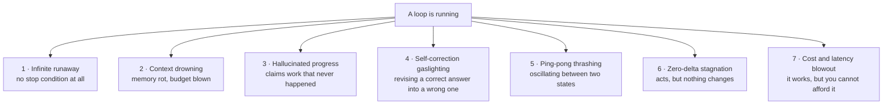
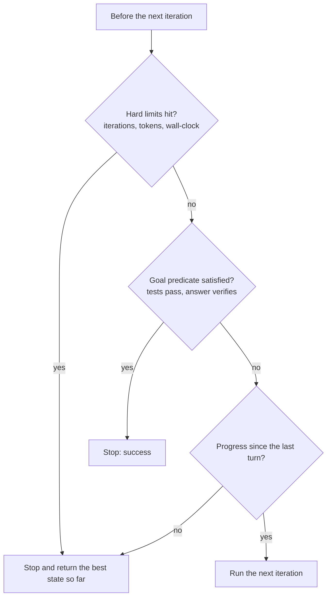
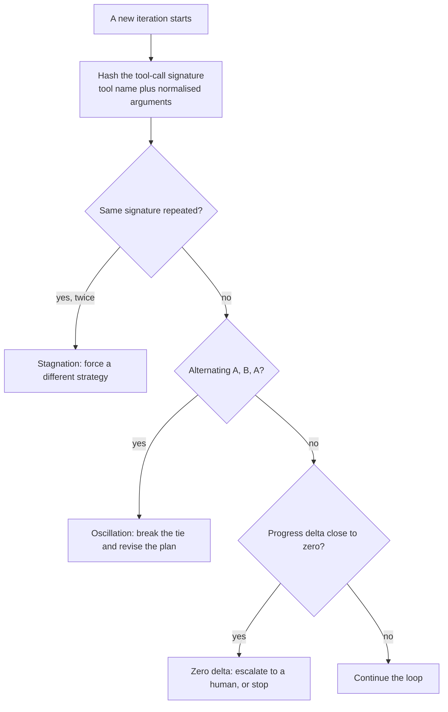
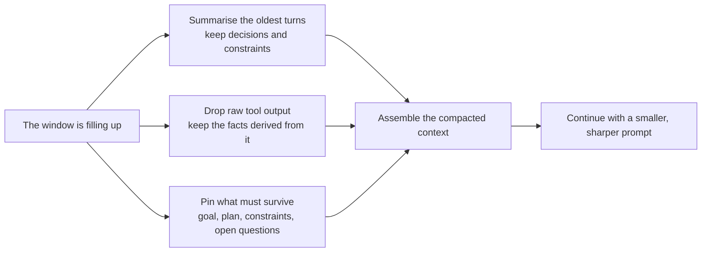
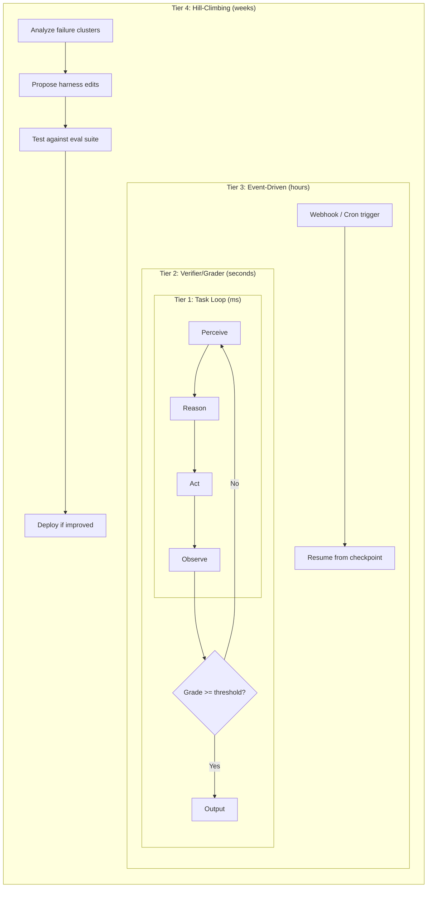

## Introduction

In [Lesson 20](../20-looping/), we learned how loops give agents autonomy. But in production software engineering, an unconstrained loop is one of the most dangerous primitives you can write.

Anyone can write a `while True:` loop.

**Loop engineering** is the disciplined engineering practice of designing loops that:
1. **Always terminate** under all edge cases
2. **Monotonically converge** toward higher quality rather than degrading
3. **Detect stagnation and thrashing** before burning user tokens
4. **Prune context aggressively** to prevent memory rot
5. **Enforce hard financial and temporal circuit breakers**

If prompting is teaching an agent what to say, and harness engineering is building its vehicle, loop engineering is installing the cruise control, anti-lock brakes, collision avoidance, and speed governor.

### ELI5: The smart climate system vs. the stuck heater

Imagine you buy a cheap space heater with a basic sensor: "If room temperature is below 72°F, turn on. If above, turn off."

One winter day, someone leaves a window open. The heater turns on. The room never reaches 72°F because cold air is rushing in. The heater runs at maximum power for three weeks, overheats, trips the circuit breaker, and sends your electric bill to $1,500.

An **engineered industrial climate system** does not just check a binary sensor:
- **Rate-of-change monitor:** "I have been blasting heat for 30 minutes, but the temperature has not risen by 0.5°F. Something is wrong."
- **Oscillation dampener:** "Do not turn on and off 10 times per minute."
- **Thermal fuse & run-time cap:** "Never run continuously for more than 45 minutes without a cooldown cycle."
- **Fault notification:** "Alert the facility manager that an unmetered draft exists."

Loop engineering is building that industrial climate control around an LLM.

> **Key takeaway:** A naive loop hopes the model knows when to stop. An engineered loop guarantees termination, enforces convergence, and actively defends against cognitive stagnation.

---

## The 7 deadly loop failure modes

When agent loops fail in production, they almost always fall into one of seven failure modes:

```
                          7 DEADLY LOOP FAILURES
                                    |
      +-----------------------------+-----------------------------+
      |                             |                             |
1. Infinite Runaway          3. The "Ralph Loop"           5. Ping-Pong Thrashing
   (No exit trigger)            (Hallucinated Progress)       (A <-> B oscillation)
      |                             |                             |
2. Context Drowning          4. Critic Gaslighting         6. Zero-Delta Stagnation
   (Token memory rot)           (Self-correction decay)       (Repeating identical calls)
                                    |
                             7. Budget Blowout
                                ($50 API burn)
```

### 1. Infinite Runaway Loops
The model fails to output the designated termination token or believes there is "always one more check to do." Without external intervention, it loops indefinitely until the hosting cloud service times out.

### 2. Context Drowning (Token Memory Rot)
As the loop turns, error messages, raw JSON dumps, and tool outputs accumulate. By turn 8, the context window contains 40,000 tokens of mostly irrelevant historical failures. This context dilution distracts the model from its original goal and causes degradation in reasoning ability.

### 3. The "Ralph Loop" (Hallucinated Progress)
The agent executes an action that fails. In its reasoning trace, it claims: *"That attempt was slightly different and showed promise; I will try again."* In reality, it is repeating the exact same flawed strategy while convincing itself it is making progress.

### 4. Self-Correction Gaslighting (Degradation)
In reflection loops (Generator $\to$ Critic), research has shown that after 2-3 iterations, LLM critics often begin finding non-existent flaws in previously valid work, actively degrading high-quality answers into convoluted, worse outputs.

### 5. Ping-Pong Thrashing (Oscillation)
The agent alternates endlessly between two opposing states:
- *Step 1:* "Port 8080 is blocked, changing to 8081."
- *Step 2:* "Port 8081 requires authentication, changing to 8080."
- *Step 3:* "Port 8080 is blocked, changing to 8081."

### 6. Zero-Delta Stagnation
The agent calls an API, receives an empty or unhelpful response, and calls the exact same API with identical parameters on the next turn, expecting a different result.

### 7. Runaway Cost & Latency Blowouts
A single user submits an ambiguous request, and the agent spins through 25 iterations of web searches and code runs, costing $15 in tokens and taking 4 minutes to return a generic answer.

---



## Multi-criteria termination predicates

Never rely on a single exit condition (such as `if model.is_finished`). Production loops enforce a **Composite Termination Predicate**:

$$\text&#123;Should Terminate&#125; = C_&#123;\text&#123;goal&#125;&#125; \lor C_&#123;\text&#123;steps&#125;&#125; \lor C_&#123;\text&#123;tokens&#125;&#125; \lor C_&#123;\text&#123;time&#125;&#125; \lor C_&#123;\text&#123;stagnant&#125;&#125;$$

```python
def should_terminate(state: LoopState) -> bool:
    # 1. Successful Completion Guard
    if state.is_goal_satisfied:
        return True
        
    # 2. Hard Step Ceiling
    if state.current_step >= state.max_steps:
        state.termination_reason = "MAX_STEPS_EXCEEDED"
        return True
        
    # 3. Financial / Token Budget Guard
    if state.total_tokens_consumed >= state.max_token_budget:
        state.termination_reason = "TOKEN_BUDGET_EXHAUSTED"
        return True
        
    # 4. Wall-Clock Latency Ceiling
    if (time.time() - state.start_time) >= state.max_timeout_seconds:
        state.termination_reason = "WALL_CLOCK_TIMEOUT"
        return True
        
    # 5. Stagnation / Circuit Breaker
    if state.consecutive_stagnant_turns >= 2:
        state.termination_reason = "STAGNATION_CIRCUIT_TRIPPED"
        return True
        
    return False
```

---



## Stagnation & oscillation detection

To stop an agent before it wastes budget, the loop runtime must inspect its actions for repetitive patterns.

### 1. Tool Call Signature Hashing
Every tool invocation can be represented as an immutable hash of its tool name and canonicalized arguments:

```python
import hashlib
import json

def get_action_signature(tool_name: str, args: dict) -> str:
    # Sort keys to ensure deterministic JSON representation
    serialized = json.dumps({"tool": tool_name, "args": args}, sort_keys=True)
    return hashlib.sha256(serialized.encode('utf-8')).hexdigest()
```

By storing recent action hashes in a sliding window (e.g., the last 5 steps), the loop can instantly catch:
- **Zero-Delta Repeat:** Hash $H_t == H_&#123;t-1&#125;$ (identical tool call twice in a row).
- **Oscillation:** Hash pattern $A \to B \to A \to B$.

```python
# Oscillation detector snippet
if len(history_hashes) >= 4:
    if history_hashes[-1] == history_hashes[-3] and history_hashes[-2] == history_hashes[-4]:
        raise OscillationDetectedException("Agent is ping-ponging between two actions.")
```

---



## In-loop context compaction

As an agent loops, its message history grows. Without compaction, latency increases and reasoning quality degrades. Loop engineering uses three compaction strategies:

```
NAIVE HISTORY (Grows indefinitely):
[Goal] -> [T1+A1+Obs1] -> [T2+A2+Obs2] -> [T3+A3+Obs3] -> [T4+A4+Obs4] ... (Token Explosion)

COMPACTED HISTORY (Constant budget):
[Goal] + [Structured Scratchpad / State] + [Recent Turn N-1] + [Recent Turn N]
```

1. **Sliding Observation Window:** Keep the original goal and system prompt pinned. Keep only the last $K$ (typically 2-3) full tool observations in detail.
2. **Scratchpad Summarization:** After every 3 iterations, have a fast/cheap model (e.g., Gemini Flash-Lite) summarize the intermediate findings into a concise list of confirmed facts, replacing 20,000 tokens of raw history with 250 tokens of structured memory.
3. **Structured State Variables:** Instead of raw conversational chat, store key extracted data as strongly-typed state variables (e.g., `user_id = 42`, `file_path = "src/main.py"`).

---



## The 4-Tier Loop Engineering Hierarchy

Agent loops do not exist at a single level of abstraction. In production, resilient systems employ a nested hierarchy of loops, where outer loops monitor and correct the inner loops. The four tiers are:

**Tier 1 — Task Loop** (sub-second): The basic ReAct cycle. Perceive $\to$ Reason $\to$ Act $\to$ Observe. Runs in milliseconds. No verification.

**Tier 2 — Verifier/Grader Loop** (seconds): Wraps Tier 1. After the task agent produces output, a separate evaluator/critic agent grades it. If the grade falls below a threshold, the task loop is retried with feedback. This catches hallucinations and quality issues.

**Tier 3 — Event-Driven Loop** (hours/days): Wraps Tier 2. The agent sleeps and re-awakens on external events (webhooks, cron triggers, new data). It maintains state across sessions. Example: monitoring a deployment, going to sleep, and re-checking after each commit.

**Tier 4 — Hill-Climbing Loop** (weeks): Wraps Tier 3. Analyzes production failure clusters over time and proposes harness edits (better prompts, tool schemas, context policies). Tests changes against an eval suite and deploys if improved. This is the self-improving loop.



## Production Python: The ResilientAgentLoop

Here is a hardened agent loop incorporating termination guards, action hashing, and stagnation detection:

```python
import time
import hashlib
import json
from typing import Dict, Any, Callable, List

class ResilientAgentLoop:
    def __init__(
        self,
        model_client: Any,
        tools: Dict[str, Callable],
        max_steps: int = 6,
        max_tokens: int = 15000,
        timeout_seconds: float = 30.0
    ):
        self.model = model_client
        self.tools = tools
        self.max_steps = max_steps
        self.max_tokens = max_tokens
        self.timeout_seconds = timeout_seconds

    def _hash_action(self, tool_name: str, args: dict) -> str:
        serialized = json.dumps({"tool": tool_name, "args": args}, sort_keys=True)
        return hashlib.sha256(serialized.encode()).hexdigest()[:12]

    def execute(self, user_goal: str) -> Dict[str, Any]:
        start_time = time.time()
        total_tokens = 0
        action_history_hashes: List[str] = []
        
        # Working memory
        messages = [
            {"role": "system", "content": "You are an autonomous problem-solving agent. When finished, emit FINAL_ANSWER: <result>"},
            {"role": "user", "content": user_goal}
        ]

        for step in range(1, self.max_steps + 1):
            # Guard 1: Timeout
            if time.time() - start_time > self.timeout_seconds:
                return {"status": "failed", "reason": "TIMEOUT_EXCEEDED", "step": step}

            # Guard 2: Token Budget
            if total_tokens > self.max_tokens:
                return {"status": "failed", "reason": "TOKEN_BUDGET_EXHAUSTED", "step": step}

            # Reason Turn
            resp = self.model.generate(messages=messages)
            total_tokens += resp.tokens_used

            if "FINAL_ANSWER:" in resp.text:
                return {
                    "status": "success",
                    "answer": resp.text.split("FINAL_ANSWER:")[1].strip(),
                    "steps_used": step,
                    "tokens_used": total_tokens
                }

            tool_name = resp.tool_call_name
            tool_args = resp.tool_call_args
            current_hash = self._hash_action(tool_name, tool_args)

            # Guard 3: Stagnation & Oscillation Circuit Breaker
            if len(action_history_hashes) >= 1 and current_hash == action_history_hashes[-1]:
                # Injected recovery instruction rather than fatal crash
                messages.append({
                    "role": "user",
                    "content": f"[SYSTEM WARNING]: You just called {tool_name} with identical arguments. You must choose a DIFFERENT approach."
                })
                continue

            if len(action_history_hashes) >= 3 and current_hash == action_history_hashes[-2]:
                return {"status": "aborted", "reason": "OSCILLATION_DETECTED (Ping-Pong)", "step": step}

            action_history_hashes.append(current_hash)

            # Act & Observe
            try:
                observation = self.tools[tool_name](**tool_args)
            except Exception as e:
                observation = f"Tool Execution Error: {str(e)}"

            # Context compaction: prune older observations if history grows too long
            messages.append({"role": "assistant", "content": f"Action: {tool_name}"})
            messages.append({"role": "user", "content": f"Observation: {str(observation)[:500]}"})

        return {"status": "failed", "reason": "MAX_STEPS_REACHED", "steps_used": self.max_steps}
```

---

## Interactive Visualizer: Loop Resilience Lab

Simulate common loop failures and observe how engineered circuit breakers stabilize the system:


```html
<div id="resilience-lab" style="font-family: -apple-system, BlinkMacSystemFont, 'Segoe UI', Roboto, sans-serif; max-width: 900px; margin: 2rem auto; background: #f8f9fa; border-radius: 16px; box-shadow: 0 4px 24px rgba(0,0,0,0.08); padding: 24px; box-sizing: border-box;">
  <h3 style="margin: 0 0 6px 0; color: #1a1a2e; font-size: 1.25rem;">Loop Resilience & Circuit Breaker Simulator</h3>
  <p style="margin: 0 0 16px 0; color: #666; font-size: 0.88rem;">Inject common agent failure modes and see whether a naive loop crashes or an engineered loop recovers.</p>

  <!-- Controls -->
  <div style="display: grid; grid-template-columns: 1fr 1fr; gap: 16px; margin-bottom: 16px;">
    <div style="background: white; border-radius: 12px; border: 1px solid #e2e8f0; padding: 14px;">
      <div style="font-weight: 700; font-size: 0.85rem; color: #1e293b; margin-bottom: 8px;">Select Failure Mode to Inject:</div>
      <select id="rl-failure-select" style="width: 100%; padding: 8px; border-radius: 8px; border: 1px solid #cbd5e1; font-size: 0.85rem; margin-bottom: 10px;">
        <option value="oscillation">1. Ping-Pong Thrashing (Port 8080 <-> 8081)</option>
        <option value="zero_delta">2. Zero-Delta Stagnation (Identical API Call)</option>
        <option value="gaslighting">3. Critic Gaslighting (Self-correction degrades)</option>
        <option value="budget_burn">4. Runaway Infinite Loop (No exit token)</option>
      </select>
      <div style="font-size: 0.78rem; color: #64748b;" id="rl-desc">
        Agent gets caught in a loop alternating between two conflicting solutions.
      </div>
    </div>

    <div style="background: white; border-radius: 12px; border: 1px solid #e2e8f0; padding: 14px; display: flex; flex-direction: column; justify-content: space-between;">
      <div>
        <div style="font-weight: 700; font-size: 0.85rem; color: #1e293b; margin-bottom: 6px;">Engineered Guards Active:</div>
        <div style="font-size: 0.78rem; color: #10b981; line-height: 1.5;">
          ✓ Action Hash History<br>
          ✓ Stagnation Circuit Breaker<br>
          ✓ Max 5-Turn Hard Limit
        </div>
      </div>
      <button id="rl-simulate-btn" style="padding: 10px; background: #3b82f6; color: white; border: none; border-radius: 8px; font-weight: 700; font-size: 0.85rem; cursor: pointer;">
        Run Comparison Simulation
      </button>
    </div>
  </div>

  <!-- Comparison Output Columns -->
  <div style="display: grid; grid-template-columns: 1fr 1fr; gap: 16px;">
    <!-- Naive Loop -->
    <div style="background: #fff1f2; border: 1px solid #fecdd3; border-radius: 12px; padding: 14px;">
      <div style="display: flex; justify-content: space-between; align-items: center; margin-bottom: 8px;">
        <span style="font-weight: 700; color: #9f1239; font-size: 0.82rem;">❌ NAIVE WHILE-LOOP</span>
        <span id="rl-naive-badge" style="background: #e11d48; color: white; padding: 2px 6px; border-radius: 6px; font-size: 0.7rem; font-weight: 700;">UNGUARDED</span>
      </div>
      <div id="rl-naive-log" style="font-family: monospace; font-size: 0.76rem; color: #4c0519; line-height: 1.5; min-height: 140px; white-space: pre-wrap;">
Click 'Run Comparison Simulation' to begin.
      </div>
    </div>

    <!-- Engineered Loop -->
    <div style="background: #f0fdf4; border: 1px solid #bbf7d0; border-radius: 12px; padding: 14px;">
      <div style="display: flex; justify-content: space-between; align-items: center; margin-bottom: 8px;">
        <span style="font-weight: 700; color: #166534; font-size: 0.82rem;">🛡️ ENGINEERED LOOP</span>
        <span id="rl-eng-badge" style="background: #16a34a; color: white; padding: 2px 6px; border-radius: 6px; font-size: 0.7rem; font-weight: 700;">STABILIZED</span>
      </div>
      <div id="rl-eng-log" style="font-family: monospace; font-size: 0.76rem; color: #052e16; line-height: 1.5; min-height: 140px; white-space: pre-wrap;">
Click 'Run Comparison Simulation' to begin.
      </div>
    </div>
  </div>
</div>

<script>
(function() {
  const select = document.getElementById('rl-failure-select');
  const desc = document.getElementById('rl-desc');
  const btn = document.getElementById('rl-simulate-btn');
  const naiveLog = document.getElementById('rl-naive-log');
  const engLog = document.getElementById('rl-eng-log');
  const naiveBadge = document.getElementById('rl-naive-badge');
  const engBadge = document.getElementById('rl-eng-badge');

  const descs = {
    oscillation: "Agent ping-pongs between two conflicting solutions (Port 8080 <-> 8081) forever.",
    zero_delta: "Agent calls the exact same API endpoint with identical arguments expecting a new result.",
    gaslighting: "Critic agent keeps demanding revisions to already-valid code until logic breaks.",
    budget_burn: "Agent enters an unconstrained search loop that never outputs a final answer token."
  };

  select.addEventListener('change', () => {
    desc.textContent = descs[select.value];
  });

  btn.addEventListener('click', () => {
    const val = select.value;
    if (val === 'oscillation') {
      naiveBadge.textContent = 'HANG / CRASH';
      naiveLog.textContent = `Turn 1: Action -> set_port(8080)\nTurn 2: Error 8080 blocked -> set_port(8081)\nTurn 3: Error 8081 auth -> set_port(8080)\nTurn 4: Error 8080 blocked -> set_port(8081)\nTurn 5..20: Ping-pong oscillation continues indefinitely!\n[FAIL]: 30,000 tokens burned. HTTP 504 Gateway Timeout.`;

      engBadge.textContent = 'CIRCUIT BROKEN';
      engLog.textContent = `Turn 1: Action hash: e4b2\nTurn 2: Action hash: 91a0\nTurn 3: Action hash: e4b2\nTurn 4: Action hash: 91a0\n[CIRCUIT BREAKER]: Oscillation pattern [A, B, A, B] detected!\n[RECOVERY]: Injected directive: 'Stop port flipping. Attempt port 0 (ephemeral binding).'\n[SUCCESS]: Resolved on Turn 5 safely.`;
    } else if (val === 'zero_delta') {
      naiveBadge.textContent = 'INFINITE LOOP';
      naiveLog.textContent = `Turn 1: call_search('user_id: 100') -> []\nTurn 2: call_search('user_id: 100') -> []\nTurn 3: call_search('user_id: 100') -> []\nTurn 4: call_search('user_id: 100') -> []\n[FAIL]: Model stuck in zero-delta stagnation for 15 turns.`;

      engBadge.textContent = 'INTERCEPTED';
      engLog.textContent = `Turn 1: call_search('user_id: 100') -> []\nTurn 2: Duplicate hash detected for call_search('user_id: 100')\n[STAGNATION GUARD]: Repetitive call blocked.\n[FALLBACK]: Switched strategy -> query_audit_logs(user_id=100)\n[SUCCESS]: User found in audit archive. Completed.`;
    } else if (val === 'gaslighting') {
      naiveBadge.textContent = 'CODE DEGRADED';
      naiveLog.textContent = `Round 1: Code score 92/100 (Passes tests)\nRound 2: Critic nitpicks variable names -> score 85\nRound 3: Critic re-architects working logic -> score 60\nRound 4: Syntax error introduced by critic!\n[FAIL]: Self-correction degraded working solution.`;

      engBadge.textContent = 'CONVERGENCE EXIT';
      engLog.textContent = `Round 1: Code score 92/100 (Threshold: 90)\n[CONVERGENCE PREDICATE]: Quality threshold (92 >= 90) met on Round 1.\n[EARLY TERMINATION]: Prevented unnecessary revision rounds.\n[EFFICIENCY]: Saved 3 LLM round-trips and preserved clean code.`;
    } else if (val === 'budget_burn') {
      naiveBadge.textContent = '$45 BILL OVERRUN';
      naiveLog.textContent = `Turn 1..5: Deep research loop continues...\nTurn 10..15: Exploring 120 web links...\nTurn 25..30: Context window at 128K tokens.\n[CRITICAL]: User billed $45.00 for a single inquiry.`;

      engBadge.textContent = 'BUDGET CAP ENFORCED';
      engLog.textContent = `Turn 1..4: Research executing...\nTurn 5: Token counter: 14,800 / 15,000.\n[HARD CAP TRIPPED]: Maximum token budget approaching.\n[FORCED SYNTHESIS]: Instructed model to finalize findings immediately.\n[COMPLETE]: Delivered answer at $0.08 total cost.`;
    }
  });
})();
</script>
```


---

## Best practices & common anti-patterns

| Anti-Pattern | Danger | Engineered Fix |
|---|---|---|
| **Relying solely on model exit tokens** | If model omits `FINAL_ANSWER:`, loop runs until timeout | Enforce hard programmatic `max_steps` |
| **Accumulating raw observations forever** | Quadratic token explosion and context degradation | Sliding observation window + periodic scratchpad summaries |
| **Blindly looping reflection critics** | Critic gaslights good answers into broken code | Set max 2 revision passes; terminate as soon as tests pass |
| **Ignoring repeat tool calls** | Model gets stuck in infinite zero-delta query loops | Hash action arguments; trip circuit breaker on duplicate hashes |

---

## Key takeaways

- **Loop engineering** is the discipline of making autonomous agent execution cycles bounded, resilient, and convergent.
- The **7 deadly loop failures** include runaway loops, context drowning, Ralph loops, critic gaslighting, thrashing, zero-delta stagnation, and budget blowouts.
- Always implement **composite termination predicates**: goal satisfaction, step limits, token budgets, and wall-clock timeouts.
- Use **action signature hashing** ($SHA256(\text&#123;tool&#125; + \text&#123;args&#125;)$) to catch oscillation and zero-delta loops before tokens are wasted.
- Next, in **Lesson 22 (Graph Engineering)**, we will look at how to move from loops to explicit, governed state machines.

---

## Further reading

- [Language Agent Tree Search Unifies Reasoning, Acting, and Planning (Zhou et al., 2023)](https://arxiv.org/abs/2310.04406)
- [Why Language Models Hallucinate Progress in Loops](https://arxiv.org/abs/2305.14992)
- [ADK Best Practices for Resilient Agents](https://adk.dev/)
- [Anthropic Research: Managing Context in Agent Workflows](https://www.anthropic.com/research/building-effective-agents)

---

[Previous Lesson: Looping](../20-looping/) | [Next Lesson: Graph Engineering ->](../22-graph-engineering/)
