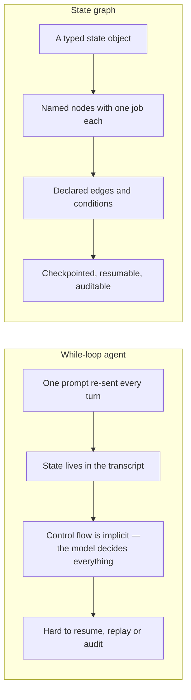
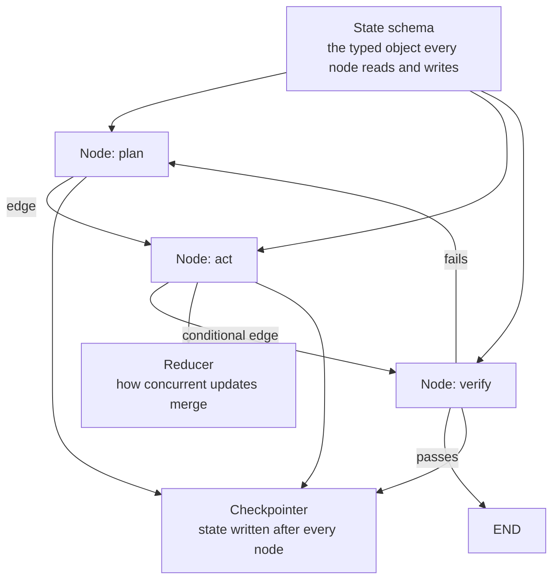
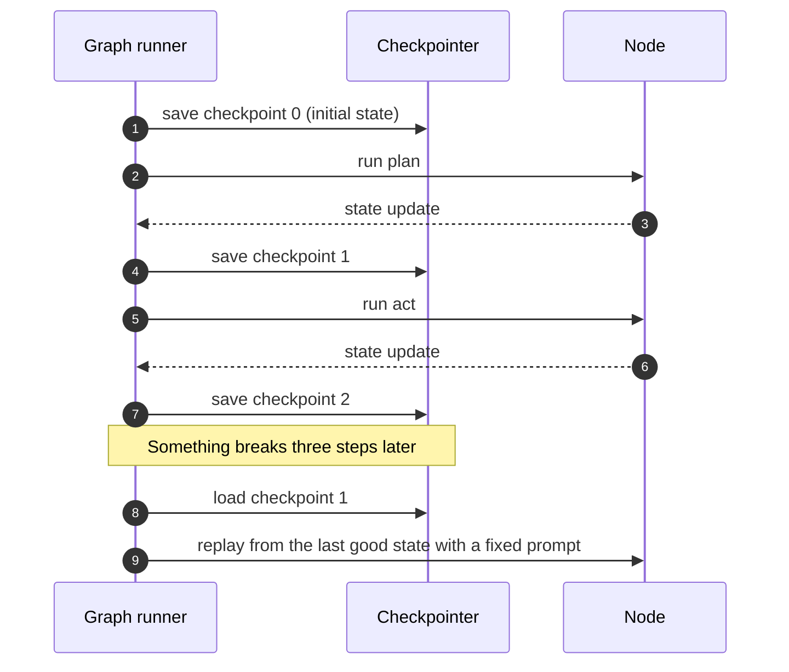
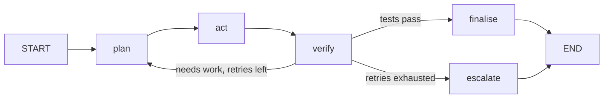
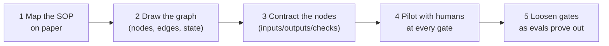
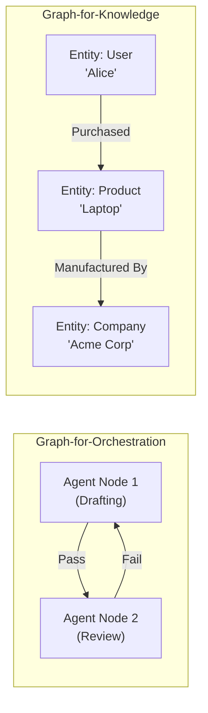

## Introduction

In [Lesson 20](../20-looping/) and [Lesson 21](../21-loop-engineering/), we explored the power—and the risks—of autonomous while-loops. Loops grant autonomy, but in enterprise engineering, unconstrained autonomy is often a liability.

When building medical diagnosis assistants, banking transaction processors, or production deployment agents, you cannot rely on an LLM to decide what to do next based on an opaque reasoning prompt. You need:
- **Absolute predictability:** Guarantees that step $B$ can never execute without step $A$ passing validation.
- **Auditability:** Exact historical traces of which node modified which field in state.
- **Resilience:** The ability to pause execution, wait three days for a manager's approval, and resume on a different server without losing context.
- **Deterministic control:** Mixing hand-coded algorithmic checks with generative LLM steps.

The architectural paradigm that solves this is **graph engineering**.

### ELI5: The high-speed railway and switchyard

Driving an autonomous loop is like driving an off-road buggy across the open desert: you can go in any direction, explore sand dunes, and take creative detours. But you can also hit a boulder, flip over, or run out of fuel in the middle of nowhere.

**Graph engineering** is building a modern electric railway system:
- **Nodes are stations:** Discrete facilities built for a specific purpose (Cargo Unloading, Maintenance, Passenger Boarding).
- **Edges are tracks:** Fixed physical pathways that trains must travel along.
- **Switches are conditional routers:** Track switches that automatically route trains onto the freight line or the express line depending on cargo weight.
- **Signals and platforms are checkpoints:** Safe places where trains pause for red lights or wait for human station-masters to give the green light.

You can still loop in a railway (a circular beltway line), but a train can **never derail into an illegal state**.

> **Key takeaway:** Graph engineering moves control flow out of the LLM's probabilistic imagination and into an explicit, typed state machine. Nodes perform work; edges govern transitions; typed schemas protect the state.

---

## The architectural ceiling of while-loops

Why did the AI industry transition from simple agent loops to graph engineering?

```
WHILE-LOOP PARADIGM:
+-----------------------------------------------------+
| while not done:                                     |
|    # LLM holds all routing logic inside its head    |
|    thought, action = model.predict(everything)      |
|    execute(action)                                  |
+-----------------------------------------------------+
Problems: Opaque routing, state mutation bugs, impossible to pause/resume cleanly.

GRAPH ENGINEERING PARADIGM:
+-----------------------------------------------------+
|  [Ingest Node] ---> [Draft Node] ---> [Audit Node]  |
|                            ^                 |      |
|                            | (Needs Work)    v      |
|                            +----------- [Router]    |
|                                              |      |
|                                              v      |
|                                        [Deploy Node]|
+-----------------------------------------------------+
Benefits: Explicit states, typed schemas, deterministic routing, native HITL breakpoints.
```

When an agent system grows beyond 2-3 tools, while-loops encounter severe architectural ceilings:

| Challenge | While-Loop Architecture | Graph Engineering Architecture |
|---|---|---|
| **Control Flow** | Implicit; model decides next step on the fly | Explicit; governed by code-defined nodes and edges |
| **State Mutation** | Appending raw text messages to a list | Strongly-typed schemas with pure reducer functions |
| **Human-in-the-Loop** | Blocking threads or hacky callback hooks | Native graph interrupts and persistent thread checkpoints |
| **Error Recovery** | Model has to "re-reason" from raw history | Rollback to exact node checkpoint (time-travel debugging) |
| **Hybrid Execution** | Hard to mix deterministic code with LLM steps | Deterministic code nodes and LLM nodes live side-by-side |

---



## Anatomy of an agent graph

An agent graph is fundamentally a **stateful, cyclic computational graph**. It consists of four core elements:

```
                           +-------------------+
                           |    STATE SCHEMA   |
                           |  (TypedDict/Base) |
                           +---------+---------+
                                     |
                                     v
                       +-------------+-------------+
                       |                           |
                       v                           v
              +-----------------+         +-----------------+
              |      NODE A     |         |     NODE B      |
              | (Generates Code)|         |  (Runs Linter)  |
              +--------+--------+         +--------+--------+
                       |                           |
                       | State update              | State update
                       v                           v
              +---------------------------------------------+
              |           REDUCER (Immutable Merge)         |
              +----------------------+----------------------+
                                     |
                                     v
                           +-------------------+
                           | CONDITIONAL EDGE  |
                           |  (Router Function)|
                           +----+---------+----+
                                |         |
                     Passed?    |         | Failed?
                     +----------+         +----------+
                     |                               |
                     v                               v
            +-----------------+             [Cycle back to Node A]
            |     NODE C      |
            | (Deploy Prod)   |
            +-----------------+
```



### 1. The State Schema
The central, single source of truth passed between all nodes. Unlike a conversational chat log, graph state is structured and typed using Pydantic or Python `TypedDict`:

```python
from typing import TypedDict, List, Optional

class AgentWorkflowState(TypedDict):
    task_id: str
    user_prompt: str
    draft_content: Optional[str]
    critic_score: int
    review_comments: List[str]
    iteration_count: int
    is_approved: bool
```

### 2. Nodes (The Workers)
A node is an isolated function that receives the current `State`, performs a task, and returns an updated dictionary:
- **LLM Nodes:** Call models to draft text, summarize data, or make strategic decisions.
- **Tool / Code Nodes:** Deterministic Python functions (e.g., executing a compiler, querying Postgres, running unit tests).
- **Human Nodes:** Breakpoints that pause the graph and wait for external input.

Nodes do not know about other nodes; they only know how to read the state and return state updates.

### 3. Reducers (State Update Rules)
When a node returns data, how does it merge into the global state?
- **Replace:** Overwrites the current value (e.g., `draft_content = new_draft`).
- **Append:** Appends new elements to a list without losing previous items (e.g., adding review comments).
- **Merge:** Merges keys into a dictionary.

### 4. Edges (The Pathways)
Edges connect nodes and direct traffic:
- **Normal (Unconditional) Edges:** Always transition from Node A to Node B ($A \to B$).
- **Conditional Edges:** Run a routing function that evaluates the state and dynamically returns the name of the next node:

```python
def route_after_critique(state: AgentWorkflowState) -> str:
    if state["critic_score"] >= 90:
        return "deploy_node"
    elif state["iteration_count"] >= 3:
        return "escalate_to_human_node"
    else:
        return "refine_draft_node"
```

---

## Checkpointing, persistence & time-travel

In a traditional Python script, if the process crashes or restarts, all in-memory variables are lost.

Graph engines (like LangGraph and Vertex AI Agent Engine) solve this with **checkpointers**:
1. At every node boundary, the graph serializes the entire `State` into a database (PostgreSQL, SQLite, Redis, or Cloud Spanner).
2. Each run has a unique `thread_id`.
3. If an agent task pauses for human input or encounters an unhandled network error, the workflow can be resumed instantly on any machine simply by loading the latest thread checkpoint.
4. **Time-Travel Debugging:** You can load the state checkpoint from Turn 2, modify a variable, and re-execute the graph down a different branch to see how the agent behaves.

---



## Python implementation: A complete cyclic agent graph

Here is a complete, runnable agent graph architecture implemented with typed state, pure nodes, and a conditional cyclic router:

```python
from typing import TypedDict, Annotated, List, Dict, Any
import operator

# 1. Define Typed State Schema
class CodeReviewState(TypedDict):
    code: str
    test_output: str
    attempts: int
    status: str

# 2. Define Node Functions
def code_generator_node(state: CodeReviewState) -> Dict[str, Any]:
    """Generates or refines code."""
    attempts = state.get("attempts", 0) + 1
    print(f"\n[Node: Generator] Running iteration {attempts}...")
    
    if attempts == 1:
        # Initial draft with an intentional bug
        code = "def add(a, b): return a - b  # Bug: minus instead of plus"
    else:
        # Refined draft fixing the issue
        code = "def add(a, b): return a + b  # Fixed: addition"
        
    return {"code": code, "attempts": attempts}

def test_runner_node(state: CodeReviewState) -> Dict[str, Any]:
    """Deterministic node: runs unit tests against generated code."""
    print("[Node: TestRunner] Executing tests...")
    code = state["code"]
    
    # Simulate running pytest
    if "return a - b" in code:
        test_output = "FAILED: test_add(2, 2) expected 4, got 0"
        status = "FAILED"
    else:
        test_output = "PASSED: 3 tests run, 0 failures"
        status = "PASSED"
        
    return {"test_output": test_output, "status": status}

def human_approval_node(state: CodeReviewState) -> Dict[str, Any]:
    """Breakpoint node for production deployment."""
    print("[Node: HumanApproval] Production approval granted by tech lead.")
    return {"status": "APPROVED_FOR_PRODUCTION"}

# 3. Define Conditional Routing Function
def routing_edge(state: CodeReviewState) -> str:
    print(f"[Edge Router] Inspecting status: {state['status']}, attempts: {state['attempts']}")
    if state["status"] == "PASSED":
        return "human_approval"
    elif state["attempts"] >= 3:
        return "failed_exit"
    else:
        return "generator"  # CYCLE back to generator

# 4. Graph Execution Engine (Runtime)
class SimpleGraphEngine:
    def __init__(self):
        self.nodes = {}
        self.conditional_edges = {}

    def add_node(self, name: str, fn):
        self.nodes[name] = fn

    def add_conditional_edge(self, source: str, router_fn):
        self.conditional_edges[source] = router_fn

    def run(self, initial_state: CodeReviewState):
        state = dict(initial_state)
        current_node = "generator"

        while current_node and current_node != "failed_exit":
            # Execute node
            node_fn = self.nodes[current_node]
            updates = node_fn(state)
            state.update(updates)

            # Check if this was a terminal node
            if current_node == "human_approval":
                print("\n[Workflow Complete] State safely reached terminal station.")
                break

            # Evaluate conditional edge
            if current_node in self.conditional_edges:
                current_node = self.conditional_edges[current_node](state)
            else:
                break
                
        return state

# Execute Graph
graph = SimpleGraphEngine()
graph.add_node("generator", code_generator_node)
graph.add_node("test_runner", test_runner_node)
graph.add_node("human_approval", human_approval_node)

# Flow: generator -> test_runner -> conditional_edge
graph.nodes["generator_to_test"] = lambda s: s
graph.add_conditional_edge("test_runner", routing_edge)

# Run pipeline
final_state = graph.run({"code": "", "test_output": "", "attempts": 0, "status": "INIT"})
print(f"\nFinal State Result: {final_state['code']} -> {final_state['status']}")
```

---



## Node contracts

A graph is only as reliable as its nodes are predictable. Every node should declare a contract:

| Field | Meaning | Example |
|---|---|---|
| `inputs` | State fields it reads | `claim`, `policy_id` |
| `outputs` | State fields it writes | `damage_report`, `confidence` |
| `preconditions` | What must be true before it runs | `claim.images.length > 0` |
| `postconditions` | What must be true after it runs | `damage_report.citations.length > 0` |
| `on_error` | Retry / fallback / escalate policy | `retry(2) -> human_gate` |

Contracts convert "the graph ran without errors" into "the graph produced verifiable outputs" - the exact difference between a green dashboard and the $4,500 payout bug described in [Agent runtime and LLMOps](../agent-runtime-and-llmops/).

## The 5-stage adoption methodology



Adopt graphs the way you adopt any automation: document the process first, encode it second, and keep humans at the gates until the eval suite has earned their removal. Skipping to step 5 is how teams ship the payout bug.

## Graph Orchestration vs Graph Knowledge

When discussing graphs in the context of AI agents, there is a critical bifurcation that often confuses beginners. "Graph" can mean two completely different things depending on whether you are building the agent's workflow or the agent's memory.

- **Graph-for-Orchestration (e.g., LangGraph, ADK)**:
  - **Nodes** are agents or tools (functions that do work).
  - **Edges** are control flow (the paths execution can take).
  - The graph IS the execution plan. It is used for workflow automation.
- **Graph-for-Knowledge (e.g., GraphRAG, HippoRAG 2)**:
  - **Nodes** are entities (people, concepts, documents).
  - **Edges** are relationships ("works for", "mentions", "depends on").
  - The graph IS the knowledge base. It is used for retrieval and memory.

These two concepts often exist in the same system (an orchestration graph node might query a knowledge graph), but they solve entirely different problems.



## Interactive Visualizer: Interactive Agent Graph Studio

Click through the interactive state machine below to watch data flow across nodes, observe conditional edge evaluation, and see how human approval gates pause execution:


```html
<div id="graph-studio" style="font-family: -apple-system, BlinkMacSystemFont, 'Segoe UI', Roboto, sans-serif; max-width: 900px; margin: 2rem auto; background: #f8f9fa; border-radius: 16px; box-shadow: 0 4px 24px rgba(0,0,0,0.08); padding: 24px; box-sizing: border-box;">
  <h3 style="margin: 0 0 6px 0; color: #1a1a2e; font-size: 1.25rem;">Interactive Agent Graph Studio</h3>
  <p style="margin: 0 0 16px 0; color: #666; font-size: 0.88rem;">Step through a production code deployment graph with cyclic self-healing and human approval gates.</p>

  <!-- Graph SVG Diagram -->
  <div style="background: white; border-radius: 12px; border: 1px solid #e2e8f0; padding: 16px; margin-bottom: 16px; overflow-x: auto;">
    <svg id="gs-svg" viewBox="0 0 760 180" style="width: 100%; height: auto; display: block;">
      <!-- Edges -->
      <line x1="120" y1="90" x2="230" y2="90" stroke="#cbd5e1" stroke-width="3" id="e-draft-test" />
      <line x1="330" y1="90" x2="430" y2="90" stroke="#cbd5e1" stroke-width="3" id="e-test-route" />
      <line x1="490" y1="90" x2="570" y2="90" stroke="#cbd5e1" stroke-width="3" id="e-route-human" />
      <line x1="670" y1="90" x2="720" y2="90" stroke="#cbd5e1" stroke-width="3" id="e-human-deploy" />
      
      <!-- Cycle back edge: Router -> Generator -->
      <path d="M 460 70 Q 280 -20 100 70" fill="none" stroke="#cbd5e1" stroke-width="3" stroke-dasharray="6,4" id="e-cycle-back" />

      <!-- Node 1: Generator -->
      <g id="gn-generator" transform="translate(80, 90)">
        <circle r="36" fill="#eff6ff" stroke="#3b82f6" stroke-width="3" />
        <text text-anchor="middle" y="-4" font-size="11" font-weight="bold" fill="#1e3a8a">Draft</text>
        <text text-anchor="middle" y="12" font-size="9" fill="#3b82f6">Node (LLM)</text>
      </g>

      <!-- Node 2: TestRunner -->
      <g id="gn-test" transform="translate(280, 90)">
        <circle r="36" fill="#f8fafc" stroke="#64748b" stroke-width="3" />
        <text text-anchor="middle" y="-4" font-size="11" font-weight="bold" fill="#334155">Test</text>
        <text text-anchor="middle" y="12" font-size="9" fill="#64748b">Node (Tool)</text>
      </g>

      <!-- Node 3: Router -->
      <g id="gn-router" transform="translate(460, 90)">
        <polygon points="0,-36 36,0 0,36 -36,0" fill="#fef3c7" stroke="#f59e0b" stroke-width="3" />
        <text text-anchor="middle" y="4" font-size="10" font-weight="bold" fill="#78350f">Router</text>
      </g>

      <!-- Node 4: HumanApproval -->
      <g id="gn-human" transform="translate(620, 90)">
        <circle r="36" fill="#fdf4ff" stroke="#a855f7" stroke-width="3" />
        <text text-anchor="middle" y="-4" font-size="11" font-weight="bold" fill="#581c87">Approve</text>
        <text text-anchor="middle" y="12" font-size="9" fill="#a855f7">Node (HITL)</text>
      </g>

      <!-- Terminal -->
      <circle cx="735" cy="90" r="14" fill="#10b981" id="gn-deploy" />
    </svg>
  </div>

  <!-- State Monitor & Inspector -->
  <div style="display: grid; grid-template-columns: 1fr 1fr; gap: 16px; margin-bottom: 16px;">
    <!-- Active Step Details -->
    <div style="background: white; border-radius: 12px; border: 1px solid #e2e8f0; padding: 14px;">
      <div style="font-weight: 700; font-size: 0.85rem; color: #1e293b; margin-bottom: 6px;">Current Node Execution:</div>
      <div id="gs-node-title" style="font-weight: 800; font-size: 1.1rem; color: #3b82f6; margin-bottom: 6px;">Ready to Start</div>
      <div id="gs-node-desc" style="font-size: 0.82rem; color: #475569; line-height: 1.5;">Click 'Step Forward' to initiate state propagation.</div>
    </div>

    <!-- Live Typed State Object -->
    <div style="background: #0f172a; border-radius: 12px; padding: 14px; color: #e2e8f0; font-family: monospace; font-size: 0.78rem; line-height: 1.5;">
      <div style="color: #94a3b8; font-size: 0.7rem; border-bottom: 1px solid #334155; padding-bottom: 4px; margin-bottom: 6px;">TYPED GRAPH STATE (IMMUTABLE SNAPSHOT)</div>
      <div id="gs-state-dump">{\n  "attempts": 0,\n  "code": null,\n  "tests_passed": false,\n  "approved": false\n}</div>
    </div>
  </div>

  <!-- Control Buttons -->
  <div style="display: flex; gap: 10px;">
    <button id="gs-step-btn" style="flex: 2; padding: 12px; background: #3b82f6; color: white; border: none; border-radius: 8px; font-weight: 700; cursor: pointer; font-size: 0.9rem;">
      Step Forward (Execute Node)
    </button>
    <button id="gs-reset-btn" style="flex: 1; padding: 12px; background: #e2e8f0; color: #334155; border: none; border-radius: 8px; font-weight: 700; cursor: pointer; font-size: 0.9rem;">
      Reset Graph
    </button>
  </div>
</div>

<script>
(function() {
  const nodeTitle = document.getElementById('gs-node-title');
  const nodeDesc = document.getElementById('gs-node-desc');
  const stateDump = document.getElementById('gs-state-dump');
  const stepBtn = document.getElementById('gs-step-btn');
  const resetBtn = document.getElementById('gs-reset-btn');

  const steps = [
    {
      activeNode: "gn-generator",
      title: "Node 1: Draft Generator (Turn 1)",
      desc: "LLM generates initial Python implementation. Introduces a subtle syntax bug on first pass.",
      state: { attempts: 1, code: "def add(a,b): return a - b", tests_passed: false, approved: false }
    },
    {
      activeNode: "gn-test",
      title: "Node 2: Deterministic Test Runner",
      desc: "Test runner executes unit tests against code. Test failed: expected 4, got 0.",
      state: { attempts: 1, code: "def add(a,b): return a - b", tests_passed: false, approved: false }
    },
    {
      activeNode: "gn-router",
      title: "Conditional Edge: Router Evaluation",
      desc: "Router inspects state['tests_passed']. Condition FALSE -> Cycling back to Draft Generator!",
      state: { attempts: 1, code: "def add(a,b): return a - b", tests_passed: false, approved: false },
      edgePulse: "e-cycle-back"
    },
    {
      activeNode: "gn-generator",
      title: "Node 1: Draft Generator (Turn 2 - Refinement)",
      desc: "LLM receives test failure in state, corrects arithmetic operator to addition.",
      state: { attempts: 2, code: "def add(a,b): return a + b", tests_passed: false, approved: false }
    },
    {
      activeNode: "gn-test",
      title: "Node 2: Deterministic Test Runner (Turn 2)",
      desc: "Tests rerun: 3 passed, 0 failed! tests_passed updated to TRUE.",
      state: { attempts: 2, code: "def add(a,b): return a + b", tests_passed: true, approved: false }
    },
    {
      activeNode: "gn-router",
      title: "Conditional Edge: Router Evaluation",
      desc: "Router inspects state['tests_passed']. Condition TRUE -> Routing to Human Approval Node!",
      state: { attempts: 2, code: "def add(a,b): return a + b", tests_passed: true, approved: false },
      edgePulse: "e-route-human"
    },
    {
      activeNode: "gn-human",
      title: "Node 4: Human-in-the-Loop Breakpoint",
      desc: "Graph pauses and persists checkpoint. Tech lead reviews code diff and clicks 'Approve'.",
      state: { attempts: 2, code: "def add(a,b): return a + b", tests_passed: true, approved: true }
    },
    {
      activeNode: "gn-deploy",
      title: "Terminal Station: Production Deployment",
      desc: "Code deployed to cloud cluster safely. Workflow succeeded with 100% auditability.",
      state: { attempts: 2, code: "def add(a,b): return a + b", tests_passed: true, approved: true, deployed: true }
    }
  ];

  let currentStep = -1;

  function clearHighlight() {
    ["gn-generator", "gn-test", "gn-router", "gn-human"].forEach(id => {
      const g = document.getElementById(id);
      if (g) {
        const shape = g.querySelector('circle') || g.querySelector('polygon');
        if (shape) shape.style.filter = 'none';
      }
    });
  }

  function setHighlight(nodeId) {
    clearHighlight();
    const g = document.getElementById(nodeId);
    if (g) {
      const shape = g.querySelector('circle') || g.querySelector('polygon');
      if (shape) {
        shape.style.filter = 'drop-shadow(0 0 8px rgba(59, 130, 246, 0.8))';
      }
    }
  }

  stepBtn.addEventListener('click', function() {
    if (currentStep < steps.length - 1) {
      currentStep++;
      const s = steps[currentStep];
      nodeTitle.textContent = s.title;
      nodeDesc.textContent = s.desc;
      stateDump.textContent = JSON.stringify(s.state, null, 2);
      setHighlight(s.activeNode);

      if (currentStep === steps.length - 1) {
        stepBtn.disabled = true;
        stepBtn.style.background = '#94a3b8';
        stepBtn.textContent = 'Workflow Complete';
      }
    }
  });

  resetBtn.addEventListener('click', function() {
    currentStep = -1;
    nodeTitle.textContent = 'Ready to Start';
    nodeDesc.textContent = "Click 'Step Forward' to initiate state propagation.";
    stateDump.textContent = '{\n  "attempts": 0,\n  "code": null,\n  "tests_passed": false,\n  "approved": false\n}';
    clearHighlight();
    stepBtn.disabled = false;
    stepBtn.style.background = '#3b82f6';
    stepBtn.textContent = 'Step Forward (Execute Node)';
  });
})();
</script>
```


---

## Best practices & common anti-patterns

| Anti-Pattern | Danger | Graph Engineering Solution |
|---|---|---|
| **Untyped Dictionaries as State** | Nodes accidentally overwrite keys with incompatible data types | Use strict Pydantic models or Python `TypedDict` |
| **Monolithic Nodes** | Putting generation, testing, and formatting all in one giant node | Break into single-responsibility nodes with explicit interfaces |
| **Unbounded Cycles** | Graph loops infinitely between Node A and Node B | Always enforce an `iteration_count` guard in routing edges |
| **Mutable State Side-Effects** | Nodes modifying global databases directly without recording in state | Keep nodes pure: read state, return dictionary diff |

---

## Key takeaways

- **Graph engineering** organizes complex agent systems into explicit state machines made of **nodes** (workers), **edges** (paths), and **state schemas** (single source of truth).
- Moving from while-loops to graphs enables **time-travel debugging, persistent checkpoints, and native human-in-the-loop approvals**.
- Reducers define how node outputs are safely merged into the central state.
- In **Lesson 23**, we will pit **Loops vs. Graphs** head-to-head to determine exactly when to choose which architecture.

---

## Further reading

- [LangGraph Documentation: Multi-Agent Workflows & Persistence](https://langchain-ai.github.io/langgraph/)
- [Statecharts: A Visual Formalism for Complex Systems (Harel, 1987)](https://www.sciencedirect.com/science/article/pii/0167642387900359)
- [Google Cloud ADK Custom Workflow Graphs](https://adk.dev/)
- [Temporal.io: Deterministic Workflow Orchestration Principles](https://docs.temporal.io/)

---

[Previous Lesson: Loop Engineering](../21-loop-engineering/) | [Next Lesson: Loop vs Graph ->](../23-loop-vs-graph/)
