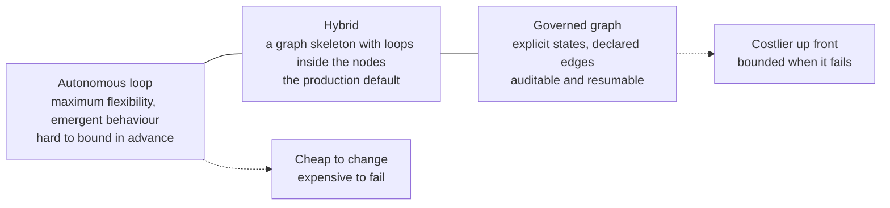
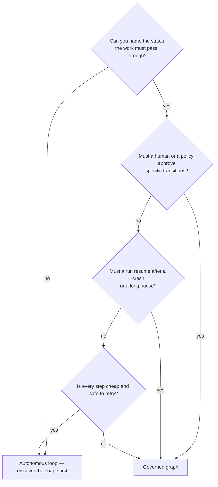
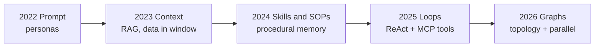
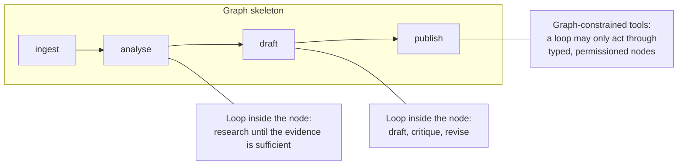
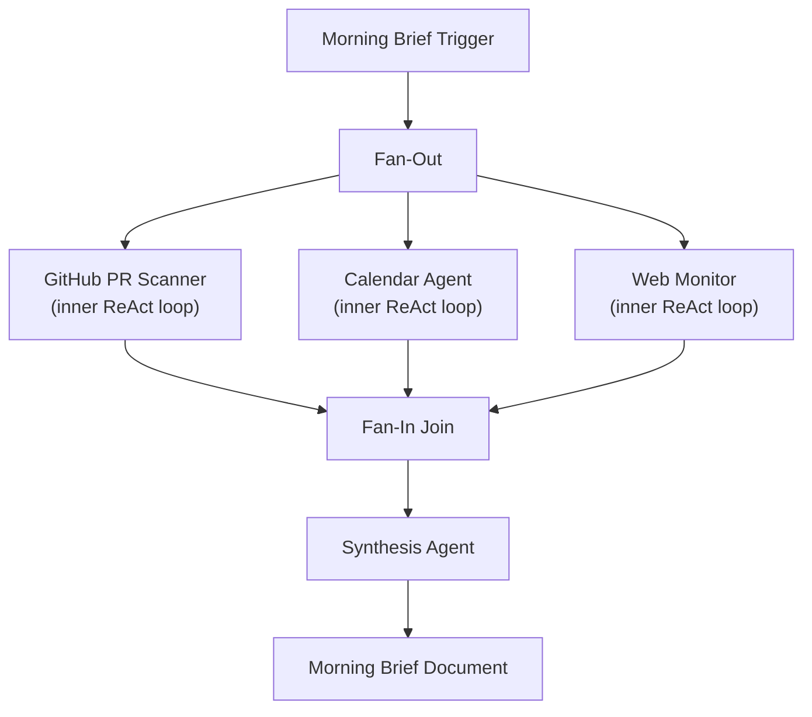
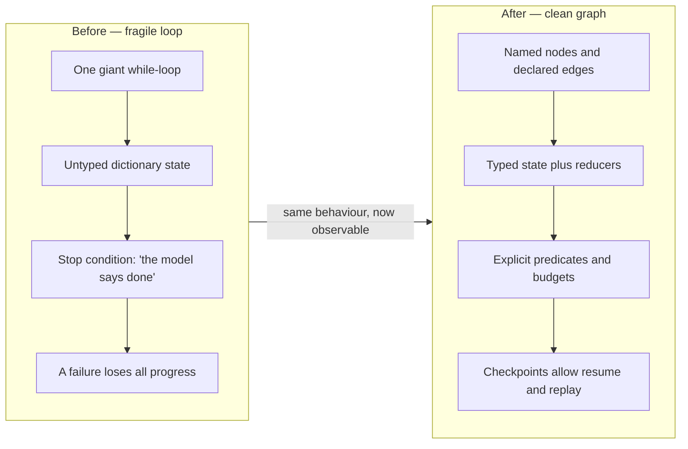

## Introduction

Over the last three lessons, we explored two powerful paradigms for building agentic systems:
- In [Lesson 20](../20-looping/) and [Lesson 21](../21-loop-engineering/), we mastered **loops**—autonomous, model-driven feedback cycles that adapt dynamically to unexpected obstacles.
- In [Lesson 22](../22-graph-engineering/), we mastered **graphs**—explicit, code-governed state machines that enforce strict topology, typed schemas, and auditability.

Now comes the ultimate architectural question every agent engineer must answer:

> **When should you build an autonomous loop, when should you build a governed graph, and how do you combine them in production?**

Choosing incorrectly has severe consequences:
- Use a **loop** where a graph is needed, and your agent will suffer from unpredictable paths, compliance failures, and runaway token bills.
- Use a **graph** where a loop is needed, and your system will become a brittle, over-engineered 50-node monstrosity that breaks whenever the user asks an unexpected question.

This lesson provides the definitive architectural decision framework, comparative trade-off matrix, and production hybrid blueprints.

### ELI5: The off-road expedition vs. the metropolitan subway

Imagine you are planning transportation:

If you are exploring an uncharted jungle (an open-ended coding task or deep research), you need an **off-road 4x4 expedition buggy** (an autonomous loop). There are no pre-built roads. The driver must steer around trees, winch through mud, and adjust the route based on what they see through the windshield.

If you are transporting 500,000 commuters across New York City every morning (an enterprise loan approval or patient triage system), you do not give everyone an off-road buggy. You build a **subway network** (a governed graph). Trains travel on fixed steel tracks, stop at designated stations, wait for dispatch signals, and cannot veer off into oncoming traffic.

What do modern smart cities do? They build a **hybrid**: a high-speed subway line connects major city hubs (macro-graph), while electric shuttles navigate neighborhood streets at the terminal stations (micro-loops).

> **Key takeaway:** Loops excel at emergent problem-solving in unstructured spaces. Graphs excel at governance, compliance, and deterministic workflows. Production systems almost always combine them.

---

## The Autonomy vs. Governance Spectrum

Agent architectures exist on a spectrum between total human control and total agent autonomy:

```
[ LOW AUTONOMY / HIGH GOVERNANCE ]                     [ HIGH AUTONOMY / LOW GOVERNANCE ]
=========================================================================================
Single      --> Linear      --> Governed        --> Hybrid         --> Guarded Autonomous
Prompt          Chain           State Graph         (Graph-of-Loops)   While-Loop
(No branching)  (Fixed A->B->C) (Nodes & Edges)     (Sub-agents)       (Model decides path)
```

1. **Single Prompt:** Zero agency. One input produces one output.
2. **Linear Chain:** Deterministic pipeline. Predictable, but cannot handle errors or branching.
3. **Governed State Graph:** Pure graph engineering. Nodes, edges, reducers, and checkpoints enforce all transitions.
4. **Hybrid (Graph of Loops):** A macro-graph governs the overarching business lifecycle, while individual nodes execute autonomous micro-loops.
5. **Guarded Autonomous Loop:** High agency. The model decides all intermediate steps within strict harness bounds (budget, timeout, stagnation guards).

---



## The 6-dimension architectural comparison matrix

| Dimension | Autonomous Loop (Lessons 20 & 21) | Governed Graph (Lesson 22) | Winner Depends On |
|---|---|---|---|
| **Control & Predictability** | **Emergent:** Model decides next action probabilistically | **Deterministic:** Code-defined edges govern transitions | Strictness of business policy & compliance requirements |
| **Observability & Audit** | Requires parsing conversational thought/action traces | Built-in node transition history and state diffs | Need for zero-ambiguity regulatory audits |
| **Development Velocity** | **Very Fast:** Define tools and system prompt; agent runs | Slower: Must model state schemas, nodes, and routers | Speed to prototype vs. long-term maintainability |
| **Handling Novelty** | **Exceptional:** Adapts to unseen tasks and error messages | Brittle if task falls outside pre-modeled graph edges | Whether the problem space is open-ended or bounded |
| **Token Cost & Budget** | Variable; risk of high token variance per run | Predictable; each node has isolated, bounded scope | Tolerance for cost variance |
| **State Resilience & HITL** | Hard to pause/resume across multi-day human reviews | **Native:** Built-in persistence checkpoints and time-travel | Requirement for human sign-off gates |

### Wall-Clock Latency Equation

When deciding between loops and graphs, consider the mathematical limits of execution speed.

**Sequential Loop Latency:**
$$T_&#123;\text&#123;loop&#125;&#125; = \sum_&#123;i=1&#125;^&#123;N&#125; t_i$$

Every step runs after the previous one. Total time = sum of all step durations.

**Parallel Graph Latency:**
$$T_&#123;\text&#123;graph&#125;&#125; = \max(t_1, t_2, ..., t_k) + t_&#123;\text&#123;synthesis&#125;&#125;$$

Parallel branches execute simultaneously. Total time = slowest branch + synthesis step.

**Example:** 5 research tasks, each taking 30 seconds.
- Loop: 5 × 30s = 150s (2.5 minutes)
- Graph: max(30s) + 10s synthesis = 40s
- Speedup: 3.75×

---

## The architectural decision tree

Use this flowchart when deciding how to structure a new agent capability:

```
                               Start: New Agent Project
                                          |
                                          v
                         Is the overall process fixed by
                         regulations, security, or SOPs?
                                    /           \
                           YES     /             \  NO
                                  v               v
                   Does any stage require         Are tasks highly open-ended
                   unstructured exploration?      (e.g., coding, deep research)?
                          /          \                         /        \
                    YES  /            \  NO              YES  /          \  NO
                        v              v                     v            v
                 [HYBRID: GRAPH   [PURE GRAPH        [GUARDED LOOP    [LINEAR CHAIN
                   OF LOOPS]       WORKFLOW]          WITH HARNESS]     OR DAG]
```



### When to pick an Autonomous Loop:
- **Coding & Debugging:** Investigating stack traces, modifying code, and retrying unit tests until they pass.
- **Deep Web Research:** The agent does not know in advance which search queries will yield relevant facts.
- **Data Exploration:** Formulating SQL queries, inspecting tables, and iterating on data visualizations.
- **Early-Stage Prototyping:** Validating user demand before spending weeks mapping out state graphs.

### When to pick a Governed Graph:
- **Regulated Workflows:** Financial underwriting, insurance claims, and healthcare triage where every decision must map to a compliance rule.
- **Multi-Day Processes:** Tasks that require waiting for a human manager or customer to approve a request.
- **Complex Branching Logic:** When different types of input require fundamentally different tools and instructions.
- **Multi-Role Handoffs:** Where Writer, Reviewer, Legal, and Publisher agents have strict separation of duties.

---

## Where these paradigms came from (the 5-stage ladder)



| Stage | Era | Core idea |
|---|---|---|
| Prompt engineering | 2022 | Instruct well |
| Context engineering | 2023 | Feed the right data |
| Skills and SOPs | 2024 | Package procedures |
| Loop engineering | 2025 | Let it iterate to a goal |
| Graph engineering | 2026 | Orchestrate the known shape |

Each stage did not replace the previous one - it absorbed it. Modern graphs contain loops; modern loops load skills; modern skills assume good context.

## The 2x2 decision matrix and the break-even math

|  | Single path | Parallel paths |
|---|---|---|
| **Known shape** | Sequential graph | **Parallel graph** (fan-out / fan-in) |
| **Unknown shape** | Loop | Loop per branch, graph on top |

Break-even intuition: if each step succeeds with probability `p`, a chain of `n` steps succeeds with `p^n`. At `p = 0.9`, a 10-step chain succeeds only ~35% of the time. That single fact explains two design moves: **loops with verifier retries** raise effective `p`, and **graph node contracts** make failures visible instead of silent. Lift per-step success from 0.9 to 0.99 with a retry and the same chain jumps to ~90%.

## 2023 Airflow DAGs vs 2026 agent graphs

| Property | Airflow-style DAG | Agent graph |
|---|---|---|
| Node behavior | Deterministic task | Often a non-deterministic LLM call |
| Routing | Static dependencies | Dynamic, LLM-as-router edges |
| Failure handling | Retry the task | Retry, re-plan, escalate |
| State | Task metadata | Rich typed state + checkpoints |
| Human in the loop | Rare | Breakpoints and approvals as first-class features |

Airflow orchestrates *known* pipelines; agent graphs orchestrate pipelines whose steps reason. Borrow the ops discipline - retries, backfills, observability - but not the assumption that nodes are predictable.

## Hybrid architectures: The production standard

In enterprise production, the answer is rarely "Loop OR Graph." The industry standard is **Hybrid Composition**:



### Pattern 1: Graph of Loops (Macro-Graph, Micro-Loops)
The top-level workflow is modeled as a deterministic state graph. However, specific nodes inside the graph execute autonomous loops:

```
[Customer Intake Node]
         |
         v (Deterministic Edge)
[Research Node: AUTONOMOUS REACT LOOP]
  - Searches 5 web sources
  - Runs Python calculation
  - Loops until facts gathered
         |
         v (State Checkpoint)
[Human Review Breakpoint] (Pauses until manager clicks Approve)
         |
         v (Conditional Edge)
[Publisher Node: DETERMINISTIC API PUSH]
```

### Pattern 2: Loop with Graph-Constrained Tools
The agent operates in an autonomous loop, but when it calls a complex capability (e.g., `process_refund(user_id, amount)`), that tool is implemented as a strict, verified state graph rather than raw code.

### Pattern 3: Hybrid Waku Graph Concrete Example
A classic hybrid architecture is the Waku-style "Morning Brief" agent. It uses a graph for high-level fan-out orchestration and synthesis, while delegating to inner ReAct loops for the exploratory data gathering.



---

## The refactoring playbook: From fragile loop to clean graph

If your team has an autonomous while-loop that has grown fragile, buggy, and hard to maintain, follow this 4-step refactoring recipe:

```
BEFORE: Monolithic 400-Line While-Loop
while True:
    thought = model.think()
    if "refund" in thought: ...
    elif "shipping" in thought: ...
    elif "ask_human" in thought: ... (Hack: input() blocks server thread)

AFTER: Modular Governed Graph
[Triage Router] ---> [Billing Node]   ---> [Audit Checkpoint]
                ---> [Shipping Node]  ---> [Audit Checkpoint]
```

1. **Step 1: Extract the Central State:** Replace conversational chat history with a strongly-typed `TypedDict` or `Pydantic` model capturing only essential fields.
2. **Step 2: Carve Prompts into Single-Responsibility Nodes:** Turn sprawling 2,000-word system instructions into 3-4 small, focused prompts for each distinct stage.
3. **Step 3: Convert `if/else` Decisions into Routing Edges:** Move branching logic out of the LLM's prompt and into deterministic Python routing functions.
4. **Step 4: Add Persistence Checkpoints:** Wrap the graph in a checkpointer (e.g., LangGraph Postgres Saver or Vertex AI Agent Engine) to make every node boundary durable.

---



## Interactive Visualizer: Architectural Trade-off & Cost Calculator

Input your project's characteristics below to calculate the recommended architectural pattern and view estimated trade-offs:


```html
<div id="decision-calc" style="font-family: -apple-system, BlinkMacSystemFont, 'Segoe UI', Roboto, sans-serif; max-width: 900px; margin: 2rem auto; background: #f8f9fa; border-radius: 16px; box-shadow: 0 4px 24px rgba(0,0,0,0.08); padding: 24px; box-sizing: border-box;">
  <h3 style="margin: 0 0 6px 0; color: #1a1a2e; font-size: 1.25rem;">Loop vs. Graph Architecture Calculator</h3>
  <p style="margin: 0 0 16px 0; color: #666; font-size: 0.88rem;">Select your project constraints to receive an architectural recommendation and trade-off profile.</p>

  <!-- Form Controls -->
  <div style="display: grid; grid-template-columns: 1fr 1fr; gap: 16px; margin-bottom: 20px;">
    <div>
      <label style="display: block; font-size: 0.82rem; font-weight: 700; color: #334155; margin-bottom: 4px;">Task Predictability:</label>
      <select id="calc-predictability" style="width: 100%; padding: 8px; border-radius: 8px; border: 1px solid #cbd5e1; font-size: 0.85rem;">
        <option value="unstructured">Open-Ended (Research, Coding, Debugging)</option>
        <option value="semi">Semi-Structured (Standard flow with exceptions)</option>
        <option value="strict">Strict & Regulated (Finance, Healthcare, Legal)</option>
      </select>
    </div>

    <div>
      <label style="display: block; font-size: 0.82rem; font-weight: 700; color: #334155; margin-bottom: 4px;">Human Approval Requirement:</label>
      <select id="calc-hitl" style="width: 100%; padding: 8px; border-radius: 8px; border: 1px solid #cbd5e1; font-size: 0.85rem;">
        <option value="none">Fully Autonomous (Zero human oversight)</option>
        <option value="checkpoint">Occasional Checkpoint (Manager sign-off on high-risk actions)</option>
        <option value="every_step">Step-by-Step Co-Pilot (Continuous human approval)</option>
      </select>
    </div>

    <div>
      <label style="display: block; font-size: 0.82rem; font-weight: 700; color: #334155; margin-bottom: 4px;">Cost & Latency Sensitivity:</label>
      <select id="calc-cost" style="width: 100%; padding: 8px; border-radius: 8px; border: 1px solid #cbd5e1; font-size: 0.85rem;">
        <option value="relaxed">Flexible (Quality matters most; token variance okay)</option>
        <option value="moderate">Moderate (Reasonable budget with circuit breakers)</option>
        <option value="strict">Strict SLA (Predictable latency & fixed token ceiling)</option>
      </select>
    </div>

    <div>
      <label style="display: block; font-size: 0.82rem; font-weight: 700; color: #334155; margin-bottom: 4px;">Development Stage:</label>
      <select id="calc-stage" style="width: 100%; padding: 8px; border-radius: 8px; border: 1px solid #cbd5e1; font-size: 0.85rem;">
        <option value="prototype">Rapid Prototype / Proof of Concept</option>
        <option value="production">Enterprise Production Deployment</option>
      </select>
    </div>
  </div>

  <!-- Recommendation Card -->
  <div style="background: white; border-radius: 12px; border: 2px solid #3b82f6; padding: 18px; margin-bottom: 16px;">
    <div style="display: flex; justify-content: space-between; align-items: center; margin-bottom: 8px;">
      <span style="font-size: 0.78rem; font-weight: 700; color: #64748b; text-transform: uppercase;">RECOMMENDED ARCHITECTURE</span>
      <span id="calc-badge" style="background: #eff6ff; color: #1d4ed8; padding: 4px 10px; border-radius: 12px; font-weight: 800; font-size: 0.82rem;">HYBRID: GRAPH OF LOOPS</span>
    </div>
    <div id="calc-title" style="font-size: 1.25rem; font-weight: 800; color: #1e293b; margin-bottom: 6px;">Hybrid: Macro-Graph with Autonomous Micro-Loops</div>
    <div id="calc-rationale" style="font-size: 0.85rem; color: #475569; line-height: 1.5;">
      Your requirements benefit from a top-level state graph to enforce human sign-off checkpoints and deterministic routing, while delegating exploratory investigation to bounded autonomous loops inside specialized nodes.
    </div>
  </div>

  <!-- Metric Scores -->
  <div style="display: grid; grid-template-columns: repeat(3, 1fr); gap: 12px;">
    <div style="background: white; border-radius: 10px; border: 1px solid #e2e8f0; padding: 12px; text-align: center;">
      <div style="font-size: 0.72rem; color: #64748b;">Governance Score</div>
      <div id="score-gov" style="font-size: 1.2rem; font-weight: 800; color: #3b82f6;">8.5 / 10</div>
    </div>
    <div style="background: white; border-radius: 10px; border: 1px solid #e2e8f0; padding: 12px; text-align: center;">
      <div style="font-size: 0.72rem; color: #64748b;">Adaptability Score</div>
      <div id="score-adapt" style="font-size: 1.2rem; font-weight: 800; color: #10b981;">8.0 / 10</div>
    </div>
    <div style="background: white; border-radius: 10px; border: 1px solid #e2e8f0; padding: 12px; text-align: center;">
      <div style="font-size: 0.72rem; color: #64748b;">Implementation Complexity</div>
      <div id="score-complex" style="font-size: 1.2rem; font-weight: 800; color: #f59e0b;">Moderate</div>
    </div>
  </div>
</div>

<script>
(function() {
  const predEl = document.getElementById('calc-predictability');
  const hitlEl = document.getElementById('calc-hitl');
  const costEl = document.getElementById('calc-cost');
  const stageEl = document.getElementById('calc-stage');

  const badgeEl = document.getElementById('calc-badge');
  const titleEl = document.getElementById('calc-title');
  const rationaleEl = document.getElementById('calc-rationale');
  const scoreGov = document.getElementById('score-gov');
  const scoreAdapt = document.getElementById('score-adapt');
  const scoreComplex = document.getElementById('score-complex');

  function updateRecommendation() {
    const pred = predEl.value;
    const hitl = hitlEl.value;
    const cost = costEl.value;
    const stage = stageEl.value;

    if (stage === 'prototype' && pred === 'unstructured' && hitl === 'none') {
      badgeEl.textContent = 'GUARDED AUTONOMOUS LOOP';
      badgeEl.style.background = '#ecfdf5';
      badgeEl.style.color = '#047857';
      titleEl.textContent = 'Guarded ReAct Autonomous Loop';
      rationaleEl.textContent = 'For rapid prototyping of open-ended tasks with no human approval required, a guarded ReAct loop delivers maximum development velocity and dynamic problem solving.';
      scoreGov.textContent = '4.0 / 10';
      scoreAdapt.textContent = '9.5 / 10';
      scoreComplex.textContent = 'Low';
    } else if (pred === 'strict' || hitl === 'checkpoint' || hitl === 'every_step' || cost === 'strict') {
      if (pred === 'unstructured') {
        badgeEl.textContent = 'HYBRID: GRAPH OF LOOPS';
        badgeEl.style.background = '#eff6ff';
        badgeEl.style.color = '#1d4ed8';
        titleEl.textContent = 'Hybrid: Governed Graph with Autonomous Leaf Nodes';
        rationaleEl.textContent = 'Your task contains open-ended problem solving but demands strict governance, budget caps, or human checkpoints. Use a state graph for the workflow with bounded ReAct loops inside specific task nodes.';
        scoreGov.textContent = '8.5 / 10';
        scoreAdapt.textContent = '8.0 / 10';
        scoreComplex.textContent = 'Moderate';
      } else {
        badgeEl.textContent = 'PURE GOVERNED GRAPH';
        badgeEl.style.background = '#fef3c7';
        badgeEl.style.color = '#b45309';
        titleEl.textContent = 'Deterministic State Machine / Cyclic Graph';
        rationaleEl.textContent = 'Strict compliance, predictable SLAs, and regulatory policies require an explicit state graph. Every step, edge, and state transition should be governed by code with persistent checkpoints.';
        scoreGov.textContent = '9.8 / 10';
        scoreAdapt.textContent = '4.5 / 10';
        scoreComplex.textContent = 'High';
      }
    } else {
      badgeEl.textContent = 'HYBRID PIPELINE';
      badgeEl.style.background = '#f3e8ff';
      badgeEl.style.color = '#6b21a8';
      titleEl.textContent = 'Staged Pipeline with Adaptive Recovery';
      rationaleEl.textContent = 'A balanced architecture combining sequential task execution with localized retry loops provides strong reliability without unnecessary graph complexity.';
      scoreGov.textContent = '7.5 / 10';
      scoreAdapt.textContent = '7.0 / 10';
      scoreComplex.textContent = 'Moderate';
    }
  }

  [predEl, hitlEl, costEl, stageEl].forEach(el => el.addEventListener('change', updateRecommendation));
})();
</script>
```


---

## Best practices & common anti-patterns

| Anti-Pattern | Why It Breaks | The Architectural Fix |
|---|---|---|
| **The 50-Node Graph for Simple Tasks** | High developer friction; breaks when user input deviates slightly | Keep graphs small (3-7 nodes); let nodes use internal model reasoning |
| **The Naked While-Loop in Banking/Healthcare** | Probabilistic routing violates regulatory compliance | Wrap the workflow in an auditable state graph with HITL checkpoints |
| **Duplicating State Across Graphs & Loops** | State drift and synchronization race conditions | Maintain a single typed state schema; pass clean sub-slices to loops |
| **Forcing Everything into LangGraph or ADK** | Architectural lock-in for tasks that just need a 5-line script | Choose the simplest pattern that meets your SLA and compliance needs |

---

## Key takeaways

- **Loops** provide emergent adaptability for open-ended problem solving (coding, deep research).
- **Graphs** provide deterministic governance, typed state persistence, and native human-in-the-loop controls.
- The highest-performing production systems use **Hybrid Patterns (Graph of Loops)**: macro-graphs directing business processes, with micro-loops handling exploratory sub-tasks.
- Refactor messy loops into graphs by extracting typed state schemas, breaking monolithic prompts into cohesive nodes, and converting `if/else` checks into explicit routing edges.

---

## Further reading

- [Anthropic: Building Effective Agents — Workflows vs. Autonomous Agents](https://www.anthropic.com/research/building-effective-agents)
- [LangGraph Design Principles: State Machines for Agentic AI](https://langchain-ai.github.io/langgraph/)
- [Google Cloud Architecture Center: Multi-Agent Design Patterns](https://cloud.google.com/architecture)
- [Martin Fowler: Finite State Machines in Enterprise Application Architecture](https://martinfowler.com/books/eaa.html)

---

[Previous Lesson: Graph Engineering](../22-graph-engineering/) | [Next: Agent swarms ->](../agent-swarms/)
