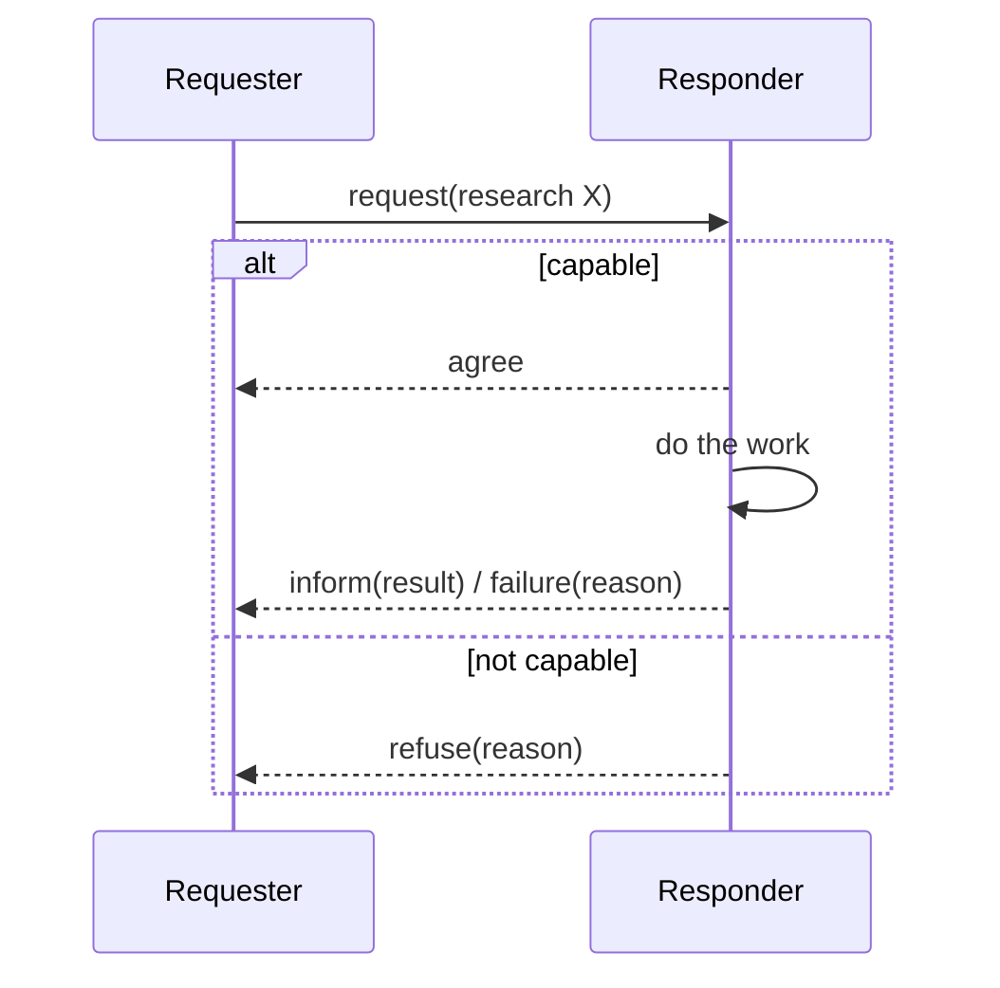
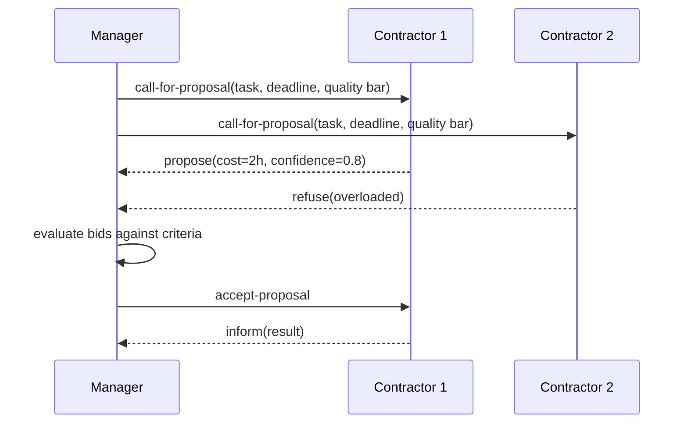

> **Learning goals:** Read and write agent messages with ACL semantics; run the classic interaction protocols; implement a Contract Net; compare negotiation mechanisms; avoid the standard multi-agent failure modes.
> **Prerequisites:** [Lesson 7 - Multi-agent systems](../07-multi-agent-systems/) and [Lesson 14 - Agent protocols, MCP and A2A](../14-agent-protocols-mcp-and-a2a/)

## Coordination mechanisms vs protocols

**Mechanisms** are *where* coordination happens; **protocols** are *the rules* agents follow there.

| Mechanism | Idea | Good for | Watch out |
|---|---|---|---|
| Direct messaging | A sends to B | Small teams, explicit control | Coupling, N-squared chatter |
| Blackboard | Shared workspace; whoever can help, helps | Open-ended problem solving | Contention, no ownership |
| Tuple space | Shared associative store (`out`/`in`/`read`) | Decoupled parallel work | Hard to trace |
| Publish / subscribe | Topics; publishers and subscribers decoupled | Event-driven systems | Delivery guarantees |
| Stigmergy | Work leaves traces others react to | Swarms - see [Agent swarms](../agent-swarms/) | Emergent, hard to govern |

## The anatomy of an agent message

The FIPA **Agent Communication Language (ACL)** is the classic reference - an envelope that separates *what the message does* from *what it says*:

| Field | Meaning | Example |
|---|---|---|
| `performative` | The speech act (what I intend) | `request`, `propose`, `inform` |
| `sender` / `receiver` | Who, via agent IDs | `agent:planner-1` |
| `content` | The payload | `research(topic="battery recycling")` |
| `language` | Encoding of content | JSON, FIPA-SL |
| `ontology` | Shared vocabulary | `supply-chain-v2` |
| `protocol` | Which conversation pattern | `fipa-contract-net` |
| `conversation-id` | Correlates messages in one exchange | `conv-7781` |
| `reply-with` / `in-reply-to` | Threading of turns | `msg-12` |

Common performatives: `inform`, `request`, `query-if`/`query-ref`, `propose`, `accept-proposal`, `reject-proposal`, `refuse`, `agree`, `subscribe`, `failure`, `not-understood`.

Modern LLM stacks (MCP for tools, A2A for agents) re-implement exactly these ideas as JSON - the lesson transfers: always know *who* is speaking, *what act* it is performing, and *which conversation* it belongs to.

## Interaction protocols: the standard conversations

Three base patterns cover most coordination:

| Protocol | Shape | Use for |
|---|---|---|
| **Request** | ask -> agree/refuse -> inform/failure | Delegation with accountability |
| **Propose** | propose -> accept/reject/**counter-propose** | Negotiating terms (price, deadline, scope) |
| **Subscribe** | subscribe -> notify, notify, ... | Standing interest in events (watch a repo, a price) |

Note the **counter-propose** branch: without it, negotiation degenerates into accept/reject and good options die. Always allow "yes, but...".

## Contract Net: the work-allocation protocol

Contract Net is the classic market for *"who should do this job?"* - and it maps directly onto orchestrator delegation:

Design rules: **state evaluation criteria in the CFP** (or bids become incomparable), set a **bid deadline**, allow refusals (a refusing agent beats a failing one), and log the award decision for audit.

## Negotiation mechanisms

| Mechanism | How it works | Best for | Guardrail |
|---|---|---|---|
| Bargaining | Alternating offers until agreement | Multi-dimensional deals | Cap rounds (3-5), walk-away terms |
| English auction | Ascending bids, highest wins | Scarce resource, many bidders | Anti-sniping deadline |
| Dutch auction | Descending price, first to accept wins | Fast sales, price discovery | Reserve price |
| Sealed-bid (Vickrey) | Private bids, second price wins | Truthful valuation | Explain the rule upfront |
| Argumentation | Agents exchange *reasons*, updating beliefs | Quality disputes, planning debates | Bound message length and rounds |

Agent rule of thumb: **auctions when the item is scarce, bargaining when the terms are complex, argumentation when the disagreement is about facts.**

## Coordination mechanisms in modern stacks

| Classic mechanism | Modern implementation |
|---|---|
| Blackboard | Shared task board file or graph store all agents read/write |
| Tuple space | Job queue with typed payloads |
| Publish/subscribe | Event bus, webhooks, chat channels |
| Direct messaging | Agent-to-agent calls (A2A), orchestrator task dispatch |
| Stigmergy | Work artifacts that signal state (labels, PR states, file markers) |

## Failure modes and defenses

| Failure | Symptom | Defense |
|---|---|---|
| Circular delegation | A asks B, B asks A, forever | Cap delegation depth, detect cycles |
| Deadlock | Everyone waits for everyone | Timeouts + default actions |
| Stale messages | Acting on a superseded offer | `conversation-id` + expiry timestamps |
| Conflicting actions | Two agents write the same resource | Single-writer rule per resource |
| Over-communication | Token bill explodes with agents | Budget per agent, batch messages |
| No authority | Nobody can break ties | Explicit arbiter role (orchestrator) |

## Worked example: research crew via Contract Net

| Step | Message | Notes |
|---|---|---|
| 1 | Manager CFP: "Summarize EU battery regulation, 2 hours, cite 5 sources" | Criteria stated upfront |
| 2 | Scout A proposes (has domain memory); Scout B refuses (overloaded) | Refusal is healthy |
| 3 | Manager awards A, logs decision | Audit trail |
| 4 | A informs result; Manager checks citations | Verification |
| 5 | Verifier rejects (2 dead URLs); counter-proposal: replace sources | Counter-propose saves the job |

## Key takeaways

1. Protocols are what let independent agents cooperate without shared memory of intent.
2. ACL separates *the act* (performative) from *the content*; modern JSON messaging copies this.
3. Contract Net is the canonical "who does this?" market - use criteria, deadlines and refusals.
4. Every protocol needs timeouts, cycle limits, an arbiter and a single-writer rule.

## Further reading

- [FIPA ACL message structure specification](http://www.fipa.org/specs/fipa00061/SC00061G.html)
- [Smith (1980) - The Contract Net Protocol](https://ieeexplore.ieee.org/document/1675516)
- [A2A - Agent2Agent protocol](https://a2a-protocol.org/)

---

[Previous Lesson: Classical agent architectures](../classical-agent-architectures/) | [Next Lesson: Agent runtime and LLMOps →](../agent-runtime-and-llmops/)

