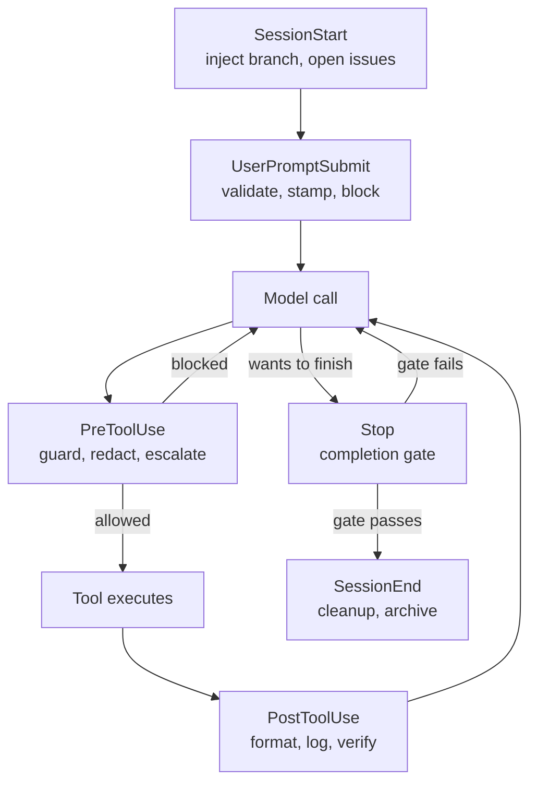

## Introduction

In [Lesson 19](../19-agent-harnesses/), the harness had six parts, and one of them was **Lifecycle Interceptors (L)** - the layer described as "middleware hooks that run before and after every agent turn and tool invocation". That lesson told you the interceptors exist and why. This one shows you how to build them.

The distinction that matters is simple, and it is the whole reason hooks exist:

- A **prompt** is a suggestion. The model follows it *most* of the time.
- A **hook** is a guarantee. The harness runs it, so it happens *every* time.

Every guarantee you care about - "never push to main", "always format the file you touched", "don't finish until tests pass" - belongs in a hook, not in an instruction.

> **Key takeaway:** Hooks are the deterministic shell around a probabilistic core. You write them where you need certainty, and you write them in code you control.

---

## ELI5: the circuit breakers in your house

You can tell everyone in a house, "please don't plug six space heaters into one outlet." Most people will listen. Most of the time.

Or you can install a circuit breaker.

The breaker does not care who you are, what you meant, or how politely you asked. Current exceeds the limit and the circuit opens, every single time. That is a hook: not advice to the occupant, but a physical property of the house.

A hook is where your agent system stops being a conversation and starts being an engineered system.

---

## Hooks vs. agent instructions

If you have read [Lesson 15](../15-agents-md/), you already have a place to put project conventions: `AGENTS.md`. It is worth being precise about which tool does which job.

| You want... | Put it in | Because |
|---|---|---|
| The agent to know how your repo is structured | `AGENTS.md` | Context the model should *know* |
| The agent to usually run the linter | `AGENTS.md` or a skill | A preference - usually-followed is fine |
| The agent to *always* run the linter after an edit | A `PostToolUse` hook | Must happen every time, no exceptions |
| A dangerous command to be *impossible* | A `PreToolUse` hook | The model's cooperation is not part of the security model |
| The agent to write in a certain tone | Instructions or a skill | Style is a judgment call |

The rule of thumb: **anything you would write as "never" or "always" belongs in a hook.**

---

## The lifecycle

Hooks fire at named points in the agent's execution. The full event surface is large and growing, but almost every production setup is built from five of them.



### The events you will actually use

| Event | Fires | Its job in production |
|---|---|---|
| `SessionStart` | Session begins, resumes, or clears | Inject dynamic context - branch, recent commits, open issues |
| `UserPromptSubmit` | Before the model reads your prompt | Stamp the date, reject prompts containing secrets |
| `PreToolUse` | Before a tool call executes | **The guard.** Block destructive commands, enforce tenancy |
| `PostToolUse` | After a tool call succeeds | Format, lint, log what changed |
| `PostToolUseFailure` | After a tool call fails | Capture failing invocations for triage |
| `Stop` | The agent finishes responding | Completion gate - block finishing until tests pass |
| `SubagentStart` / `SubagentStop` | A subagent is spawned / finishes | Inject agent-type context; validate subagent output |
| `PreCompact` | Before context compaction | Snapshot state you cannot afford to lose |
| `Notification` | The agent sends a notification | Desktop alert when it needs input |
| `SessionEnd` | Session terminates | Archive logs, tear down resources |

Anything beyond these exists for the day you need it. Start with the five.

---

## The contract: JSON in, exit codes or JSON out

A hook is not magic - it is a small program with a narrow interface. Understanding the interface is 90% of using hooks well.

**In:** the hook receives a JSON object on stdin (or as a POST body for HTTP hooks, or as a callback argument in an SDK). Every event carries a common envelope plus event-specific fields.

```json
{
  "session_id": "abc123",
  "transcript_path": "/home/user/.claude/projects/.../transcript.jsonl",
  "cwd": "/home/user/my-project",
  "permission_mode": "default",
  "hook_event_name": "PreToolUse",
  "tool_name": "Bash",
  "tool_input": { "command": "npm test" }
}
```

**Out:** usually an exit code. For finer control, print JSON on stdout and exit 0.

| Exit code | Meaning | What the harness does |
|---|---|---|
| `0` | Success | Proceeds. If stdout contains valid JSON, that JSON decides the outcome |
| `2` | **Blocking error** | Blocks the action; stderr is fed back to the model as the reason |
| Any other | Non-blocking error | Logs a hook-error notice and continues anyway |

### The footgun that costs everyone an hour

**Exit `1` does not block anything.** It is the conventional Unix failure code, so it is the natural thing to write - and the harness treats it as a generic non-blocking error, logs it, and proceeds. A policy hook that exits `1` is a policy hook that does nothing.

If you want to block, exit `2` (or return a JSON `permissionDecision`). Write the reason to stderr so the model knows *why* and can adjust instead of retrying blindly.

### What blocking means, per event

Not every event can block, and "block" means something different each time.

| Event | Effect of a blocking outcome |
|---|---|
| `PreToolUse` | The tool call is stopped |
| `UserPromptSubmit` | Processing is blocked and the prompt is erased |
| `Stop` / `SubagentStop` | Stopping is prevented - the agent keeps working |
| `PermissionRequest` | The permission is denied |
| `PreCompact` | Compaction is blocked |
| `PostToolUse` | **Cannot block** - the tool already ran; stderr is shown to the model |

### JSON output for nuanced decisions

When "block" is too blunt, exit 0 and print an object. The key fields:

| Scope | Fields |
|---|---|
| **Universal** | `continue: false` plus `stopReason` stops the agent entirely; `systemMessage` warns the user; `suppressOutput` hides stdout |
| **`PreToolUse`** | `hookSpecificOutput.permissionDecision` of `"allow"`, `"deny"`, `"ask"`, or `"defer"`, plus `permissionDecisionReason` and `updatedInput` to rewrite the arguments |
| **`PostToolUse`** | `updatedToolOutput` replaces the tool result before the model sees it |
| **`SessionStart`** | `additionalContext` injects context the model can see |

One precedence rule to know: when several `PreToolUse` hooks disagree, the most restrictive answer wins - **deny, then defer, then ask, then allow**. Give each decision a single owning hook rather than relying on that tie-break.

> **Critical property:** `PreToolUse` hooks fire *before* permission-mode checks. A hook that denies cannot be overridden by a permissive mode, and a hook that allows cannot loosen settings-level deny rules. Hooks can tighten policy, never weaken it.

---

## Configuring hooks

Configuration nests three levels: pick an event, add a matcher group to filter when it fires, and define handlers to run.

```json
{
  "hooks": {
    "PreToolUse": [
      {
        "matcher": "Bash",
        "hooks": [
          {
            "type": "command",
            "command": "$CLAUDE_PROJECT_DIR/.claude/hooks/guard.sh",
            "timeout": 10
          }
        ]
      }
    ]
  }
}
```

| Concept | Detail |
|---|---|
| **Handler types** | `command` (shell), `http` (POST endpoint), `mcp_tool`, `prompt` (single-turn model evaluation), `agent` (a subagent) |
| **Matchers** | An exact string (`Bash`), a `\|`-separated list (`Edit\|Write`), or `*` / empty for everything. Values with other characters become an unanchored regex - anchor with `^Edit$` when you mean exactly one tool |
| **Argument filters** | The optional per-handler `if` field narrows on the tool's arguments using permission-rule syntax, e.g. `"Bash(git *)"`. Best-effort - use real permission rules for hard guarantees |
| **Scopes** | `~/.claude/settings.json` (all your projects), a project's `.claude/settings.json` (committed, team-wide), and `.claude/settings.local.json` (machine-local, gitignored). Managed policy wins over all of them |
| **Other carriers** | Hooks can ship inside a **plugin** (`hooks/hooks.json`), inside skill or agent frontmatter, and as enterprise-managed policy |
| **Kill switch** | `"disableAllHooks": true` turns everything off temporarily |

Because hooks run in parallel and duplicates are deduplicated, `$CLAUDE_PROJECT_DIR` points scripts at the project root regardless of the working directory.

---

## Example 1 - block destructive commands (`PreToolUse`)

The highest-value hook in any setup: a guard that inspects every shell command and refuses the irreversible ones.

```bash
#!/usr/bin/env bash
# .claude/hooks/guard.sh - register on PreToolUse with matcher "Bash"
set -euo pipefail

payload=$(cat)
command=$(echo "$payload" | jq -r '.tool_input.command // ""')

# Patterns we never want an agent to run unattended.
if echo "$command" | grep -Eq 'rm[[:space:]]+-[a-z]*r[a-z]*f|mkfs|dd[[:space:]]+if=|git push --force'; then
  echo "Blocked: '$command' matches a destructive pattern. Ask the user to run it manually." >&2
  exit 2
fi

exit 0
```

Make it executable (`chmod +x`), wire it up, and every Bash call now passes through it first. Why inspect `tool_input.command` instead of matching the tool? Because the matcher only tells you *a Bash call is happening* - the command string is the thing that is dangerous.

The JSON equivalent gives you more room to grow - `"ask"` escalates to the human, `updatedInput` rewrites the command:

```json
{
  "hookSpecificOutput": {
    "hookEventName": "PreToolUse",
    "permissionDecision": "ask",
    "permissionDecisionReason": "Command deletes a build directory. Confirm before running."
  }
}
```

## Example 2 - auto-format after every edit (`PostToolUse`)

The second hook most teams install. It does not need to block anything, so it is a one-liner in config:

```json
{
  "hooks": {
    "PostToolUse": [
      {
        "matcher": "Edit|Write",
        "hooks": [
          { "type": "command", "command": "jq -r '.tool_input.file_path' | xargs -r npx prettier --write" }
        ]
      }
    ]
  }
}
```

The `-r` on `xargs` matters: without it, an invocation with no file path makes Prettier run with an empty argument and error on every such tool call. Swap Prettier for `ruff format`, `gofmt`, or `swiftformat` as your stack demands.

## Example 3 - inject context at session start (`SessionStart`)

Plain stdout from a `SessionStart` hook becomes context the model can see - no JSON required:

```bash
#!/usr/bin/env bash
# .claude/hooks/session-context.sh - register on SessionStart
echo "Current branch: $(git branch --show-current)"
echo "Recent commits:"
git log --oneline -5
echo "Uncommitted files: $(git status --porcelain | wc -l | tr -d ' ')"
exit 0
```

Use this for *dynamic* state. Static conventions belong in `AGENTS.md` - there is no reason to spend a subprocess on facts that never change.

## Example 4 - a completion gate (`Stop`)

`Stop` fires when the agent believes it is done. Blocking it forces the agent to keep working until a condition holds:

```bash
#!/usr/bin/env bash
# .claude/hooks/stop-gate.sh - register on Stop
set -euo pipefail
input=$(cat)

# Guard against infinite loops: if we already blocked a stop, let this one through.
if [ "$(echo "$input" | jq -r '.stop_hook_active')" = "true" ]; then
  exit 0
fi

if ! npm test --silent >/tmp/stop-gate.log 2>&1; then
  echo "Tests are failing. Fix them before finishing: $(tail -5 /tmp/stop-gate.log)" >&2
  exit 2
fi
exit 0
```

This single hook converts "the agent says it is done" into "the agent is done, and here is the evidence." Always check the loop-guard field first - a gate that can block forever will block forever.

## Example 5 - in-process hooks in Python

If you are building on an SDK rather than driving a CLI, hooks become callback functions instead of shell scripts. The events and matchers are the same; the return shape is the same JSON. Here is the Claude Agent SDK:

```python
import logging
from claude_agent_sdk import ClaudeAgentOptions, ClaudeSDKClient
from claude_agent_sdk.types import HookMatcher

logger = logging.getLogger(__name__)


async def check_bash_command(input_data, tool_use_id, context):
    """PreToolUse: refuse commands that reference a forbidden script."""
    if input_data["tool_name"] != "Bash":
        return {}
    command = input_data["tool_input"].get("command", "")
    if "foo.sh" in command:
        logger.warning("Blocked command: %s", command)
        return {
            "hookSpecificOutput": {
                "hookEventName": "PreToolUse",
                "permissionDecision": "deny",
                "permissionDecisionReason": "Command references a forbidden script",
            }
        }
    return {}


options = ClaudeAgentOptions(
    allowed_tools=["Bash"],
    hooks={
        "PreToolUse": [
            HookMatcher(matcher="Bash", hooks=[check_bash_command]),
        ],
    },
)

async with ClaudeSDKClient(options=options) as client:
    await client.query("Run the bash command: ./foo.sh --help")
    async for message in client.receive_response():
        print(message)
```

Returning an empty dict means "no opinion - allow normally." Returning a `permissionDecision` of `"deny"` is the in-process equivalent of `exit 2`, with the advantage that you can attach a structured reason the model will read.

## Example 6 - hooks in Google ADK

ADK expresses the same idea as **callbacks** on the agent, with a naming convention that mirrors the lifecycle: `before_agent_callback` / `after_agent_callback` on every agent, and the model and tool hooks on `LlmAgent`.

```python
from google.adk.agents import Agent


def redact_secrets(callback_context, llm_request):
    """before_model_callback: runs before every model call."""
    for content in llm_request.contents:
        # scrub credentials out of anything entering the context window
        ...
    return None  # returning None lets the call proceed normally


def guard_tool(tool, args, tool_context):
    """before_tool_callback: runs before every tool call.

    Returning a dict short-circuits the tool and hands the value back
    to the model as the tool result - the ADK equivalent of blocking.
    """
    if tool.name == "delete_file" and not args.get("confirmed"):
        return {"error": "Blocked by policy: deletion requires confirmation"}
    return None


def after_tool(callback_context, tool, args, tool_response):
    """after_tool_callback: sanitize the result before it re-enters context."""
    ...
    return None


agent = Agent(
    name="guarded_agent",
    model="gemini-2.5-flash",
    instruction="You help with the reporting pipeline.",
    before_model_callback=redact_secrets,
    before_tool_callback=guard_tool,
    after_tool_callback=after_tool,
)
```

Two ADK-specific details are worth remembering:

- **Plugins outrank callbacks.** ADK's plugin system (`google.adk.plugins.base_plugin.BasePlugin`) lets you register hooks on the *runner* so they apply across every agent. For any given event, plugin hooks run **before** the corresponding agent callback. That makes plugins the right home for cross-cutting policy - logging, rate limits, tenancy boundaries - and callbacks the right home for agent-specific behavior.
- **Plugins have more hooks than bare callbacks.** Standard callbacks are just `before_` and `after_`. Plugins additionally get error-handling hooks, which is where retry and recovery logic belongs.

---

## Hooks across frameworks

| Framework | Hook mechanism | Notes |
|---|---|---|
| **Claude Code** | `settings.json` `hooks` key, event + matcher + handler | Handler types: command, http, mcp_tool, prompt, agent |
| **Claude Agent SDK** | `hooks` field with `HookMatcher` callbacks | Same events as the CLI; shell hooks from settings still apply |
| **Google ADK** | Agent callbacks and runner-level plugins | Plugin hooks always precede agent callbacks |
| **LangGraph** | Interrupts on graph nodes | Blocking a node for approval is a first-class graph feature |
| **Agent harness (your own)** | Lifecycle interceptors (L) from Lesson 19 | The same `pre_turn` / `pre_tool` / `post_tool` / `post_turn` slots |

They all converge on the same four slots: **before the turn, before a tool, after a tool, after the turn.** If you are building your own harness, implement those and you have the whole pattern.

---

## The hook pattern catalog

| Pattern | Event | What it does |
|---|---|---|
| **Guard** | `PreToolUse` | Deny dangerous or out-of-scope actions; deny-by-default for anything not explicitly allowed |
| **Rewriter** | `PreToolUse` | Use `updatedInput` to repair a malformed or over-broad call |
| **Auto-fixer** | `PostToolUse` | Format, lint, or type-check every file the agent touches |
| **Sanitizer** | `PostToolUse` | Scrub secrets from tool output before it enters context |
| **Context injector** | `SessionStart`, `UserPromptSubmit` | Add dynamic state the model cannot guess |
| **Audit logger** | Any | Persist every call for the trajectory record - the observability layer of [Lesson 9](../09-evaluating-and-testing-agents/) |
| **Completion gate** | `Stop` | Refuse to finish until a verifiable condition holds |
| **Escalator** | `PreToolUse` | Return `"ask"` to route a decision to a human - the hook-level form of [human-in-the-loop](../10-guardrails-and-safety/) |

---

## Best practices and footguns

| Practice | Why |
|---|---|
| Exit `2` to block, never `1` | Exit `1` is logged and ignored; the action proceeds |
| Write the reason to stderr | The model reads it and can change course instead of looping |
| Keep policy in code you own | The model's cooperation is not a boundary |
| Prefer a script file over inline shell | Testable, reviewable, keeps JSON readable |
| Quote your variables | Commands contain spaces, quotes, and metacharacters the model generated |
| Set timeouts and check the loop guard | A gate that can block forever will |
| Idempotent hooks | They may run more than once; make that safe |
| Log everything | In a decentralized or long-running system, the hook log *is* the audit trail |

| Footgun | What actually happens |
|---|---|
| `exit 1` in a policy hook | Nothing is blocked. This is the single most common hook bug |
| Matching the tool when you meant the content | A `Bash` matcher fires on *every* Bash call - read `tool_input` to decide |
| Printing JSON *and* exiting non-zero | The JSON is discarded; JSON is only honored on exit `0` |
| Treating a hook as a sandbox | Hooks run as you, with your permissions. They are policy, not isolation |
| Trusting installed hooks blindly | A hook from a plugin is arbitrary code running in your shell |

---

## Key takeaways

- **Prompts are suggestions; hooks are guarantees.** Anything you would phrase as "always" or "never" belongs in a hook.
- Hooks attach to lifecycle **events** (`SessionStart`, `UserPromptSubmit`, `PreToolUse`, `PostToolUse`, `Stop`, and more), filtered by **matchers**.
- The contract is **JSON in, exit codes or JSON out**. Exit `2` blocks on the events that can block; **exit `1` blocks nothing**.
- `PreToolUse` is your guard rail: it fires before permission checks, can `deny`, `ask`, or rewrite the call, and cannot be loosened by permissive modes.
- `PostToolUse` cannot block - it reacts: format, sanitize, log.
- `Stop` is a completion gate: block it and the agent must keep working until a verifiable condition holds.
- The same four slots - before turn, before tool, after tool, after turn - appear in every framework. In ADK they are callbacks, with runner-level **plugins** running first.
- Existing hooks you already rely on are an attack surface: review them like code, because that is what they are.

---

## Further reading

- [Claude Code hooks reference](https://code.claude.com/docs/en/hooks) - event schemas, JSON formats, async and HTTP hooks
- [Claude Code: automate actions with hooks](https://code.claude.com/docs/en/hooks-guide) - the official patterns
- [Claude Agent SDK hooks](https://code.claude.com/docs/en/agent-sdk/hooks) - in-process callbacks
- [Claude Agent SDK Python hook examples](https://github.com/anthropics/claude-agent-sdk-python/blob/main/examples/hooks.py) - runnable reference source for Example 5
- [Google ADK callbacks](https://adk.dev/callbacks/) and [ADK plugins](https://adk.dev/plugins/) - the callback and plugin hook models
- [SWE-bench: Can Language Models Resolve Real-World GitHub Issues?](https://www.swebench.com/) - why completion gates matter more than model quality

---

[Previous Lesson: Agent plugins](../agent-plugins/) | [Next Lesson: MCP vs Tools ->](../mcp-vs-tools/)
