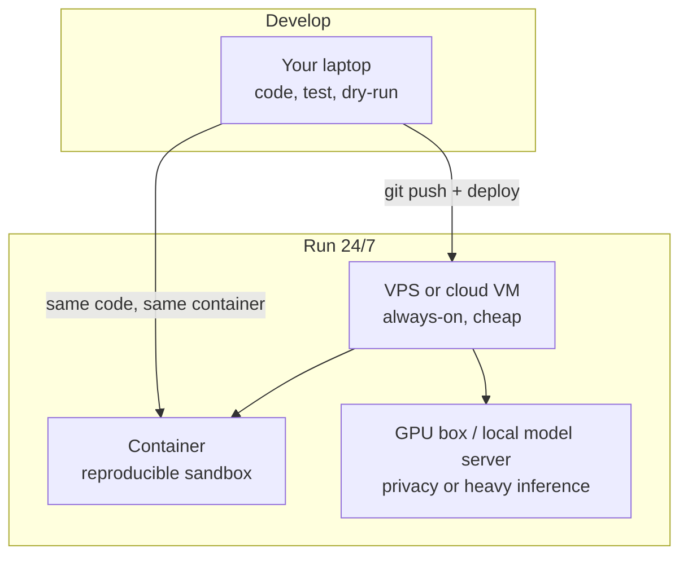
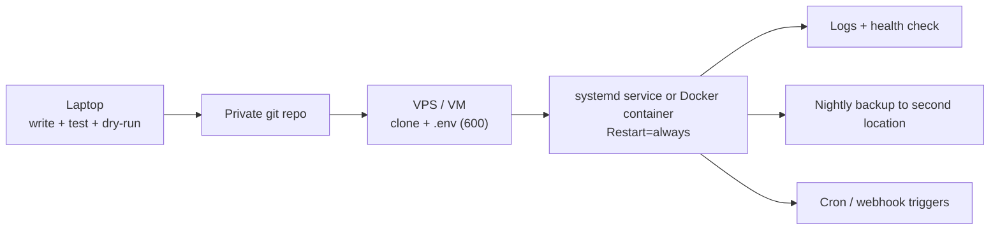
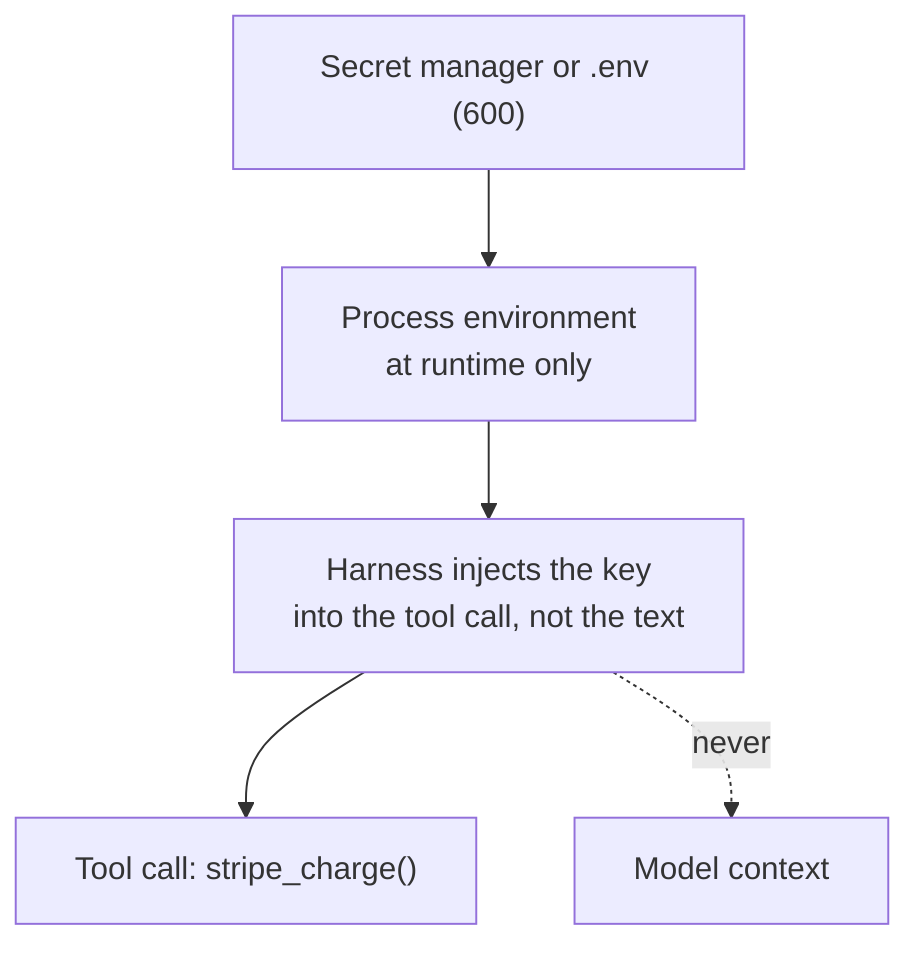

> **Learning goals:** Choose a host for your worker; understand terminal, deploy and GPU basics; lock down SSH, firewall, permissions, secrets and backups like a sysadmin.
> **Prerequisites:** [Lesson 29 - AI worker foundations](../agent-worker-foundations/)

## The question nobody asks in tutorials: where does the worker live?

Your laptop is fine for learning and terrible for ownership: it sleeps, it travels, it dies. A worker that owns a recurring outcome needs a **host** with uptime, backups and a security posture you understand.



### Hosting options compared

| Option | Uptime | Cost / month | Privacy | Best for |
|---|---|---|---|---|
| Laptop / desktop | Low (sleeps) | $0 | Total | Prototyping, local-first workers |
| Always-on mini PC | High | $0 one-time + power | Total | Home automation, personal brain |
| VPS (1-2 vCPU) | Very high | $5-20 | Good | Scheduled workers, inbox triage, webhooks |
| Cloud VM / managed | Very high | $20+ | Good | Team workers, autoscaling, audit needs |
| Container (Docker) on any of the above | Same as host | $0 | Same as host | Reproducible, disposable, safer sandbox |
| GPU box / rented GPU | Depends | $0.3-2 / hour | Total locally | Local models, vision, fine-tuning |

Rule of thumb: **develop locally, deploy to the smallest always-on host that can do the job, prefer containers.**

## Terminal, commands and the sandbox mindset

Agents act by running commands. That is their superpower and their risk. The three safety dials you control:

| Dial | Safe setting | Why |
|---|---|---|
| **Allowlist** | Only commands the worker needs (`python`, `git`, `curl` to specific domains) | Blocks creative destruction |
| **Sandbox** | Container or dedicated user with no access to personal files | Blast radius stays small |
| **Dry-run mode** | Actions are logged, not executed, on first N runs | Builds trust before autonomy |

An agent with `bash` and no allowlist is a remote shell for anyone who can influence its input (including a web page it reads). Treat every tool as an attack surface - this is the same principle as [Lesson 10 - Guardrails and safety](../10-guardrails-and-safety/) applied at the OS level.

## The deploy path: laptop to always-on



Typical first deploy (Ubuntu VPS):

```bash
# 1. create a dedicated non-root user
sudo adduser --disabled-password agent && sudo usermod -aG docker agent
# 2. install runtime, clone repo into /home/agent/worker
# 3. put secrets in /home/agent/worker/.env  (chmod 600, owner agent)
# 4. run as a service so it restarts after crashes and reboots
sudo systemctl enable --now inbox-briefer.service
```

```ini
# /etc/systemd/system/inbox-briefer.service
[Service]
User=agent
WorkingDirectory=/home/agent/worker
EnvironmentFile=/home/agent/worker/.env
ExecStart=/usr/bin/python3 main.py
Restart=always
```

## SSH: know your front door

SSH is the encrypted shell you use to administer the host. Passwords get brute-forced; keys do not.

| Good practice | Command / setting |
|---|---|
| Use ed25519 keys | `ssh-keygen -t ed25519 -C "you@laptop"` |
| Disable password login | `PasswordAuthentication no` in `sshd_config` |
| No root login | `PermitRootLogin no` |
| Auto-ban scanners | `fail2ban` with the sshd jail |
| Scoped keys for automation | A **deploy key** limited to one repo, never your personal key |

The worker itself needs **outbound** calls, not inbound SSH. Give the agent a scoped key or token for exactly the systems it must touch ([Lesson 10](../10-guardrails-and-safety/) applies here too).

## Firewall: default deny

```bash
sudo ufw default deny incoming
sudo ufw default allow outgoing
sudo ufw allow 22/tcp        # your SSH port (change it if you like)
sudo ufw allow 443/tcp       # only if you receive webhooks
sudo ufw enable
```

Two ideas worth internalizing:

1. **Inbound**: if nothing needs to reach the host, nothing is open.
2. **Outbound**: an allowlist of tool domains limits how much damage a prompt-injected agent can do - it cannot exfiltrate your data to an unknown server.

## File permissions and least privilege

| Rule | Why |
|---|---|
| Run as a dedicated `agent` user, not root | Blast radius of any bug stays tiny |
| `chmod 600 .env`, `chmod 700 secrets/` | Other users on the box cannot read secrets |
| Knowledge base mounted read-only for tools that only read | Prevents accidental rewrites of your brain |
| Separate worker accounts per worker | One compromised worker cannot touch the others |

## Secrets never enter the prompt



| Bad | Good |
|---|---|
| API key pasted in the system prompt | Key in environment, referenced by tool code |
| `.env` committed to git | `.env.example` committed, `.env` ignored |
| One master key for everything | Scoped keys per service, rotated on leak |
| Key in logs | Redaction middleware before logging |

## Backups: the difference between a toy and an asset

Follow **3-2-1**: three copies, two media, one off-site. Back up `state.db`, `MEMORY.md`, `skills/`, `brain/`, configs and the deploy unit file. Do **not** back up plaintext secrets with the same access - encrypt them or keep them in a manager. **Test a restore monthly**; an untested backup is a rumor.

## Host security checklist

- [ ] Dedicated non-root user runs the worker
- [ ] SSH key-only, root login disabled, fail2ban on
- [ ] Firewall default-deny, only required ports open
- [ ] Outbound allowlist for tool domains
- [ ] Secrets in env/manager, `600`, never in git or prompts
- [ ] Container or sandbox for anything that executes untrusted code
- [ ] Logs with redaction, retained for debugging
- [ ] Automated backup + tested restore
- [ ] Spend caps and alert thresholds on the API account
- [ ] A written "what to do if the key leaks" paragraph

## Common pitfalls

| Pitfall | Why it hurts | Fix |
|---|---|---|
| Running everything as root | One bug owns the machine | Dedicated user + container |
| Long-lived unrotated keys | Leak becomes permanent | Scope + rotate |
| Host only inside your home network | Uptime depends on your router | VPS for anything that must run |
| No disk monitoring | Fills with logs, worker dies | Log rotation + alerts |
| Silent deploy drift | "Works on my laptop" | Same container everywhere |

## Key takeaways

1. Choose the smallest always-on host that does the job; develop locally, run remotely.
2. SSH keys, default-deny firewall, least privilege and scoped secrets are non-negotiable.
3. Backups with tested restores are what make a worker an *asset*.
4. Every host control you add is a guardrail the model cannot talk its way past.

## Further reading

- [OWASP Top 10 for LLM Applications](https://genai.owasp.org/llm-top-10/)
- [Ubuntu - ufw firewall documentation](https://help.ubuntu.com/community/UFW)
- [systemd.service reference](https://www.freedesktop.org/software/systemd/man/latest/systemd.service.html)

---

[Previous Lesson: AI worker foundations](../agent-worker-foundations/) | [Next Lesson: Event-driven and scheduled agents →](../event-driven-and-scheduled-agents/)

