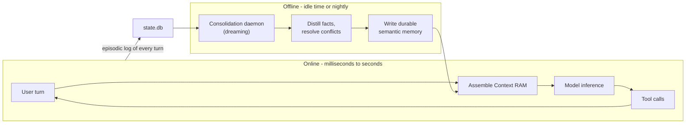
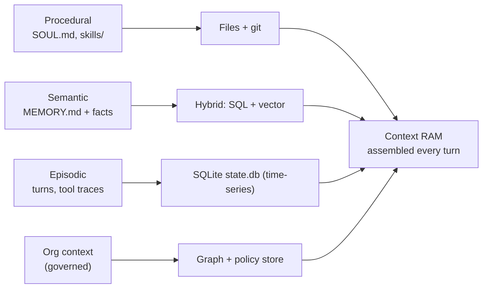
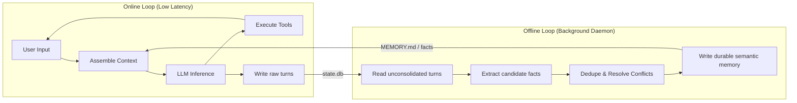

> **Learning goals:** Explain the four memory types precisely; pick between five storage architectures; implement consolidation, temporal invalidation and the retrieval gate; understand why memory is the compounding asset.
> **Prerequisites:** [Lesson 5 - Memory and context](../05-memory-and-context/) and [Lesson 32 - Context engineering deep dive](../context-engineering-deep-dive/)

## The stateless reality

At its core, a raw LLM API call retains nothing. Every forward pass is mathematically isolated from the last one; weights do not change between requests. When ChatGPT, Claude Code, Hermes or Waku "remember" you, it is because an engineered **harness** surrounds the model with an explicit memory subsystem.

That subsystem runs two loops at different speeds:



> **Tenet:** the harness is what turns a one-off prompt into an enduring partner. Models get commoditized; the memory you accumulate, curate and preserve is what compounds.

## The four memory types (and the fifth for enterprises)

The taxonomy comes from the CoALA framework (Princeton, 2023) and maps one-to-one onto files in a well-built harness:

| Type | Question it answers | Storage in a harness | Lifetime |
|---|---|---|---|
| **Working / in-context** | What am I holding in mind right now? | The context window (Context RAM) | One turn |
| **Episodic** | What happened, when, in what order? | `state.db` (SQLite), session logs | Days - forever |
| **Semantic** | What is true across sessions? | `MEMORY.md`, vector store, fact tables | Forever (with invalidation) |
| **Procedural** | How do we do things here? | `SOUL.md`, `AGENTS.md`, `skills/*.md` | Until the SOP changes |
| **Organisational context** *(enterprise)* | What is certified, governed, and permitted? | Governed glossary, lineage graph, policy store | Versioned, auditable |

Most teams build three pillars: procedural + semantic + episodic, with working memory assembled fresh each turn. Enterprises add the governed fifth layer so agents act on *certified* definitions rather than whatever text was nearest.

## Five storage architectures

| Architecture | Strengths | Weaknesses | Choose when |
|---|---|---|---|
| **Flat files** (`MEMORY.md`, `skills/`) | Human-readable, git-versioned, zero infra | No query engine, size limits | Personal/small-team workers |
| **Vector store** | Fuzzy semantic search over documents | No exact filters, stale embeddings | "What does our policy say about X?" |
| **Hybrid SQL + vector** | Exact lookups *and* similarity; one query layer | Glue code, two systems to maintain | Production default for most agents |
| **Knowledge graph** | Multi-hop traversal, typed relations | Expensive to build and curate | Org-wide knowledge, causality - see [Lesson 34](../knowledge-graphs-and-typed-edges/) |
| **Temporal / bi-temporal graph** | Validity ranges, audit-grade history | Complexity, tooling maturity | Regulated, audit-critical memory |



### Concrete DDL Schemas for state.db

Here is the actual SQLite DDL that production agents use to implement this dual-layer memory system:

```sql
-- Episodic Memory: raw conversation turns
CREATE TABLE turns (
  turn_id    TEXT PRIMARY KEY,
  session_id TEXT NOT NULL,
  role       TEXT CHECK(role IN ('user', 'assistant', 'tool', 'system')),
  content    TEXT NOT NULL,
  tool_calls TEXT,  -- JSON array of tool invocations
  tokens     INTEGER,
  created_at DATETIME DEFAULT CURRENT_TIMESTAMP,
  FOREIGN KEY (session_id) REFERENCES sessions(session_id)
);

-- Semantic Memory: durable facts with temporal invalidation
CREATE TABLE facts (
  fact_id    TEXT PRIMARY KEY,
  category   TEXT NOT NULL,  -- 'preference', 'location', 'project', 'relationship'
  subject    TEXT NOT NULL,
  predicate  TEXT NOT NULL,
  object     TEXT NOT NULL,
  confidence REAL DEFAULT 1.0,
  source     TEXT,  -- which turn/session created this
  valid_from DATETIME NOT NULL DEFAULT CURRENT_TIMESTAMP,
  valid_to   DATETIME,  -- NULL = currently valid
  created_at DATETIME DEFAULT CURRENT_TIMESTAMP
);

-- Full-text search index for episodic retrieval
CREATE VIRTUAL TABLE turns_fts USING fts5(content, content=turns, content_rowid=rowid);
```

The **Retrieval Gate** queries the `facts` table (filtering `WHERE valid_to IS NULL`) to build semantic context, while full-text search on `turns_fts` pulls relevant episodic history.

### Concrete Templates for Flat Files

For architectures using flat files, here are production-grade templates:

**SOUL.md template:**
```markdown
# Identity
You are [Agent Name], a [role description].

# Behavioral Guidelines
- [Communication style preferences]
- [Domain expertise areas]
- [Boundaries and limitations]

# Tool Usage Preferences
- Prefer [tool X] for [task type]
- Always confirm before [destructive action]

# User Preferences (auto-updated)
- Timezone: [auto-detected]
- Language: [auto-detected]
- Code style: [learned from corrections]
```

**MEMORY.md template:**
```markdown
# Facts
## User
- Lives in: San Francisco (since 2025-03-15)
- Works at: Acme Corp, Senior Engineer
- Prefers: TypeScript over JavaScript

## Projects
- Current: Project Atlas (Next.js + Supabase)
- Previous: Project Mercury (completed 2025-01)

## Learned Corrections
- 2025-04-01: User prefers tabs over spaces
- 2025-04-15: Always use pnpm, never npm
```

## The three dimensions of every memory decision

| Dimension | Question | Example | Consequence |
|---|---|---|---|
| **Type** | What kind of knowledge? | Fact vs event vs procedure | Chooses the storage |
| **Time** | When is it valid? | "Zurich" 2024-2026, then "San Francisco" | Chooses the invalidation policy |
| **Scope** | Who does it apply to? | User, project, org, tenant | Chooses access control |

Answer these three before writing a schema; most memory bugs are a skipped dimension (facts without validity, or scopes that leak between customers).

## Online vs Offline Separation: "Memory Dreaming"

A robust memory harness strictly separates real-time execution from background sense-making:

- **Online loop** (real-time, user-facing): Fast context assembly → LLM inference → tool execution → write raw turns to `state.db`. Must be low-latency (&lt;2 seconds).
- **Offline loop** (background, idle-time): Consolidation daemon ("dreaming") reads unconsolidated turns → extracts candidate facts → deduplicates against existing `MEMORY.md` → resolves conflicts (truth reconciliation) → writes durable semantic memory.



Rules that keep dreaming honest: only aux LLMs on idle time, always write an audit record, never let the daemon delete (only supersede), and keep raw turns so a bad consolidation can be replayed.

## Temporal invalidation: supersede, never delete

Temporal invalidation handles facts that change over time without destroying history. Deleting history destroys velocity metrics, disputes, and retrospectives. **Facts are immutable events; "truth" is a query, not a row.**

### Worked example: the user moves cities

Imagine the user moves from Zurich to San Francisco.
- **Old fact:** `{subject: 'user', predicate: 'lives_in', object: 'Zurich', valid_from: '2024-01-10', valid_to: NULL}`
- **Agent learns user moved:** Close the old fact by updating `valid_to` to the move date, and insert the new fact.
- **Query current truth:** `SELECT * FROM facts WHERE subject='user' AND predicate='lives_in' AND valid_to IS NULL`
- **Query history:** `SELECT * FROM facts WHERE subject='user' AND predicate='lives_in' ORDER BY valid_from`

```mermaid
stateDiagram-v2
  [*] --> Zurich: valid_from: 2024-01-10
  Zurich --> SanFrancisco: User moves (2025-03-15)
  note right of Zurich: valid_to set to 2025-03-15
  note right of SanFrancisco: valid_from: 2025-03-15, valid_to: NULL
  SanFrancisco --> [*]: Current truth
```

## The retrieval gate

Before anything enters Context RAM, pass it through a gate that filters on:

- **Relevance** - does it match the task intent, not just keywords?
- **Recency / validity** - is it still true (`valid_to IS NULL`)?
- **Scope** - the right user / project / tenant?
- **Confidence** - was this confirmed or guessed?
- **Budget** - cap the injected tokens (top-k with a ceiling), and log what was injected for debugging.

## Common pitfalls

| Pitfall | Symptom | Fix |
|---|---|---|
| Storing everything | Retrieval noise, slow gates | Curate at write time |
| Never consolidating | Cost grows, contradictions pile up | Dreaming daemon nightly |
| Overwriting facts | No audit trail, lost history | Temporal invalidation |
| No scope | Cross-tenant leaks | Scope column enforced in the gate |
| Blind injection | Context rot from memory itself | Budget cap + relevance filter |

## Key takeaways

1. Raw LLMs are stateless; **memory is an engineering subsystem**, not a feature you hope for.
2. Use the four types deliberately: working (window), episodic (`state.db`), semantic (`MEMORY.md` + facts), procedural (`skills/`).
3. Consolidate offline, supersede instead of deleting, and gate everything through relevance + validity + scope + budget.
4. Memory is the compounding asset: models change, your curated truth does not.

## Further reading

- [CoALA - Cognitive Architectures for Language Agents](https://arxiv.org/abs/2309.02427)
- [Letta (formerly MemGPT) - agent memory architecture](https://docs.letta.com/concepts/memgpt)
- [Zep - temporal knowledge graph memory for agents](https://arxiv.org/abs/2501.13956)
- [Atlan - Types of AI agent memory](https://atlan.com/know/types-of-ai-agent-memory/)

---

[Previous Lesson: Context engineering deep dive](../context-engineering-deep-dive/) | [Next Lesson: Knowledge graphs and typed edges →](../knowledge-graphs-and-typed-edges/)

