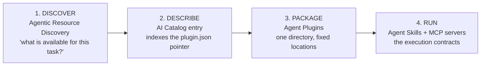
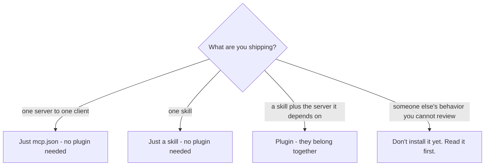

## Introduction

[Lesson 17](../17-agent-skills/) gave us **skills**: portable Markdown that tells an agent how to do a job. [Lesson 16](../16-mcp-deep-dive/) gave us **MCP servers**: the tools that let an agent actually do it. Each is portable on its own.

The *packaging* was never portable. Every client invented its own folder layout, its own manifest, its own way of wiring an MCP server. So if you wrote one skill plus one MCP server and tried to ship it to a second tool, you forked it, maintained two copies of components that were never different, and watched them drift.

A **plugin** is the fix: a single directory with fixed locations for the parts that are genuinely the same, and an escape hatch for the parts that are not.

> **Key takeaway:** Skills are content, MCP servers are capability, and a plugin is the shipping container. It adds a packaging layer *above* both - it replaces neither.

---

## ELI5: a flat-pack box, not just the furniture

Buying a desk used to mean a pile of parts, a hardware bag, and a photocopied sheet of instructions that may or may not match the parts you got. Flat-pack changed the deal: one box, everything in it, one sheet, and any Allen key you already own will work.

A plugin is flat-pack for agent extensions. The **skills** are the assembly instructions, the **MCP servers** are the tools in the hardware bag, and `plugin.json` is the label on the box that says what is inside and what it is called. The box does not make the desk stronger - it just means you can buy it once and assemble it anywhere.

---

## Why plugins exist

The problem is not the components. It is the manifest.

Picture a team that built a genuinely useful thing: a skill that knows how to query the reporting database, plus an MCP server that turns the rows into the weekly summary people actually read. It works. Now they want it in a second client.

| Layer | Portable before plugins? | Why it broke |
|---|---|---|
| Agent Skills | Yes | The `SKILL.md` format is a published spec |
| MCP servers | Yes | `mcp.json` / server config is standardized |
| **The wrapper** | **No** | Every client wanted a different directory layout, different top-level metadata, a different MCP config shape |

So teams fork. Two copies of identical logic, drifting apart one commit at a time. Plugins standardize the wrapper so the components can travel.

---

## Anatomy of a plugin

Two conventions matter in practice. The first is the format used by Claude Code, whose plugin system popularized the idea. Every plugin follows the same layout:

```
plugin-name/
├── .claude-plugin/
│   └── plugin.json        # Plugin metadata (required)
├── commands/              # Slash commands (optional)
├── agents/                # Specialized subagents (optional)
├── skills/                # Agent Skills, one folder each (optional)
├── hooks/                 # Event handlers (optional)
├── .mcp.json              # External tool configuration (optional)
└── README.md              # Plugin documentation
```

A concrete example - the shape of a real code-review plugin from Anthropic's own plugin repository:

```
code-review/
├── .claude-plugin/plugin.json
├── commands/
│   └── code-review.md          # /code-review slash command
├── agents/
│   ├── claude-md-compliance.md # 5 parallel review subagents
│   ├── bug-detect.md
│   ├── historical-context.md
│   ├── pr-history.md
│   └── code-comments.md
├── hooks/
│   └── hooks.json              # optional: gate, format, log
└── README.md
```

Notice what a plugin actually bundles. It is not just documentation - it is **capability plus behavior**: commands the user can invoke, subagents that run in parallel, skills that load on demand, hooks that fire deterministically, and MCP servers that reach external systems. That combination is why plugins are powerful and why they deserve the security scrutiny in the next section.

The second convention is the open **Agent Plugins** specification, which strips the idea down to a portable core:

```
reports-plugin/
├── plugin.json                 # the only manifest, two lines of substance
├── skills/
│   └── summarize/
│       ├── SKILL.md
│       ├── scripts/
│       └── references/
├── mcp.json                    # MCP servers, explicit transport type on each entry
└── com.example.client/         # reverse-domain namespace: that client's own hooks/agents
```

```json
{
  "$schema": "https://agent-plugins.org/schemas/1.0.0/plugin.schema.json",
  "name": "reports-plugin"
}
```

Three design decisions in that tiny manifest are worth internalizing:

1. **Fixed locations.** Skills live in `skills/`, one subdirectory each; MCP servers are declared in `mcp.json`. There is no discovery path to configure and no precedence order to learn.
2. **Independent failure.** If `skills/` is missing, the client loads what exists and moves on. If one MCP server fails to start, the client skips that entry and keeps the rest of the plugin alive.
3. **An escape hatch.** `com.example.client/` is a namespace owned entirely by one client - for hooks, agents, commands, or anything else. Clients that do not recognize it ignore it. The portable core stays small because the non-portable parts have somewhere legitimate to go.

---

## The plugin ecosystem: four distinct layers

Packaging is one job. Getting a plugin discovered, packaged, and running are three more. Keeping them straight prevents a lot of confusion:



Each layer is independently useful and independently adoptable. You can publish a plugin with no catalog entry, catalog a resource that is not a plugin, and run skills with no plugin at all.

### Agent Plugins 1.0, briefly

The open-plugin specification was published by a technical steering committee of core maintainers from Amazon, Cursor, Microsoft, OpenAI, and Vercel, with Google joining as a core maintainer and building support into its own products. Its deliberate scope is worth quoting, because **what it refuses to specify is as important as what it defines**:

| It defines | It deliberately does not define |
|---|---|
| A directory layout | An install mechanism |
| A minimal `plugin.json` manifest | A distribution protocol |
| The `mcp.json` config format and transports | A permission model |
| The `skills/` convention | Sandboxing requirements |
| A per-client namespace | Trust or provenance verification |

That restraint is sensible: installation UX, enterprise controls, and approval flows differ wildly between an IDE, a CLI, and a managed platform. But it also means **portability is not safety**. A plugin is arbitrary code you are about to let near your filesystem.

---

## Building a plugin, step by step

Let us package a genuinely useful artifact: a weekly reporting plugin.

**1. Create the manifest.**

```json
{
  "$schema": "https://agent-plugins.org/schemas/1.0.0/plugin.schema.json",
  "name": "reports-plugin"
}
```

**2. Write the skill - the *how*.**

```markdown
---
name: weekly-report
description: >
  Builds the weekly operations summary from the reporting database.
  Use when asked for a weekly report, ops summary, or metrics digest.
---

## Weekly Report Process

1. Query the reporting database via the `reporting` MCP server for
   the last 7 days of deploy, error, and latency metrics.
2. Compare each metric against the trailing 4-week average.
3. Flag any metric that moved more than 15%.
4. Render the output using `assets/report-template.md`.

## Output format

- One section per metric family
- Every number gets its delta vs the 4-week average
- End with a "Needs attention" list, most severe first
```

**3. Declare the MCP server - the *with what*.**

```json
{
  "mcpServers": {
    "reporting": {
      "type": "stdio",
      "command": "uvx",
      "args": ["reporting-mcp"],
      "env": { "REPORTING_DB": "${REPORTING_DB}" }
    }
  }
}
```

**4. Add a hook - the *guarantee*.** This is where plugins earn their keep: a plugin can ship behavior that runs whether or not the model cooperates. See [Agent hooks](../agent-hooks/) for the full lifecycle.

```json
{
  "PostToolUse": [
    {
      "matcher": "Edit|Write",
      "hooks": [
        { "type": "command", "command": "$CLAUDE_PROJECT_DIR/.claude/hooks/format-report.sh" }
      ]
    }
  ]
}
```

**5. Ship it through a marketplace.** A marketplace is simply a catalog - a registry file in a git repository, local directory, or URL that lists plugins and where to fetch them. Distribution is intentionally left outside the plugin format itself, which is why every ecosystem has its own marketplace layer.

---

## Plugins vs. skills vs. MCP vs. tools

The four terms get used interchangeably and should not be. Each answers a different question:

| Thing | Answers | Portability | Contains executable code? |
|---|---|---|---|
| **Tool** | "How do I perform one action?" | Framework-specific | Yes |
| **MCP server** | "How do I expose capabilities to any agent?" | Yes, by specification | Yes |
| **Skill** | "How and when should I approach this job?" | Yes, by specification | No (instructions plus optional scripts) |
| **Plugin** | "How do I ship skills, servers, hooks, and commands together?" | Yes, by specification | Yes, indirectly - it can include hooks and servers |

A practical decision guide:



> **Do not over-package.** If you have a single skill, you do not need a plugin. Plugins earn their keep when components belong together and must travel together.

---

## Security: a plugin is a supply chain

An MCP server is already third-party code your agent will execute, and [Lesson 14](../14-agent-protocols-mcp-and-a2a/) told you to treat it like any open-source dependency. A plugin is stricter than that, because it can also bundle **hooks that run as real OS processes with your permissions**, commands that expand into prompts, and subagents with their own tool access.

Treat a plugin like a package you are adding to production:

- **Read the hooks first.** A hook is arbitrary code running as you. Review it, keep it in version control, and never paste one you have not read - from a plugin or from a gist.
- **Prefer pinned versions** over floating refs so an upstream change cannot silently alter your agent's behavior.
- **Scope credentials tightly.** Only give the plugin's MCP servers credentials they need, prefer short-lived and time-boxed tokens, and keep secrets in env vars rather than committed configs.
- **Assume portability is not safety.** The specification openly declines to define a permission model or sandboxing. That layer is yours.
- **Sandbox the blast radius.** Run plugin-provided servers and command hooks in isolated containers or sandboxes, exactly as you would any other tool from [Lesson 19](../19-agent-harnesses/).

---

## Best practices and anti-patterns

| Practice | Why |
|---|---|
| One plugin, one coherent job | A "kitchen sink" plugin is unreviewable and unsellable |
| Ship skills as the entry point | The skill describes *when* to use the plugin; servers are an implementation detail |
| Keep hooks small and auditable | A hook bug has filesystem permissions; a 500-line hook never gets reviewed |
| Use the client namespace for client-specific bits | Keeps the portable core small and the lock-in optional |
| Document every command and agent in the README | Users cannot invoke what they cannot discover |

| Anti-pattern | What happens |
|---|---|
| Wrapping a single skill in a plugin | Extra manifest, zero portability gained |
| Bundling credentials in `mcp.json` | Secrets leaked with every clone |
| Shipping a hook that exits `1` to block | It does not block - see the hooks lesson |
| Treating a marketplace listing as a security review | Nobody vetted it for you |

---

## Key takeaways

- A **plugin** packages skills, MCP servers, hooks, commands, and subagents into one portable directory.
- The value is the **manifest**: one predictable structure for the parts that are the same, plus a per-client namespace for the parts that are not.
- **Agent Plugins 1.0** is an open, vendor-neutral spec that standardizes `plugin.json`, `skills/`, and `mcp.json` - and deliberately leaves install, permissions, trust, and sandboxing out of scope.
- Plugins **package**; skills and MCP **run**. A plugin replaces neither.
- Do not over-package: one skill is a skill, not a plugin.
- A plugin is a **supply chain artifact**, and hooks inside it run with your permissions. Read before you install.

---

## Further reading

- [Agent Plugins - package your skills, tools, and more (Google Developers Blog)](https://developers.googleblog.com/agent-plugins-package-your-skills-tools-and-more/) - the announcement and the design rationale
- [Agent Plugins specification](https://agent-plugins.org/specification) - the normative format for `plugin.json`, `skills/`, and `mcp.json`
- [Claude Code plugins README (anthropics/claude-code)](https://github.com/anthropics/claude-code/blob/main/plugins/README.md) - official example plugins and the standard directory layout
- [Agent Skills specification](https://agentskills.io/specification) - the format plugins package
- [Model Context Protocol](https://modelcontextprotocol.io/) - the tool contract plugins wire up

---

[Previous Lesson: Agent swarms](../agent-swarms/) | [Next Lesson: Agent hooks ->](../agent-hooks/)
