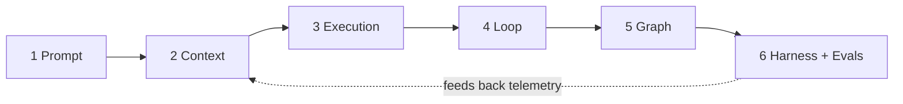
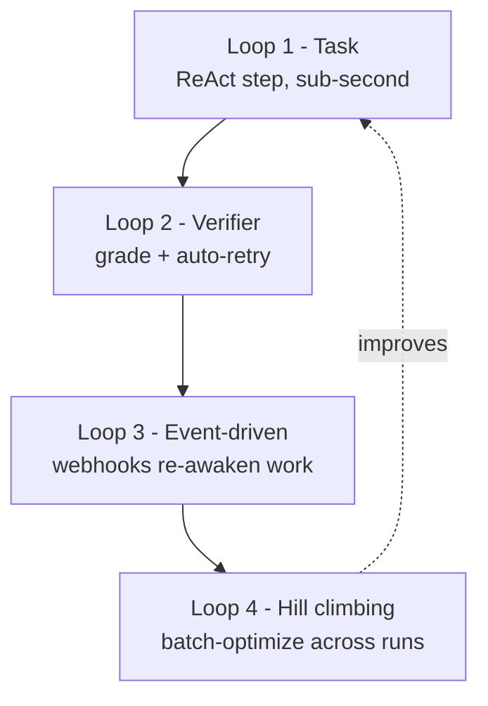
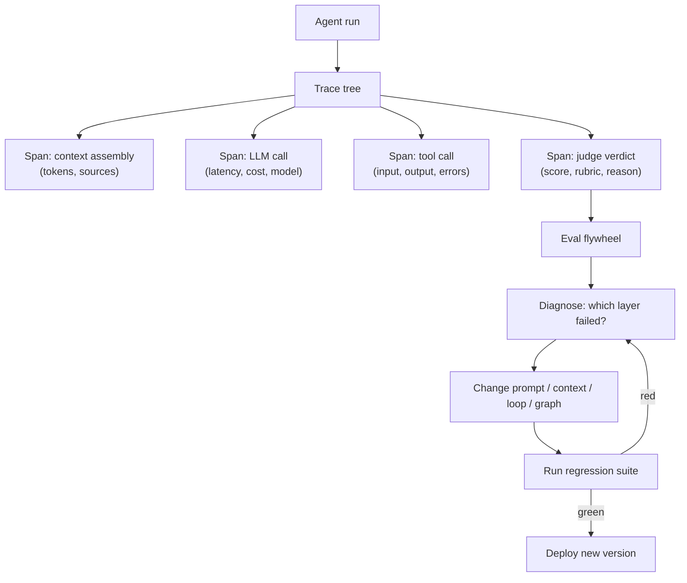
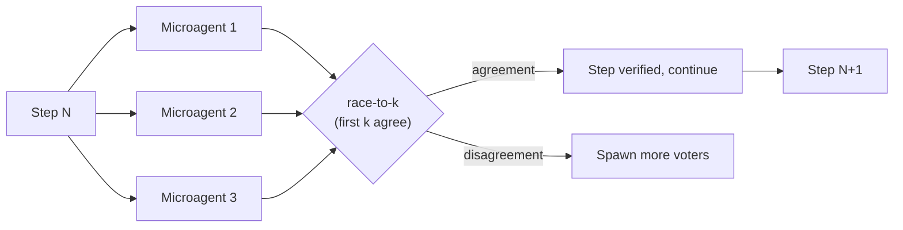
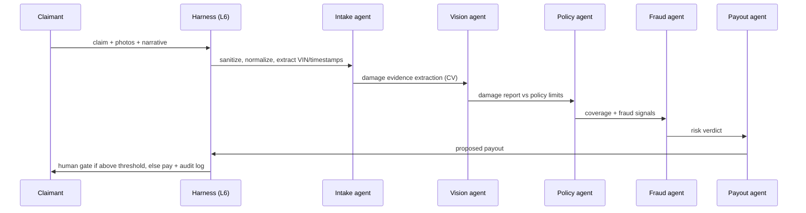

> **Learning goals:** Climb the six layers from prompt to harness; wire the four nested feedback loops; instrument trace trees and an eval flywheel; apply MAKER-style reliability; run a testing pyramid; replay the 5-agent insurance pipeline end to end.
> **Prerequisites:** [Lesson 11 - From prototype to production](../11-from-prototype-to-production/), [Lesson 21 - Loop engineering](../21-loop-engineering/) and [Lesson 19 - Agent harnesses](../19-agent-harnesses/)

## The production gap

An enterprise multi-agent system ran end to end, every node reported success - and paid out **$4,500 on a minor scratch**. Structure alone does not create reliability. Closing that gap is what the six layers are for.

| Layer | Question it answers | Core practice |
|---|---|---|
| 1. Prompt | What am I asked? | Role, task, constraints, output schema |
| 2. Context | What may I see? | Budgets, offload, compaction, Tool RAG ([Lesson 32](../context-engineering-deep-dive/)) |
| 3. Execution | How do I act? | ReAct cycles, sanitized inputs, error recovery, confidence |
| 4. Loop | What happens when I fail? | Verifier retries, event re-awakening, hill climbing |
| 5. Graph | How does the system flow? | LangGraph DAGs + selective GraphRAG ([Lesson 22](../22-graph-engineering/)) |
| 6. Harness + Evals | How do I stay safe over time? | Governors, circuit breakers, audit logs, 72 regression evals |

Measured warning from layer 2: retrieval quality degrades **>10%** in standard vector stores (ChromaDB, measured) over long sessions - hence offloading and compaction are not optional.

## The 4-tier loop hierarchy and 3-speed feedback

- **Loop 1** is the agent loop you already know.
- **Loop 2** grades each attempt; failures retry automatically instead of silently passing.
- **Loop 3** is the trigger layer from [Lesson 31](../event-driven-and-scheduled-agents/).
- **Loop 4** compares many historical runs and changes the harness itself (see [Lesson 39](../self-improvement-and-oversight/)).

Layer speeds (Andrew Ng's formulation): iterate at **minutes** (agentic coding), **hours** (prototype review), **weeks** (production telemetry). If all your learning happens at one speed, you are blind at the other two.

## The four pillars of a production harness

| Pillar | Job | Failure if missing |
|---|---|---|
| **Context RAM & working memory** | Assemble the token budget: prompt + skills + facts + recent turns | Context rot, amnesia |
| **Hybrid retrieval & consolidation** | SQL for exact/time-series, vectors for similarity; offline fact distillation | Wrong answers, stale truth |
| **Loop engineering & guardrails** | Multi-turn tool calling with turn ceilings, cost caps, permission hooks | Runaway loops, surprise bills |
| **LLMOps & continuous evals** | Trace trees, judge scoring, bottleneck isolation, shipped prompt versions | You cannot explain any failure |

Three harness extras worth standardizing: **automations** (scheduled jobs the harness owns), **worktrees** (isolated workspaces per task so parallel agents never fight over files), and a **spine** (the single ordered log of every action - your ground truth when agents disagree).

## Trace trees and the eval flywheel

Tracing is not logging. Logs tell you *that* something happened; trace trees tell you **where in the cycle quality died** - context assembly, model choice, tool schema, or loop logic.

## The 72-eval matrix (and why regression suites win)

A production insurance pipeline shipped with **72 automated regression evals** spanning damage evidence, policy rules, fraud triggers, payout boundaries and audit-log immutability. The point is not the number - it is the *coverage dimensions*:

| Dimension | Example eval | Catches |
|---|---|---|
| Evidence integrity | "Minor scratch photo must not exceed payout tier 1" | The $4,500 false payout |
| Policy limits | "Claim above limit routes to human" | Boundary off-by-one |
| Fraud anomalies | "Same VIN, 3 claims in 30 days -> flag" | Abuse patterns |
| Payout math | "Deductible applied exactly once" | Double-charging |
| Audit immutability | "Decision log cannot be edited post-hoc" | Compliance holes |
| Regression | "Yesterday's 40 golden cases still pass" | Prompt drift |

Treat evals as unit tests for behavior: fast ones in CI, LLM-judge ones nightly, golden sets on every release.

## MAKER: zero-error reliability through decomposition + voting

Scaling reliability is a *systems* problem, not a model-size problem. Cognizant's **MAKER** demonstrated error-free execution across **one million dependent steps** by combining:

1. **Maximal decomposition** - break the task into single-step microagents (one tiny decision each).
2. **Multi-agent voting** - several microagents answer each step; "race-to-k" voting accepts the first k agreeing answers.
3. **Local error correction** - errors are caught and fixed at the step, before they compound.

The arithmetic: a 1%-per-step error rate guarantees failure over a million steps, but local verification plus k-of-n agreement collapses the probability of an *undetected* error exponentially. Implications: reliability through structure, transparency (each microagent's scope is tiny), and cost efficiency (small models do most of the work).

## The testing pyramid for agents

| Level | What it tests | Speed | Count |
|---|---|---|---|
| Unit | Parsers, validators, tool schemas, math | ms | Many |
| Component | One agent with **mocked** tools | seconds | Dozens |
| Integration | Graph + real tools in a sandbox | minutes | A few |
| End-to-end | Production-like, real-ish data | slow | Rare, gated |
| Evals | Behavior quality (judge + golden sets) | nightly | 72+ and growing |
| Long-session probe | Turn-11 recall ([Lesson 32](../context-engineering-deep-dive/)) | minutes | At least one |

Inverted pyramids (everything e2e) are slow and flaky; unit tests alone cannot see reasoning failure. Keep the shape.

## Capstone: the 5-agent insurance claim pipeline

Where the six layers earn their keep: L1/L6 sanitize and authenticate intake, L2/L3 extract visual evidence with confidence scores, L4 retries and re-verifies failed extractions, L5 routes deterministically between five agents, and L6 enforces caps, circuit breakers and the 72 evals - written *pre-code*, the contract style you meet again in [Lesson 42](../multi-agent-case-studies/).

## Common pitfalls

| Pitfall | Symptom | Fix |
|---|---|---|
| Logging without traces | Cannot isolate failures | Hierarchical spans per run |
| Evals written after coding | Tests confirm existing bugs | Pre-code contracts |
| One giant agent | Context death spiral | Decompose + subagents |
| No circuit breaker | Infinite retry loop | Caps + breakers on every loop |
| Judge without rubric | Noisy scores, endless arguments | Rubrics + golden examples |

## Key takeaways

1. Reliability is engineered in layers; each layer has one job and one failure signature.
2. Trace trees plus a judge flywheel turn production into training data for your harness.
3. Regression evals are the only thing that keeps improvements from silently slipping away.
4. MAKER shows the ceiling: extreme decomposition + voting + local verification scales reliability past any single model.

## Further reading

- [Cognizant - MAKER achieves million-step, zero-error LLM reasoning](https://www.cognizant.com/us/en/ai-lab/blog/maker)
- [MAKER paper (arXiv 2511.09030)](https://arxiv.org/abs/2511.09030)
- [OpenTelemetry - GenAI semantic conventions](https://opentelemetry.io/docs/specs/semconv/gen-ai/)

---

[Previous Lesson: Agent coordination protocols](../agent-coordination-protocols/) | [Next Lesson: Self-improving agents and oversight →](../self-improvement-and-oversight/)

