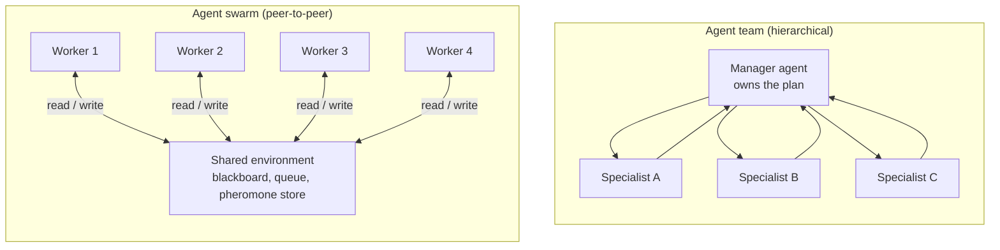
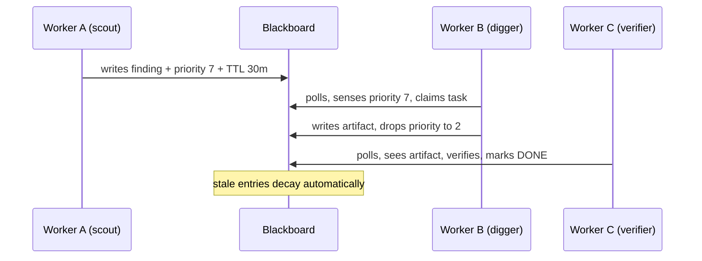
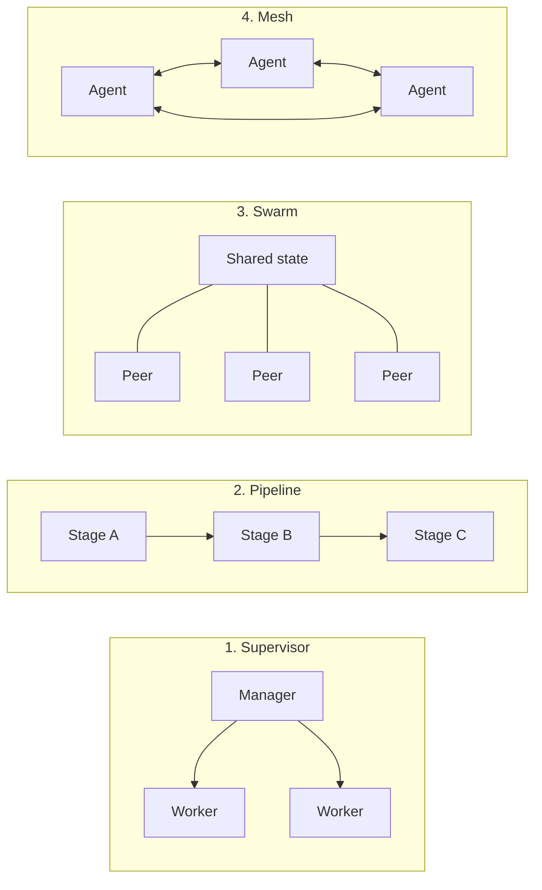

## Introduction

In [Lesson 7](../07-multi-agent-systems/), we met multi-agent systems: a manager agent, a handful of specialists, and typed handoffs between them. In [Lesson 18](../18-orchestrators/) we made that control flow explicit with orchestrators. Both designs share one assumption - **something at the top knows the plan**.

An **agent swarm** drops that assumption.

A swarm is a set of autonomous agents that share no central controller. Each agent follows simple local rules, but they all read and write a shared environment. Coordination is not dictated - it *emerges* from the traces agents leave behind. This is why the section is titled "AI Agents (Loops, Graphs, Swarms)": loops and graphs are topologies you write down, a swarm is a topology that writes itself.

> **Key takeaway:** A swarm replaces a manager with an environment. Nobody assigns work; agents discover it from the state of a shared substrate.

---

## ELI5: an ant colony, not a kitchen brigade

A professional kitchen is a hierarchy. The head chef reads the order, decides who does what, and calls out dishes. If the head chef leaves, the kitchen stops.

An ant colony has no head chef. Every ant follows the same three local rules: follow the pheromone trail, pick up food if you find it, drop pheromone when you do. No ant sees the colony's plan. Yet the colony finds the shortest path to food, redistributes workers when a trail dies out, and recovers instantly when half the ants are swept away.

The trick is that ants **communicate through the world, not with each other**. A pheromone trail is a message with no recipient. That is exactly the mechanism an agent swarm uses.

---

## What makes a swarm a swarm

Not every group of agents is a swarm. Four properties have to hold at once:

| Property | Meaning | What breaks it |
|---|---|---|
| **Decentralized control** | No agent holds a global plan or issues assignments | A "supervisor" agent that routes every task |
| **Local rules** | Each agent decides using only what it can see and what it is good at | Agents needing global state to choose work |
| **Shared environment** | Coordination travels through a blackboard, queue, or file store | Agents talking only via direct messages |
| **Emergence** | System-level behavior is not authored by any single agent | A hard-coded workflow graph pretending to be a swarm |

### Swarm vs. team vs. pipeline

It helps to place swarms next to the topologies you already know from Lesson 7:



The manager in a team diagram is a single point of failure *and* a bottleneck. Remove it and you must replace its decisions with something - a set of local rules plus shared state. That replacement is the swarm.

---

## Stigmergy: coordination through the environment

The formal name for "communicate by modifying the environment" is **stigmergy**. It was coined to describe termites building mounds: one termite drops a ball of soil, which makes the spot slightly more attractive to the next termite, which drops another. Nobody designs the mound.

In LLM agent systems, stigmergy shows up in three concrete forms:

1. **Pheromone scores on tasks.** An agent attaches a priority, quality score, or `needs_retry` flag to a task record. Other agents sense the aggregate signal and self-select work. A high score attracts more agents; a low score repels them.
2. **Blackboard writes.** An agent finishes a subtask and writes a structured artifact to shared storage. Downstream agents poll that store and start when their preconditions are satisfied.
3. **Handoff metadata in artifacts.** Instead of passing a message, an agent embeds the context the next agent needs inside a file, a database row, or a document. The next agent reads the artifact and reconstructs the situation.



### Pheromone decay is not optional

In an ant colony, pheromones evaporate. Stale trails fade, so the colony stops chasing yesterday's food. A digital blackboard has no natural evaporation - entries live forever unless you delete them.

If you skip decay, agents keep reacting to signals that are hours out of date. A worker that finished a task at 9am leaves a priority-9 marker; at 5pm another agent deprioritizes real work to investigate a corpse. **Every annotation an agent writes needs a time-to-live.**

---

## The four coordination patterns

Production teams have converged on four ways to arrange multiple agents. They are not ranked - they are matched to task shape. Mixing them without intention gives you the worst of each.

| Pattern | Control | Communication | Best for | Weakness |
|---|---|---|---|---|
| **Supervisor** | Centralized | Delegation and reports | Clear decomposition, strong audit needs (legal review, structured extraction) | Supervisor is a bottleneck and single point of failure |
| **Pipeline** | Sequential | Point-to-point handoffs | Strictly ordered transforms, mixed model cost tiers | One failed stage blocks everything downstream |
| **Swarm** | Decentralized | Shared environment (stigmergy) | Variable-structure, parallelizable work (crawling, large-scale enrichment) | Emergent behavior is hard to debug; errors amplify |
| **Mesh** | Decentralized | Direct messaging between any peers | Negotiation, dynamic team formation, research | Highest coordination overhead; message explosion at scale |



Notice that your own agent harness from [Lesson 19](../19-agent-harnesses/) sits *inside* every one of these boxes. A swarm is not a replacement for a harness - it is a harness that runs N times, sharing one blackboard.

---

## Anatomy of a swarm

A production swarm has five parts. Only two of them are "agents".

```
+---------------------------------------------------------------+
|                        AGENT SWARM                            |
|                                                               |
|   +-----------+   +-----------+   +-----------+               |
|   | Worker A  |   | Worker B  |   | Worker C  |               |
|   | (scout)   |   | (digger)  |   | (verifier)|               |
|   +-----+-----+   +-----+-----+   +-----+-----+               |
|         |               |               |                     |
|         +-------+-------+-------+-------+                     |
|                 |               |                             |
|                 v               v                             |
|   +-------------------------------------------------------+   |
|   |  SHARED ENVIRONMENT (blackboard / queue / artifacts)  |   |
|   |  - task records with priority + TTL (pheromones)      |   |
|   |  - artifact storage (results, intermediate files)      |   |
|   |  - claim / lease table (prevents duplicate work)       |   |
|   +-------------------------------------------------------+   |
|                 ^                                             |
|                 |                                             |
|   +-------------+-----------------------------------------+   |
|   |  CONTROL SHELL (lightweight scheduler)                |   |
|   |  - picks which ready task fires next                  |   |
|   |  - enforces budgets, retries, and circuit breakers    |   |
|   +-------------------------------------------------------+   |
+---------------------------------------------------------------+
```

- **Workers** are the agents. They are stateless - all memory lives in the environment, so any worker can pick up any task.
- **The shared environment** is the star of the show. Redis Streams for the queue, a relational database or object store for artifacts, a vector store for semantic lookup.
- **The control shell** is deliberately dumb. It is a priority queue plus policy, not an LLM. Keeping scheduling out of the model is what makes swarms debuggable.

---

## A minimal blackboard swarm in Python

Here is a runnable sketch. Three peer agents poll one blackboard, claim work they are suited for, and leave pheromone traces for the others.

```python
import time
from dataclasses import dataclass, field
from typing import Callable

TTL_SECONDS = 30 * 60


@dataclass
class Task:
    id: str
    kind: str                 # "scout" | "dig" | "verify"
    payload: dict
    priority: float = 1.0     # the pheromone score
    claimed_by: str | None = None
    created_at: float = field(default_factory=time.time)
    written_at: float = field(default_factory=time.time)

    def is_stale(self, now: float) -> bool:
        return now - self.written_at > TTL_SECONDS


class Blackboard:
    """Shared environment. In production this is Redis + Postgres."""

    def __init__(self) -> None:
        self.tasks: dict[str, Task] = {}

    def post(self, task: Task) -> None:
        task.written_at = time.time()
        self.tasks[task.id] = task

    def claim_best(self, worker_id: str, kind: str) -> Task | None:
        now = time.time()
        # decay: stale tasks are invisible to everyone
        live = [
            t for t in self.tasks.values()
            if not t.is_stale(now) and t.claimed_by is None and t.kind == kind
        ]
        if not live:
            return None
        task = max(live, key=lambda t: t.priority)
        task.claimed_by = worker_id
        return task


class SwarmAgent:
    def __init__(self, name: str, kind: str, board: Blackboard,
                 work: Callable[[Task, Blackboard], float]) -> None:
        self.name, self.kind, self.board, self.work = name, kind, board, work

    def tick(self) -> bool:
        task = self.board.claim_best(self.name, self.kind)
        if task is None:
            return False

        # --- deterministic gate: verify before the trace spreads ---
        if task.priority < 0.2:
            task.claimed_by = None          # release low-value work
            return False

        new_priority = self.work(task, self.board)   # do the work

        # deposit a pheromone that steers the next agent
        self.board.post(Task(
            id=f"{task.id}:next",
            kind="verify",
            payload={"source": task.id},
            priority=new_priority,
        ))
        return True
```

Two details matter more than the rest. The `claim_best` method refuses stale tasks, which is the decay rule from the previous section. And the priority written back by `work` is how one agent influences another **without ever messaging it**.

### Decay in one line

If you only remember one implementation detail, remember this:

```python
# A pheromone score with a half-life, evaluated at read time.
def effective_priority(task: Task, now: float, half_life: float = 1800.0) -> float:
    age = now - task.written_at
    return task.priority * (0.5 ** (age / half_life))
```

Because the score is computed at read time, you never need a background job to sweep the blackboard. Stale signals simply stop being attractive.

---

## Swarms in the framework landscape

Most frameworks give you swarms or swarm-adjacent primitives. Pick by **coordination pattern**, not brand familiarity.

| Framework | Core primitive | Swarm fit | Watch out for |
|---|---|---|---|
| **OpenAI Agents SDK** | Explicit **handoffs** (an agent declares who it can hand off to) | Good for triage-style routing and pipelines; the experimental `Swarm` library it grew out of is now superseded | Handoff context grows; no native shared blackboard |
| **LangGraph** | State machines over a shared, typed graph state | Strongest option when the "blackboard" is your graph state | Not decentralized by default - you still author the graph |
| **CrewAI** | Role-based crews | Fast to prototype a "team", not a true swarm | Limited checkpointing for long-running runs |
| **AG2 / AutoGen** | `GroupChat` with a selector choosing the next speaker | Closest built-in to emergent turn-taking | Research-oriented; harder to bound costs |
| **Swarms** library | Agents, tools, memory with minimal opinion on topology | Built for large-scale, shared-state deployments | You own the coordination design |
| **Google ADK** | Composable agents (`SequentialAgent`, `ParallelAgent`, `LoopAgent`) plus callbacks | Compose swarms from `ParallelAgent` plus an external store | ADK is hierarchical by construction - the blackboard lives outside it |

A useful rule from the research: if your coordination logic is really a fixed graph, [use a graph](../22-graph-engineering/) and stop pretending it is a swarm. You will get checkpointing, replay, and audit trails for free.

---

## When swarms win - and when they quietly fail

Swarms look impressive in a demo and fail expensively in production. Current research and post-mortems are unusually blunt about this, so read this section twice before you decide your workflow should be decentralized.

| Failure mode | Mechanism | Mitigation |
|---|---|---|
| **Error amplification** | Agent A writes a hallucination to the blackboard, Agent B treats it as ground truth, Agent C inherits it | Insert a lightweight judge/verifier between stages; gate advancement on quality |
| **Free-riding** | In shared-reward setups, one productive agent lets others coast | Attribute rewards and costs per agent, not per swarm |
| **Coordination cost exceeds the win** | Shared-state reads/writes and synchronization eat the parallelism gain | Don't swarm by default; add agents only for a measured bottleneck |
| **Stale state / context drift** | No TTL means old priorities mislead new workers | Pheromone decay on every annotation; garbage-collect finished chains |
| **The swarm paradox** | Sequential tasks get *slower* when parallelized because of forced sync points | Match topology to task structure: pipelines for dependent work |

Two numbers are worth carrying around. Reported estimates put error amplification at roughly **17x** for fully uncoordinated agents and around **4x** even with centralized coordination, because errors compound stage over stage. And analyses of multi-agent systems report degradations of **39-70%** on tasks that are inherently sequential, plus diminishing returns once a single well-built agent already clears around **45%** task completion quality. In other words: the better your single agent is, the harder it is for a swarm to beat it.

> **Rule of thumb:** Reach for a swarm only when the work is *genuinely decomposable into independent parallel streams with variable structure*. Everything else is a supervisor, a pipeline, or - most often - one good agent.

---

## Guardrails for swarms

Every guardrail from [Lesson 10](../10-guardrails-and-safety/) still applies, plus a few that only matter once peers work in parallel:

- **Validation gates between stages.** A cheap judge agent checks an artifact before the blackboard marks it complete. This turns error amplification from exponential into roughly linear.
- **Decay everything.** TTL on task annotations, score half-lives, and explicit garbage collection of finished chains.
- **Claim/lease table.** Without atomic claims, two workers will happily do the same expensive job.
- **Per-agent budgets.** Cap steps, tokens, and wall-clock time *per worker*, then cap the swarm total.
- **Circuit breakers.** If the swarm's quality metric drops or the queue grows faster than it drains, stop and escalate to a human rather than spawning more workers.
- **Full trajectory logging.** In a decentralized system, the blackboard history *is* the audit log. Persist every write.

---

## Key takeaways

- A **swarm** is decentralized: no manager, local rules, coordination through a shared environment.
- **Stigmergy** - communicating by modifying shared state - is the defining mechanism. Pheromone scores, blackboard writes, and handoff metadata are its three forms.
- The four coordination patterns are **supervisor, pipeline, swarm, mesh**. Choose by task shape, not fashion.
- **Decay is mandatory.** Digital pheromones do not evaporate on their own.
- Swarms have severe, documented failure modes: error amplification, free-riding, coordination cost, stale state, and the swarm paradox on sequential work.
- If the work is even slightly sequential or the structure is fixed, a graph or a supervisor beats a swarm.

---

## Further reading

- [Swarm Intelligence for AI Agents: Coordination Patterns, Failure Modes, and Production Reality](https://zylos.ai/research/2026-05-23-swarm-intelligence-multi-agent-coordination-patterns/) - source for the four patterns, decay, and the failure statistics above
- [OpenAI Swarm (experimental) - README](https://github.com/openai/swarm) - the `Agent` plus handoff primitive, now superseded by the OpenAI Agents SDK
- [SwarmSys: decentralized agent coordination (arXiv 2510.10047)](https://arxiv.org/abs/2510.10047) - embedding matching plus pheromone-inspired reinforcement
- [Stigmergic coordination in practice (Graybeam)](https://www.graybeam.tech/stigmergic-swarm-coordination/) - a production Elixir/OTP swarm
- [Building Effective Agents (Anthropic)](https://www.anthropic.com/research/building-effective-agents) - why most "multi-agent" work should start simpler

---

[Previous Lesson: Loop vs graph](../23-loop-vs-graph/) | [Next Lesson: Agent Plugins ->](../agent-plugins/)
