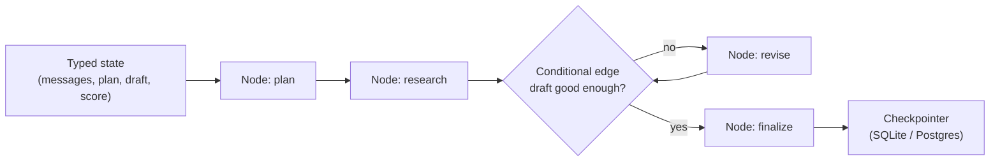
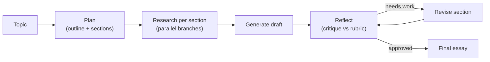

> **Learning goals:** Build graph workflows with typed state and checkpointers; use threads, streaming and time travel; capstone an essay-writer pipeline; pick a framework with criteria instead of hype; lay out a sane agent repo.
> **Prerequisites:** [Lesson 22 - Graph engineering](../22-graph-engineering/) and [Lesson 12 - Getting started with Vertex and ADK](../12-getting-started-with-vertex-and-adk/)

## LangGraph in one diagram

LangGraph's mental model is small: **state flows through nodes; edges decide where it goes next; a checkpointer remembers every step.**



| Concept | What it does | Why you care |
|---|---|---|
| Typed state | A schema every node reads/writes | No more "what's in the prompt?" ambiguity |
| Nodes | Functions (LLM calls, tools, code) | Testable units |
| Reducers | Merge rules for state updates (append, overwrite, sum) | Parallel branches stop clobbering each other |
| Conditional edges | Routing based on state | Loops and branches without spaghetti |
| Checkpointer | Persists state after every step | **Resume after crash, human-in-the-loop, time travel** |
| Threads | Named conversation/run streams | Multi-user, multi-run isolation |
| Streaming | Token/event-level output | Live UIs, long tasks feel responsive |
| Breakpoints | Pause for approval, edit state, resume | The human gate from lesson 31 |

**Time travel** is the killer feature for debugging: rewind to any checkpoint, change a decision, replay forward - and compare outcomes. It is `git` for agent runs.

After the graph works, **LangSmith** adds tracing and eval datasets (the flywheel from [Lesson 38](../agent-runtime-and-llmops/)), and **LangServe** turns the graph into an API endpoint.

## Capstone: the essay writer

A classic LangGraph pipeline that exercises every concept:



Two production upgrades that make it real: run the **research branches in parallel** (wall-clock = slowest branch, not the sum), and cap the reflect/revise loop at 2-3 rounds so the graph always terminates.

## The framework landscape

| Framework | Type | Sweet spot | Watch out |
|---|---|---|---|
| **LangChain** | Integration library | Glue for models, tools, loaders | Abstraction churn between versions |
| **LangGraph** | Graph orchestration runtime | Stateful workflows, HITL, checkpoints | Graph design is on you |
| **CrewAI** | Role-based multi-agent | Fast crews/prototypes | Opinionated; dig for control points |
| **AutoGen / AG2** | Conversational multi-agent | Research, group chat patterns | Conversation cost can explode |
| **Swarms** | Swarm orchestration | Many-agent topologies | Young ecosystem - pin versions |
| **Claude Agent SDK** | Production agent runtime | Tool use, sandboxing, long tasks | Vendor-shaped runtime |
| **Google ADK + Vertex** | Enterprise agent platform | Evals, deployment, GCP shops | Cloud gravity |
| **JADE / Jason / SPADE** | Classical FIPA/BDI platforms | Teaching, simulation, protocol fidelity | Pre-LLM ergonomics |
| **NetLogo** | Agent-based simulation | Emergence research | Not a production runtime |

## How to choose (in order)

1. **State**: does the framework checkpoint and resume? If not, it is a demo tool.
2. **Human-in-the-loop**: can you pause, edit state, and resume?
3. **Observability**: traces out of the box, or a bolt-on?
4. **Portability**: are tools behind MCP and prompts in files? Then you can leave later.
5. **Cost model**: does it encourage parallel token burn by default? (See the swarm numbers in [Lesson 42](../multi-agent-case-studies/).)
6. **Team fit**: the framework your team can debug at 2 AM beats the trendy one.

## A reference repository layout

```text
agent-project/
  agents/        # role/node definitions (one file each)
  graph/         # state schema + edges + reducers
  tools/         # one file per tool: schema, impl, tests
  prompts/       # versioned prompt files (never inline strings)
  memory/        # state.db, MEMORY.md, skills/
  brain/         # domain knowledge and decisions (lesson 29)
  evals/         # golden sets, judge rubrics, turn-11 probe
  infra/         # deploy units, .env.example, backups
  traces/        # local trace dumps for debugging
```

Two rules keep this portable: **tools behind MCP** (or a thin adapter), and **state in your own database** (the framework is a runtime, not your system of record).

## Worked example: same task, three frameworks

The "daily inbox brief" from [Lesson 29](../agent-worker-foundations/) can be built in all three styles:

| Style | Shape | Best when |
|---|---|---|
| Library (LangChain) | A script calls model + tools in order | One path, simple |
| Graph (LangGraph) | Nodes + conditional edges + checkpointer | Retries, approvals, time travel |
| Crew (CrewAI) | Roles: triager, drafter, reviewer | Work is naturally role-shaped |

Start with the library, graduate to the graph when you need state, and only build a crew when independent judgments genuinely add value.

## Common pitfalls

| Pitfall | Symptom | Fix |
|---|---|---|
| Framework-first design | Architecture dictated by hype | Sketch state + loops, then pick |
| Prompts inline in code | Cannot diff or version behavior | Prompt files + changelog |
| Tools locked to a runtime | Cannot swap frameworks | MCP adapters |
| No checkpointer | Every crash restarts work | Persist state from day one |
| Parallel everything | Token bill explodes | Parallel only independent reads |

## Key takeaways

1. LangGraph's core quartet - typed state, reducers, conditional edges, checkpointers - covers most production needs.
2. Time travel plus persistent checkpoints is what turns an agent pipeline into a debuggable system.
3. Choose frameworks by state, HITL, observability and portability - not by star count.
4. Keep prompts in files, tools behind MCP and state in your own DB: the framework becomes replaceable.

## Further reading

- [LangGraph documentation](https://langchain-ai.github.io/langgraph/)
- [LangSmith - tracing and evaluation](https://docs.smith.langchain.com/)
- [CrewAI](https://docs.crewai.com/) · [AutoGen](https://microsoft.github.io/autogen/) · [Swarms](https://docs.swarms.world/)
- [Google Agent Development Kit (ADK)](https://google.github.io/adk-docs/)

---

[Previous Lesson: Self-improving agents and oversight](../self-improvement-and-oversight/) | [Next Lesson: Model internals and agent benchmarks →](../model-internals-and-benchmarks/)

