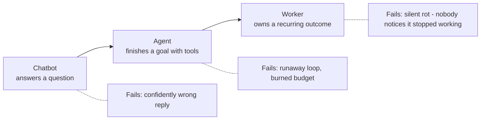
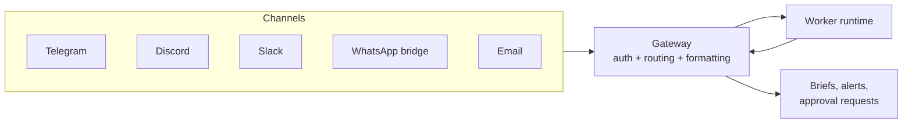
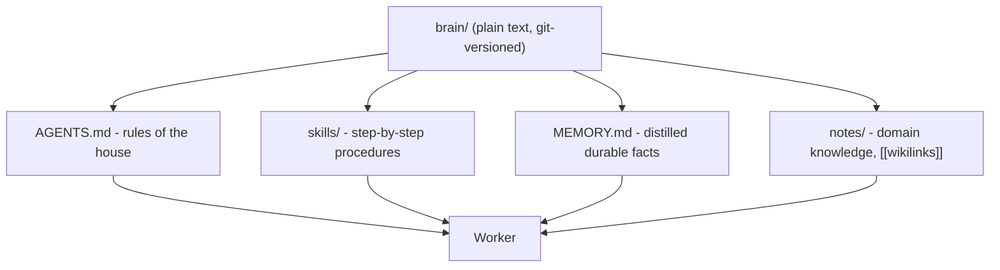
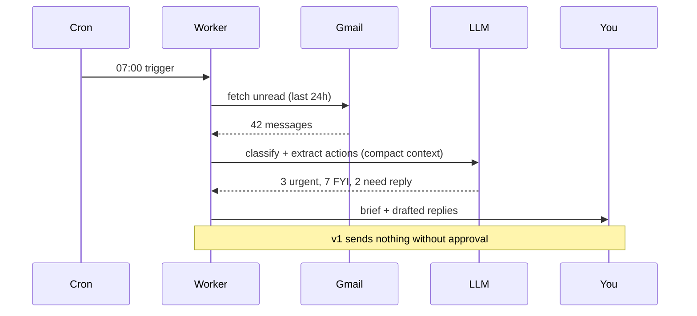

> **Learning goals:** Tell chatbots, agents and workers apart; speak the vocabulary of standing AI systems; wire a gateway, a connector and a plain-text brain into your first worker.
> **Prerequisites:** [Lesson 1 - What Are AI Agents?](../01-what-are-ai-agents/) and [Lesson 3 - Tools - giving agents hands](../03-tools-giving-agents-hands/)

## Why "worker" is the mental model that matters

Most courses stop at "agent". The thing you actually operate is bigger than an agent: it is a **worker** - a named, standing responsibility with a trigger, a toolbelt, limits, memory, and a report.

Three different units, three different failure modes:

| Unit | Who starts it | Unit of work | Success looks like | Typical failure |
|---|---|---|---|---|
| Chatbot | Human, each time | One reply | Helpful answer | Hallucination |
| Agent | Human, each time | One completed goal | Task done **and verified** | Infinite loop, cost spike |
| **Worker** | Cron, webhook or event | A recurring responsibility | Work done, exceptions escalated, brief delivered | Silent rot |

The moment you can write down *who starts it, what it owns, and how you know it worked*, you have left demo-land.

## The vocabulary you were missing

These are the working terms that keep coming up once agents leave the chat window. Learn them once, use them everywhere.

| Term | Meaning | Example | Covered in |
|---|---|---|---|
| **Trigger** | The event that starts work without a human typing | 7:00 AM cron, new email, webhook from Stripe | [Lesson 31](../event-driven-and-scheduled-agents/) |
| **Workflow** | A fixed sequence of steps with defined handoffs | Intake -> research -> draft -> review -> send | [Lesson 4 - Agentic design patterns](../04-agentic-design-patterns/) |
| **Automation** | A workflow where steps are deterministic (no LLM decisions) | "Save every invoice PDF to Drive and log it" | [Lesson 18 - Orchestrators](../18-orchestrators/) |
| **Gateway** | The channel the worker listens on and talks back through | Telegram, Discord, Slack, web chat, WhatsApp bridge | Below |
| **Connector** | A packaged integration that gives read/write access to a system | Gmail, Calendar, Notion, Stripe, GitHub | Below |
| **Integration vs API vs connector** | API = raw endpoints; integration = authenticated wiring; connector = reusable packaged integration | Stripe API < Stripe integration < "Stripe connector" you install | [Lesson 16 - MCP deep dive](../16-mcp-deep-dive/) |
| **Brain** | The durable, human-readable store of business knowledge | Obsidian vault, notes folder, `MEMORY.md` | Below |
| **Skill** | A reusable procedure the worker can load on demand | "How we write a follow-up email" | [Lesson 17 - Agent skills](../17-agent-skills/) |
| **Harness** | Everything around the model: loop, tools, memory, guardrails | Claude Code, Hermes, Pi | [Lesson 19 - Agent harnesses](../19-agent-harnesses/) |

A useful sentence to keep: **a worker = trigger + workflow + tools + brain + guardrails + report.**

## Gateways: the worker's ears and mouth

A gateway turns a chat channel into an interface your worker can use - and turns approvals into a single reply.

| Channel | Setup cost | Best for | Notes |
|---|---|---|---|
| Telegram bot | Low | Personal alerts and control | Approval-by-reply is trivial |
| Discord | Low | Communities, small teams | Threads make parallel work readable |
| Slack | Medium | Company workflows | Permissions come built in |
| WhatsApp bridge | Medium | External customers (2B+ users, strong in LatAm) | Local bridge (webhooks/Baileys) keeps data on your host |
| Email | Medium | Stakeholders who live in email | Slowest loop, but unavoidable |

Start with **one** gateway. Gateways are also where human-in-the-loop lands: "Reply `APPROVE` to send."

## Connectors, MCP and raw APIs

| Approach | What it is | Use when | Maintenance |
|---|---|---|---|
| Raw API + code | You call endpoints yourself | 1-2 systems, full control needed | Highest |
| Connector | Packaged integration (install, auth, done) | Many SaaS systems, speed matters | Vendor |
| **MCP server** | Standard tool interface reusable across harnesses | You want one tool layer for many agents | Medium - see [Lesson 16](../16-mcp-deep-dive/) |
| Browser automation | Clicking what has no API | Last resort | Fragile |

## The brain: your business in plain text

The highest-leverage memory store is not a vector database - it is a **plain-text knowledge folder** the model can read directly. Obsidian users already have one: a vault where notes link to each other with `[[wikilinks]]`, which *is* a knowledge graph, just stored as files.

Why plain text wins: diffable, git-versioned, human-auditable, model-agnostic, and no vendor lock-in. Related lessons: [15 - AGENTS.md](../15-agents-md/), [17 - Agent skills](../17-agent-skills/).

## Your first worker: the daily inbox brief

Describe it like a job, not a prompt:

| Field | Value |
|---|---|
| Name | `inbox-briefer` |
| Trigger | Weekdays at 07:00 (cron) |
| Inputs | Inbox last 24h, today's calendar |
| Tools | Gmail (read), Calendar (read), chat (send) |
| Guardrails | Read-only mailbox, $0.50/run cap, never email externally |
| Output | 5-line brief + 3 suggested replies (drafts only) |
| Escalate | Anything from legal, banking, or your boss |

What makes it a worker and not a demo: it wakes itself, it reports, it escalates, it has a budget, and its performance can be evaluated (see [Lesson 9](../09-evaluating-and-testing-agents/)).

## Worker readiness checklist

- [ ] A named trigger that does not require you to type
- [ ] A one-sentence job description you could hand to a human
- [ ] Tools limited to what the job needs (allowlist)
- [ ] A budget cap per run and per month
- [ ] A defined output artifact (brief, file, record)
- [ ] An escalation path for the cases it should not decide
- [ ] A log you can read after a failure
- [ ] An eval you can run before changing anything

## Common pitfalls

| Pitfall | Symptom | Fix |
|---|---|---|
| Chatbot dressed as a worker | Nothing happens unless you prompt it | Add a trigger (lesson 31) |
| Gateway sprawl | Four channels, none reliable | One channel until it works |
| Brain in a proprietary tool | Agent cannot read your knowledge | Move notes to plain text |
| No budget cap | Surprise API bill | Hard caps + alerts |
| No report | You do not know it ran | Every run ends with a brief or a log line |

## Key takeaways

1. Chatbots answer, agents act, **workers own** - and workers have triggers, tools, budgets, brains and reports.
2. Gateways handle the human interface; connectors handle systems; MCP standardizes the tool layer.
3. A plain-text brain beats a fancy store for most personal and small-team workers.
4. Your first worker should be read-only, budgeted, and boring - trust is earned run by run.

## Further reading

- [Anthropic - Building effective agents](https://www.anthropic.com/engineering/building-effective-agents)
- [AGENTS.md - a simple, open format for agent instructions](https://agents.md/)
- [CoALA - Cognitive Architectures for Language Agents (Princeton)](https://arxiv.org/abs/2309.02427)

---

[Previous Lesson: MCP vs Tools](../mcp-vs-tools/) | [Next Lesson: Infrastructure and host security →](../agent-infrastructure-and-security/)

