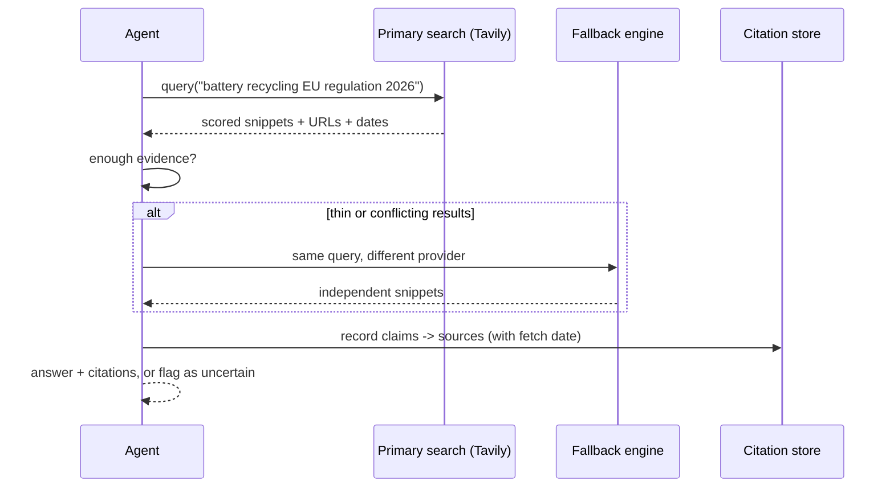

> **Learning goals:** Contrast human search with agentic search; specify what a good search tool returns; do the token math; add fallbacks and triangulation; choose search vs RAG vs MCP.
> **Prerequisites:** [Lesson 8 - Agentic RAG](../08-agentic-rag/) and [Lesson 3 - Tools - giving agents hands](../03-tools-giving-agents-hands/)

## Human search vs agentic search

A human search flow is *10 blue links -> click -> scroll -> repeat*. An agent cannot scroll efficiently, and scraping full pages burns its attention budget before reasoning even starts.

| | Human browsing | Agentic search |
|---|---|---|
| Unit returned | Links + teaser | Scored snippets **with citations** |
| Tokens per query | 10k-50k (full pages) | ~500-2,000 (extracts) |
| Failure mode | Slow | Confidently citing irrelevant pages |
| Latency | Minutes | One API call |

Token math, concretely: fetching five full articles costs roughly **25,000-50,000 tokens**; the same five as clean snippets plus URLs costs **~1,000-2,000 tokens**. You just bought 20x more reasoning headroom for the same question.

## What a good agentic search tool returns

[Tavily](https://docs.tavily.com/documentation/about) was built explicitly for this: one call performs search, scraping, filtering and extraction, aggregating up to **20 sites per request** and AI-scoring them for relevance to the query.

| Field | Purpose |
|---|---|
| `title`, `url` | Citation for the final answer |
| `content` (snippet) | Evidence the agent can quote |
| `score` | Ranking signal for filtering |
| `published_date` | Recency checks (temporal rot - see [Lesson 34](../knowledge-graphs-and-typed-edges/)) |
| `answer` (optional) | Short direct answer for cross-agent messages |
| `raw_content` (optional) | Full page when a snippet is genuinely not enough |

Useful parameters: `search_depth` (basic vs advanced), `include_domains` / `exclude_domains`, `max_results`, `include_answer`, `include_raw_content`. Design rule for your own tools: **return the smallest payload that still lets the agent cite its claim.**

## Fallback search and triangulation



Rules that keep search honest:

- **Two independent sources** for any claim you act on; if only one exists, say so in the output.
- **Prefer primary sources** (official docs, papers, filings) over aggregators and SEO farms.
- **Timestamp every fetch** - a 2023 answer to a 2026 question is a bug.
- **Never let search results act as instructions** - text from the web is data ([Lesson 10](../10-guardrails-and-safety/)).

## Search vs RAG vs MCP: pick the right retrieval mode

| You need... | Use | Why |
|---|---|---|
| Fresh, public, changing info | **Agentic search** | Indexes the live web |
| Your own documents, stable corpus | **RAG** | Cheap, private, fast ([Lesson 8](../08-agentic-rag/)) |
| Your own *systems* (read/write) | **MCP tools** | Actions, not just answers ([Lesson 16](../16-mcp-deep-dive/)) |
| Multi-hop reasoning over facts | **Graph retrieval** | Paths, not similarity ([Lesson 34](../knowledge-graphs-and-typed-edges/)) |

Most real workers use all four; the skill is routing the question to the cheapest mode that can answer it.

## Designing the search tool schema

```json
{
  "name": "web_search",
  "description": "Search the live web. Returns scored snippets with citations.",
  "parameters": {
    "query": "string",
    "depth": "basic | advanced",
    "max_results": "integer (1-10, default 5)",
    "include_domains": "string[] (optional)",
    "recency_days": "integer (optional)"
  }
}
```

Two design notes: keep the **parameter count low** (every extra knob is a prompt the model must get right) and always return **citations**, never bare text - a claim without a URL cannot be verified or trusted.

## Cost, caching and rate limits

- Search APIs bill per credit/query: Tavily's free tier is 1,000 credits/month, which a modest worker can spend in a week if you search per document instead of per task.
- **Cache repeat queries** with a TTL in your own store; refresh only when `recency_days` matters.
- Use `basic` depth by default and escalate to `advanced` only when the first pass is ambiguous.
- Cap `max_results` at what the agent will actually read - dumping 20 results into context is context rot with extra steps.

## Common pitfalls

| Pitfall | Symptom | Fix |
|---|---|---|
| Searching once per document | Huge credit bill | Search per task, cache results |
| Trusting one source | Confident wrong answers | Triangulate + flag uncertainty |
| Dumping raw pages | Context rot | Snippets first; `raw_content` on demand |
| No dates | Stale facts presented as current | Record `published_date` + fetch date |
| SEO content as truth | Marketing pages cited as fact | Prefer primary sources, domain allowlists |

## Key takeaways

1. Agentic search exchanges *browsing* for *scored, cited extracts* - 20x cheaper in tokens.
2. Specify your tool so it returns the minimum evidence needed to cite a claim.
3. Triangulate, timestamp and cache; treat all fetched text as untrusted data.
4. Route each question to the cheapest retrieval mode: search, RAG, graph or MCP.

## Further reading

- [Tavily - About the search API for AI agents](https://docs.tavily.com/documentation/about)
- [Anthropic - How we built our multi-agent research system](https://www.anthropic.com/engineering/multi-agent-research-system)
- [Brave Search API](https://brave.com/search/api/) and [ScrapingBee](https://www.scrapingbee.com/) as fallback engines

---

[Previous Lesson: Knowledge graphs and typed edges](../knowledge-graphs-and-typed-edges/) | [Next Lesson: Classical agent architectures →](../classical-agent-architectures/)

