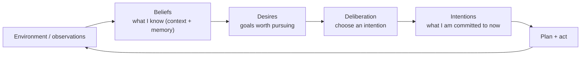
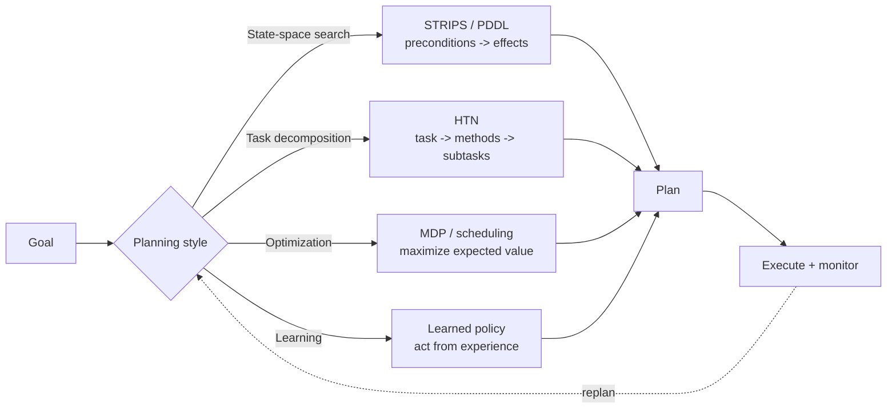
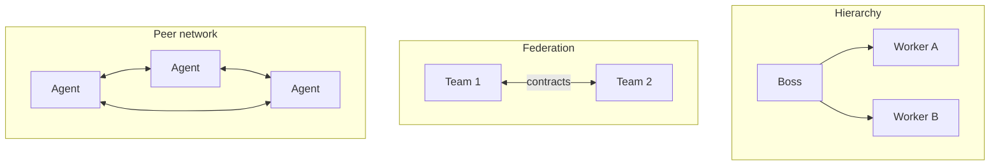

> **Learning goals:** Classify any task's environment; separate reactive, deliberative and hybrid architectures; use BDI to structure goals vs commitments; pick a planning tradition; know what multi-agent reinforcement learning warns you about.
> **Prerequisites:** [Lesson 2 - How agents think](../02-how-agents-think/) and [Lesson 6 - Planning and reasoning](../06-planning-and-reasoning/)

## Environments come first: the taxonomy that predicts difficulty

Before choosing an architecture, classify the world your agent operates in. Each property adds a specific difficulty:

| Property | Options | Agent consequence |
|---|---|---|
| Observability | Fully / partially observable | Partial -> you need memory and beliefs |
| Determinism | Deterministic / stochastic | Stochastic -> retries and verification |
| Dynamics | Static / dynamic | Dynamic -> plans expire mid-flight |
| Episodes | Episodic / sequential | Sequential -> earlier actions constrain later ones |
| State | Discrete / continuous | Continuous -> numeric tolerance and sensors |
| Agents | Single / multi-agent | Multi -> other agents react to you |

A "support bot answering FAQs" is fully observable, deterministic, static, episodic. A "trading worker" is partially observable, stochastic, dynamic, sequential - which is why it needs verification loops and hard limits.

## Reactive, deliberative, hybrid

| Architecture | Idea | Strength | Weakness | Modern echo |
|---|---|---|---|---|
| **Reactive** | Condition-action rules, no world model | Fast, robust | Myopic; cannot plan ahead | Tool routing, classifiers |
| **Deliberative** | Model the world, plan, then act | Goal-directed | Slow; model drifts | Plan-and-execute agents |
| **Hybrid** | Layered: reactive safety + deliberative planning | Both speeds | More moving parts | **Every production LLM agent** |

The standard LLM agent *is* hybrid: a deliberative planner (the LLM) wrapped in reactive guardrails (turn caps, allowlists, approval gates).

## BDI: beliefs, desires, intentions

BDI is the cleanest vocabulary for separating three things LLM agents constantly confuse:

- **Beliefs** = your context window plus memory stores. Wrong beliefs, wrong everything.
- **Desires** = goals, often several, some conflicting.
- **Intentions** = the committed subset - the agent should not silently switch goals mid-task.

Practical use: when an agent keeps flip-flopping ("now I'll refactor... no, let me write tests... no, docs"), it lacks an intentions layer. Pin the intention explicitly in the prompt or state: *"Current intention: finish migration step 2. Ignore new ideas until it is done."*

## Planning traditions that still shape agent design

| Tradition | Core idea | Classic example | LLM-era echo |
|---|---|---|---|
| **STRIPS / PDDL** | Actions have preconditions and effects; search for a sequence | Blocks world | Tool contracts: preconditions as parameter validation |
| **HTN** | Recursively decompose tasks into subtasks and methods | "Move house" -> pack -> load -> drive | Plan-and-execute, task trees ([Lesson 4](../04-agentic-design-patterns/)) |
| **Rule-based** | Production rules fire on conditions | Expert systems | Guardrails, allowlists, routing rules |
| **Optimization** | Maximize reward under constraints | Scheduling, MDPs | Budget allocation, model routing |
| **Learned policy** | Improve from experience | RL agents | Hill-climbing loops, fine-tuning, memory of what worked |

The modern stack combines them: HTN-style decomposition from the LLM, STRIPS-style preconditions on tools, rule-based guardrails, optimization for costs, and learned improvements via evals.

## What multi-agent reinforcement learning warns you about

MARL is where multi-agent systems go to fail, and its failure modes transfer directly to LLM crews:

| MARL issue | What it means | LLM crews translation |
|---|---|---|
| **Non-stationarity** | Other agents learn and change, so your policy's world shifts | Pin roles and contracts; version prompts ([Lesson 37](../agent-coordination-protocols/)) |
| **Credit assignment** | Which agent earned the reward? | Attribute evals per role, not just per run |
| **Independent vs cooperative** | Selfish agents can beat cooperative ones | Align incentives: shared evals, shared caps |
| **Competitive** | Adversarial agents exploit each other | Use for validation (adversarial QA), bound it |
| **Emergent behavior** | Unintended strategies appear | Log every message, audit emergent roles |

The single biggest takeaway: **if agents are rewarded separately, they will optimize separately.** In LLM terms - evaluate the *team outcome*, not just each node's output.

## Teamwork and organisational models

- **Joint intentions**: a team commits together; members do not unilaterally quit a shared plan.
- **Coalitions**: temporary alliances for one mission, dissolved afterwards (factory missions, ad-hoc research crews).
- **Hierarchy / federation / peer networks / markets**: pick the structure that matches your coordination budget; the swarm lessons show the trade ([Agent teams vs swarms](../agent-swarms/), [Lesson 42](../multi-agent-case-studies/)).

## Game theory: the warning label

Local rationality does not compose into global optimality. Two agents each optimizing their own score can produce the worst system outcome (prisoner's dilemma). The design response is **mechanism design**: set caps, budgets, auctions and shared rewards so that acting in one's own interest *is* acting in the system's interest.

## Why this still matters for LLM agents

| Classical concept | Modern life |
|---|---|
| Environment taxonomy | Choose memory/verification by observability + determinism |
| Reactive/deliberative/hybrid | Planner + guardrails is the standard architecture |
| BDI | Separate context (beliefs), goals (desires), committed plan (intentions) |
| STRIPS/HTN | Tool preconditions + task decomposition patterns |
| MARL warnings | Per-role evals, contracts, non-stationarity of prompts |
| Mechanism design | Budgets, caps, approvals, auctions for scarce resources |

## Common pitfalls

| Pitfall | Symptom | Fix |
|---|---|---|
| Ignoring environment class | Agent "forgets" in dynamic worlds | Add memory + replanning |
| No intentions layer | Goal thrash | Pin current intention explicitly |
| Treating LLM planning as HTN | Broken decompositions | Validate tree shape, cap depth |
| Per-agent rewards only | Team outcome degrades | Shared evals + shared caps |

## Key takeaways

1. Environment properties dictate architecture before any model choice.
2. Reactive + deliberative = hybrid, and hybrid is what production agents are.
3. BDI separates knowledge, goals and commitments - use it to stop goal thrash.
4. MARL's lessons are free: reward teams, pin roles, expect non-stationarity.

## Further reading

- [Russell & Norvig - Artificial Intelligence: A Modern Approach (agent architectures)](https://aima.cs.berkeley.edu/)
- [Rao & Georgeff - BDI agents: from theory to practice](https://www.aaai.org/Papers/ICMAS/1995/ICMAS95-042.pdf)
- [Multi-agent reinforcement learning: a survey](https://arxiv.org/abs/1911.10635)

---

[Previous Lesson: Agentic search and retrieval tools](../agentic-search-and-retrieval-tools/) | [Next Lesson: Agent coordination protocols →](../agent-coordination-protocols/)

