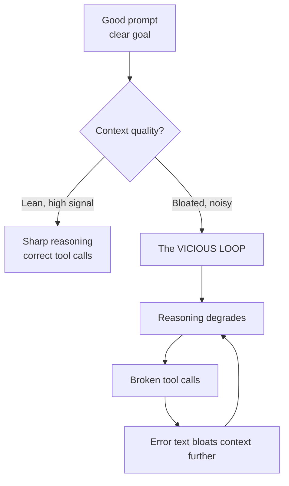
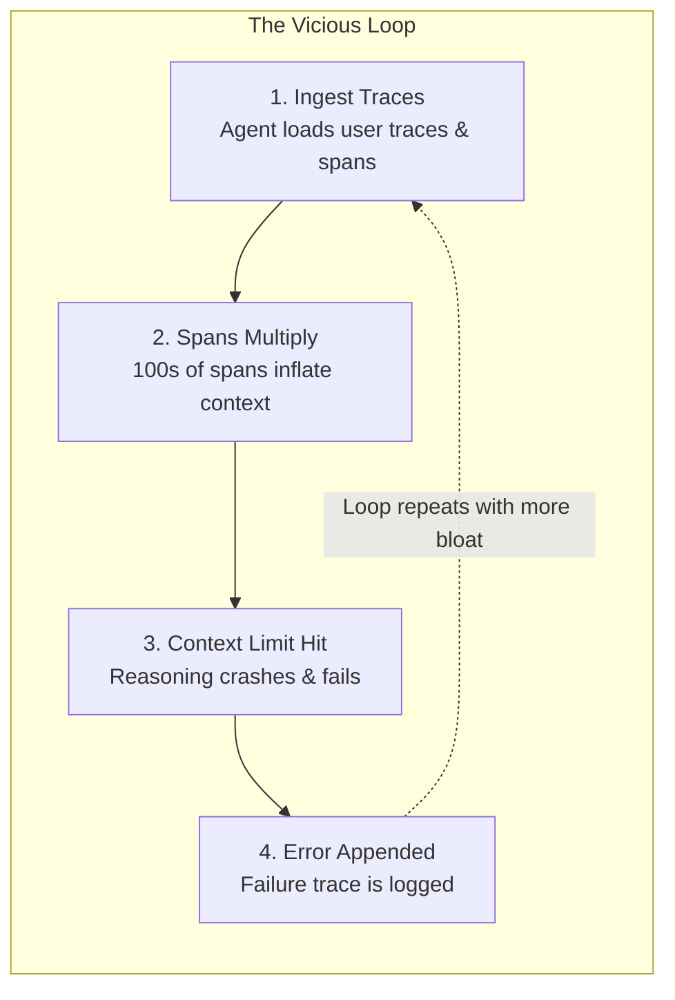
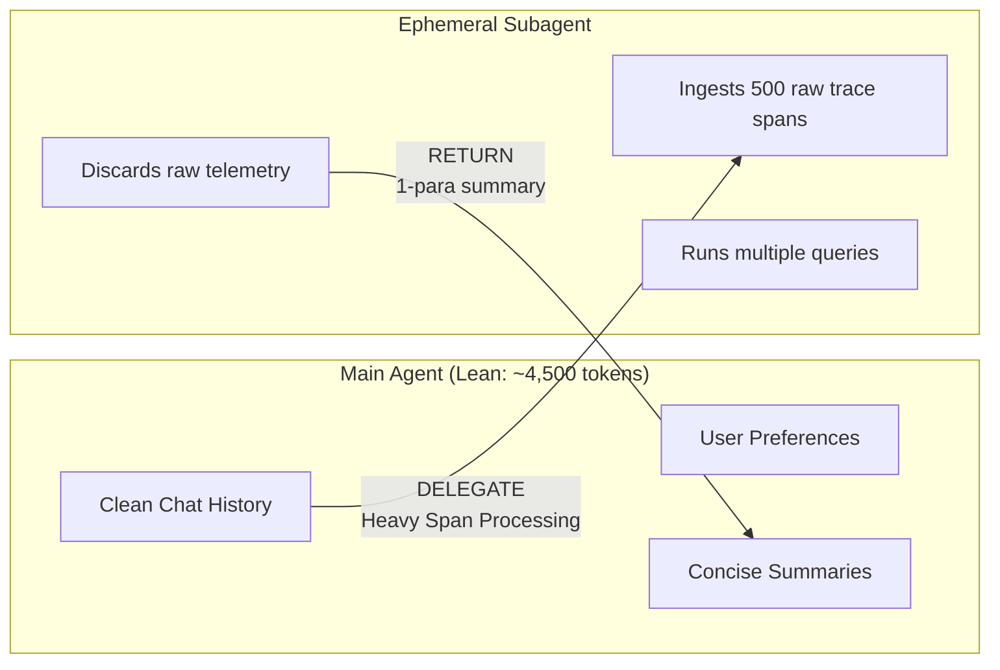
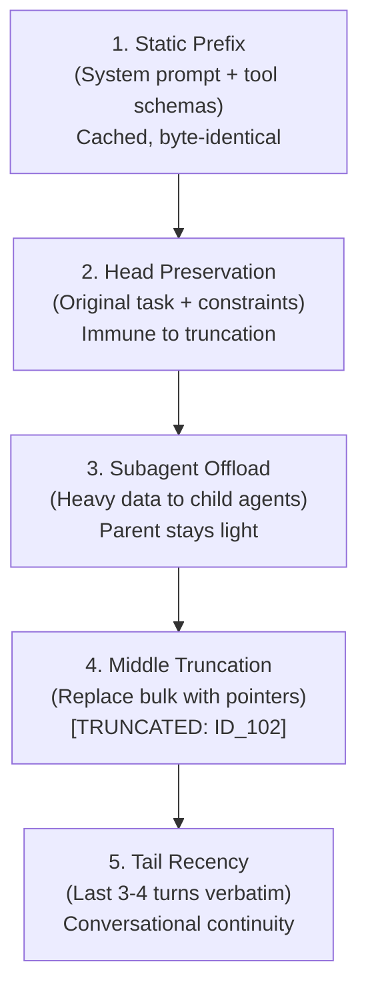
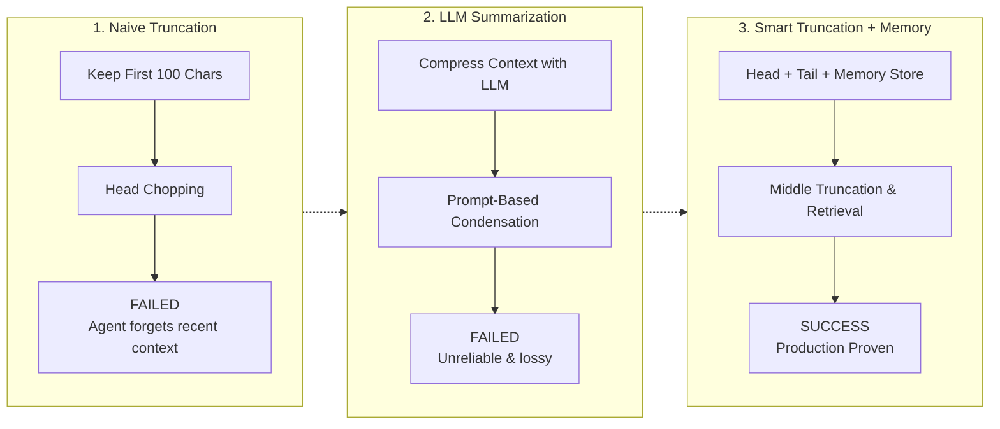
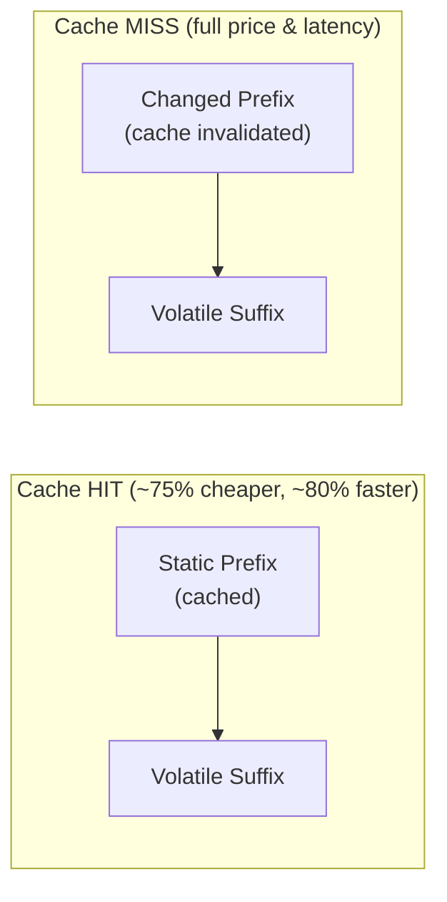
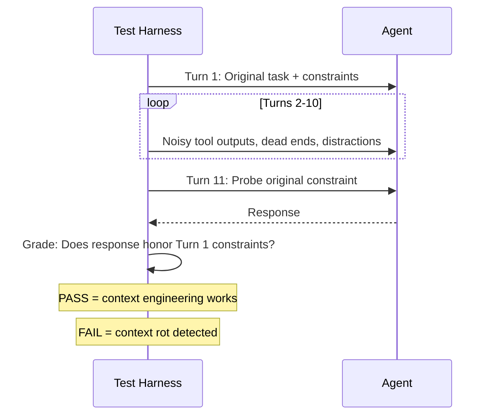

> **Learning goals:** Internalize context rot and the attention budget; run the 5-step context assembly pipeline; isolate heavy work in subagents; keep prompt prefixes stable for caching; test long sessions properly.
> **Prerequisites:** [Lesson 5 - Memory and context](../05-memory-and-context/) and [Lesson 2 - How agents think](../02-how-agents-think/)

## Context is a finite resource, not a bucket

Anthropic's engineering team calls it the **attention budget**: every token you add competes with every other token for the model's attention. Studies on needle-in-a-haystack benchmarks show **context rot** - as total tokens grow, the model's ability to recall any single fact inside them *drops*. This happens across all models; some degrade more gracefully, none escape it.

The practical consequence: **agents fail from context, not prompts.** A perfectly worded system prompt cannot save you if turn 9 dumped 40,000 tokens of raw tool output into the window.

### The death spiral to design against

The **meta-agent context death spiral**: one "god agent" retrieves 500 trace spans into its main context. The window fills, reasoning thins, it generates malformed tool calls, and the error responses make the context even fatter. Each rotation makes recovery less likely.

Two defenses, used together for every heavy task:

1. **Subagent context isolation** - the parent sends an ephemeral child to parse the 500 spans in a *fresh* window; the child returns a 2-sentence finding plus 3 IDs. The parent's attention budget is untouched.

2. **Offloading with pointers** - payloads over ~500 tokens are written to an indexed store and replaced by `[TRUNCATED: ID_882. Call fetch_context_payload(882) to read]`. Skills stay in context; bulk data becomes retrievable on demand.

## The five-step Context RAM pipeline

This is the assembly line that turns a raw session into a high-signal window:

| Step | What happens | Token effect |
|---|---|---|
| 1. Static prefix | Persona, rules, tool schemas placed at the very start, immutable | Cached by the provider |
| 2. Head preservation | The original request is pinned and cannot be pushed out by sliding windows | Tiny, permanent |
| 3. Subagent offload | Data-heavy reads run in a disposable child context | Saves thousands |
| 4. Middle truncation | Bulky outputs replaced with `[TRUNCATED: ID_882]` pointers | Recovers ~90% of capacity |
| 5. Tail recency | Last few turns appended verbatim | Small, keeps flow |

## Three strategies that actually work

| Strategy | Keeps | Costs | Use when |
|---|---|---|---|
| **Avoid summarization by default** | Exact IDs, error strings, numbers | More storage, retrieval tooling | Debugging, code, anything precise |
| **Head/tail preservation** | Original goal + recent flow | Some middle detail behind pointers | Long sessions with a stable goal |
| **Subagent isolation** | Parent attention budget | Extra calls, summarization risk | Parsing logs, scanning repos, bulk reads |

### LLM Summarization Pitfalls

The counterintuitive strategy is the first. Teams often try to summarize history to save tokens, but this introduces critical production failures. 
- LLM summarization is **non-deterministic**: the same input produces different summaries each time.
- It drops structured identifiers that downstream tools require:
  - Span IDs (e.g., `trace_id: abc-123-def`) &rarr; tool calls fail
  - SQL column names &rarr; queries break
  - Regex patterns &rarr; matching fails
  - API endpoint paths &rarr; requests fail

Anthropic's guidance is to find *the smallest set of high-signal tokens*, not the shortest possible summary. The fix is to use **pointer offloading** instead. Replace bulk data with `[TRUNCATED: ID_882. Call fetch_context(882) to retrieve]` and store the full payload in an indexed database. Summarize only when the *flow* of an old conversation matters more than its *facts*.

## Prompt caching and prefix stability

Providers cache the Key-Value attention states of identical prompt prefixes. If your prefix changes on every call, you pay full price and latency forever.

**Rules for 80%+ cache hit rate:**
1. Keep the system prompt EXACTLY the same (byte-identical) across requests.
2. Don't inject timestamps, session IDs, or request IDs into the system prompt.
3. Keep tool schema order stable.
4. Place all volatile content (user messages, retrieved docs, tool outputs) AFTER the static prefix.

| Rule | Result |
|---|---|
| System prompt + tool definitions at the very start, byte-identical | 80%+ cache hit rates |
| No timestamps, session IDs or user names inside the prefix | Cache survives across calls |
| Volatile content (today's data, new turns) **after** the static block | Only the tail is re-processed |
| Source-course figures | ~75% cost reduction, ~80% latency reduction at high hit rates |

Anti-patterns to delete today: "Current time: 2025-04-01T10:30:00Z" at the top of the system prompt (invalidates the entire cache every second); tool lists whose order changes per request; user-specific text injected before the static block.

## Evaluate long sessions: the "Turn 11" probe

Single-turn evals lie about long sessions. A 98% score on Turn 1 hides severe memory decay by Turn 8. The fix is a cheap, brutal test:

1. Preload 10 turns of noisy tool observations (logs, JSON dumps, dead ends).
2. At **Turn 11**, ask something that requires the *original* instruction ("What constraint did I give before you started?").
3. Pass = correct recall, zero invented facts, and adherence to the original constraint.

Run it before shipping any change to context assembly. It is the single highest-value regression test for a harness (see [Lesson 9](../09-evaluating-and-testing-agents/) for the full eval toolbox).

## Context poisoning and untrusted data

One bad input becomes "true" for the rest of the session: a hallucinated fact, a stale web page, or malicious text that says *"ignore previous instructions"*. Defenses:

- Treat every tool result and web page as **data**, never as instructions ([Lesson 10](../10-guardrails-and-safety/)).
- Keep durable facts in a separate store (next lesson) so poison does not get promoted.
- Re-verify before writing anything into memory.
- If a session is poisoned, kill it: start a clean subagent with a curated summary rather than arguing with a confused window.

## Just-in-time retrieval

Keep lightweight **identifiers** in context (file paths, ticket IDs, URLs) and let the agent load the content via tools when it actually needs it. This is how you run a 100k-file repository in a 200k-token window: you never load it all - you load what the task touches.

## Common pitfalls

| Pitfall | Symptom | Fix |
|---|---|---|
| Summarizing everything | Agent forgets exact details mid-task | Offload with pointers instead |
| Volatile prefix | Cache hit rate ~0, costs double | Freeze the prefix |
| No Turn-11 test | Long sessions regress silently | Add the probe to CI |
| Trusting retrieved text | Prompt injection succeeds | Data-not-instructions rule |
| Preloading whole files | Context rot, degradation | JIT retrieval by identifiers |

## Key takeaways

1. Context is finite; **attention is the budget you are actually spending**.
2. Preserve the head, keep the tail, offload and truncate the middle - never summarize by reflex.
3. Stable prefixes are free money; volatile prefixes are a hidden tax.
4. Test long sessions with a Turn-11 probe before you trust any harness change.

## Further reading

- [Anthropic - Effective context engineering for AI agents](https://www.anthropic.com/engineering/effective-context-engineering-for-ai-agents)
- [Chroma - Context Rot: how increasing input tokens impacts LLM performance](https://research.trychroma.com/context-rot)
- [LangChain - Context engineering for agents](https://blog.langchain.com/context-engineering-for-agents/)

---

[Previous Lesson: Event-driven and scheduled agents](../event-driven-and-scheduled-agents/) | [Next Lesson: Agent memory architectures →](../agent-memory-architectures/)

