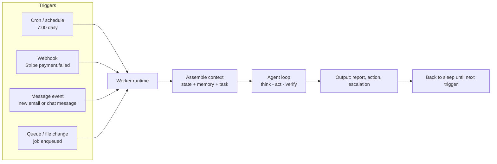
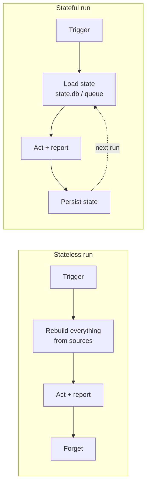
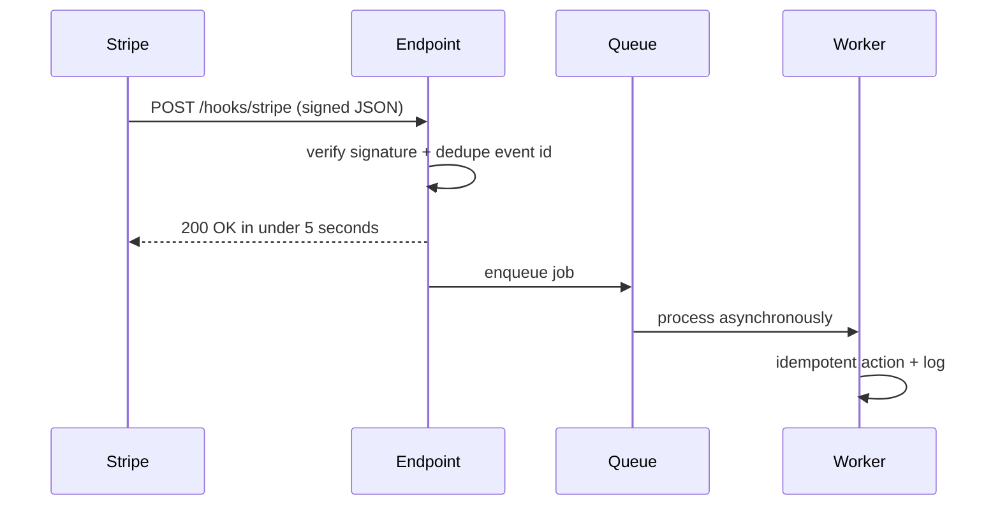
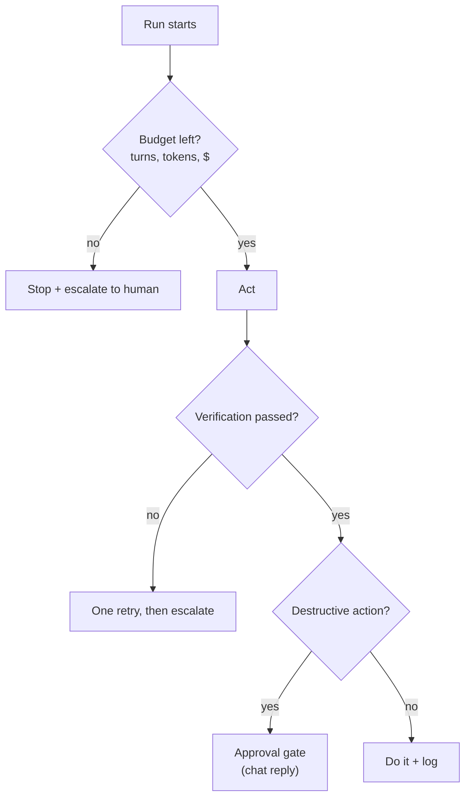

> **Learning goals:** Give a worker a heartbeat with schedules and events; separate stateful from stateless runs; price and cap unattended loops; design guardrails for work nobody is watching.
> **Prerequisites:** [Lesson 20 - Looping](../20-looping/) and [Lesson 29 - AI worker foundations](../agent-worker-foundations/)

## An agent without a heartbeat is a library

Up to now, every loop started because *you* typed something. A worker starts because the world changed: a clock ticked, a webhook fired, a message arrived. This lesson is the difference between "I use an agent" and "an agent runs my X".



### Trigger taxonomy

| Trigger | Fires when | Typical latency | Needs a server? | Example |
|---|---|---|---|---|
| **Cron / schedule** | A time expression matches | Minutes | No (local daemon works) | "Every weekday 7:00, brief me" |
| **Webhook** | An external system POSTs to your URL | Seconds | Yes (public endpoint) | Stripe payment failure |
| **Message event** | Chat/email arrives | Seconds | Sometimes (bridge) | WhatsApp -> worker |
| **Queue / job** | Another system enqueues work | Seconds | Yes | "Analyze this repo" jobs |
| **File change** | A file appears or changes | Seconds | No | Drop invoice in folder -> process |
| **Long polling** | Your worker checks an API | Minutes | No | Gmail label polling |

Start with **cron** for anything periodic and **webhooks** for anything reactive. Everything else is a variation.

## Cron in practice

| Field | Meaning | Values |
|---|---|---|
| 1 | Minute | 0-59 |
| 2 | Hour | 0-23 |
| 3 | Day of month | 1-31 |
| 4 | Month | 1-12 |
| 5 | Day of week | 0-6 (Sun=0) |

```bash
# crontab -e
0 7 * * 1-5   /home/agent/worker/run.sh inbox-brief   # weekdays 07:00
*/15 * * * *  /home/agent/worker/run.sh check-queue   # every 15 minutes
0 3 * * 0     /home/agent/worker/run.sh weekly-review # Sundays 03:00
```

Alternatives to local cron: **systemd timers** (better logs, dependencies), **GitHub Actions schedules** (no server at all), **cloud schedulers** (EventBridge, Cloud Scheduler), Windows **Task Scheduler**.

Two classic cron failures:

| Failure | Symptom | Defense |
|---|---|---|
| Overlapping runs | Two workers edit the same files | Lock file (`flock`) or a job queue |
| Silent death | Nothing runs for days, nobody notices | **Dead man's switch**: alert if no heartbeat in 2x the interval |

## Stateful vs stateless runs



| Property | Stateless | Stateful |
|---|---|---|
| Simplicity | High | Lower |
| Idempotency | Natural - rerun freely | Requires dedupe and locks |
| Cost | Repays "re-derive" work each run | Cheaper across runs |
| Best for | Digests, monitors, reports | Pipelines, negotiations, long tasks |
| Storage needed | None | SQLite/Redis/Postgres |

Prefer stateless until a run genuinely must remember something - then store the *minimum* state (IDs, cursors, statuses), never raw context dumps.

## Webhooks that do not break



Rules: verify the signature, acknowledge fast, process asynchronously, dedupe by event ID (providers **retry**), and make every action idempotent. If a retry can charge a customer twice, your webhook is a bug waiting for a deadline.

## Guardrails for work nobody is watching



| Guardrail | Typical setting | Why |
|---|---|---|
| Max turns | 10 tool iterations | Bounds a reasoning loop |
| Max spend | $0.50-1.00 per run | Bounds the bill |
| Repeated-action detection | Abort after 2 identical calls | Catches stuck loops |
| Tool allowlist | Only what the job needs | Shrinks attack surface |
| Approval for destructive ops | Send, delete, pay, deploy | Cheap insurance |
| Heartbeat alert | Alert if no run in 26h | Kills silent rot |

## The economics of unattended loops

Do the arithmetic **before** you schedule anything:

> Every 5 minutes = 288 runs/day = ~8,640 runs/month. At $0.01 per run that is ~$86/month for a monitor that has not done anything useful yet.

| Cadence | Runs/month | Use when |
|---|---|---|
| Realtime (seconds) | 100k+ | Payment fraud, security |
| Frequent (5-15 min) | 3k-8k | Queue triage, urgent inbox |
| Daily | 30 | Briefs, reports, digests |
| Weekly | 4 | Reviews, consolidation |

Cost levers, in order of impact: **cadence** down, **triage-cheap** (a small model routes; the expensive model handles the 5% that matters), **prefix caching** (stable system prompt + tools, see [Lesson 32](../context-engineering-deep-dive/)), and hard per-run caps.

## Worked example: nightly lead triage (cron + webhook hybrid)

| Run | Trigger | Job | Model |
|---|---|---|---|
| Scan | 19:00 cron | Pull new CRM leads, score interest | Cheap classifier |
| Notify | After scan | Post top 5 with reasons to chat | - |
| Act | `APPROVE` reply (webhook) | Write back owner + drafts outreach | Strong model |

Two run types, one worker, a human gate in the middle. This is the standard shape of trustworthy automation.

## Common pitfalls

| Pitfall | Symptom | Fix |
|---|---|---|
| Scheduling too often | Bill grows, value flat | Slowest cadence that works |
| Assuming one run | Duplicate emails, double charges | Idempotency keys + dedupe |
| No dedupe on webhooks | Retries replay actions | Event ID store |
| Alerts that never fire | Dead worker discovered by a customer | Dead man's switch |
| Long agentic runs on cron | Overlap and file conflicts | Locks or a job queue |

## Key takeaways

1. A trigger is what separates a worker from a tool you must remember to use.
2. Cron for periodic, webhooks for reactive - and both need locks, dedupe and idempotency.
3. Unattended work needs explicit caps: turns, dollars, tools, destructive actions.
4. Do the runs-per-month arithmetic first; cadence is your biggest cost lever.

## Further reading

- [GitHub Actions - scheduled workflows](https://docs.github.com/en/actions/using-workflows/events-that-trigger-workflows#schedule)
- [Stripe - webhook best practices](https://docs.stripe.com/webhooks#best-practices)
- [cron - Wikipedia (syntax reference)](https://en.wikipedia.org/wiki/Cron)

---

[Previous Lesson: Infrastructure and host security](../agent-infrastructure-and-security/) | [Next Lesson: Context engineering deep dive →](../context-engineering-deep-dive/)

