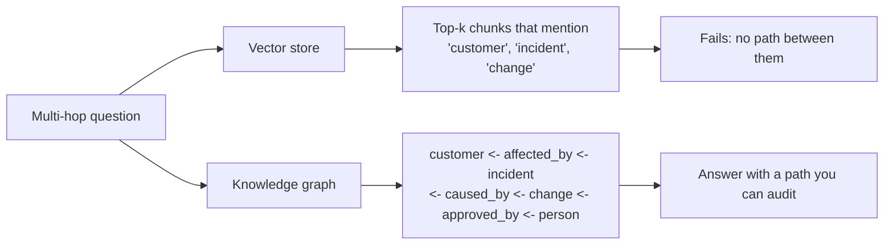
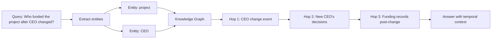
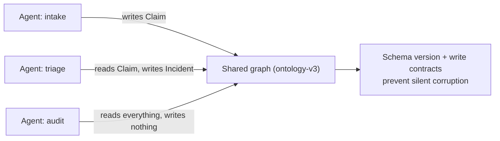
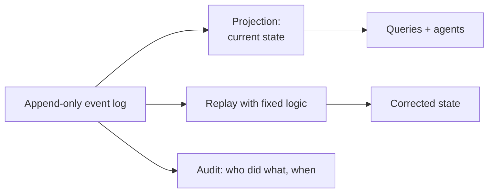

> **Learning goals:** Know when a graph beats a vector store; design typed edges with provenance; reason about multi-hop trust; keep an ontology versioned; detect temporal rot; use event sourcing for reversibility.
> **Prerequisites:** [Lesson 8 - Agentic RAG](../08-agentic-rag/) and [Lesson 33 - Agent memory architectures](../agent-memory-architectures/)

## Why vector-only retrieval hits a ceiling

Embeddings answer one question: *"what text looks similar to this query?"* They cannot answer *"who approved the change that caused the incident that affected this customer?"* - that requires **traversal**, not similarity.

Rule of thumb: **vectors for "what does the document say", graphs for "how are things connected".**

## Typed edges: the difference between a graph and a pile

An untyped graph ("A related to B") is worse than files. Value comes from **edge semantics you can query and trust**:

| Edge type | Meaning | Example |
|---|---|---|
| `supersedes` | Replaces an older fact/decision | Decision-14 supersedes Decision-09 |
| `depends_on` | Blocks or requires | Deploy depends_on migration |
| `decided_by` | Accountability | Policy-7 decided_by VP-Engineering |
| `caused` | Causal link (investigations) | Outage-3 caused_by Commit-882 |
| `implements` | Realizes a spec or policy | Service-A implements Policy-7 |
| `references` | Weak association / citation | Doc-12 references RFC-19 |
| `part_of` | Composition | Team-A part_of Org-X |
| `owns` | Responsibility | Agent-B owns queue-sync |

Every edge should carry **type + direction + provenance (source) + validity**. Without provenance you cannot answer "why do we believe this?" - the same question audits ask.

## Multi-hop trust arithmetic

Accuracy compounds *multiplicatively* along a path. If each edge is 90% reliable:

| Hops | Compounded trust | Verdict |
|---|---|---|
| 1 | 90% | Fine |
| 2 | 81% | Fine with citations |
| 3 | 73% | Needs verification |
| 5 | 59% | Worse than guessing |

Defenses: **cap traversal** (2-3 hops by default), require **provenance on every edge**, and have the agent output the *path* it walked so a human can audit it. A graph answer without a path is just a confident opinion.

## GraphRAG vs graph orchestration (do not confuse them)

| | Graph orchestration | Graph knowledge (GraphRAG) |
|---|---|---|
| What it is | State machine controlling *execution* | Entity/relation index for *retrieval* |
| Tooling | LangGraph, BPMN-like pipelines | GraphRAG, HippoRAG, temporal graphs |
| Answers | "In what order do agents run?" | "How are these facts connected?" |
| Cost | Moderate | High (extraction + curation) |
| Production rule | Use **always** | Use **selectively**: multi-hop, temporal, or audit-critical |

The production principle from the layered-agent playbook: *graphs for orchestration always, graphs for knowledge selectively.*

### HippoRAG 2: Neurobiologically Inspired Retrieval

While standard GraphRAG excels at broad summarization, **HippoRAG 2** is an advanced variant inspired by the hippocampal memory system in the human brain. It excels at answering complex questions that require reasoning across multiple documents.

Key characteristics:
- **Multi-hop Entity Traversal**: Uses a knowledge graph and Personalized PageRank (PPR) to "spread activation," connecting related facts across documents in a single pass.
- **Temporal Relationships**: Naturally handles facts that change over time.
- **Efficiency**: Achieves multi-hop reasoning without the latency and cost of iterative, multi-step LLM calls.

## Ontology and shared-state versioning

Your ontology is the vocabulary of the graph: entity types (`Customer`, `Incident`, `Policy`) and relation types (`caused`, `owns`). Two rules keep it from silently rotting:

1. **Version the ontology** (`ontology-v3`) and store the version on every entity and edge.
2. **Make the graph the shared state** between agents, with a written contract for who may write what. Multiple writers without a schema produce confident garbage.

## Temporal rot: knowledge expires

Policies change, prices move, APIs deprecate. An edge that was true in March can quietly mislead in September. Defenses:

- **Validity ranges on edges** (`valid_from`, `valid_to`) - bi-temporal graphs track *valid time* and *transaction time* separately.
- **Refresh jobs** that re-verify high-traffic edges on a schedule (nightly for policies, hourly for prices).
- **"As of" queries** so answers can be reproduced: *"what did we believe on 2026-03-01?"*
- **Staleness alarms**: alert when a critical edge has not been verified in N days.

## Event sourcing: reversible agents

Store the **events**, not just the current state. Every action becomes an append-only entry (`fact_added`, `edge_superseded`, `tool_called`, `payout_blocked`), and current state is a *projection* you can rebuild.

Payoffs: agent mistakes are reversible (append a compensating event), audits are a `git log`-style read, and "what changed?" questions have exact answers.

## Pitfalls

| Pitfall | Symptom | Fix |
|---|---|---|
| Untyped edges | Everything "relates to" everything | Typed + directional relations |
| No provenance | Cannot defend an answer | Source on every edge |
| Deep traversal | Confident nonsense | Cap hops, verify at the end |
| Unversioned ontology | Silent corruption across agents | Version + write contracts |
| Forever-true edges | Answers drift from reality | Validity ranges + refresh jobs |
| State-only storage | No undo, no audit | Event sourcing |

## Key takeaways

1. Vectors find similar text; **graphs find paths** - pick by question shape.
2. Typed edges with provenance turn a graph into an auditable asset.
3. Trust decays per hop: cap traversal and require citations.
4. Version the ontology, expire the edges, and log the events.

## Further reading

- [Microsoft - GraphRAG: unlocking LLM discovery on narrative private data](https://www.microsoft.com/en-us/research/blog/graphrag-unlocking-llm-discovery-on-narrative-private-data/)
- [HippoRAG - neurobiologically inspired long-term memory for LLMs](https://arxiv.org/abs/2405.14831)
- [Martin Fowler - Event sourcing](https://martinfowler.com/eaaDev/EventSourcing.html)

---

[Previous Lesson: Agent memory architectures](../agent-memory-architectures/) | [Next Lesson: Agentic search and retrieval tools →](../agentic-search-and-retrieval-tools/)

