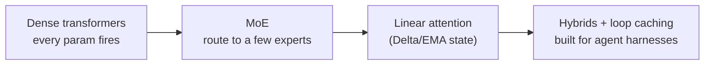
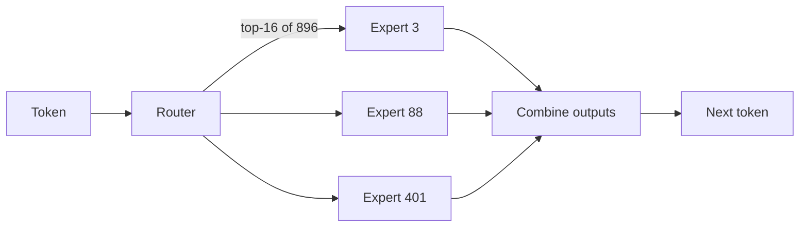
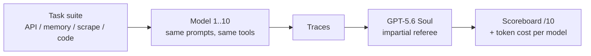
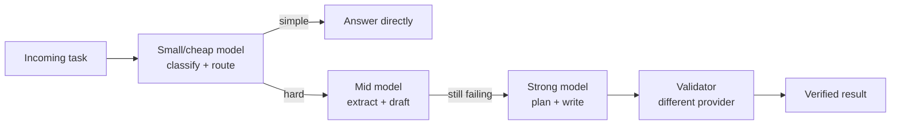

> **Learning goals:** Read the model-evolution timeline; understand sparse MoE and router economics; compare quadratic and linear attention; use KV-cache and loop-caching facts for cost; interpret agent benchmarks honestly.
> **Prerequisites:** [Lesson 2 - How agents think](../02-how-agents-think/) and [Lesson 32 - Context engineering deep dive](../context-engineering-deep-dive/)

## Why an agent engineer should care about model internals

You do not need to train a model - but you do need to predict **cost, latency and context limits**, because those three decide your architecture. The evolution, in one line:

## Sparse MoE: huge capacity, small bill

A Mixture-of-Experts model keeps enormous total parameters but activates only a few per token. Kimi K3 (per the source curriculum) is the extreme example:

| Property | Value | Consequence |
|---|---|---|
| Total parameters | 2.8T | Massive stored knowledge |
| Experts | 896, top-16 routed per token | Each token sees a small committee |
| Active parameters | ~50B per token (1.78% sparsity) | Latency/cost near a 50B dense model |

Implication for you: **capacity is not the bottleneck - context and loops are.** MoE buys you a smarter model at a workable price, which is exactly why agentic loops became affordable.

## Attention: quadratic versus linear

Standard attention compares every token with every other token - an `N × N` matrix. At 1M tokens that is a wall. **Kimi Delta Attention (KDA)** replaces it with a fixed-size recurrent state updated in linear time:

> `S_t = α_t · S_(t-1) + β_t · (K_t^T · V_t)` - an exponential moving average with learned delta gates.

| Property | Full attention (softmax) | KDA (linear) |
|---|---|---|
| Complexity | `O(N²)` | `O(N)` |
| Memory at 1M tokens | KV cache grows linearly *and* pairwise compute explodes | Fixed-size state |
| Reported gains (Kimi Linear paper) | baseline | up to **75% KV-cache reduction**, up to **6× decoding throughput** at 1M context |
| Quality | baseline | outperformed full MLA across tested regimes in the same training recipe |

**Attention residuals and loop caching** go one step further for agents: because agent loops re-process nearly identical prefixes, caching activations across loop iterations can cut repeated work dramatically (the course cites up to ~10× cost reduction). This is the hardware-level version of the prefix-stability rule from [Lesson 32](../context-engineering-deep-dive/).

## The 10-model harness arena

What happens when you drop ten frontier models into the **same agent harness**, give them the **same tasks**, and let an impartial model referee the output? The source curriculum ran exactly that experiment on a local Waku-style harness with these tasks: calendar API manipulation, Pokémon semantic memory, a web scraper, and a Python subagent coder.

Reported top performers (scores out of 10):

| Model | Score | Token cost profile |
|---|---|---|
| xAI Grok 4.5 | 8.3 | Moderate |
| Claude Opus 4.8 | 7.9 | **Highest tier** - nearly 2x the tokens of the Kimi models |
| Kimi K2.7 | 7.6 | Low |
| Kimi K3 | 7.5 | Low |

Findings that matter more than the ranking:

1. **Quality and cost decouple.** Claude Opus 4.8 led cost while trailing the top score; Kimi models delivered competitive quality at a fraction of the spend. Where you sit on that curve is a *product* decision, not a benchmark fact.
2. **Tool behavior is heterogeneous under identical prompts.** Gemini Flash preferred fast single searches; others ran iterative lookups. Your harness must tolerate different tool-use styles - or it silently penalizes models it was not designed around.
3. **Referee models must be named and versioned.** "Judged by GPT-5.6 Soul" is part of the result; a different judge is a different experiment.

## How to read agent benchmarks honestly

- **Who built the harness?** Vendor harnesses flatter their own model.
- **Which tasks, and do they resemble yours?** Calendar + scraping ≠ your claims pipeline.
- **Who judges, and how?** LLM judges carry biases; check for human calibration.
- **Is cost on the scoreboard?** A 0.4-point gain for 2x tokens is often a loss.
- **Variance:** single runs prove nothing; demand seeds and confidence intervals.
- **Contamination:** public benchmarks leak into training data; private golden sets do not.

The only benchmark that fully applies to you: **your own mini-arena** - 10-20 tasks from your workload, two or three candidate models, your rubric, cost included.

## Model routing: put the price ladder to work

| Task | Tier | Why |
|---|---|---|
| Routing, classification | Smallest | Volume is high, reasoning is shallow |
| Extraction, formatting | Mid | Pattern fidelity matters |
| Planning, coding | Strong | Errors compound downstream |
| Validation | Strong, *different* provider | Independent blind spots |
| Judging | Strong + rubric | Cheap judges produce noise |

This cascade is how the cost divide in the arena becomes an advantage instead of a constraint: pay strong-model prices only for the fraction of work that needs them.

## Common pitfalls

| Pitfall | Symptom | Fix |
|---|---|---|
| Single-run benchmark worship | Model flips rank next week | Seeds + variance, re-run quarterly |
| Ignoring token cost | "Best" model bankrupts the worker | Cost-adjusted scoring |
| One model everywhere | Overpaying for easy work | Router cascade |
| Same provider for judge and worker | Flattered scores | Independent judge |
| Harness tuned to one model | Others look bad unfairly | Style-neutral tooling |

## Key takeaways

1. Architecture decides what is possible: MoE for capacity, linear attention for long context, loop caching for repeated prefixes.
2. Cost per token is now a first-class architectural fact - KV-cache and attention choices set your floor.
3. Run your own harness arena; external leaderboards are hypotheses, not answers.
4. Route by difficulty and validate with a different provider than you generate with.

## Further reading

- [Kimi Linear - An expressive, efficient attention architecture (arXiv 2510.26692)](https://arxiv.org/abs/2510.26692)
- [Artificial Analysis - model quality, price and speed comparisons](https://artificialanalysis.ai/)
- [LMArena](https://lmarena.ai/) and [SWE-bench](https://www.swebench.com/)

---

[Previous Lesson: Tooling and frameworks](../agent-tooling-and-frameworks/) | [Next Lesson: Multi-agent case studies →](../multi-agent-case-studies/)

