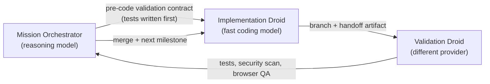
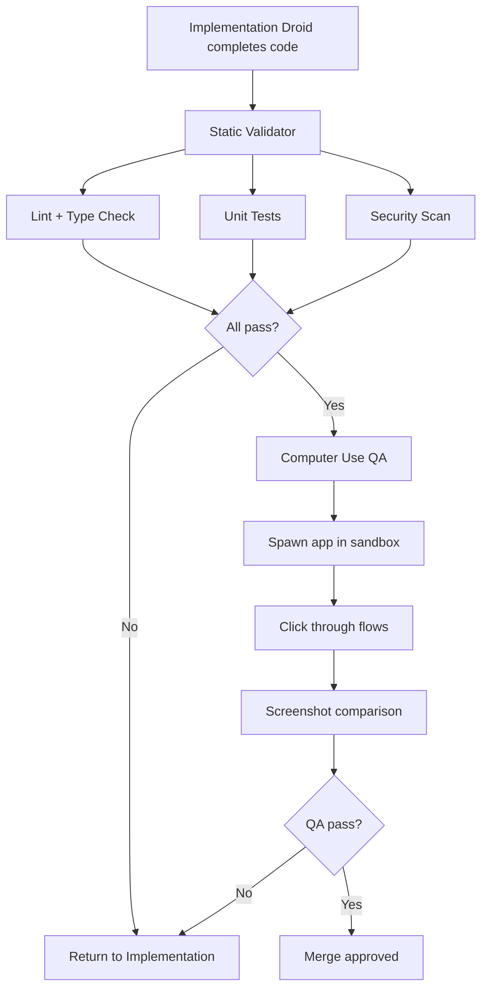
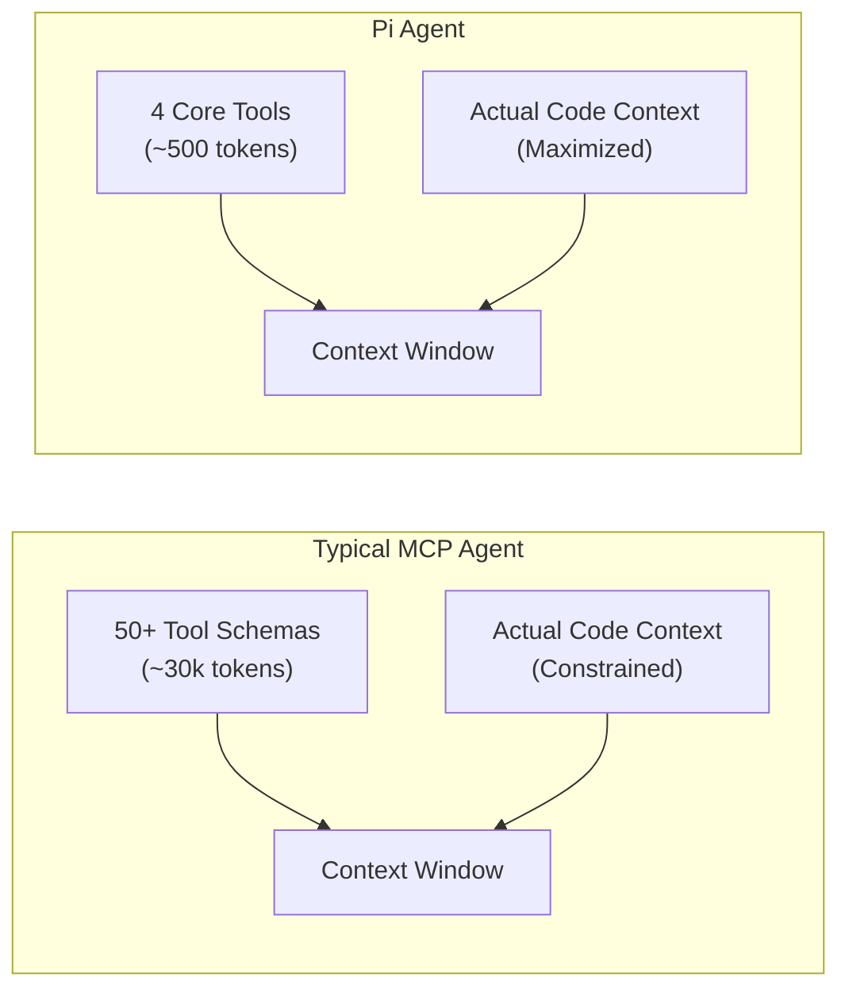
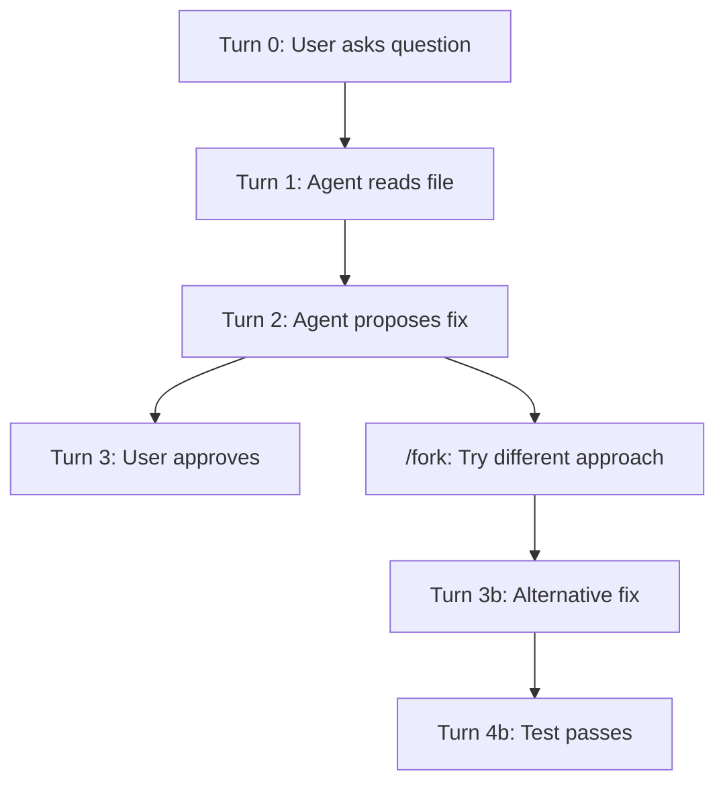
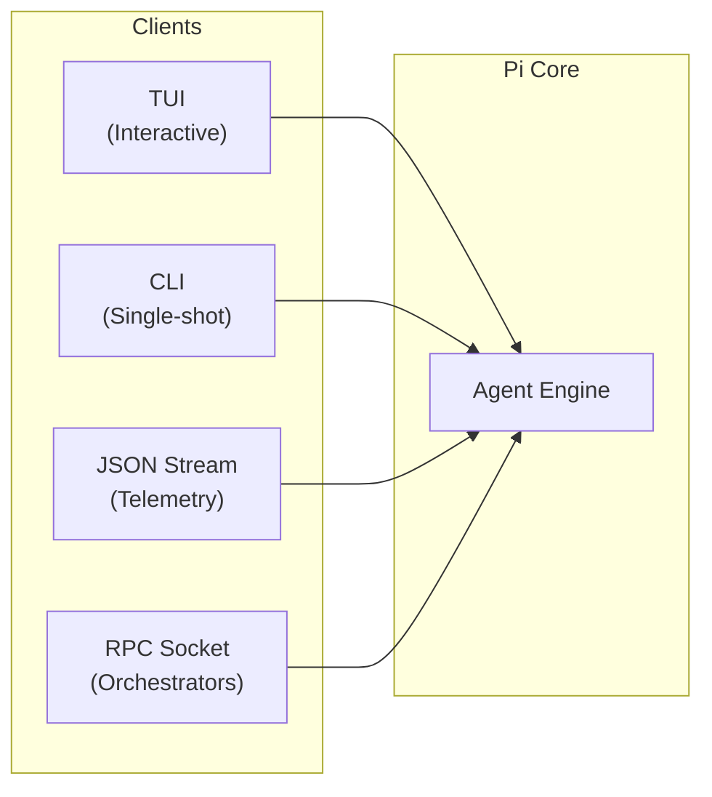

> **Learning goals:** Steal patterns from real multi-agent systems; run a 3-role factory with pre-code contracts; choose between teams, swarms and deep research; recognize token economics in practice; appreciate why Pi's 4 tools and 792 lines win.
> **Prerequisites:** [Lesson 7 - Multi-agent systems](../07-multi-agent-systems/), [Lesson 18 - Orchestrators](../18-orchestrators/) and [Agent swarms](../agent-swarms/)

## Factory missions: the 3-role software factory

### Human attention as the new bottleneck

In AI-assisted coding, code generation has become cheap—agents can write thousands of lines per hour. The new scarce resource is **human attention** for steering, reviewing, and validating agent output. As the volume of AI-generated work outpaces a human's cognitive capacity to review it, organizations face a "human attention bottleneck." This is why pre-code validation contracts matter so much: they automate the verification process that would otherwise require massive human review, shifting the developer's role from writing code to managing AI workers through structured governance.

### The factory architecture

The most disciplined multi-agent pattern in the source material is a **factory**: a mission orchestrator, an implementation droid, and an adversarial validation droid.

| Pattern | What it means | Why it works |
|---|---|---|
| **Pre-code validation contract** | Write the test suite and assertions *before* any implementation | Kills confirmation bias - agents cannot write tests that merely bless their code |
| **Serial writes + parallel reads** | Reads, scans and lookups run concurrently; file edits and commits are serialized | Full parallel speed, zero Git conflicts |
| **Dual adversarial validation** | The validator runs a *different model provider* than the coder | Different training biases catch each other's blind spots |
| **Droid whispering** | Assign models by cognitive strength: heavy reasoner plans, fast coder implements, rival model validates | Each seat plays to a strength |
| **Structured handoff contracts** | JSON/markdown specs with milestone summaries, exit codes, open issues | Zero context rot across multi-day runs |
| **Anti-bitter-lesson design** | 95% of orchestration in text prompts and skills | The system improves when a better base model ships |

The lifecycle: scope the epic -> author the contract (e.g., 40 assertions) -> dispatch milestone -> droid codes in a sandbox branch until local tests pass -> validator audits with an independent model -> orchestrator merges and advances. Repeat autonomously.

### 16-day autonomous mission runs

Because of the rigid structure of this pattern, production factory systems have demonstrated 16+ day continuous autonomous operation. By using proper structured contract handoffs—passing explicit JSON/markdown specs, milestone summaries, and exit codes—the system maintains zero context rot across these massive multi-day runs. This validates that the architecture can scale far beyond single-session chats.

### Dual adversarial validators

To replace human oversight, the validation droid employs two distinct layers of adversarial checking:
1. **Static Validator**: Runs deterministic checks such as linting, type checking, unit tests, and security scanning (SAST). This layer is fast, reproducible, and catches syntax or logic errors immediately.
2. **Dynamic Computer Use QA Validator**: Spawns the actual application in a sandbox and uses Computer Use (browser automation) to click buttons, fill forms, and navigate. This catches visual regressions, broken interactions, and accessibility issues that static tests miss.

## Agent teams: you are the org chart

**Claw Code** teams: a leader plans and dispatches **5 pre-defined scouts** (you name the lenses before execution).

| Observation from the live demo | Number |
|---|---|
| Tools used by scouts before steering | 70-90 tools, **90k tokens** |
| After human steer ("4 channels max, min tool usage") | re-launched with 3 tools each -> **15k tokens** |
| Wall-clock | 18m 14s |
| Reconciliation | Team lead merges dissent into a de-biased brief |

The lesson: teams give **maximum control** and their token cost is whatever you steer it to be - but breadth is capped by how well *you* decompose the problem.

## Agent swarm: the org chart writes itself

**Kimi K2.5** swarm: a goal agent derives specs, spawns **12 templated researchers**, and a clustering synthesizer ("Bowen") merges results.

| Property | Teams | Swarm |
|---|---|---|
| Who defines workers? | You (1-5 named) | Goal agent at runtime |
| Observed parallelism | 5 scouts | 12 agents (100 sub-pages claimed, 10/12 succeeded) |
| Token cost | Steerable (90k -> 15k) | ~2x teams |
| Control | Maximal | Minimal |
| Best when | Workflow is crisp | Intent is vague, breadth is the goal |
| Analogy | CEO delegating to department heads | Random forest - many trees vote, a final layer merges |

Both reconcile dissent centrally (lead or synthesizer) - which is the real reason to go multi-agent: **de-biasing through independent opinions**, not raw speed.

## Deep research: the middle option

Deep research is the supervisory pattern with **ceremony**: a supervisor asks clarifying questions, writes a research brief, fans out sub-researchers, then compiles. It sits between teams (maximal control) and swarms (zero pre-definition).

| Dimension | Teams (Claw Code) | Swarm (Kimi K2.5) | Deep research |
|---|---|---|---|
| Who defines workers? | You (1-5 named) | Goal agent at runtime | Supervisor, after clarification |
| Parallelism | 5 scouts | 12 agents | Sub-researchers after the brief |
| Ceremony | Minimal | None | Clarify + brief (auditable) |
| Reconciliation | Team lead | Clustering synthesizer | Supervisor compiles |
| Best when | Workflow is crisp | Intent is vague | You need an auditable brief before breadth |

The quadrant, in words: **control on X, breadth on Y.** Swarm = high breadth, low control. Teams = high control, medium breadth. Deep research = medium/medium, and the only one that produces a brief you can audit before spending the big tokens.

> Heuristic from the source: *"Too vague? Let it swarm. Need control? Lead the team."*

## Live demos: the token economics, measured

**Demo 1 - "Find four developer-tool / automation / indie-hacking YouTube channels":**

| Lane | Path | Cost |
|---|---|---|
| Kimi swarm | Goal -> 12 templated researchers -> clustering synthesizer (Bowen) | ~2x teams; 10/12 agents succeeded |
| Claw teams | Leader + 5 pre-defined scouts | 90k tokens -> human steer ("4 channels max, min tool usage") -> re-launch with 3 tools each -> **15k tokens**, 18m 14s |

Both systems independently surfaced the same white spaces: a **Spanish/Portuguese market gap** (no hands-on "ship from zero" builder channel), **happy-path bias** ("everyone shows what worked, nobody documents what broke"), and an **empty impartial-comparison seat** ("every creator advocates one tool").

**Demo 2 - "Review this WhatsApp-first sales agent from VC, product, GTM, customer-success and legal lenses":** the five lenses were pre-defined (a Teams replay). Synthesis: pricing should start flat (~$200-300) and move to per-qualified-lead once "qualified" is defined from data; the moat is structured lead capture, not chat wrapping.

Two transferable lessons: **batch powers cost tokens** - breadth is never free - and **dissent reconciliation** (lead or synthesizer) is the actual product of a multi-agent run.

## Waku-Agent: loops inside graphs

The hybrid pattern in practice: a harness whose *outer* layer is a graph (triage -> gather -> synthesize) while individual nodes run autonomous loops. Triage classifies the request; the gather node runs an agentic search loop; synthesis runs a writing loop with reflection. This is the "loops inside graphs" composition from [Lesson 23](../23-loop-vs-graph/) - deterministic where the shape is known, autonomous where discovery is needed.

## The counter-example: Pi Agent's radical minimalism

While the industry adds frameworks, **Pi Agent** (pi.dev, 77k+ GitHub stars) became wildly popular by removing almost everything. The system is built on a philosophy of extreme constraint.

> *"No MCPs, no subagents, no plan mode, no to-dos, no permission pop-ups, no cheerful fluff. Just four core tools and a 792-line loop."*

### 1. The 4 core tools philosophy

Pi Agent uses exactly four tools: `read`, `write`, `edit`, and `bash`. 

Why does this work? Fewer tools mean far less ambiguity in tool selection for the model. More importantly, it saves approximately 30,000 tokens per turn by avoiding the massive schema injection required for a 50+ tool MCP setup. Every token of context goes to actual code instead of tool descriptions.

### 2. Session tree storage (DAG)

Instead of a flat chat history, conversations are stored as a directed acyclic graph (DAG) in `~/.pi/sessions/`. Each message is an immutable node with a parent pointer. 

This non-destructive history means nothing is ever deleted. It enables branching conversations and Git-like checkout of earlier conversational states.

### 3. Conversational forking (`/fork`)

Leveraging the DAG storage, the `/fork` TUI command allows you to branch from any earlier turn. If an agent goes down a rabbit hole, you don't have to erase context or start over. You simply fork the conversation at the last good node and test alternative hypotheses, much like `git branch` for conversations.

### 4. Four interface modalities

Pi exposes the same underlying engine through four distinct interfaces, making it adaptable to any environment:
- **TUI**: Interactive terminal UI for human pairing
- **Single-shot CLI**: e.g., `pi -p "fix the bug"` for CI/CD or scripts
- **JSON event streaming**: For telemetry, logging, and metrics
- **RPC sockets**: For outer orchestrators like Waku or OpenClaw to drive the agent

### 5. The 792-line core loop

The entire agent logic is contained within a single `agent-loop.ts` file. This 792-line core loop provides a fully auditable execution path with no hidden state and no "plugin magic." Contrast this with frameworks that span thousands of files, and it becomes clear why Pi offers sub-millisecond startup times and rock-solid reliability.

The lesson is not "always build minimal" - it is that **the headless engine and the orchestrator are separable**. Pi is the perfect inner engine for outer harnesses precisely because it refuses to be everything. Compare with the factory in the first section of this lesson: complex orchestration *around* a simple loop, not inside it.

## What to copy for your own system

- [ ] Steal the **pre-code contract**: write tests/assertions before implementation
- [ ] Serialize writes, parallelize reads - no merge conflicts, no waiting
- [ ] Use a **different provider** for validation than for implementation
- [ ] Keep handoffs as **structured contracts**, not conversation dumps
- [ ] Name your workers before execution if you need control; let a goal agent decompose if you need breadth
- [ ] Cap the tools each scout may use; steer token budgets explicitly
- [ ] Reconcile dissent in one place (lead or synthesizer) - that is the point of the exercise
- [ ] Fork sessions/branches for risky exploration instead of committing to one path
- [ ] Keep orchestration in text (prompts, skills, SOPs) so better models make you better for free

## Limitations to keep in mind

| Limitation | Reality |
|---|---|
| Token cost | Multi-agent breadth costs ~2x; batch powers are not free |
| Control ceiling | You cannot audit what a swarm did if it never logged its decomposition |
| Judge dependence | Multi-agent quality is only as good as the reconciliation step |
| Latency | Parallel helps, but reconciliation and validation add wall-clock time |
| Minimalism trade-off | Pi needs you to build the outer evaluation loop yourself |

## Common pitfalls

| Pitfall | Symptom | Fix |
|---|---|---|
| Naming scouts badly | Breadth capped by your decomposition | Rehearse lenses before dispatch |
| No tool caps | 90k tokens on one question | Hard cap per agent, steer explicitly |
| Validation by same model | Shared blind spots | Different provider |
| Ignoring the brief step | Swarm solves the wrong problem | Clarify + brief before spawning |
| Celebration of breadth | Bill with no decision | Reconcile into one actionable output |

## Key takeaways

1. The factory pattern (orchestrator + implementation + adversarial validation) is the most disciplined multi-agent design in the source material.
2. Pre-code contracts, serial writes with parallel reads and structured handoffs eliminate the three classic failure modes: confirmation bias, merge conflicts and context rot.
3. Teams trade breadth for control, swarms trade control for breadth, deep research buys an auditable brief; all of them win by reconciling dissent.
4. Radical minimalism (Pi) and radical orchestration (factory) are two ends of one spectrum - choose per task, and keep the inner engine swappable.

## Further reading

- [Pi Agent - pi.dev](https://pi.dev/)
- [Kimi K2.5 swarm and the agent-organization debate (source curriculum lessons 3-6)](../agent-swarms/)
- [Anthropic - How we built our multi-agent research system](https://www.anthropic.com/engineering/multi-agent-research-system)

---

[Previous Lesson: Model internals and agent benchmarks](../model-internals-and-benchmarks/) | [Back to Course Overview](/docs/ai-agents/agent-engineer)

