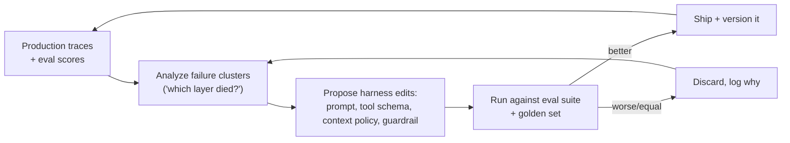
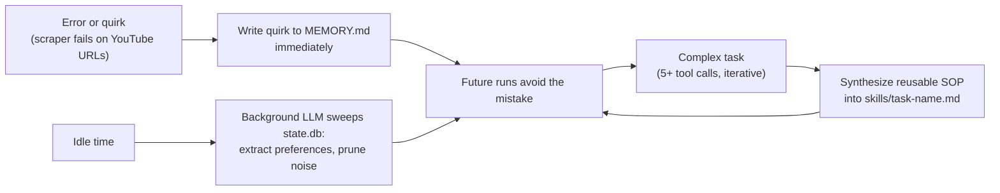
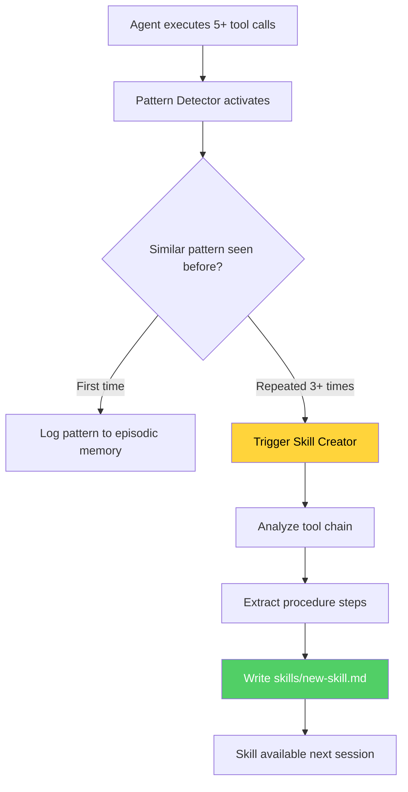

> **Learning goals:** Close the hill-climbing loop safely; know what the Salty Lesson means for agent design; name and pay down the three debts; build a Hermes-style self-improvement cycle; keep humans accountable with oversight controls.
> **Prerequisites:** [Lesson 21 - Loop engineering](../21-loop-engineering/), [Lesson 38 - Agent runtime and LLMOps](../agent-runtime-and-llmops/)

## The hill-climbing loop: the agent improves its own harness

The fourth loop in the hierarchy does not change the *task* - it changes the *system that does the task*. It is how a worker gets better without you rewriting prompts by hand.

Safety rules for self-editing systems, learned the hard way:

- **Change one layer at a time** (prompt *or* context policy *or* guardrail) so you can attribute the effect.
- **Never let the loop edit its own eval suite** - the fox guards the henhouse.
- **Version everything**; every harness edit is reviewable and revertible.
- **Humans own the merge button** until the loop has a long track record.

## The Salty Lesson

The Bitter Lesson says general methods that scale with compute beat hand-crafted heuristics. Its agent-era adaptation - the **Salty Lesson** - goes further: *agentic systems scale with more context, more tools, more loops and more time*, so design decisions that assume a single clever prompt keep losing to systems that let the model grind.

Practical consequences:

| Salty Lesson | What to do |
|---|---|
| More context beats cleverer phrasing | Improve retrieval and memory before prompt tricks |
| More loops beat one perfect attempt | Add verifier loops instead of "getting it right" |
| More tools beat one over-loaded tool | Small, focused tools over mega-tools |
| More time beats tighter budgets | Budget for retries; cap only runaway cases |
| The harness is the moat | Invest in memory, tools, evals - not prompt poetry |

## The three debts (and cognitive surrender)

Every agent-built system accumulates debt that does not show up in the diff:

| Debt | What it is | Symptom | Payment |
|---|---|---|---|
| **Comprehension debt** | Nobody fully understands the code/agent | "It works, don't touch it" | Read + document critical paths |
| **Intent debt** | Nobody remembers *why* it works that way | Decisions get reversed blindly | Decision records in the brain (lesson 29) |
| **Unverified code debt** | Outputs accepted without checking | Silent regressions | Evals, reviews, pre-code contracts |

**Cognitive surrender** is the psychological version: accepting the agent's answer because it is fluent. The antidote is institutional, not personal - require verification artifacts (sources, tests, diffs) rather than trusting tone.

## The Hermes loop: self-improvement without fine-tuning

Hermes (Nous Research) shows what a disciplined self-improving harness looks like on a local machine:

Three phases, all without touching model weights:

1. **Observation & quirk learning** - failures become durable notes the moment they happen.
2. **Autonomous skill creation** - after a genuinely iterative task, the agent writes the SOP it wishes it had.
3. **Idle-time distillation** - background models mine history for preferences and prune noise.

### Proactive Skill Creator

The **Proactive Skill Creator** is an autonomous background routine that monitors the agent's tool-call chains during execution. When it detects:

- 5+ sequential tool calls following a similar pattern
- Repeated multi-step workflows across sessions
- User corrections that could be codified

...it automatically synthesizes a reusable Standard Operating Procedure (SOP) as a markdown file in `skills/*.md`. The SOP captures:

- The step-by-step procedure
- Required tools and their parameters
- Success/failure criteria
- Edge cases observed

This transforms tacit knowledge (observed patterns) into explicit procedural memory — the agent literally writes its own documentation.

### Idle-time distillation

During periods when the agent is not actively serving requests, a background worker (using a cheaper/smaller model) mines `state.db` episodic logs to:

- Extract user preferences and patterns
- Prune redundant or outdated facts from `MEMORY.md`
- Consolidate repeated corrections into permanent skills

This is the agent's 'dreaming' phase — learning while idle to improve its future performance without blocking real-time user requests.

## Oversight: the controls that keep autonomy honest

| Control | Implementation | Answers |
|---|---|---|
| Approval gates | Human confirms destructive/irreversible actions | "Who said yes?" |
| Audit trail | Append-only event log ([Lesson 34](../knowledge-graphs-and-typed-edges/)) | "What did it do, when?" |
| Bias & fairness checks | Eval suites on protected attributes and edge populations | "Who could this harm?" |
| Transparency | Citations, paths walked, confidence flags | "Why does it believe that?" |
| Accountability | A named human owner per worker | "Who is responsible?" |
| Kill switch | One command stops all workers | "How do we stop it now?" |

Oversight is not the opposite of autonomy - it is what makes autonomy *deployable*. See [Lesson 10](../10-guardrails-and-safety/) for the mechanics.

## What the return arrow is allowed to touch

The hill-climbing loop edits the system, so define its blast radius explicitly:

| Editable by the loop | Human-only | Never |
|---|---|---|
| Prompt wording and structure | Eval rubrics and golden sets | Safety guardrails |
| Context policy (window sizes, offload rules) | Model choice and budget tiers | Audit logging |
| Tool descriptions and schemas | Anything touching money or PII | Approval requirements |
| Skills and SOPs | Deployment permissions | Kill-switch logic |

Two classic self-improvement failures to design against: **reward hacking** (the loop optimizes the metric instead of the goal - e.g., shortening answers to raise a "conciseness" score) and **eval gaming** (the loop learns the eval's quirks). Defenses: rotate hidden test cases, keep a human-owned holdout set, and score *outcomes* (did the refund get processed correctly?) rather than *shapes* (does the output look nice?).

## Bias, fairness and transparency in agent systems

| Source of bias | Where it enters | Check |
|---|---|---|
| Training data | The model's priors | Probe with paired counterfactuals |
| Retrieval corpus | Your docs and memories | Audit corpus diversity |
| Evaluator (LLM judge) | Scoring preferences | Calibrate judge against humans |
| Automation bias | Humans trusting fluent output | Require verification artifacts |
| Feedback loops | Prior outputs become future context | Deduplicate and expire memory |

Fairness checks that actually run: **paired counterfactual evals** (same claim, different names/regions - same outcome?), edge-population testing (small groups, unusual cases), distribution monitoring on decisions, and a documented escalation path when the checks fail. Transparency means citations, paths walked and confidence flags; accountability means a named human owner per worker and an incident process - the same posture regulators now expect from consequential AI systems.

## A week in the life of a hill-climbing worker

| Day | Activity | Artifact |
|---|---|---|
| Mon | Collect 200 traces, cluster failures | Failure report |
| Tue | Diagnose: 60% of failures are stale retrieval | Layer attribution |
| Wed | Propose context policy edit (recency boost) | Versioned diff |
| Thu | Run eval suite + Turn-11 probe | Green: no regressions |
| Fri | Ship, monitor, write the decision record | Changelog + why |

One change, one owner, one artifact trail - that is what makes self-improvement trustworthy instead of spooky.

## Common pitfalls

| Pitfall | Symptom | Fix |
|---|---|---|
| Loop edits too much at once | Cannot attribute improvement | One layer per change |
| Metric worship | Quality drops while scores rise | Outcome-based evals + holdout |
| Unreviewed autonomy creep | Agent gains powers nobody voted for | Explicit permission list |
| Debt accumulation | Nobody understands the system | Pay down comprehension debt weekly |
| Silent prompt drift | Behavior changes, no changelog | Version + decision records |

## Key takeaways

1. Self-improvement is a loop over *traces*, with human-owned guardrails and versioned changes.
2. The Salty Lesson: scale context, loops and tools - not prompt cleverness.
3. Comprehension, intent and unverified-code debt are the real price of autonomy; pay them deliberately.
4. Oversight (gates, audits, fairness checks, named owners) is what makes autonomy deployable.

## Further reading

- [Sutton - The Bitter Lesson](http://www.incompleteideas.net/IncIdeas/BitterLesson.html)
- [NIST AI Risk Management Framework](https://www.nist.gov/itl/ai-risk-management-framework)
- [Hermes Agent (Nous Research)](https://github.com/NousResearch/hermes-agent)

---

[Previous Lesson: Agent runtime and LLMOps](../agent-runtime-and-llmops/) | [Next Lesson: Tooling and frameworks →](../agent-tooling-and-frameworks/)

