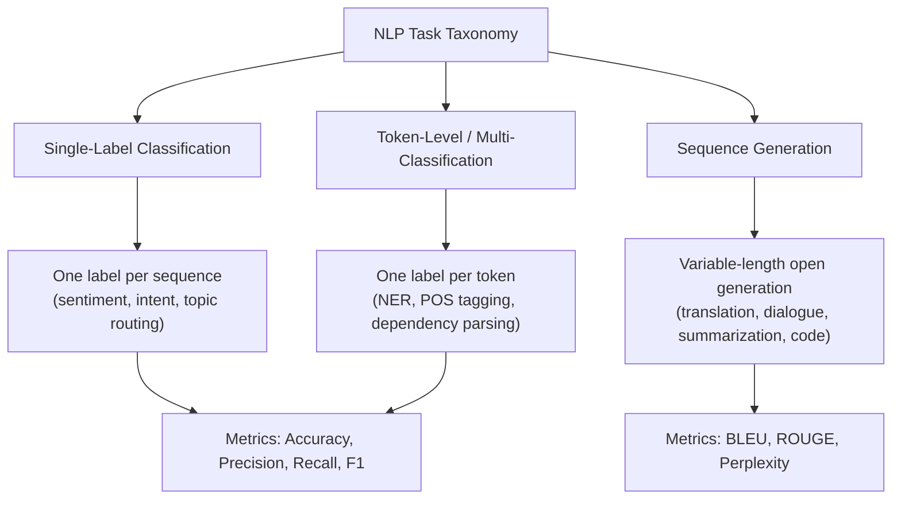
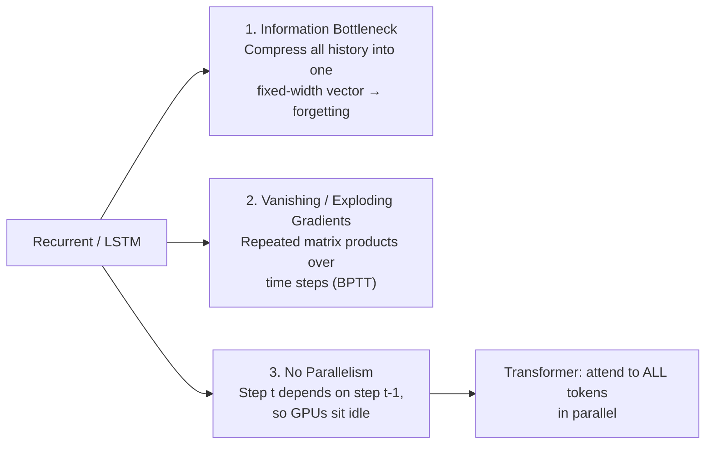
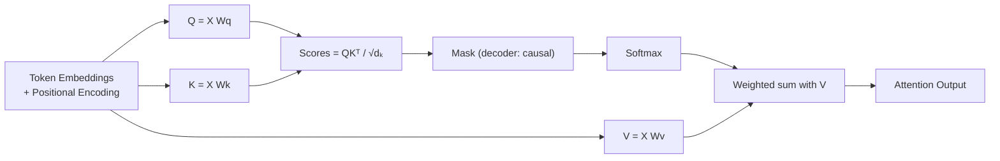
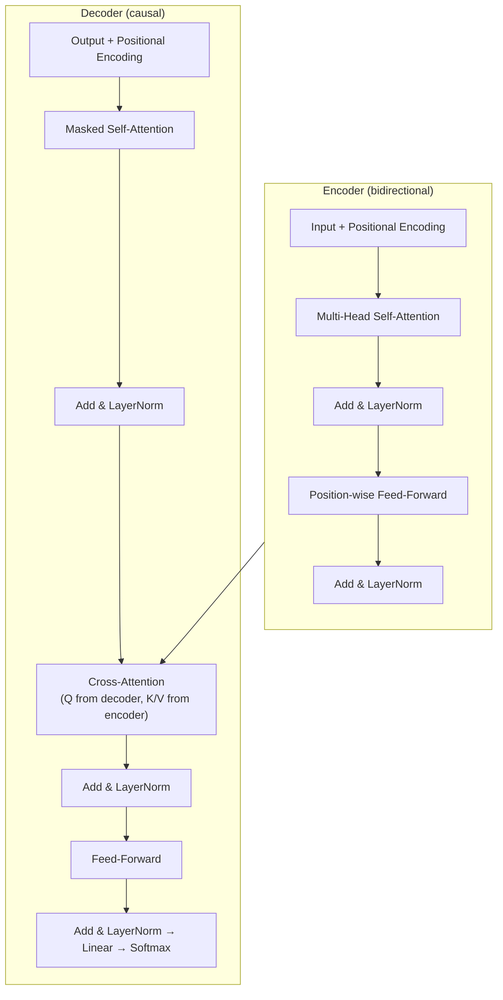

> **Stanford CME 295: Transformers & Large Language Models** — Lecture 1
> **Instructors:** Afshine Amidi & Shervine Amidi.

Every modern LLM — GPT, Claude, Gemini, Llama, DeepSeek — descends from a single 2017 paper: *Attention Is All You Need* (Vaswani et al.). This foundational lesson builds that architecture from first principles: how text becomes vectors, why recurrence was abandoned, and how **scaled dot-product attention** makes training parallelizable.

---

## Learning Objectives

By the end of this lesson you will be able to:

1. **Classify NLP tasks** into single-label classification, token-level tagging, and sequence generation, and choose the right evaluation metric for each.
2. **Compare tokenization strategies** (word-level, sub-word BPE/WordPiece, character-level) and explain the vocabulary/length trade-off.
3. **Explain why RNNs and LSTMs fail** at scale: information bottleneck, vanishing/exploding gradients, and lack of parallelism.
4. **Derive and implement scaled dot-product attention**, including *why* the $1/\sqrt{d_k}$ factor is necessary for stable softmax gradients.
5. **Assemble the full encoder-decoder Transformer**: multi-head attention, positional encoding, causal masking, cross-attention, and label smoothing.

---

## NLP Tasks and Their Metrics

Before architecture, we need a map of what these models are asked to do. CME 295 groups NLP into three families:



### Classification metrics

- **Accuracy:** intuitive but misleading under class imbalance (99% "not fraud" is a trivial majority classifier).
- **Precision:** $\frac{TP}{TP + FP}$ — of everything you flagged positive, how much really was.
- **Recall:** $\frac{TP}{TP + FN}$ — of everything truly positive, how much you caught.
- **F1 Score:** the harmonic mean, balancing both:

$$\text{F1} = 2 \cdot \frac{P \cdot R}{P + R}$$

### Generation metrics

- **BLEU:** n-gram *precision* with a brevity penalty (translation).
- **ROUGE:** n-gram *recall* suite (summarization).
- **Perplexity:** $\exp(\text{Cross-Entropy Loss})$ — the model's effective uncertainty; lower is better.

---

## From Text to Vectors

### Tokenization strategies

A model cannot read strings; it reads integer token IDs. The tokenizer choice drives vocabulary size $V$ and sequence length $T$ — two quantities that dominate memory and compute.

| Strategy | Vocabulary $V$ | Sequence length | Strengths | Weaknesses |
|---|---|---|---|---|
| **Word-level** | ~$10^6$ | Short | Intuitive | Huge $V$, no morphology sharing ("bear" vs "bears"), many OOV tokens |
| **Sub-word (BPE / WordPiece)** | 30k–100k | Medium | Balances both; handles rare words compositionally | Industry standard, minor segmentation quirks |
| **Character-level** | ~100 | Very long | Zero OOV, robust to typos | Sequence blows up; characters carry no semantic prior |

Special tokens frame every sequence: `<BOS>` / `<s>` (begin), `<EOS>` / `</s>` (end), `<UNK>` (unknown).

### Word embeddings

**One-hot encoding (OHE)** maps each word to a $V$-dimensional basis vector. Every vector is orthogonal to every other ($\cos\theta = 0$), so semantic similarity is impossible to represent.

**Distributed embeddings** (Word2Vec, Mikolov 2013) instead learn a dense space $\mathbb{R}^d$ with $d \ll V$:

- **CBOW:** predict the center token from its context window.
- **Skip-Gram:** predict context tokens from the center token.
- The *proxy task* is self-supervised — the useful artifact is the learned weight columns, not the prediction itself.

The famous payoff is **vector arithmetic** capturing analogy:

$$\vec{v}_{\text{King}} - \vec{v}_{\text{Man}} + \vec{v}_{\text{Woman}} \approx \vec{v}_{\text{Queen}}$$

---

## Why Recurrence Failed

Before Transformers, sequence models were recurrent: a hidden state updated one step at a time,

$$h_t = f(h_{t-1}, x_t)$$

RNNs and LSTMs suffer from three fatal flaws:



**Bahdanau et al. (2014)** introduced attention as a soft, dynamic link between decoder steps and all encoder states — the direct precursor to the Transformer.

---

## Scaled Dot-Product Attention

The Transformer discards recurrence entirely. Its atomic operation is:

$$\text{Attention}(Q, K, V) = \text{softmax}\left(\frac{QK^T}{\sqrt{d_k}}\right)V$$

The three matrices are projections of the input:

- **Query ($Q$):** what a token is searching for.
- **Key ($K$):** the label/index of what each token contains.
- **Value ($V$):** the actual semantic content retrieved.

The attention matrix $QK^T$ scores every token against every other token; softmax turns scores into weights; multiplying by $V$ produces a weighted summary. This is why every token can "see" every other token in **one parallel matrix multiplication**.

### Why divide by $\sqrt{d_k}$?

As dimension $d_k$ grows, dot products between roughly independent vectors grow in magnitude (variance scales with $d_k$). Large logits push the softmax into a **saturated region** where gradients are near-zero, stalling learning. Dividing by $\sqrt{d_k}$ rescales the logits to unit variance, keeping gradients healthy.

### Multi-head attention

A single attention head has one geometric "view." Multi-head attention runs $h$ of them in parallel subspaces:

$$\text{MultiHead}(Q, K, V) = \text{Concat}(\text{head}_1, \dots, \text{head}_h)W^O$$
$$\text{head}_i = \text{Attention}(QW_i^Q,\; KW_i^K,\; VW_i^V)$$

This is analogous to multiple convolution kernels in a CNN — each head can specialize (syntax, coreference, position, etc.).



### Positional encoding

Self-attention is **permutation-invariant** — it has no inherent notion of order. Sinusoidal positional encodings of varying frequencies are *added* to token embeddings so the model can recover position:

$$PE_{(pos, 2i)} = \sin\!\left(\frac{pos}{10000^{2i/d_{\text{model}}}}\right), \qquad PE_{(pos, 2i+1)} = \cos\!\left(\frac{pos}{10000^{2i/d_{\text{model}}}}\right)$$

---

## The Full Encoder-Decoder



- **Encoder:** bidirectional self-attention + feed-forward — every token sees every other token.
- **Decoder:** *masked* causal self-attention (a lower-triangular mask prevents looking ahead) + **cross-attention** into the encoder + feed-forward.
- **Label smoothing:** dampens target confidence by a small $\epsilon$ to prevent overconfident output distributions.

---

## Production Python: Scaled Dot-Product Attention

A numerically stable, masked multi-head attention implemented from scratch in PyTorch.

```python
"""
attention.py
Scaled dot-product attention from scratch, matching "Attention Is All You Need".
Includes causal masking and the numerically stable softmax trick.
"""
from __future__ import annotations

import math
import torch
import torch.nn as nn
import torch.nn.functional as F


def scaled_dot_product_attention(
    query: torch.Tensor,   # (B, H, Tq, d_k)
    key: torch.Tensor,     # (B, H, Tk, d_k)
    value: torch.Tensor,   # (B, H, Tk, d_v)
    mask: torch.Tensor | None = None,  # (Tq, Tk) or broadcastable, 1 = keep, 0 = mask
) -> tuple[torch.Tensor, torch.Tensor]:
    """Return (output, attention_weights)."""
    d_k = query.size(-1)

    # 1. Raw scores QK^T / sqrt(d_k)
    scores = torch.matmul(query, key.transpose(-2, -1)) / math.sqrt(d_k)

    # 2. Apply mask by setting masked positions to -inf BEFORE softmax
    if mask is not None:
        scores = scores.masked_fill(mask == 0, float("-inf"))

    # 3. Stable softmax (PyTorch subtracts the max internally)
    attn = F.softmax(scores, dim=-1)

    # 4. Weighted sum over values
    out = torch.matmul(attn, value)
    return out, attn


class MultiHeadAttention(nn.Module):
    def __init__(self, d_model: int = 512, num_heads: int = 8) -> None:
        super().__init__()
        assert d_model % num_heads == 0, "d_model must be divisible by num_heads"
        self.d_model = d_model
        self.num_heads = num_heads
        self.d_k = d_model // num_heads

        self.w_q = nn.Linear(d_model, d_model)
        self.w_k = nn.Linear(d_model, d_model)
        self.w_v = nn.Linear(d_model, d_model)
        self.w_o = nn.Linear(d_model, d_model)

    def forward(
        self,
        query: torch.Tensor,
        key: torch.Tensor,
        value: torch.Tensor,
        causal: bool = False,
    ) -> torch.Tensor:
        B, Tq, _ = query.shape
        Tk = key.size(1)

        # Linear projections -> (B, T, d_model) -> (B, H, T, d_k)
        Q = self.w_q(query).view(B, Tq, self.num_heads, self.d_k).transpose(1, 2)
        K = self.w_k(key).view(B, Tk, self.num_heads, self.d_k).transpose(1, 2)
        V = self.w_v(value).view(B, Tk, self.num_heads, self.d_k).transpose(1, 2)

        # Optional causal (lower-triangular) mask for the decoder
        mask = None
        if causal:
            mask = torch.tril(torch.ones(Tq, Tk, device=query.device))

        out, _ = scaled_dot_product_attention(Q, K, V, mask)

        # Recombine heads: (B, H, Tq, d_k) -> (B, Tq, d_model)
        out = out.transpose(1, 2).contiguous().view(B, Tq, self.d_model)
        return self.w_o(out)


if __name__ == "__main__":
    torch.manual_seed(0)
    mha = MultiHeadAttention(d_model=512, num_heads=8)
    x = torch.randn(2, 10, 512)
    y = mha(x, x, x, causal=True)
    print("Output shape:", y.shape)  # (2, 10, 512)

    # Verify causality: position 0 cannot attend to the future.
    Q = torch.randn(1, 1, 4, 8)
    K = torch.randn(1, 1, 4, 8)
    V = torch.randn(1, 1, 4, 8)
    _, attn = scaled_dot_product_attention(
        Q, K, V, mask=torch.tril(torch.ones(4, 4))
    )
    print("Row 0 attention (only col 0 nonzero):", attn[0, 0, 0])
```

---

## Key Takeaways

| Concept | Formula / Idea | Why It Matters |
|---|---|---|
| Scaled dot-product attention | $\text{softmax}(QK^T/\sqrt{d_k})V$ | Lets every token attend to every other token in parallel |
| Scaling factor | $1/\sqrt{d_k}$ | Keeps softmax logits at unit variance → stable gradients |
| Multi-head attention | $\text{Concat}(\text{head}_1,\dots,\text{head}_h)W^O$ | Multiple representation subspaces per layer |
| Positional encoding | Sinusoids of varying frequency | Restores order to a permutation-invariant operation |
| Causal masking | Lower-triangular mask | Prevents the decoder from peeking at future tokens |
| Cross-attention | $Q$ from decoder, $K/V$ from encoder | Links generated output to the encoded input |

---

## Next Steps

We have the base architecture, but the 2017 blueprint has since been refined heavily. Next we explore the **architectural tricks** that made Transformers trainable at depth and efficient at long context: RoPE, ALiBi, RMSNorm, Pre-LN, KV cache, and Grouped-Query Attention.

[Next: Transformer-Based Models & Architectural Tricks →](/docs/ai-agents/agentic-ai/02-transformer-models-and-tricks)
