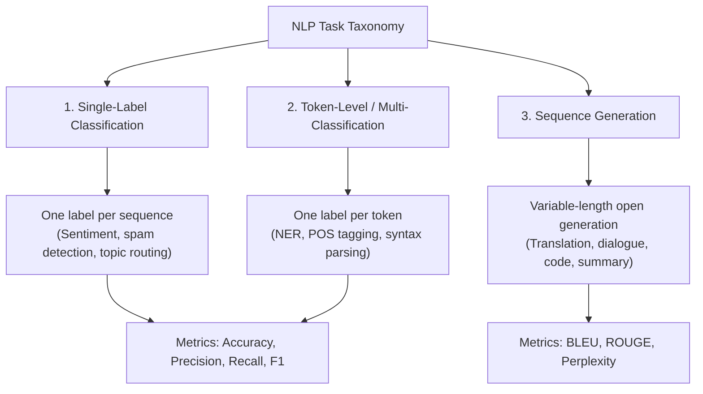
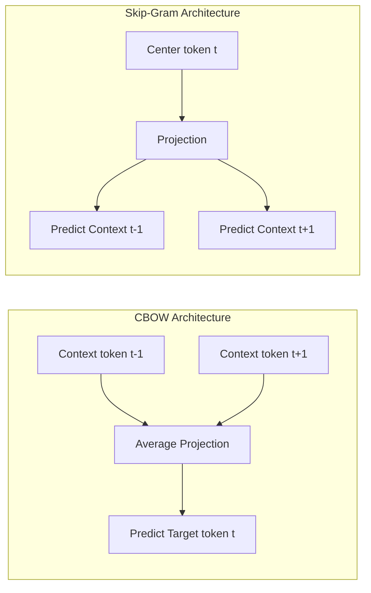
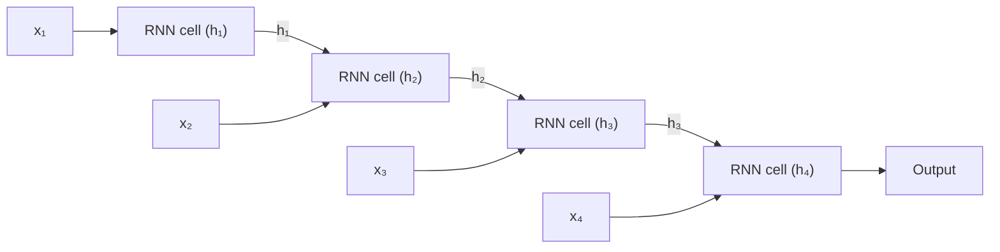
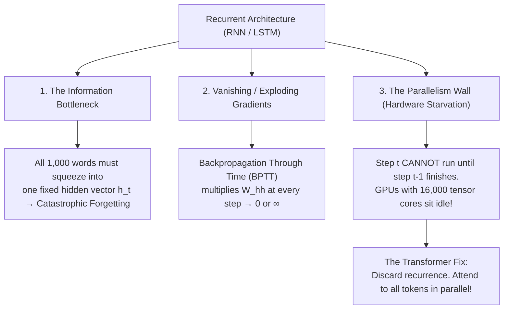
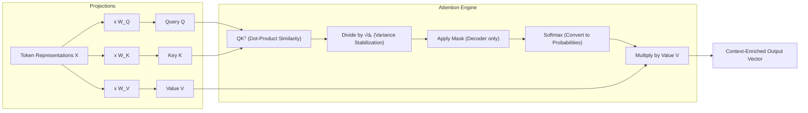
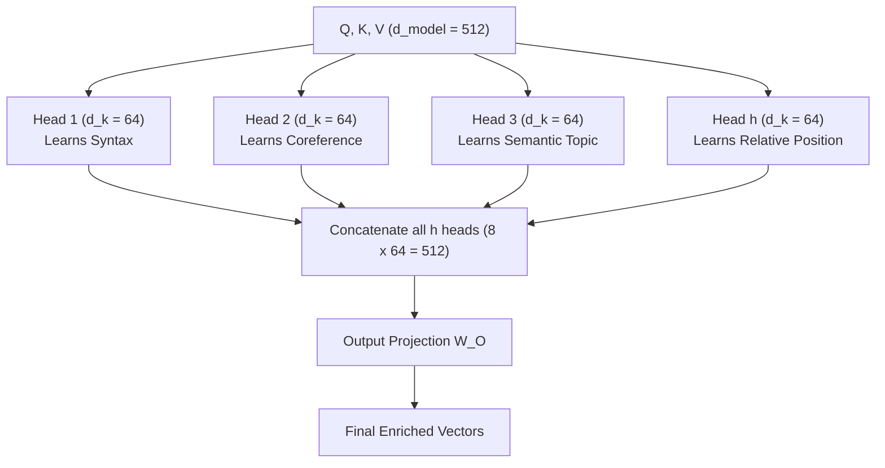
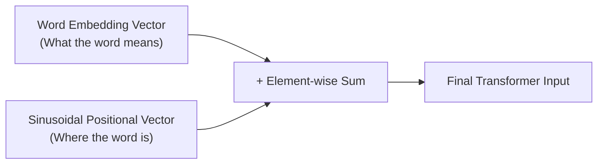
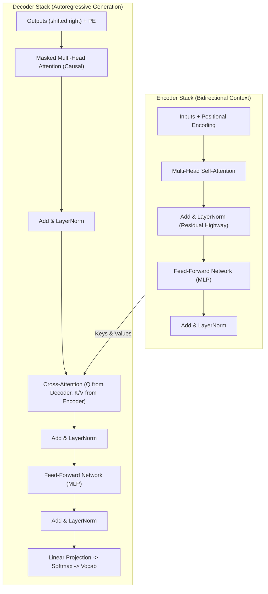

import { Callout } from 'fumadocs-ui/components/callout';
import { Tab, Tabs } from 'fumadocs-ui/components/tabs';
import { Accordion, Accordions } from 'fumadocs-ui/components/accordion';

> **Stanford CME 295: Transformers & Large Language Models** — Lecture 1  
> **Instructors:** Afshine Amidi & Shervine Amidi.

Every modern **LLM** (Large Language Model) — GPT, Claude, Gemini, Llama, DeepSeek — descends from a single 2017 paper: *Attention Is All You Need* (Vaswani et al.). This foundational lesson builds that architecture from first principles: how raw human language becomes numbers, why recurrence collapsed under its own weight, and how **scaled dot-product attention** enabled massively parallel neural computation.

---

## Learning Objectives

By the end of this lesson you will be able to:

1. **Classify NLP tasks** into single-label classification, token-level tagging, and sequence generation, and select mathematically sound evaluation metrics for each.
2. **Compare tokenization strategies** (word-level, sub-word BPE/WordPiece, character-level) and evaluate the vocabulary-size vs. sequence-length trade-off.
3. **Diagnose why RNNs and LSTMs failed** at scale: the fixed-vector information bottleneck, vanishing/exploding gradients via BPTT, and lack of hardware parallelization.
4. **Derive and implement scaled dot-product attention**, explaining both mathematically and intuitively why the $1/\sqrt{d_k}$ normalization prevents softmax gradient vanishing.
5. **Assemble the full encoder-decoder Transformer**: multi-head attention subspaces, sinusoidal positional encodings, causal masking, cross-attention, and label smoothing regularization.

---

## 1. NLP Tasks and Their Metrics

### The Problem: How Do We Frame Language for Machines?

Human language is messy, highly contextual, and ambiguous. A machine cannot optimize an arbitrary string of characters without a clearly formulated loss function and objective. Before writing code or designing layers, we must categorize what sequence modeling actually demands.

CME 295 groups all Natural Language Processing (**NLP**) into three foundational families:



### Physical Analogy

- **Single-label classification:** Like sorting incoming postal mail into 3 bins: "Bills", "Personal Letters", "Junk Mail". One stamp per entire envelope.
- **Token-level classification:** Like a proofreader running through a sentence with colored highlighters: marking names in yellow, dates in green, and verbs in blue.
- **Sequence generation:** Like an author hearing a question and writing a brand new paragraph from scratch, token by token.

---

### Classification Metrics

When evaluating classification, picking the wrong metric creates disastrous illusions of performance:

- **Accuracy:** The ratio of correct predictions over total predictions:
  $$\text{Accuracy} = \frac{TP + TN}{TP + TN + FP + FN}$$
  <Callout type="warn">
  **The Imbalance Trap:** In credit card fraud detection where 99.9% of transactions are legitimate, a model that classifies *every single transaction* as legitimate achieves 99.9% accuracy while catching zero fraud. Never use accuracy on imbalanced datasets.
  </Callout>

- **Precision:** Of everything the model claimed was positive, what fraction truly was?
  $$\text{Precision} = \frac{TP}{TP + FP}$$
  *Use when False Positives are expensive* (e.g., spam filter sending crucial work contracts to spam).

- **Recall (Sensitivity):** Of all the truly positive cases in the world, what fraction did the model catch?
  $$\text{Recall} = \frac{TP}{TP + FN}$$
  *Use when False Negatives are catastrophic* (e.g., cancer diagnosis or intrusion detection).

- **F1 Score:** The harmonic mean that penalizes models with extreme trade-offs:
  $$\text{F1} = 2 \cdot \frac{P \cdot R}{P + R} = \frac{2 \cdot TP}{2 \cdot TP + FP + FN}$$

---

### Generation Metrics

Sequence generation outputs variable-length text, making simple accuracy meaningless (there are thousands of valid ways to translate a sentence):

- **BLEU (Bilingual Evaluation Understudy):** Measures n-gram *precision* between machine output and human references, penalizing outputs that are too short via a **Brevity Penalty (BP)**. Heavily used in machine translation.
- **ROUGE (Recall-Oriented Understudy for Gisting Evaluation):** Measures n-gram *recall*. Did the summary capture the key phrases present in the reference text?
- **Perplexity (PPL):** The exponential of the average negative log-likelihood (cross-entropy loss):
  $$\text{PPL} = \exp\left(-\frac{1}{N}\sum_{i=1}^{N} \log P(w_i \mid w_{<i})\right)$$
  **Intuition:** Perplexity represents the *effective branching factor* of the model. A perplexity of 10 means the model is, on average, as confused as if it had to choose uniformly among 10 candidate words at each step. Lower is strictly better.

<Accordions>
<Accordion title="🧠 Retrieval Check: Accuracy vs. F1 in Medical Triage">
**Question:** You are building an emergency alert model where missing a stroke patient ($FN$) is fatal, but false alarms ($FP$) simply lead to a 30-second nurse review. Should you optimize for Precision, Recall, or Accuracy?

<details>
<summary>Click to view solution</summary>

**Answer: Recall.**  
Because $FN$ represents an undetected stroke, the denominator $TP + FN$ must minimize $FN$ to near zero. A high recall guarantees that virtually every real patient is caught, even if precision is slightly lower.
</details>
</Accordion>
</Accordions>

---

## 2. From Text to Vectors

Computers cannot perform matrix multiplications on strings like `"apple"` or `"neural"`. We must convert strings into integer tokens, and integer tokens into continuous high-dimensional vectors.

### The Naive Attempt: Word-Level Dictionaries

**The Attempt:** Assign every unique word in the English language an integer ID (`"cat" -> 42`, `"dog" -> 43`).  
**The Breaking Point:**
1. **Vocabulary Explosion:** English has millions of words, technical terms, and typos. Your vocabulary size $V$ balloons past $10^6$, requiring immense embedding matrices.
2. **Out-of-Vocabulary (OOV) Catastrophe:** Any word not in the training dictionary becomes an uninformative `<UNK>` token. If someone writes `"cat-like"`, the model is blind to it.
3. **No Morphological Sharing:** `"run"`, `"running"`, and `"runner"` receive completely independent IDs with zero structural relation.

### The Opposite Naive Attempt: Character-Level

**The Attempt:** Split text strictly into individual characters (`'c'`, `'a'`, `'t'`).  
**The Breaking Point:**
Vocabulary size is tiny ($V \approx 100$), but sequence length blows up by $5\times\text{--}8\times$. Because attention computes interactions between all tokens ($O(N^2)$), an 8,000-character article requires $64,000,000$ operations instead of $1,000,000$ operations. Furthermore, individual letters carry almost no semantic meaning on their own.

---

### The Production Solution: Sub-Word Tokenization (BPE & WordPiece)

Modern LLMs use **Byte-Pair Encoding (BPE)** or **WordPiece**. They begin with a character vocabulary and iteratively merge the most frequently occurring adjacent pairs into new subword units.

```
Iterative Merges:
"l" + "o" -> "lo"
"lo" + "w" -> "low"
"low" + "e" + "r" -> "lower"
```

| Strategy | Vocabulary $V$ | Sequence Length | Strengths | Failure Mode / Weakness |
|---|---|---|---|---|
| **Word-level** | $\sim 10^6$ | Short | Highly intuitive | Massive $V$, frequent `<UNK>` tokens, zero morphology sharing |
| **Sub-word (BPE / WordPiece)** | $30\text{k}\text{--}100\text{k}$ | Moderate | Balances memory and sequence length; breaks rare words into chunks | Minor segmentation quirks; language bias towards English |
| **Character-level** | $\sim 100$ | Very long | Zero OOV; robust to typos | Exploding sequence length; characters lack semantic priors |

**Special Tokens:**
- `<s>` or `<BOS>`: Beginning of Sequence marker.
- `</s>` or `<EOS>`: End of Sequence marker (tells autoregressive models when to stop generating).
- `<UNK>`: Unknown token.
- `<PAD>`: Padding token for batch tensor alignment.

---

### Word Embeddings: Escaping the Orthogonal Trap

Once words are token IDs, how do we represent them geometrically?

#### The Naive Attempt: One-Hot Encoding (OHE)

Map token $i$ to a vector of length $V$ containing a $1$ at index $i$ and $0$ everywhere else.

$$\vec{v}_{\text{cat}} = [1, 0, 0, \dots, 0]^T, \quad \vec{v}_{\text{kitten}} = [0, 1, 0, \dots, 0]^T$$

**The Breaking Point:**  
The dot product between any two distinct one-hot vectors is identically zero:
$$\vec{v}_{\text{cat}} \cdot \vec{v}_{\text{kitten}} = 0 \implies \cos(\theta) = 0 \quad (\theta = 90^\circ)$$
Every single concept is completely orthogonal to every other concept. The geometry implies `"cat"` is just as unrelated to `"kitten"` as it is to `"refrigerator"`.

---

#### The Solution: Distributed Embeddings (Word2Vec)

Instead of sparse basis vectors of length $V$, map each token to a continuous dense vector in $\mathbb{R}^d$ where $d \ll V$ (typically $d \in [512, 4096]$).

Mikolov et al. (2013) demonstrated that by training a shallow neural network on an auxiliary **proxy task**, the learned weight columns naturally organize into a semantic vector space:

- **Continuous Bag-of-Words (CBOW):** Predict the target center token given surrounding context words.
- **Skip-Gram:** Predict the surrounding context words given the center target token.



**The Geometric Payoff:**  
Semantic relationships correspond to spatial displacements:

$$\vec{v}_{\text{King}} - \vec{v}_{\text{Man}} + \vec{v}_{\text{Woman}} \approx \vec{v}_{\text{Queen}}$$

The vector direction $\vec{v}_{\text{Man}} \to \vec{v}_{\text{Woman}}$ encodes the concept of gender across all noun pairs.

---

## 3. Why Recurrence Failed

Before 2017, the undisputed kings of sequential deep learning were **Recurrent Neural Networks (RNNs)** and **Long Short-Term Memory networks (LSTMs)**.

A recurrent model processes an input sequence sequentially, passing a hidden state forward one step at a time:

$$h_t = f(W_{hh} h_{t-1} + W_{xh} x_t + b)$$



### The Three Fatal Walls of Recurrence



#### 1. The Information Bottleneck
Imagine reading an entire 300-page book and being required to summarize it in exactly 512 floating-point numbers before answering questions about page 3. By the time the RNN reaches step 1,000, early tokens are overwritten and forgotten.

#### 2. Vanishing and Exploding Gradients (BPTT)
During **Backpropagation Through Time (BPTT)**, computing the gradient of the loss at step $T$ with respect to the hidden state at step $1$ requires multiplying the recurrent weight matrix $W_{hh}$ repeatedly:

$$\frac{\partial h_T}{\partial h_1} = \prod_{k=2}^{T} \frac{\partial h_k}{\partial h_{k-1}} = \prod_{k=2}^{T} W_{hh}^T \text{diag}(f'(z_k))$$

- If the largest eigenvalue of $W_{hh} < 1$, the gradient shrinks exponentially to zero (model cannot learn long-range connections).
- If the largest eigenvalue of $W_{hh} > 1$, the gradient explodes to infinity (numerical overflow / `NaN`).

#### 3. The Parallelism Wall (Hardware Starvation)
This was the ultimate killer. Modern GPUs (like NVIDIA A100/H100) are massive matrix-multiplication machines featuring tens of thousands of arithmetic cores. An RNN is fundamentally sequential: **Step $t=100$ cannot compute until Step $t=99$ has finished.** As a result, GPUs sat at ~5% utilization during training.

**Bahdanau et al. (2014)** introduced attention as an auxiliary bridge between an RNN decoder and all encoder steps. In 2017, Vaswani et al. asked: *What if we throw away the RNN completely and keep only the attention?*

---

## 4. Scaled Dot-Product Attention: The Library Search Mechanism

The core engine of the Transformer is **Scaled Dot-Product Attention**:

$$\text{Attention}(Q, K, V) = \text{softmax}\left(\frac{QK^T}{\sqrt{d_k}}\right)V$$

### The Intuitive Physical Analogy: The Research Library

Think of a research library containing millions of books:

1. **Query ($Q$):** The topic you write on your notepad (e.g., *"How do solar flares affect GPS satellites?"*).
2. **Key ($K$):** The Dewey Decimal subject labels on the spine of every book in the library.
3. **Value ($V$):** The actual text, facts, and knowledge printed inside the pages of each book.

**The Mechanical Steps:**
1. **Match ($QK^T$):** You compare your Query against every single Key (spine). The dot product produces a similarity score for every book.
2. **Scale & Normalize ($\text{softmax}(QK^T / \sqrt{d_k})$):** You convert raw similarity scores into percentage weights between $0.0$ and $1.0$ that sum to $1.0$. Highly relevant books receive $0.85$, irrelevant books receive $0.0001$.
3. **Retrieve ($\sum \text{weight} \cdot V$):** You extract a blended synthesis of the contents ($V$) weighted strictly by relevance!



---

### Why Divide by $\sqrt{d_k}$? The Variance Derivation

Why is the $\sqrt{d_k}$ divisor mandatory? Why not just use $QK^T$?

Suppose the elements of $q \in \mathbb{R}^{d_k}$ and $k \in \mathbb{R}^{d_k}$ are independent random variables with zero mean ($\mathbb{E}[q_i] = \mathbb{E}[k_i] = 0$) and unit variance ($\text{Var}(q_i) = \text{Var}(k_i) = 1$).

The dot product is the sum of $d_k$ products:
$$S = q \cdot k = \sum_{i=1}^{d_k} q_i k_i$$

The expected value is:
$$\mathbb{E}[S] = \sum_{i=1}^{d_k} \mathbb{E}[q_i]\mathbb{E}[k_i] = 0$$

The variance is:
$$\text{Var}(S) = \sum_{i=1}^{d_k} \text{Var}(q_i k_i) = \sum_{i=1}^{d_k} \left(\mathbb{E}[q_i^2]\mathbb{E}[k_i^2] - (\mathbb{E}[q_i]\mathbb{E}[k_i])^2\right) = \sum_{i=1}^{d_k} (1 \cdot 1 - 0) = d_k$$

$$\text{Standard Deviation}(S) = \sqrt{\text{Var}(S)} = \sqrt{d_k}$$

<Callout type="error">
**The Softmax Saturation Breakdown:**  
When head dimension $d_k = 64$, the standard deviation of raw dot products is $\sqrt{64} = 8$. For $d_k = 128$, it is $\sqrt{128} \approx 11.3$.  
When logits entering the softmax function are large ($> 10$), the softmax distribution becomes a sharp one-hot vector (e.g., $[0.00001, 0.99998, 0.00001]$).  
In this saturated regime, the derivative of softmax $\frac{\partial \text{softmax}(z_i)}{\partial z_j} = s_i(\delta_{ij} - s_j)$ is **virtually zero**. Gradients vanish completely during backpropagation, and training freezes!  
Dividing by $\sqrt{d_k}$ scales the variance back to $1.0$, keeping gradients in the steep, healthy region of the softmax curve.
</Callout>

---

## 5. Multi-Head Attention: Looking Through Multiple Lenses

A single attention head has only one set of $W_Q, W_K, W_V$ projection weights. It can only compute a single weighted average over values.

### The Problem
In the sentence:  
> *"The robotic rover analyzed the Martian rock because it detected basalt."*

A model needs to attend to multiple relationships simultaneously:
- **Coreference:** What does `"it"` refer to? (`"it"` $\to$ `"rover"`).
- **Causality:** Why did it analyze? (`"analyzed"` $\to$ `"because detected"`).
- **Direct Object:** What was analyzed? (`"analyzed"` $\to$ `"rock"`).

A single attention head would be forced to blur all these disparate linguistic relationships into a single compromise distribution.

### The Solution: Multi-Head Attention (MHA)

Instead of performing a single large attention operation of dimension $d_{\text{model}}$, project queries, keys, and values $h$ separate times with different learned linear projections to dimension $d_k = d_{\text{model}} / h$:

$$\text{MultiHead}(Q, K, V) = \text{Concat}(\text{head}_1, \dots, \text{head}_h)W^O$$
$$\text{head}_i = \text{Attention}(Q W_i^Q, K W_i^K, V W_i^V)$$



**Analogy:** Multi-head attention is directly analogous to using multiple convolution filters in a CNN (where one filter detects vertical edges, another detects horizontal edges, and another detects color gradients).

---

## 6. Positional Encoding: Restoring Order

### The Problem: Permutation Invariance

Notice the attention formula:
$$\text{Attention}(Q, K, V) = \text{softmax}\left(\frac{QK^T}{\sqrt{d_k}}\right)V$$

If you shuffle the input tokens into an arbitrary scrambled order, the attention weights change rows and columns in the exact same permutation. Self-attention has **zero intrinsic notion of word order**.

To self-attention:
- *"Dog bites man"*
- *"Man bites dog"*

yield the exact same set of un-ordered representations.

### The Solution: Sinusoidal Positional Encodings

Vaswani et al. added fixed sinusoidal waves of varying frequencies directly to the input token embeddings:

$$PE_{(pos, 2i)} = \sin\left(\frac{pos}{10000^{2i/d_{\text{model}}}}\right)$$
$$PE_{(pos, 2i+1)} = \cos\left(\frac{pos}{10000^{2i/d_{\text{model}}}}\right)$$

Where:
- $pos$ is the token's position in the sequence ($0, 1, 2, \dots$).
- $i$ is the dimension index within the embedding ($0 \le i < d_{\text{model}} / 2$).
- $10000^{2i/d_{\text{model}}}$ scales wavelengths from $2\pi$ to $10000 \cdot 2\pi$.



**The Mathematical Beauty:**
By using trigonometric identities:
$$\cos(\alpha + \beta) = \cos(\alpha)\cos(\beta) - \sin(\alpha)\sin(\beta)$$
$$\sin(\alpha + \beta) = \sin(\alpha)\cos(\beta) + \cos(\alpha)\sin(\beta)$$

For any fixed offset $k$, the positional encoding vector at position $pos + k$ can be represented as a **linear transformation** of the positional encoding at position $pos$. This enables the model to easily learn relative positions.

---

## 7. The Full Encoder-Decoder Transformer



### Critical Components Explained:

1. **Residual Connections (Add & Norm):**  
   Every sub-layer outputs $x + \text{Sublayer}(x)$. This residual connection prevents gradients from vanishing across hundreds of layers, providing an unimpeded gradient highway directly back to the inputs.
2. **Causal Masking (Look-Ahead Mask):**  
   In autoregressive generation, when the model generates word $t$, it must not peek at words $t+1, t+2$. We enforce this by setting future attention logits to $-\infty$ before softmax:
   $$\text{Mask}_{i,j} = \begin{cases} 0 & \text{if } j \le i \\ -\infty & \text{if } j > i \end{cases}$$
   $\exp(-\infty) = 0$, strictly preventing any information leakage from the future.
3. **Cross-Attention:**  
   The decoder's queries ($Q$) come from previous target tokens, while its keys ($K$) and values ($V$) come from the encoder's output. This allows the decoder to repeatedly query the entire source document during translation or summarization.
4. **Label Smoothing Regularization:**  
   Standard cross-entropy forces the target class probability to $1.0$ (which requires output logits of $+\infty$). Label smoothing distributes a small parameter $\epsilon$ (typically $0.1$) uniformly across all non-target tokens:
   $$y_k^{\text{smooth}} = (1 - \epsilon)y_k + \frac{\epsilon}{V}$$
   This penalizes overconfident predictions and improves generalization.

---

## 8. Production PyTorch Implementation

Here is a complete, numerically stable implementation of Multi-Head Attention featuring causal masking and the scaled dot-product attention formulation:

```python
"""
scaled_attention.py
Self-contained, production-grade Scaled Dot-Product and Multi-Head Attention in PyTorch.
Includes causal masking, projection splitting, and variance stabilization checks.
"""
from __future__ import annotations

import math
import torch
import torch.nn as nn
import torch.nn.functional as F


def scaled_dot_product_attention(
    query: torch.Tensor,               # Shape: (Batch, Heads, SeqLen_Q, d_k)
    key: torch.Tensor,                 # Shape: (Batch, Heads, SeqLen_K, d_k)
    value: torch.Tensor,               # Shape: (Batch, Heads, SeqLen_K, d_v)
    mask: torch.Tensor | None = None,  # Shape: (SeqLen_Q, SeqLen_K) or broadcastable
) -> tuple[torch.Tensor, torch.Tensor]:
    """Computes Attention(Q, K, V) = softmax(Q K^T / sqrt(d_k)) V.

    Returns:
        tuple[torch.Tensor, torch.Tensor]: (context_output, attention_weights)
    """
    d_k = query.size(-1)

    # 1. Compute raw dot-product scores: (B, H, Tq, d_k) @ (B, H, d_k, Tk) -> (B, H, Tq, Tk)
    scores = torch.matmul(query, key.transpose(-2, -1)) / math.sqrt(d_k)

    # 2. Masking: replace masked positions with -inf before softmax
    if mask is not None:
        scores = scores.masked_fill(mask == 0, float("-inf"))

    # 3. Softmax over the last dimension (Tk) to produce probability distributions
    # PyTorch's F.softmax is numerically stable (subtracts max internally)
    attention_weights = F.softmax(scores, dim=-1)

    # 4. Weighted aggregation of values: (B, H, Tq, Tk) @ (B, H, Tk, d_v) -> (B, H, Tq, d_v)
    output = torch.matmul(attention_weights, value)

    return output, attention_weights


class MultiHeadAttention(nn.Module):
    """Multi-Head Attention module conforming to 'Attention Is All You Need'."""

    def __init__(self, d_model: int = 512, num_heads: int = 8) -> None:
        super().__init__()
        assert d_model % num_heads == 0, "d_model must be divisible by num_heads"

        self.d_model = d_model
        self.num_heads = num_heads
        self.d_k = d_model // num_heads

        # Linear projections for Query, Key, Value, and Output
        self.w_q = nn.Linear(d_model, d_model, bias=False)
        self.w_k = nn.Linear(d_model, d_model, bias=False)
        self.w_v = nn.Linear(d_model, d_model, bias=False)
        self.w_o = nn.Linear(d_model, d_model, bias=False)

    def forward(
        self,
        query: torch.Tensor,
        key: torch.Tensor,
        value: torch.Tensor,
        causal: bool = False,
    ) -> torch.Tensor:
        batch_size, seq_len_q, _ = query.shape
        seq_len_k = key.size(1)

        # 1. Project inputs: (B, T, d_model) -> (B, T, H, d_k) -> (B, H, T, d_k)
        Q = self.w_q(query).view(batch_size, seq_len_q, self.num_heads, self.d_k).transpose(1, 2)
        K = self.w_k(key).view(batch_size, seq_len_k, self.num_heads, self.d_k).transpose(1, 2)
        V = self.w_v(value).view(batch_size, seq_len_k, self.num_heads, self.d_k).transpose(1, 2)

        # 2. Build causal mask if requested (lower-triangular matrix of 1s)
        mask = None
        if causal:
            mask = torch.tril(torch.ones(seq_len_q, seq_len_k, device=query.device))

        # 3. Compute scaled dot-product attention
        out, _ = scaled_dot_product_attention(Q, K, V, mask=mask)

        # 4. Concatenate heads back to d_model: (B, H, Tq, d_k) -> (B, Tq, H * d_k)
        out = out.transpose(1, 2).contiguous().view(batch_size, seq_len_q, self.d_model)

        # 5. Final linear projection W_O
        return self.w_o(out)


if __name__ == "__main__":
    torch.manual_seed(42)

    batch_size = 2
    seq_len = 5
    d_model = 64
    num_heads = 4

    mha = MultiHeadAttention(d_model=d_model, num_heads=num_heads)
    dummy_input = torch.randn(batch_size, seq_len, d_model)

    # Test causal autoregressive forward pass
    output = mha(dummy_input, dummy_input, dummy_input, causal=True)
    print("MultiHeadAttention Output Shape:", output.shape)
    assert output.shape == (batch_size, seq_len, d_model)

    # Verification of Causal Masking: Position 0 cannot attend to positions 1..4
    Q_toy = torch.randn(1, 1, 4, 8)
    K_toy = torch.randn(1, 1, 4, 8)
    V_toy = torch.randn(1, 1, 4, 8)
    causal_mask = torch.tril(torch.ones(4, 4))
    _, attn_weights = scaled_dot_product_attention(Q_toy, K_toy, V_toy, mask=causal_mask)

    print("\nAttention Matrix under Causal Mask (Row 0 must only have weight at Col 0):")
    print(attn_weights[0, 0].round(decimals=3))
```

---

## 9. Key Takeaways

| Concept | Mathematical Formulation | Intuitive Physical Meaning |
|---|---|---|
| **Sub-word Tokenization** | BPE / WordPiece Merges | Avoids the millions of word dictionary entries while preventing character explosion. |
| **Distributed Embeddings** | $\vec{v} \in \mathbb{R}^d, d \ll V$ | Words with similar meanings cluster together; vector math captures semantic analogies. |
| **The Recurrent Failure** | $h_t = f(h_{t-1}, x_t)$ | Squeezing an entire book into one vector creates an information bottleneck; serial steps starve GPUs. |
| **Scaled Attention** | $\text{softmax}(QK^T / \sqrt{d_k})V$ | Queries search Keys; Values return information in one single parallel matrix multiply. |
| **$\sqrt{d_k}$ Scaling** | Divisor $\sqrt{d_k}$ | Keeps logit variance at $1.0$, preventing softmax saturation and vanishing gradients. |
| **Multi-Head Attention** | $\text{Concat}(\text{head}_1,\dots)W^O$ | Lets the model track syntax, grammar, coreference, and semantics concurrently in separate geometric subspaces. |
| **Positional Encoding** | Multi-frequency sinusoids | Restores positional order to an inherently permutation-invariant attention mechanism. |
| **Causal Mask** | Mask upper triangle with $-\infty$ | Guarantees autoregressive generation cannot cheat by peeking into future tokens. |

---

## 10. Self-Check & Retrieval Practice

<Accordions>
<Accordion title="1. Why does unscaled attention stall training when d_k is large?">
**Question:** If we remove $\sqrt{d_k}$ when $d_k=128$, what happens to the softmax outputs and the backward pass gradients?

<details>
<summary>Click to view solution</summary>

**Explanation:**  
The variance of the dot products $QK^T$ scales with $d_k$. When $d_k = 128$, the standard deviation is $\sqrt{128} \approx 11.3$. Dot products regularly reach values like $+35$ or $-30$. When passed into $\text{softmax}$, the exponential of $+35$ dominates completely, turning the output into a one-hot distribution ($1.0$ for the max item, $0.0$ for all others).  
Because the derivative of softmax in saturated regions is $S_i(\delta_{ij} - S_j) \approx 0$, the backward gradient becomes virtually zero. The weights receive zero updates, completely halting training.
</details>
</Accordion>

<Accordion title="2. Permutation Invariance Test">
**Question:** If an input sequence of 10 tokens has its positions shuffled randomly before being fed into a self-attention layer *without* positional encodings, how does the output change?

<details>
<summary>Click to view solution</summary>

**Explanation:**  
The output tokens will be identical, but permuted in the exact same order as the input tokens! The self-attention operation treats the input as an un-ordered bag of vectors. Without positional encodings, the network cannot distinguish `"the dog bit the man"` from `"the man bit the dog"`.
</details>
</Accordion>

<Accordion title="3. Causal Masking Mechanics">
**Question:** During decoder training, why do we fill masked positions with $-\infty$ instead of $0$ before computing softmax?

<details>
<summary>Click to view solution</summary>

**Explanation:**  
Softmax takes the exponential of each input: $\exp(z_i) / \sum_j \exp(z_j)$.  
If you set the logit to $0$, $\exp(0) = 1.0$, which means masked tokens would receive non-zero attention probability and corrupt the weighted sum!  
Setting the logit to $-\infty$ ensures that $\exp(-\infty) = 0.0$, guaranteeing that future positions receive mathematically zero attention weight.
</details>
</Accordion>
</Accordions>

---

## Next Steps

We now have the foundational 2017 Transformer blueprint. However, vanilla attention is computationally expensive ($O(N^2)$ memory), sinusoidal encodings struggle with long-context extrapolation, and deep networks suffer from training instability. 

In the next lesson, we will uncover the **architectural breakthroughs and tricks** that made modern frontier LLMs possible: **Rotary Position Embeddings (RoPE)**, **RMSNorm**, **Pre-LN**, the **KV Cache**, and **Grouped-Query Attention (GQA)**.

[Next: Transformer-Based Models & Architectural Tricks →](/docs/ai-agents/agentic-ai/02-transformer-models-and-tricks)
