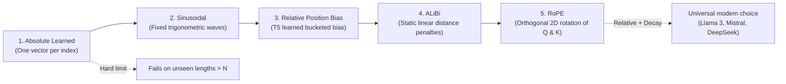
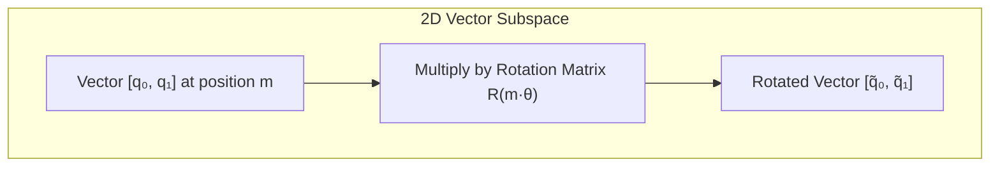
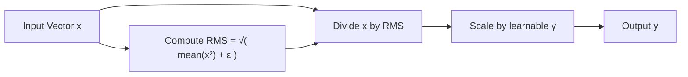
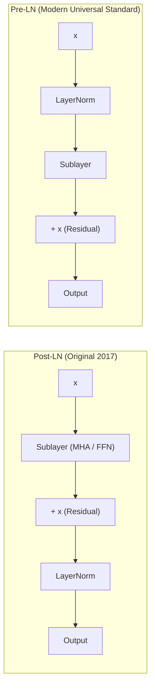
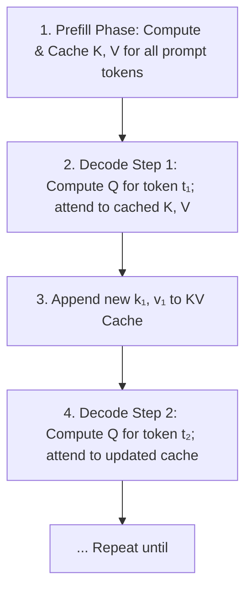
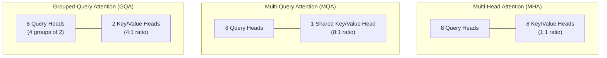
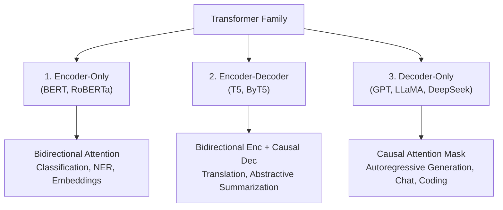
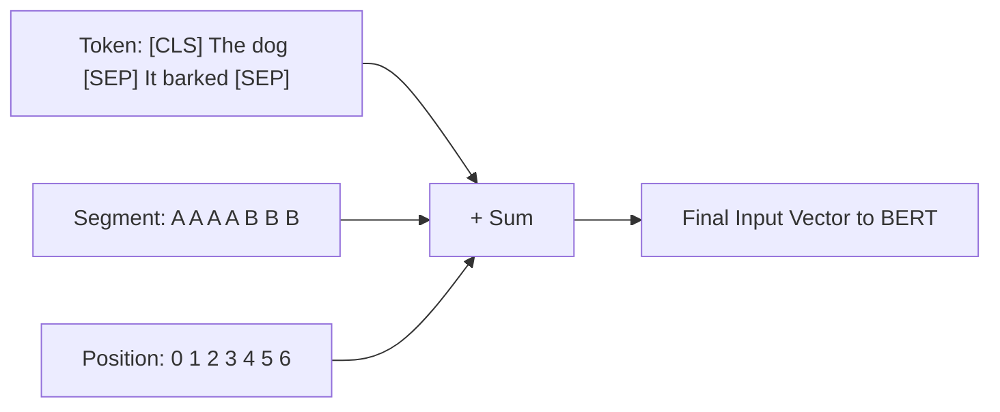

import { Callout } from 'fumadocs-ui/components/callout';
import { Tab, Tabs } from 'fumadocs-ui/components/tabs';
import { Accordion, Accordions } from 'fumadocs-ui/components/accordion';

> **Stanford CME 295: Transformers & Large Language Models** — Lecture 2  
> **Instructors:** Afshine Amidi & Shervine Amidi.

Lecture 1 gave us the original 2017 blueprint from *Attention Is All You Need*. But if you try to train a 70-billion-parameter model on trillions of tokens using only the 2017 paper's raw architecture, the training run will crash: gradients will destabilize at depth, context length will be rigidly trapped at whatever sequence length you trained on, and inference serving will exhaust all GPU memory within seconds.

This lesson explores the essential **architectural tricks and refinements** that solved these practical engineering bottlenecks: modern positional encodings (**RoPE**, **ALiBi**), stabilization techniques (**Pre-LN**, **RMSNorm**), serving optimizations (**KV Cache**, **MQA**, **GQA**), and the structural taxonomy of the Transformer family (**BERT**, **T5**, and **GPT**).

---

## Learning Objectives

By the end of this lesson you will be able to:

1. **Compare positional encoding schemes** — absolute learned, sinusoidal, relative bias, ALiBi, and Rotary (RoPE) — and explain mathematically why RoPE encodes relative distance via 2D orthogonal rotations.
2. **Derive RMSNorm** and explain why eliminating mean-centering reduces memory traffic without sacrificing training stability.
3. **Contrast Post-LN with Pre-LN**, showing how Pre-LN provides an uninterrupted identity gradient highway for deep networks.
4. **Quantify the $O(N^2)$ attention bottleneck** and calculate GPU VRAM savings from the KV Cache, Multi-Query Attention (MQA), and Grouped-Query Attention (GQA).
5. **Map the Transformer family taxonomy** (encoder-decoder, decoder-only, encoder-only) and analyze BERT's MLM and NSP pre-training objectives and modern evolutions (RoBERTa, DistilBERT).

---

## 1. Advanced Positional Encodings

Since self-attention is permutation-invariant, positional information must be injected into the network. The evolution of positional encodings is a search for **context extrapolation**: *Can a model trained on 4,000-token documents still work reliably when prompted with a 32,000-token document?*



---

### The Naive Attempt: Absolute Learned Positional Embeddings

**The Attempt (GPT-1, BERT):**  
Create a learnable embedding lookup table $P \in \mathbb{R}^{N_{\text{max}} \times d_{\text{model}}}$. Add $P[0]$ to token 0, $P[1]$ to token 1, up to $P[N_{\text{max}}-1]$.

**The Breaking Point:**
1. **Zero Extrapolation:** If you trained on $N_{\text{max}} = 2048$, position $2049$ has no learned embedding vector. Any longer input causes a runtime crash or undefined behavior.
2. **No Relative Invariance:** The model must independently re-learn that the relationship between position 5 and 7 is identical to the relationship between position 105 and 107.

---

### Intermediate Fixes: Relative Biases and ALiBi

#### Relative Position Bias (T5)
Instead of altering input vectors, modify the attention logits directly by adding a learned scalar bias $B_{m,n}$ based on the distance $(m - n)$:

$$\text{Attention Logit} = \frac{Q_m K_n^T}{\sqrt{d_k}} + B_{m,n}$$

T5 buckets large distances logarithmically. The model learns relative proximity directly, but computing the pairwise bias matrix adds computation.

#### ALiBi (Attention with Linear Biases - Press et al., 2021)
ALiBi replaces learned biases with a **static, non-learned linear penalty** proportional to token distance $|m - n|$:

$$\text{Attention Logit} = \frac{Q_m K_n^T}{\sqrt{d_k}} - m_{\text{head}} \cdot |m - n|$$

Where $m_{\text{head}} = 2^{-8 i / h}$ is a fixed geometric slope assigned per attention head. Because the penalty is a fixed geometric function, models trained on short sequences (e.g., 2,048 tokens) can extrapolate to sequences $4\times$ longer without retraining.

---

### The Modern Frontier: Rotary Position Embeddings (RoPE)

Introduced by Su et al. (2021) in RoFormer, **RoPE (Rotary Position Embeddings)** is the standard positional encoding across virtually all modern frontier open-weight models (LLaMA 1/2/3, Mistral, Qwen, DeepSeek).

#### The Core Intuition: The Clock Face Analogy
Imagine the hands of an analog clock:
- At 2:00 PM, the minute hand points up.
- At 2:15 PM, the minute hand has rotated by $90^\circ$.
- If you check the clock from 5:00 PM to 5:15 PM, the minute hand *also* rotates by exactly $90^\circ$.

The elapsed time ($15$ minutes) is encoded by the **relative angle difference ($\Delta \theta = 90^\circ$)**, completely independent of what hour of the day it started! RoPE embeds token position by rotating Query and Key vectors in 2D sub-spaces.



#### The Mathematical Formulation

RoPE partitions the $d_k$-dimensional Query and Key vectors into $d_k / 2$ two-dimensional slices. For each 2D slice at position $m$, it applies an orthogonal 2D rotation matrix:

$$R_{\theta, m} = \begin{pmatrix} \cos(m\theta) & -\sin(m\theta) \\ \sin(m\theta) & \cos(m\theta) \end{pmatrix}$$

Where $\theta_i = 10000^{-2(i-1)/d_k}$ is a fixed frequency for the $i$-th sub-dimension.

#### The Magic Inner Product Property
When we compute the dot product between a Query at position $m$ and a Key at position $n$:

$$\langle R_{\theta, m} Q, R_{\theta, n} K \rangle = (R_{\theta, m} Q)^T (R_{\theta, n} K) = Q^T (R_{\theta, m}^T R_{\theta, n}) K$$

Because rotation matrices are orthogonal, $R_{\theta, m}^T R_{\theta, n} = R_{\theta, n - m}$:

$$\langle R_{\theta, m} Q, R_{\theta, n} K \rangle = Q^T R_{\theta, n - m} K$$

<Callout type="info">
**Why This Changes Everything:**  
The inner product depends **strictly on the relative distance $(n - m)$**, not the absolute positions $m$ and $n$!  
Furthermore, because higher dimensions use higher frequencies, RoPE exhibits **long-term decay**: as tokens get farther apart in the context window, their attention bound naturally decays, giving the model an innate bias towards local context.
</Callout>

---

## 2. Normalization: LayerNorm → RMSNorm

### The Problem: Vanishing Gradients in Deep Stacks

As neural networks grow to 32, 64, or 128 layers, the variance of internal activations fluctuates wildly during forward and backward passes. Without normalization, deep networks cannot be trained.

### Standard LayerNorm (Ba et al., 2016)

LayerNorm normalizes across the feature dimensions for each individual token:

$$y = \frac{x - \mu}{\sqrt{\sigma^2 + \epsilon}} \odot \gamma + \beta$$

Where:
$$\mu = \frac{1}{d}\sum_{i=1}^{d} x_i, \qquad \sigma^2 = \frac{1}{d}\sum_{i=1}^{d} (x_i - \mu)^2$$
And $\gamma, \beta \in \mathbb{R}^d$ are learnable scale and shift parameters.

### The Modern Fix: RMSNorm (Root Mean Square Normalization)

Zhang & Sennrich (2019) demonstrated an empirical insight: **mean-centering ($\mu$) does not contribute to training stability**. What stabilizes the gradients is controlling the *scaling magnitude* (variance) of the activations.

**RMSNorm** completely discards the mean calculation and the learnable bias $\beta$:

$$y = \frac{x}{\text{RMS}(x)} \odot \gamma, \qquad \text{where } \text{RMS}(x) = \sqrt{\frac{1}{d}\sum_{i=1}^{d} x_i^2 + \epsilon}$$



**Why it matters:**  
Calculating the mean requires a reduction pass across GPU registers, subtracting it, and then computing variance. RMSNorm requires fewer memory read/write passes (fewer GPU memory roundtrips), providing a **10%–20% speedup** on normalization layers with zero drop in convergence quality. RMSNorm is used in LLaMA 3, Gemma, Mistral, and DeepSeek.

---

### Post-LN vs. Pre-LN

Where you place the normalization layer determines whether deep networks can train:



- **Post-LN (Vaswani 2017):** $x_{l+1} = \text{LayerNorm}(x_l + \text{Sublayer}(x_l))$.  
  *Failure Mode:* The normalization sits directly on the residual path. During backpropagation, gradients pass through repeated non-linear normalizations, causing gradient vanishing/explosion in deep stacks. Models require delicate, high-risk learning rate warmups.
- **Pre-LN (Modern):** $x_{l+1} = x_l + \text{Sublayer}(\text{LayerNorm}(x_l))$.  
  *The Innovation:* The residual connection is an uninterrupted, pure identity highway: $x_L = x_0 + \sum_{l=0}^{L-1} \text{Sublayer}(\text{LN}(x_l))$. Gradients flow straight from the final loss back to the earliest layers without attenuation.

---

## 3. The $O(N^2)$ Bottleneck and the KV Cache

### The Quadratic Wall of Attention

In standard full self-attention, every token compares against every other token. For sequence length $N$:
- The attention matrix size is $N \times N$.
- Compute FLOPs scale as $O(N^2)$.
- Memory footprint scales as $O(N^2)$.

At $N = 2,048$, $N^2 \approx 4.2 \times 10^6$.  
At $N = 128,000$ (modern long context), $N^2 \approx 16.4 \times 10^9$ — a **4,000-fold increase**!

---

### Autoregressive Serving: The KV Cache

During autoregressive text generation, the model generates output **one token at a time**.

#### The Naive Attempt (Recomputing Everything)
To generate token 101, you pass tokens $1\dots 100$ into the model.  
To generate token 102, you pass tokens $1\dots 101$ into the model and recompute $Q, K, V$ for all preceding 101 tokens from scratch!  
Generating $T$ tokens requires $O(T^2)$ redundant matrix operations.

#### The KV Cache Solution
Notice that for tokens that have already been generated, their Key and Value vectors **never change**! Only the new token produces a new Query to search the past.

We persist the calculated Key ($K$) and Value ($V$) tensors in GPU VRAM:



---

### The Memory Crisis Created by KV Cache

The KV cache solves computation redundancy, but introduces a massive **GPU VRAM crisis**:

$$\text{KV Cache Size (Bytes)} = 2 \times 2 \times n_{\text{layers}} \times n_{\text{heads}} \times d_k \times \text{seq\_len} \times \text{batch\_size} \times \text{precision\_bytes}$$

*(Factor of 2 accounts for both Keys and Values).*

For a standard 70B model ($n_{\text{layers}}=80, n_{\text{heads}}=64, d_k=128$, FP16 = 2 bytes) with a batch size of 16 at $32\text{k}$ context:
$$\text{KV Cache} = 2 \times 2 \times 80 \times 64 \times 128 \times 32768 \times 16 \times 2 \approx \mathbf{274\text{ GB of VRAM!}}$$
The KV cache alone exceeds the entire memory of three 80GB H100 GPUs before allocating a single byte for model weights!

---

### Attention Head Architectures: MHA vs. MQA vs. GQA

To eliminate this memory crisis, researchers restructured how heads share Keys and Values:



| Attention Architecture | Query Heads | Key / Value Heads | KV Cache Size | Quality / Capacity | Used In |
|---|---|---|---|---|---|
| **Multi-Head Attention (MHA)** | $h$ | $h$ | $1.0\times$ (Baseline) | Highest capacity | Original 2017 Transformer, GPT-3 |
| **Multi-Query Attention (MQA)** | $h$ | $1$ | $\frac{1}{h}\times$ ($8\times\text{--}64\times$ reduction) | Minor quality degradation | PaLM, StarCoder |
| **Grouped-Query Attention (GQA)** | $h$ | $g$ groups ($g < h$) | $\frac{g}{h}\times$ ($4\times\text{--}8\times$ reduction) | Near-MHA quality with near-MQA speed | LLaMA 2/3, Mistral, Gemma |

<Callout type="tip">
**Why GQA Won the Industry Standard:**  
Grouped-Query Attention partitions the $h$ query heads into $g$ groups (typically 8 groups). All query heads in a group share a single Key and Value head. GQA recovers almost 100% of MHA's linguistic expressive power while slashing KV cache memory footprint by **$8\times$**.
</Callout>

---

## 4. Transformer Family Taxonomy

Transformers fall into three structural branches based on attention visibility:



---

### Deep Dive: BERT (Devlin et al., 2018)

**BERT** (Bidirectional Encoder Representations from Transformers) pioneered self-supervised pre-training for representation extraction.

#### Input Representation
Each input token's vector is formed by the element-wise sum of three embeddings:
$$\mathbf{E}_{\text{input}} = \mathbf{E}_{\text{token}} + \mathbf{E}_{\text{segment}} + \mathbf{E}_{\text{position}}$$
- **Token Embedding:** Sub-word WordPiece lookup.
- **Segment Embedding:** Distinguishes sentence A from sentence B (`Segment A` vs `Segment B`) for pairwise tasks.
- **Position Embedding:** Absolute learned positional embedding index.

Special tokens: `[CLS]` (Classification prepended to sequence), `[SEP]` (Segment separator), `[PAD]`, and `[MASK]`.



#### Pre-Training Objectives

1. **Masked Language Model (MLM):**  
   Randomly selects 15% of all input tokens:
   - 80% are replaced with the literal `[MASK]` token.
   - 10% are replaced with a random vocabulary token (forces model to maintain representations for all tokens).
   - 10% are left unchanged (biases representations towards actual observed words).  
   The model must predict the original tokens using bidirectional context.
2. **Next Sentence Prediction (NSP):**  
   The `[CLS]` token outputs a binary classification: Does Sentence B naturally follow Sentence A (`IsNext`), or was it sampled randomly from the corpus (`NotNext`)?

#### Evolution of BERT:
- **DistilBERT (Sanh et al., 2019):** Uses knowledge distillation. A smaller student model matches the soft probability outputs of BERT via Kullback-Leibler (KL) divergence. Drops layers by 50%, retains 97% of accuracy, runs $60\%$ faster.
- **RoBERTa (Liu et al., 2019):** Proved BERT was severely undertrained. Removed the Next Sentence Prediction (NSP) task completely, used **dynamic masking** (masking different tokens across training epochs), larger batch sizes, and $10\times$ more pre-training data.

---

## 5. Production PyTorch: RoPE & RMSNorm from Scratch

Below is a self-contained, clean PyTorch implementation of **RMSNorm** and **Rotary Position Embeddings (RoPE)**:

```python
"""
modern_blocks.py
Production-grade implementations of RMSNorm and Rotary Position Embeddings (RoPE).
"""
from __future__ import annotations

import torch
import torch.nn as nn


class RMSNorm(nn.Module):
    """Root Mean Square Layer Normalization (Zhang & Sennrich, 2019).

    Normalizes activations across the last dimension by their root-mean-square.
    Discards mean-centering and learnable bias offsets for high throughput.
    """

    def __init__(self, dim: int, eps: float = 1e-6) -> None:
        super().__init__()
        self.eps = eps
        self.weight = nn.Parameter(torch.ones(dim))  # Learnable scale gamma

    def forward(self, x: torch.Tensor) -> torch.Tensor:
        # 1. Compute mean of squares along the feature dimension
        # Shape: (Batch, SeqLen, Dim) -> (Batch, SeqLen, 1)
        mean_square = x.pow(2).mean(dim=-1, keepdim=True)

        # 2. Compute reciprocal square root: 1 / sqrt(mean_square + eps)
        inv_rms = torch.rsqrt(mean_square + self.eps)

        # 3. Scale input by inv_rms and learnable weight
        return x * inv_rms * self.weight


def precompute_rope_frequencies(
    dim: int, max_seq_len: int, base: float = 10000.0
) -> torch.Tensor:
    """Precomputes complex rotary frequency tensors e^{i * m * theta}.

    Args:
        dim: Dimension of each attention head (must be even).
        max_seq_len: Maximum supported sequence length.
        base: Rotary base frequency theta (typically 10000.0, or 500000 for Llama 3).

    Returns:
        Complex tensor of shape (max_seq_len, dim // 2).
    """
    assert dim % 2 == 0, "Head dimension must be even for 2D complex pairing"
    half_dim = dim // 2

    # theta_i = base ^ (-2(i-1)/dim)
    indices = torch.arange(0, half_dim, dtype=torch.float32)
    theta = 1.0 / (base ** (indices / half_dim))  # (half_dim,)

    positions = torch.arange(max_seq_len, dtype=torch.float32)  # (max_seq_len,)

    # Outer product: m * theta -> shape (max_seq_len, half_dim)
    freqs = torch.outer(positions, theta)

    # Convert to polar complex exponentials: e^(i * freqs) = cos(freqs) + i * sin(freqs)
    return torch.polar(torch.ones_like(freqs), freqs)


def apply_rotary_embeddings(x: torch.Tensor, freqs_complex: torch.Tensor) -> torch.Tensor:
    """Applies Rotary Position Embeddings to Query or Key tensors.

    Args:
        x: Tensor of shape (Batch, Heads, SeqLen, HeadDim)
        freqs_complex: Precomputed frequencies of shape (MaxSeqLen, HeadDim // 2)

    Returns:
        Rotated tensor of identical shape (Batch, Heads, SeqLen, HeadDim).
    """
    batch_size, num_heads, seq_len, head_dim = x.shape

    # 1. Reshape real tensor into 2D pairs and view as complex numbers
    # (B, H, T, HeadDim) -> (B, H, T, HeadDim // 2, 2) -> (B, H, T, HeadDim // 2) complex
    x_pairs = x.float().reshape(batch_size, num_heads, seq_len, -1, 2)
    x_complex = torch.view_as_complex(x_pairs)

    # 2. Slice frequencies for current sequence length and broadcast
    # (T, HeadDim // 2) -> (1, 1, T, HeadDim // 2)
    freqs = freqs_complex[:seq_len].unsqueeze(0).unsqueeze(0)

    # 3. Multiply complex numbers: performs 2D orthogonal rotation!
    rotated_complex = x_complex * freqs

    # 4. Convert back to real coordinates and restore original shape
    rotated_real = torch.view_as_real(rotated_complex)
    return rotated_real.reshape(batch_size, num_heads, seq_len, head_dim).type_as(x)


if __name__ == "__main__":
    torch.manual_seed(42)

    # Verify RMSNorm
    norm = RMSNorm(dim=128)
    sample_input = torch.randn(2, 8, 128)
    normed = norm(sample_input)
    print("RMSNorm output shape:", normed.shape)
    print("Sample RMS value (should be ~1.0):", normed.pow(2).mean(dim=-1)[0, 0].item())

    # Verify RoPE relative-distance property
    head_dim = 16
    seq_len = 6
    freqs = precompute_rope_frequencies(dim=head_dim, max_seq_len=seq_len)

    Q = torch.randn(1, 1, seq_len, head_dim)
    K = torch.randn(1, 1, seq_len, head_dim)

    Q_rot = apply_rotary_embeddings(Q, freqs)
    K_rot = apply_rotary_embeddings(K, freqs)

    print("\nRoPE applied successfully!")
    print("Q_rot shape:", Q_rot.shape)
    print("K_rot shape:", K_rot.shape)
```

---

## 6. Key Takeaways

| Architectural Refinement | Predecessor / Flaw Solved | Engineering Benefit |
|---|---|---|
| **Rotary Embeddings (RoPE)** | Absolute embeddings fail beyond trained length $N$ | Bakes relative distance $(n - m)$ into inner products; long-term decay. |
| **RMSNorm** | LayerNorm computes mean $\mu$ and shift $\beta$ | Drops mean centering, saving memory bandwidth and speeding up training by 10–20%. |
| **Pre-LN** | Post-LN causes gradient vanishing in deep models | Places normalization inside branch, providing a clean identity residual gradient highway. |
| **KV Cache** | Autoregressive generation recomputed all past tokens ($O(T^2)$) | Caches Keys and Values in VRAM, making decoding $O(1)$ per step. |
| **Grouped-Query Attention (GQA)** | Multi-Head Attention's massive KV cache exhausts GPU VRAM | Groups queries to share Key/Value heads; slashes cache memory by $8\times$ with near-zero loss. |
| **RoBERTa over BERT** | BERT's NSP task and static masking limited performance | Removes NSP, uses dynamic masking, and scales training corpora for superior bidirectional encoders. |

---

## 7. Self-Check & Retrieval Practice

<Accordions>
<Accordion title="1. RoPE Relative Distance Verification">
**Question:** If Query vector $Q$ at index $10$ and Key vector $K$ at index $14$ are rotated by RoPE, what does their dot product depend on? What if they were at index $100$ and $104$?

<details>
<summary>Click to view solution</summary>

**Explanation:**  
Because orthogonal rotation matrices satisfy $R_m^T R_n = R_{n-m}$, the dot product $\langle R_{10} Q, R_{14} K \rangle$ depends strictly on $R_{14 - 10} = R_4$.  
Similarly, $\langle R_{100} Q, R_{104} K \rangle$ depends on $R_{104 - 100} = R_4$.  
The relative angle of rotation ($4\theta$) is identical in both cases. The model evaluates relative displacement regardless of absolute position in the prompt.
</details>
</Accordion>

<Accordion title="2. MHA vs MQA vs GQA Memory Calculation">
**Question:** A model has 32 query heads. How much KV cache memory does Multi-Query Attention (MQA) save compared to standard Multi-Head Attention (MHA)? How much does GQA save with 4 groups?

<details>
<summary>Click to view solution</summary>

**Explanation:**  
- In MHA, there are 32 Key heads and 32 Value heads.  
- In MQA, there is 1 Key head and 1 Value head. The KV cache is reduced by $\frac{32}{1} = \mathbf{32\times}$.  
- In GQA with 4 groups, there are 4 Key heads and 4 Value heads. The KV cache is reduced by $\frac{32}{4} = \mathbf{8\times}$.
</details>
</Accordion>

<Accordion title="3. Why Pre-LN Enables Training Deeper Models">
**Question:** Why does Pre-LN allow training a 100-layer Transformer without exploding/vanishing gradients, whereas Post-LN requires careful learning rate warmups?

<details>
<summary>Click to view solution</summary>

**Explanation:**  
In Pre-LN, the update rule is $x_{l+1} = x_l + \text{Sublayer}(\text{LN}(x_l))$.  
During backpropagation, the gradient of the loss $\mathcal{L}$ with respect to layer input $x_l$ includes an uninterrupted direct identity term:  
$$\frac{\partial \mathcal{L}}{\partial x_l} = \frac{\partial \mathcal{L}}{\partial x_{l+1}}\left(I + \frac{\partial \text{Sublayer}}{\partial x_l}\right)$$  
The identity matrix $I$ allows gradient signals to flow straight through the residual highway from layer 100 down to layer 1 without being repeatedly scaled or warped by normalization layers.
</details>
</Accordion>
</Accordions>

---

## Next Steps

Now that we have fortified the individual Transformer layers with RoPE, RMSNorm, and GQA, how do we scale models to hundreds of billions of parameters without making per-token compute unaffordable? 

In the next lesson, we explore **Mixture-of-Experts (MoE)**, the mechanics of **sampling and decoding strategies**, and frontier **inference acceleration engines** (PagedAttention, Multi-Head Latent Attention, and Speculative Decoding).

[Next: MoE, Decoding & Inference Acceleration →](/docs/ai-agents/agentic-ai/03-moe-decoding-and-inference)
