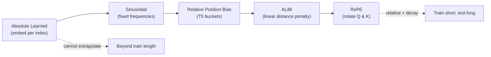
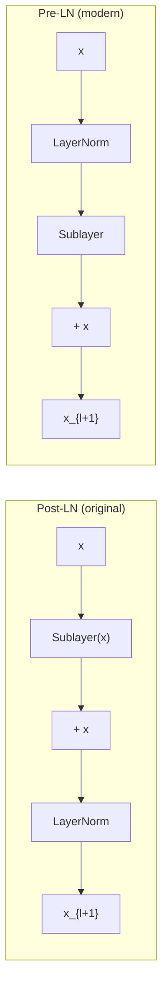
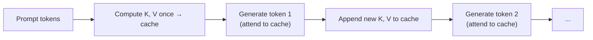
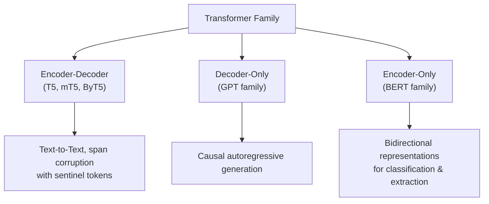

> **Stanford CME 295: Transformers & Large Language Models** — Lecture 2
> **Instructors:** Afshine Amidi & Shervine Amidi.

Lecture 1 gave us the 2017 blueprint. Lecture 2 is about what changed since: the **positional encodings, normalization schemes, and attention variants** that turned a research architecture into the backbone of trillion-token training runs.

---

## Learning Objectives

1. **Compare positional encoding schemes** — absolute learned, sinusoidal, relative bias, ALiBi, and Rotary (RoPE) — and explain RoPE's relative-distance property and long-term decay.
2. **Derive RMSNorm** and explain why dropping mean-centering speeds up modern models.
3. **Distinguish Post-LN from Pre-LN** and explain the gradient highway that stabilizes deep training.
4. **Analyze the $O(N^2)$ attention bottleneck** and the KV-cache / MQA / GQA optimizations that reduce inference memory.
5. **Map the Transformer family taxonomy** (encoder-decoder, decoder-only, encoder-only) and detail BERT's MLM + NSP pre-training.

---

## Positional Encodings, Revisited

Since self-attention is permutation-invariant, position must be injected. The evolution of *how* is a story of improving extrapolation.



### Absolute learned embeddings

Learn one vector per position index $1 \dots N$. Simple, but **cannot extrapolate** past the maximum training length — unseen indices have no parameters.

### Sinusoidal embeddings

Fixed functions of position (recall from Lesson 1). Their key property: the dot product of two position embeddings is a sum of cosines of the **relative distance** $(m-n)$, peaking when $m=n$.

### Relative position bias (T5)

Rather than modifying embeddings, add a learned, bucketed scalar $B_{m,n}$ directly to attention logits:

$$\text{softmax}\!\left(\frac{QK^T}{\sqrt{d_k}} + B_{m,n}\right)$$

This makes the model inherently sensitive to *relative* distance rather than absolute index.

### ALiBi (Attention with Linear Biases)

Apply a **static, non-learned linear penalty** proportional to $|m-n|$. Because the penalty is a simple linear function, a model trained at short context can extrapolate to longer contexts ("train short, test long").

### Rotary Position Embeddings (RoPE / RoFormer)

RoPE rotates Query and Key vectors in 2D sub-planes by an angle proportional to position:

$$R_{\theta, m} = \begin{pmatrix} \cos m\theta & -\sin m\theta \\ \sin m\theta & \cos m\theta \end{pmatrix}$$

Its defining property is that the inner product depends **only on relative distance**:

$$(R_m Q)^T (R_n K) = Q^T R_{n-m} K$$

RoPE also exhibits **long-term decay** — the attention bound shrinks as token distance grows. It is the positional encoding of choice for LLaMA, Mistral, and DeepSeek.

---

## Normalization: LayerNorm → RMSNorm

**LayerNorm** normalizes across features per token, with learnable scale $\gamma$ and shift $\beta$:

$$y = \frac{x - \mu}{\sqrt{\sigma^2 + \epsilon}} \odot \gamma + \beta$$

**RMSNorm** drops mean-centering and the shift entirely, scaling by the root-mean-square:

$$y = \frac{x}{\text{RMS}(x)} \odot \gamma, \qquad \text{RMS}(x) = \sqrt{\frac{1}{d}\sum_{i=1}^d x_i^2}$$

Removing $\mu$ and $\beta$ reduces compute and memory traffic while preserving convergence — one reason modern LLMs are faster to train.

### Post-LN vs. Pre-LN



- **Post-LN:** $x_{l+1} = \text{LayerNorm}(x_l + \text{Sublayer}(x_l))$ — prone to gradient instability in deep models without careful warmup.
- **Pre-LN:** $x_{l+1} = x_l + \text{Sublayer}(\text{LayerNorm}(x_l))$ — the identity connection provides an uninterrupted gradient highway to the input, stabilizing deep training. This is now universal.

---

## The $O(N^2)$ Bottleneck and the KV Cache

Attention cost scales **quadratically** with sequence length $N$. Two families of fixes matter:

### Local / sliding-window attention

Tokens attend only to neighbors within a fixed window (Mistral, Longformer). Stacking layers hierarchically expands the receptive field while keeping per-layer cost linear.

### KV cache

During autoregressive generation, each new token recomputes attention over all previous tokens. Since Keys and Values don't change, we **cache them** in GPU VRAM:



### Attention head variants

The KV cache is often the memory bottleneck, so we shrink it:

| Variant | Query heads | Key/Value heads | Trade-off |
|---|---|---|---|
| **MHA** (Multi-Head) | $h$ | $h$ | Best quality, largest cache |
| **MQA** (Multi-Query) | $h$ | 1 shared | Maximum cache savings, minor quality loss |
| **GQA** (Grouped-Query) | $h$ | $g$ groups share 1 K/V each | The sweet spot — near-MHA quality, near-MQA memory |

---

## Transformer Family Taxonomy



### Deep dive: BERT (Devlin 2018)

BERT (Bidirectional Encoder Representations from Transformers) builds bidirectional context. Each input token's representation is the element-wise **sum of three embeddings**: token + position + segment (`Segment A` vs `Segment B`).

Special tokens: `[CLS]` (classification), `[SEP]` (separator), `[PAD]`, `[MASK]`.

BERT pre-trains with two objectives:

1. **Masked Language Model (MLM):** 15% of tokens are selected — 80% replaced with `[MASK]`, 10% left unchanged, 10% replaced with a random token. This forces the model to build robust bidirectional context rather than shortcut on `[MASK]`.
2. **Next Sentence Prediction (NSP):** a binary classification on `[CLS]` — does Sentence B follow Sentence A? (`IsNext` vs `NotNext`).

**Evolutions:**
- **DistilBERT:** knowledge distillation using the teacher's soft targets and a KL-divergence loss; halves the layers while retaining ~97% of performance.
- **RoBERTa:** removes NSP, uses dynamic masking, larger batches, and much larger corpora.

---

## Production Python: RoPE and RMSNorm

A clean, dependency-light implementation of the two tricks that define modern LLMs.

```python
"""
modern_llm_blocks.py
Rotary Position Embeddings (RoPE) and RMSNorm implemented from scratch.
"""
from __future__ import annotations

import torch
import torch.nn as nn


class RMSNorm(nn.Module):
    """Root Mean Square Layer Normalization (Zhang & Sennrich, 2019)."""

    def __init__(self, dim: int, eps: float = 1e-6) -> None:
        super().__init__()
        self.eps = eps
        self.weight = nn.Parameter(torch.ones(dim))

    def forward(self, x: torch.Tensor) -> torch.Tensor:
        # RMS over the last dimension; no mean-centering, no bias.
        rms = x.pow(2).mean(dim=-1, keepdim=True).add(self.eps).rsqrt()
        return x * rms * self.weight


def precompute_rope_freqs(dim: int, max_seq_len: int, base: float = 10000.0) -> torch.Tensor:
    """Precompute complex exponentials e^{i m theta} for RoPE.

    Returns a (max_seq_len, dim/2) complex tensor.
    """
    assert dim % 2 == 0, "RoPE requires an even head dimension"
    half = dim // 2
    theta = 1.0 / (base ** (torch.arange(0, half).float() / half))  # (half,)
    m = torch.arange(max_seq_len).float()                          # (T,)
    freqs = torch.outer(m, theta)                                  # (T, half)
    return torch.polar(torch.ones_like(freqs), freqs)              # e^{i m theta}


def apply_rope(x: torch.Tensor, freqs: torch.Tensor) -> torch.Tensor:
    """Rotate query/key tensors of shape (B, H, T, d_k)."""
    # View last dim as complex pairs: (..., d_k) -> (..., d_k/2) complex
    x_complex = torch.view_as_complex(x.float().reshape(*x.shape[:-1], -1, 2))
    freqs = freqs[: x.size(-2)].unsqueeze(0).unsqueeze(0)  # (1, 1, T, d_k/2)
    rotated = x_complex * freqs
    return torch.view_as_real(rotated).reshape(*x.shape)


if __name__ == "__main__":
    torch.manual_seed(0)

    norm = RMSNorm(dim=512)
    x = torch.randn(2, 10, 512)
    print("RMSNorm output shape:", norm(x).shape)

    # The relative-distance property of RoPE:
    # <RoPE(q, m), RoPE(k, n)> depends only on (n - m).
    d_k, T = 16, 8
    freqs = precompute_rope_freqs(d_k, T)
    q = torch.randn(1, 1, T, d_k)
    k = torch.randn(1, 1, T, d_k)

    q_rot = apply_rope(q, freqs)
    k_rot = apply_rope(k, freqs)

    # Score between position 2 and 5 should equal score between 0 and 3.
    score_2_5 = torch.dot(q_rot[0, 0, 2], k_rot[0, 0, 5])
    score_0_3 = torch.dot(q_rot[0, 0, 0], k_rot[0, 0, 3])
    print(f"Relative-distance check: |{score_2_5:.4f} - {score_0_3:.4f}| "
          f"(same relative gap differs because q,k themselves differ)")
```

> **Note:** the final check compares different absolute vectors, so it is illustrative — the *structural* guarantee is that RoPE encodes distance into the rotation itself, which is why models generalize over relative positions.

---

## Key Takeaways

| Technique | Core Idea | Benefit |
|---|---|---|
| **RoPE** | Rotate Q/K by position-dependent angles | Relative distance baked into inner products; long-term decay |
| **ALiBi** | Static linear distance penalty on logits | "Train short, test long" extrapolation |
| **RMSNorm** | Scale by root-mean-square, no mean-centering | Cheaper normalization, stable convergence |
| **Pre-LN** | Normalize before the sublayer | Identity gradient highway for deep nets |
| **KV cache** | Persist K/V across generation steps | Removes redundant recomputation |
| **GQA** | Share K/V across groups of query heads | Big inference memory savings, minimal quality loss |
| **BERT MLM** | Mask 15%, predict them | Strong bidirectional representations |

---

## Next Steps

We now have the components. Next we scale capacity and speed: **Mixture-of-Experts** to decouple parameter count from per-token compute, **decoding strategies** to control generation, and **inference engines** (PagedAttention, MLA, speculative decoding) to make it all fast.

[Next: MoE, Decoding & Inference Acceleration →](/docs/ai-agents/agentic-ai/03-moe-decoding-and-inference)
