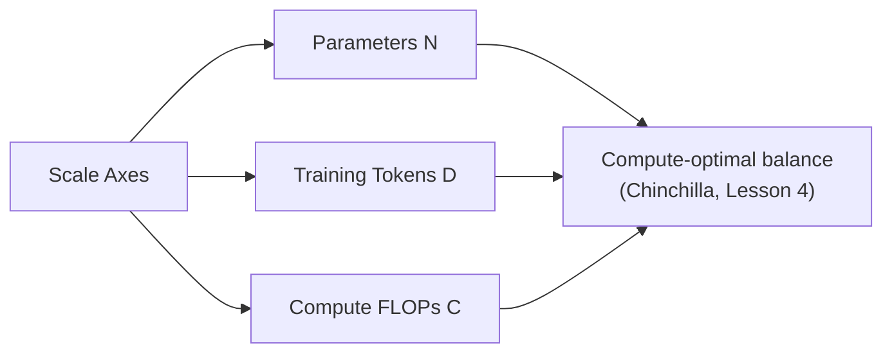
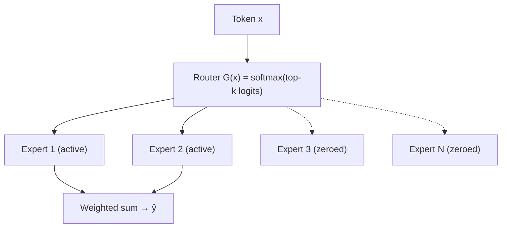
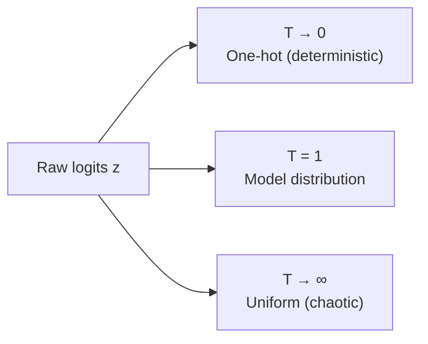
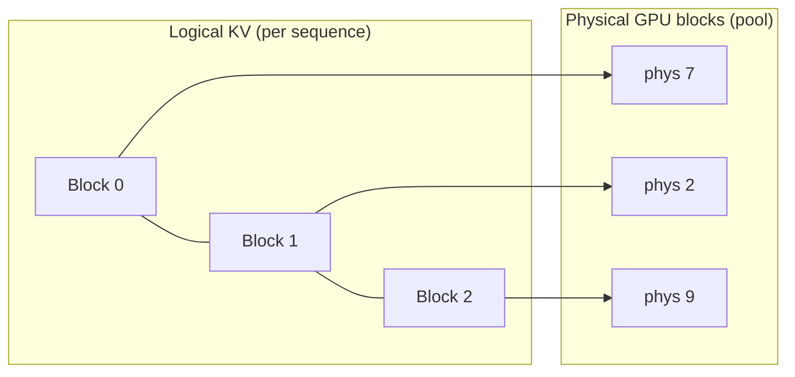
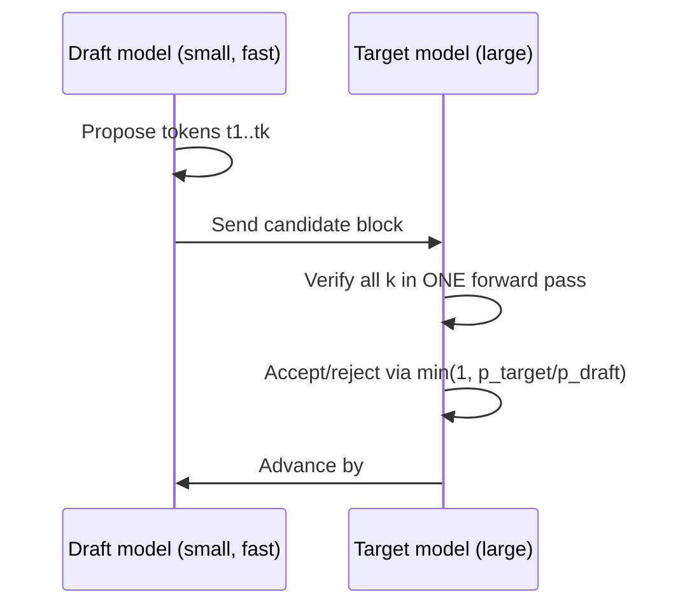

> **Stanford CME 295: Transformers & Large Language Models** — Lecture 3
> **Instructors:** Afshine Amidi & Shervine Amidi.

This lecture covers three things that define a modern LLM at runtime: **how it scales capacity without scaling compute** (Mixture-of-Experts), **how it chooses the next token** (decoding), and **how it serves billions of tokens cheaply** (inference engines).

---

## Learning Objectives

1. **Explain Mixture-of-Experts (MoE)**: the gating formulation, sparse top-$k$ routing, routing collapse, and load-balancing.
2. **Compare decoding strategies** — greedy, beam search, top-$k$, top-$p$ (nucleus) — and analyze temperature.
3. **Describe in-context learning** and its failure mode: context rot / "needle in a haystack."
4. **Quantify the memory-bound bottleneck** of autoregressive decoding.
5. **Explain PagedAttention, Multi-Head Latent Attention (MLA), and speculative decoding**, including why speculative decoding preserves the target distribution.

---

## What Makes an LLM "Large"?

Modern LLMs are **autoregressive decoder-only** models with billion-plus parameters pre-trained on hundreds of billions to tens of trillions of tokens. Scale is measured along three axes:



---

## Mixture-of-Experts (MoE)

### Motivation

Dense models scale capacity and compute together: bigger model = more FLOPs per token. MoE **decouples** them by activating only a subset of parameters per token.

### Where it goes

MoE replaces the Feed-Forward Network (FFN/MLP), which holds roughly **two-thirds of all Transformer parameters**. The FFN typically expands $D_{\text{model}} \to D_{\text{FF}} \sim 4\text{–}8\times$.

### Formulation

$$\hat{y} = \sum_{i=1}^{n} G(x)_i \cdot E_i(x)$$

- **Dense MoE:** all experts receive non-zero weights.
- **Sparse MoE:** the router gate $G(x)$ activates only the **top-$k$** experts (e.g., $k=1$ or $2$), zeroing the rest. Total parameters grow enormously, but compute per token stays fixed.



### Pathologies and mitigations

- **Routing collapse:** the router falls into a positive feedback loop, sending every token to the same one or two experts. The other experts never train.
- **Auxiliary load-balancing loss:** add a regularizer that rewards a uniform token distribution:

$$\mathcal{L}_{\text{aux}} = \alpha \cdot N \sum_{i=1}^{N} f_i \cdot P_i$$

where $f_i$ is the fraction of tokens routed to expert $i$ and $P_i$ is its average routing probability.

- **Noisy gating:** inject tunable Gaussian noise into routing logits before softmax so the router keeps exploring.

---

## Decoding Strategies

Once the model produces logits, how do we pick tokens?

| Strategy | Mechanism | Properties |
|---|---|---|
| **Greedy** | $\arg\max P(w_t \mid w_{<t})$ | Deterministic, locally optimal, prone to loops/repetition |
| **Beam search** | Track top-$B$ partial sequences by cumulative log-prob | Higher quality, but can be generic; needs length normalization $1/L^\alpha$ |
| **Top-$k$** | Sample from the $k$ highest-probability tokens | Controls tail risk |
| **Top-$p$ (nucleus)** | Sample from the smallest set $V^{(p)}$ with $\sum_{w \in V^{(p)}} P(w) \ge p$ | Adaptive cutoff, often preferred |

### Temperature

Softmax temperature $T$ rescales logits before normalization:

$$P(w_i) = \frac{\exp(z_i / T)}{\sum_j \exp(z_j / T)}$$

- As $T \to 0$: the distribution collapses to a one-hot argmax (deterministic).
- As $T \to \infty$: logits flatten; the distribution approaches uniform $1/|V|$.



### Hardware non-determinism

Even at $T=0$, floating-point reduction ordering across GPU warps/threads causes tiny numerical variations — so outputs can occasionally differ across runs.

### Guided / constrained decoding

Intercept logits with a Finite State Machine (FSM) or context-free grammar (CFG) and **mask out invalid tokens**, guaranteeing valid JSON, regex, or SQL schemas.

---

## In-Context Learning (ICL) and Context Rot

### Prompt anatomy

A well-formed prompt has four parts: **Context** (system persona/grounding), **Instructions** (procedural task), **Inputs** (dynamic data), and **Constraints** (formatting/safety bounds).

### "Needle in a Haystack" (NIAH)

Even with huge context windows, **retrieval accuracy degrades** as context grows and becomes filled with distractors. This is the empirical basis for why RAG (Lesson 7) exists.

### Chain-of-Thought (CoT) and self-consistency

- **CoT:** prompting the model to emit explicit intermediate steps — effectively a white-box debugging interface for reasoning.
- **Self-consistency:** sample $M$ independent reasoning paths at $T>0$ and take a majority vote over final answers.

---

## Inference Acceleration

### The memory-bound bottleneck

Autoregressive decoding is bottlenecked by **GPU memory bandwidth**, not arithmetic: each token requires loading weights and the KV cache from VRAM, while compute units sit underutilized. This is why batching and memory management dominate serving cost.

### PagedAttention (vLLM)

Naive KV-cache allocation reserves the maximum sequence length per request, causing **internal fragmentation**, and variable-length requests cause **external fragmentation**.

PagedAttention partitions the KV cache into **non-contiguous fixed-size blocks** (e.g., 16 tokens) mapped through a virtual-to-physical block table — the same idea as OS virtual memory paging. Result: near-zero wasted KV memory and much higher throughput.



### Multi-Head Latent Attention (MLA)

DeepSeek-V2/V3 compress Keys and Values into a single shared **low-rank latent vector** per token, decompressed on the fly during attention. This slashes the KV-cache footprint by roughly an order of magnitude while preserving quality.

### Speculative decoding

A small **draft model** proposes $k$ candidate tokens quickly; the large **target model** verifies all $k$ in a single parallel forward pass. Candidates are accepted via rejection sampling:

$$P_{\text{accept}} = \min\!\left(1, \frac{P_{\text{target}}(x)}{P_{\text{draft}}(x)}\right)$$

This preserves the **exact** output distribution of the target model while cutting wall-clock latency.



**Multi-Token Prediction (MTP)** is a related idea: attach $k$ parallel prediction heads to the base model so it proposes multiple future tokens natively.

---

## Production Python: Top-p Sampling and MoE Gating

```python
"""
serving_utils.py
Nucleus (top-p) sampling with temperature + a top-k MoE gate with load-balancing.
"""
from __future__ import annotations

import torch
import torch.nn as nn
import torch.nn.functional as F


def top_p_sample(
    logits: torch.Tensor,       # (B, V)
    temperature: float = 0.8,
    top_p: float = 0.9,
    seed: int | None = None,
) -> torch.Tensor:
    """Sample the next token using temperature + nucleus (top-p) filtering."""
    if seed is not None:
        torch.manual_seed(seed)

    # 1. Temperature scaling
    logits = logits / max(temperature, 1e-6)

    # 2. Sort probabilities descending
    probs = F.softmax(logits, dim=-1)
    sorted_probs, sorted_idx = torch.sort(probs, dim=-1, descending=True)

    # 3. Cumulative mass and the smallest set exceeding top_p
    cumulative = sorted_probs.cumsum(dim=-1)
    remove = cumulative - sorted_probs > top_p  # tokens beyond the nucleus
    sorted_probs = sorted_probs.masked_fill(remove, 0.0)

    # 4. Renormalize and sample
    sorted_probs = sorted_probs / sorted_probs.sum(dim=-1, keepdim=True)
    sampled = torch.multinomial(sorted_probs, num_samples=1)          # index in sorted order
    return sorted_idx.gather(-1, sampled).squeeze(-1)                 # map back to vocab


class SparseMoE(nn.Module):
    """A top-k Mixture-of-Experts FFN with an auxiliary load-balancing loss."""

    def __init__(self, d_model: int, d_ff: int, num_experts: int = 8, top_k: int = 2) -> None:
        super().__init__()
        self.num_experts = num_experts
        self.top_k = top_k
        self.router = nn.Linear(d_model, num_experts, bias=False)
        self.experts = nn.ModuleList(
            nn.Sequential(nn.Linear(d_model, d_ff), nn.GELU(), nn.Linear(d_ff, d_model))
            for _ in range(num_experts)
        )

    def forward(self, x: torch.Tensor) -> tuple[torch.Tensor, torch.Tensor]:
        B, T, D = x.shape
        flat = x.view(-1, D)                              # (N, D)
        logits = self.router(flat)                        # (N, E)
        probs = F.softmax(logits, dim=-1)

        # Top-k routing
        topk_vals, topk_idx = probs.topk(self.top_k, dim=-1)  # (N, k)
        topk_vals = topk_vals / topk_vals.sum(dim=-1, keepdim=True)

        out = torch.zeros_like(flat)
        for k in range(self.top_k):
            expert_ids = topk_idx[:, k]                   # (N,)
            weights = topk_vals[:, k].unsqueeze(-1)       # (N, 1)
            for e in range(self.num_experts):
                mask = expert_ids == e
                if mask.any():
                    out[mask] += weights[mask] * self.experts[e](flat[mask])

        # Auxiliary load-balancing loss: N * sum_i(f_i * P_i)
        f = F.one_hot(topk_idx, self.num_experts).float().mean(dim=(0, 1))  # (E,)
        P = probs.mean(dim=0)                                                # (E,)
        aux_loss = self.num_experts * torch.sum(f * P)
        return out.view(B, T, D), aux_loss


if __name__ == "__main__":
    torch.manual_seed(0)
    logits = torch.randn(2, 50)
    print("Sampled token ids:", top_p_sample(logits, temperature=0.7, top_p=0.9))

    moe = SparseMoE(d_model=64, d_ff=128, num_experts=8, top_k=2)
    x = torch.randn(2, 4, 64)
    y, aux = moe(x)
    print("MoE output:", y.shape, "aux_loss:", float(aux))
```

---

## Key Takeaways

| Concept | Key Point |
|---|---|
| Sparse MoE | Decouples total parameters from per-token FLOPs via top-$k$ routing |
| Load-balancing loss | Prevents routing collapse toward a few experts |
| Temperature | $T\to0$ deterministic; $T\to\infty$ uniform |
| Top-$p$ | Adaptive nucleus sampling — the practical default |
| Constrained decoding | FSM/CFG masks guarantee valid structured output |
| KV cache is the bottleneck | Autoregressive decode is memory-bandwidth bound |
| PagedAttention | Block-based KV memory eliminates fragmentation |
| MLA | Low-rank KV compression slashes cache memory |
| Speculative decoding | Draft + verify preserves the exact target distribution |

---

## Next Steps

Capacity, decoding, and serving are covered. Next we ask how these models gain their knowledge in the first place: **pre-training at scale**, the Chinchilla compute-optimal rule, distributed training with ZeRO, FlashAttention, and parameter-efficient fine-tuning (LoRA/QLoRA).

[Next: LLM Training, Distributed Systems & PEFT →](/docs/ai-agents/agentic-ai/04-llm-training-and-peft)
