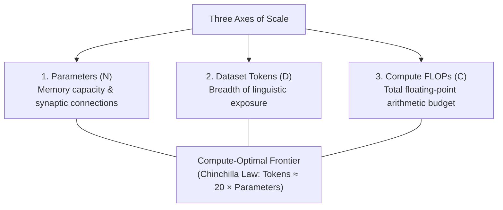
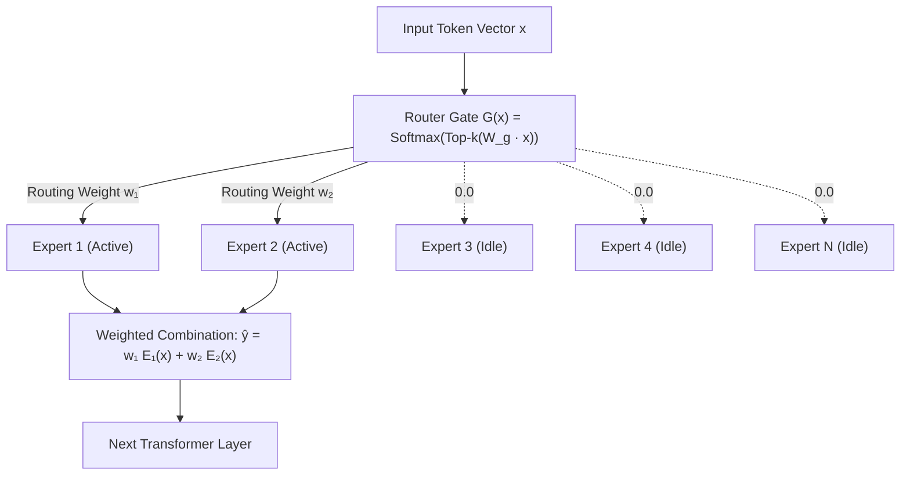
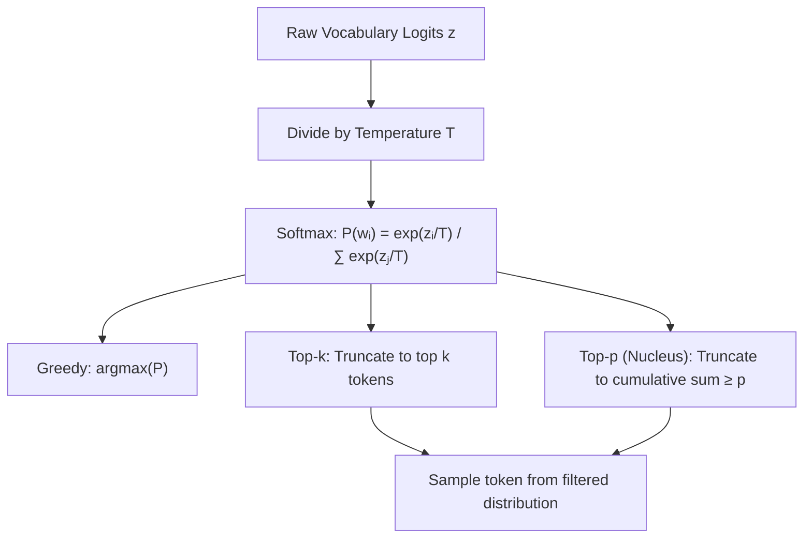
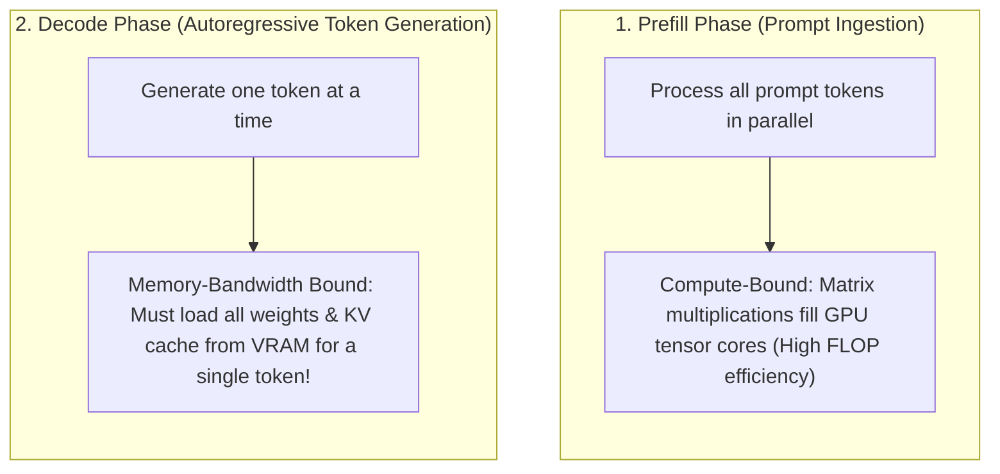
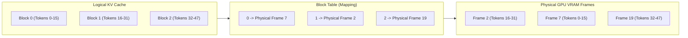
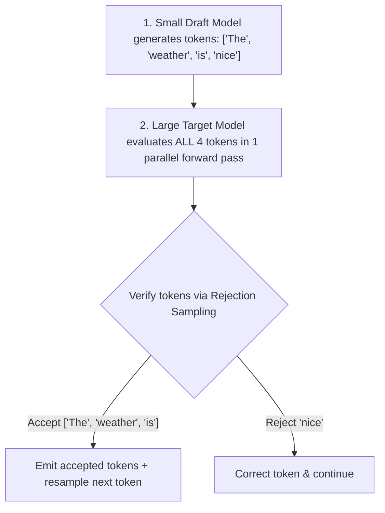

import { Callout } from 'fumadocs-ui/components/callout';
import { Tab, Tabs } from 'fumadocs-ui/components/tabs';
import { Accordion, Accordions } from 'fumadocs-ui/components/accordion';

> **Stanford CME 295: Transformers & Large Language Models** — Lecture 3  
> **Instructors:** Afshine Amidi & Shervine Amidi.

Once a Transformer architecture is trained, two massive operational questions dominate: **How do we make the model larger without making every token prohibitively expensive?** and **How do we generate responses fast and reliably at production scale?**

This lesson covers the three pillars of runtime LLM engineering: **Mixture-of-Experts (MoE)** to decouple model capacity from per-token compute, **decoding and sampling mechanics** to govern output generation, and modern **inference acceleration engines** (PagedAttention, Multi-Head Latent Attention, and Speculative Decoding) that slash serving costs.

---

## Learning Objectives

By the end of this lesson you will be able to:

1. **Formulate Mixture-of-Experts (MoE)**, contrasting dense vs. sparse top-$k$ routing and explaining how auxiliary load-balancing losses and noisy gating eliminate routing collapse.
2. **Compare decoding strategies** — greedy, beam search, top-$k$, top-$p$ (nucleus) — and explain the thermodynamic intuition of temperature $T$ and hardware non-determinism.
3. **Analyze in-context learning (ICL)**, prompt anatomy, and the failure mode known as "Context Rot" / Needle in a Haystack (NIAH).
4. **Quantify the memory-bandwidth bottleneck** of autoregressive decoding vs. compute-bound prefill.
5. **Explain modern inference engines**: how **PagedAttention** cures memory fragmentation, how **MLA** compresses KV caches into latent projections, and how **Speculative Decoding** accelerates generation without altering the target probability distribution.

---

## 1. What Makes an LLM "Large"?

A modern Large Language Model (**LLM**) is an autoregressive decoder-only sequence model containing tens to hundreds of billions of parameters pre-trained on trillions of tokens.

Scale is governed along three primary axes:



When building dense models, increasing parameters $N$ linearly increases the FLOPs required to generate every single token. A 500-billion-parameter dense model requires ~1,000 billion floating-point operations for *every single token emitted*. At that scale, serving interactive user prompts becomes commercially unviable.

---

## 2. Mixture-of-Experts (MoE)

### The Problem: The Dense Compute Bottleneck

In a standard dense Transformer, every single parameter participates in processing every single token. If a token is a simple punctuation mark like `","` or a common stop-word like `"the"`, all 70 billion parameters are activated.

**The Desired Goal:** We want the parameter capacity of a 500B model (to memorize facts, code syntax, and reasoning pathways), but the per-token computational cost of a small 20B model.

---

### The Architecture: Sparse Routing in the Feed-Forward Blocks

Mixture-of-Experts (**MoE**) replaces the standard Feed-Forward Network (**FFN** / MLP) inside Transformer layers with an ensemble of $N$ independent expert networks, coordinated by a lightweight router gate:

$$\hat{y} = \sum_{i=1}^{n} G(x)_i \cdot E_i(x)$$

Where:
- $E_i(x)$ is the output of the $i$-th expert network.
- $G(x) \in \mathbb{R}^n$ is the gating network (router) producing normalized routing weights.



### Physical Analogy: The Hospital Emergency Triage

Imagine an emergency hospital staffed by 16 medical specialists (cardiologist, neurologist, orthopedist, toxicologist, etc.):
- **The Dense Model Approach:** Every patient who walks through the door must be simultaneously examined by all 16 specialists, even if they just have a sprained ankle.
- **The Sparse MoE Approach:** A triage nurse (the **Router Gate**) spends 30 seconds assessing the patient's symptoms (the token vector) and directs them exclusively to the top 2 relevant doctors (e.g., orthopedist and radiologist). The remaining 14 doctors stay idle, saving enormous hospital resources.

In **Sparse MoE**, the router selects only the **Top-$k$** experts (typically $k=1$ or $k=2$) per token:
- **Total Parameters:** E.g., 671 billion parameters (DeepSeek-V3).
- **Active Parameters per Token:** Only 37 billion parameters!

---

### Pathologies: The Routing Collapse Trap

Sparse MoE introduces a dangerous training pathology: **Routing Collapse**.

#### The Breaking Point
Early in training, random parameter initialization might make Expert 1 slightly better at processing common words. The router notices this and sends slightly more tokens to Expert 1.  
Because Expert 1 receives more tokens, it receives more gradient updates and improves faster. The router becomes even more confident and sends *all* tokens to Expert 1.  
Meanwhile, Experts $2\dots N$ receive zero tokens, receive zero gradient updates, and permanently starve. A 16-expert model degrades into a 1-expert dense model!

#### The Engineering Mitigations

1. **Auxiliary Load-Balancing Loss ($\mathcal{L}_{\text{aux}}$):**  
   We penalize non-uniform token routing across experts during training:
   $$\mathcal{L}_{\text{aux}} = \alpha \cdot N \sum_{i=1}^{N} f_i \cdot P_i$$
   Where $f_i$ is the actual fraction of tokens dispatched to expert $i$, and $P_i$ is the average routing probability assigned to expert $i$. The product minimizes when tokens are distributed uniformly across all $N$ experts.
2. **Noisy Top-$k$ Gating:**  
   Before computing the softmax, tunable Gaussian noise is added to the router's logits:
   $$H(x)_i = (x \cdot W_g)_i + \text{StandardNormal}() \cdot \text{Softplus}((x \cdot W_{\text{noise}})_i)$$
   This stochastic perturbation forces the router to continually explore alternative experts.

---

## 3. Decoding Strategies & Mechanics

Once a decoder-only LLM computes its final hidden states and projects them into vocabulary logits $z \in \mathbb{R}^{|V|}$, how does it choose the next token?



---

### Comparison of Decoding Strategies

| Strategy | Selection Rule | Strengths | Failure Mode / Vulnerability |
|---|---|---|---|
| **Greedy Search** | $w_t = \arg\max P(w_t \mid w_{<t})$ | Deterministic, zero sampling overhead | Locally optimal; vulnerable to repetitive loops and degenerate phrasing |
| **Beam Search** | Tracks top-$B$ sequences maximizing $\sum \log P$ | Finds globally high-probability sentences | Produces generic, unnatural output in open dialogue; computationally expensive |
| **Top-$k$ Sampling** | Restricts candidate pool to the fixed $k$ highest tokens | Prevents sampling from improbable long-tail noise | Fixed cutoff fails: too loose when distribution is peaked, too strict when flat |
| **Top-$p$ (Nucleus)** | Samples from smallest set where $\sum P(w) \ge p$ | Dynamically adapts candidate pool width | Non-deterministic; requires tuning threshold (typically $p \in [0.8, 0.95]$) |

---

### The Thermodynamics of Temperature ($T$)

The softmax temperature parameter $T$ rescales raw logits prior to exponentiation:

$$P(w_i) = \frac{\exp(z_i / T)}{\sum_{j=1}^{|V|} \exp(z_j / T)}$$

#### Physical Analogy: Molecular Heat
- **$T \to 0$ (Absolute Zero / Ice):**  
  As temperature approaches zero, differences between logits become massively magnified. The distribution collapses into a sharp one-hot delta distribution at the single maximum logit ($\arg\max$). Outputs become strictly deterministic.
- **$T = 1.0$ (Room Temperature):**  
  Standard model probability distribution. Preserves the exact statistics learned during pre-training.
- **$T \to \infty$ (Boiling Steam / Chaos):**  
  As $T$ grows large, logits $z_i / T \to 0$. $\exp(0) = 1$, so the distribution flattens into a completely uniform distribution: $P(w_i) = \frac{1}{|V|}$. The model outputs nonsensical gibberish.

---

### Hardware Non-Determinism: Why $T=0$ Can Still Vary

A frequent surprise in production: *Why does an LLM occasionally return slightly different responses even with Temperature set strictly to 0.0?*

<Callout type="warn">
**The Non-Associativity of Floating-Point Math:**  
In computer arithmetic, 32-bit floating-point addition is **not associative**:
$$(a + b) + c \neq a + (b + c)$$
On modern GPUs, thousands of parallel thread warps execute reductions concurrently. Depending on thread scheduling, memory bus latency, and CUDA warp dispatch order, floating-point sums are accumulated in slightly different orders. If two candidate tokens have virtually identical logits (differing by $10^{-7}$), a tiny rounding delta can flip which token wins the $\arg\max$, causing subsequent generated tokens to diverge!
</Callout>

---

### Guided and Constrained Decoding

When building autonomous agents or tool-calling systems, you need a strict guarantee that the model outputs valid JSON or conforms to a SQL grammar.

Rather than hoping the model obeys system instructions, **Constrained Decoding** intercepts the logits at each generation step using a **Finite State Machine (FSM)** or Context-Free Grammar (**CFG**). Any token in the vocabulary that would violate the schema (e.g., emitting a letter when a closing bracket `}` is required) has its logit explicitly set to $-\infty$ before sampling.

---

## 4. In-Context Learning (ICL) and Context Rot

### Prompt Anatomy

In-Context Learning (**ICL**) is the ability of an LLM to adapt to tasks at inference time solely through prompt conditioning, without weight updates.

A well-structured production prompt consists of four decoupled blocks:

1. **Context / Grounding:** System persona, operational domain, and background knowledge.
2. **Instructions:** The procedural algorithm or directive explaining what task to perform.
3. **Inputs:** The dynamic, user-provided payload to process.
4. **Constraints:** Output format specifications (e.g., `"Return only valid JSON"`), tone, and safety restrictions.

---

### Context Rot & The "Needle in a Haystack" (NIAH) Phenomenon

As LLM context windows expanded from $4\text{k}$ to $32\text{k}$, $128\text{k}$, and $2\text{M}$ tokens, practitioners assumed prompt engineering could replace external search databases: *"Just paste the entire corporate documentation into the prompt!"*

**The Breaking Point:**  
Empirical evaluations demonstrate **Context Rot**:
1. **U-Shaped Attention Curve:** Models attend reliably to tokens at the very beginning and very end of long prompts, but frequently fail to retrieve facts buried in the middle ("Lost in the Middle").
2. **Distractor Degradation:** As hundreds of irrelevant documents are stuffed into the prompt, cross-attention weights disperse across distractors, causing factual recall accuracy to degrade sharply.

This empirical bottleneck is the reason **Retrieval-Augmented Generation (RAG)** remains mandatory even for models with million-token context windows.

---

## 5. Inference Acceleration Engines

### The Memory-Bound vs. Compute-Bound Bottleneck

To understand why serving LLMs is difficult, we must distinguish between the two phases of inference:



During token generation, arithmetic intensity (FLOPs performed per byte of memory read) is extremely low. The GPU arithmetic cores sit idle waiting for memory to transfer across the GPU bus.

---

### PagedAttention (vLLM - Kwon et al., 2023)

Before PagedAttention, serving systems pre-allocated contiguous memory arrays for each request's KV cache based on the model's maximum possible context length (e.g., allocating a contiguous 8,192-token buffer even if the user only asked a 50-token question).

#### The Pathology: Memory Fragmentation
- **Internal Fragmentation:** 60%–80% of allocated VRAM was reserved for future tokens that were never generated.
- **External Fragmentation:** Memory allocators created gaps between dynamic requests, preventing new requests from starting.

#### The Solution: Virtual Memory Paging for KV Caches
Inspired by classical Operating System virtual memory, **PagedAttention** partitions the KV cache of each sequence into small, fixed-size blocks (e.g., 16 tokens). These blocks do not need to be contiguous in physical GPU memory.



**Result:** PagedAttention drops KV cache memory waste from **over 70% to under 4%**, enabling $2\times\text{--}4\times$ higher serving throughput on identical hardware.

---

### Multi-Head Latent Attention (MLA - DeepSeek-V2/V3)

While Grouped-Query Attention (GQA) reduces KV cache memory by sharing heads, DeepSeek introduced **Multi-Head Latent Attention (MLA)**, which compresses the cache through low-rank projection.

Instead of caching full $d_k$-dimensional Keys and Values for each head, MLA projects the Key and Value representations into a single, compact **compressed latent vector** $c_t^{KV} \in \mathbb{R}^{d_c}$ (where $d_c \ll h \cdot d_k$):

$$c_t^{KV} = W^{DKV} x_t$$

During generation, only the compact vector $c_t^{KV}$ is stored in the KV cache. When computing attention, it is dynamically uncompressed via matrix multiplication on the fly. MLA slashes KV cache memory by **over 90%** compared to standard MHA, allowing DeepSeek models to serve massive concurrent request volumes.

---

### Speculative Decoding (Leviathan et al., 2023)

How can we generate multiple tokens per forward pass in an autoregressive model?

#### The Mechanism: Draft and Verify
1. **Draft Phase:** A small, fast "draft model" (e.g., 1B parameters) rapidly generates $k$ candidate tokens in serial: $[\hat{w}_1, \hat{w}_2, \dots, \hat{w}_k]$.
2. **Verification Phase:** The large, expensive "target model" (e.g., 70B parameters) evaluates all $k$ candidate tokens **simultaneously in a single parallel forward pass** (which is compute-bound and takes virtually the same time as generating one token).
3. **Rejection Sampling:** The target model accepts or rejects tokens according to the probability ratio:
   $$\text{Acceptance Probability} = \min\left(1, \frac{P_{\text{target}}(x)}{P_{\text{draft}}(x)}\right)$$
   If token $j$ is rejected, subsequent tokens are discarded, and the target model resamples token $j$ from an adjusted distribution.



<Callout type="tip">
**The Mathematical Guarantee:**  
Speculative decoding provides a **$2\times\text{--}3\times$ wall-clock speedup** with a rigorous theoretical guarantee: **The final output distribution is mathematically identical to the target model generating alone.** There is zero degradation in model output quality.
</Callout>

---

## 6. Production Python: Sparse MoE & Top-p Sampling

```python
"""
moe_and_decoding.py
Production implementations of a Sparse Mixture-of-Experts (MoE) block with Top-k gating,
alongside Top-p (Nucleus) stochastic decoding with temperature.
"""
from __future__ import annotations

import torch
import torch.nn as nn
import torch.nn.functional as F


class Expert(nn.Module):
    """Standard Feed-Forward Network acting as a single expert."""

    def __init__(self, d_model: int, d_ff: int) -> None:
        super().__init__()
        self.w1 = nn.Linear(d_model, d_ff)
        self.w2 = nn.Linear(d_ff, d_model)

    def forward(self, x: torch.Tensor) -> torch.Tensor:
        return self.w2(F.gelu(self.w1(x)))


class SparseMoELayer(nn.Module):
    """Sparse Mixture-of-Experts with Top-k routing and load-balancing auxiliary loss."""

    def __init__(self, d_model: int, d_ff: int, num_experts: int = 8, top_k: int = 2) -> None:
        super().__init__()
        self.num_experts = num_experts
        self.top_k = top_k
        self.router = nn.Linear(d_model, num_experts, bias=False)
        self.experts = nn.ModuleList([Expert(d_model, d_ff) for _ in range(num_experts)])

    def forward(self, x: torch.Tensor) -> tuple[torch.Tensor, torch.Tensor]:
        batch_size, seq_len, d_model = x.shape
        flat_x = x.view(-1, d_model)  # (N_tokens, d_model)

        # 1. Compute routing logits and probabilities
        router_logits = self.router(flat_x)  # (N_tokens, num_experts)
        router_probs = F.softmax(router_logits, dim=-1)

        # 2. Select Top-k experts per token
        topk_weights, topk_indices = torch.topk(router_probs, self.top_k, dim=-1)
        # Re-normalize top-k weights so they sum to 1.0 per token
        topk_weights = topk_weights / topk_weights.sum(dim=-1, keepdim=True)

        # 3. Compute auxiliary load-balancing loss: alpha * N * sum(f_i * P_i)
        tokens_per_expert = torch.zeros(self.num_experts, device=x.device)
        for exp_id in range(self.num_experts):
            tokens_per_expert[exp_id] = (topk_indices == exp_id).float().sum()
        f_i = tokens_per_expert / (flat_x.size(0) * self.top_k)
        P_i = router_probs.mean(dim=0)
        aux_loss = self.num_experts * torch.sum(f_i * P_i)

        # 4. Dispatch tokens to active experts
        flat_out = torch.zeros_like(flat_x)
        for i in range(self.top_k):
            exp_indices = topk_indices[:, i]  # Expert selected at rank i
            weights = topk_weights[:, i].unsqueeze(-1)  # (N_tokens, 1)

            for exp_id in range(self.num_experts):
                mask = (exp_indices == exp_id)
                if mask.any():
                    selected_tokens = flat_x[mask]
                    flat_out[mask] += weights[mask] * self.experts[exp_id](selected_tokens)

        return flat_out.view(batch_size, seq_len, d_model), aux_loss


def sample_top_p(logits: torch.Tensor, temperature: float = 0.7, top_p: float = 0.9) -> torch.Tensor:
    """Samples next token from logits using Softmax Temperature and Nucleus (Top-p) filtering.

    Args:
        logits: Logits tensor of shape (Batch, VocabSize)
        temperature: Sampling temperature (T > 0)
        top_p: Cumulative probability mass threshold (0.0 < top_p <= 1.0)
    """
    # 1. Scale by temperature
    logits = logits / max(temperature, 1e-5)

    # 2. Sort logits in descending order
    sorted_logits, sorted_indices = torch.sort(logits, descending=True, dim=-1)
    sorted_probs = F.softmax(sorted_logits, dim=-1)

    # 3. Compute cumulative probabilities
    cumulative_probs = torch.cumsum(sorted_probs, dim=-1)

    # 4. Mask out tokens beyond cumulative threshold p
    # Shift mask right by 1 so we keep at least the first token that crosses threshold
    sorted_indices_to_remove = cumulative_probs > top_p
    sorted_indices_to_remove[..., 1:] = sorted_indices_to_remove[..., :-1].clone()
    sorted_indices_to_remove[..., 0] = 0

    # 5. Scatter back to original indices and set removed to -inf
    indices_to_remove = sorted_indices_to_remove.scatter(1, sorted_indices, sorted_indices_to_remove)
    filtered_logits = logits.masked_fill(indices_to_remove, float("-inf"))

    # 6. Sample from filtered distribution
    probabilities = F.softmax(filtered_logits, dim=-1)
    return torch.multinomial(probabilities, num_samples=1)


if __name__ == "__main__":
    torch.manual_seed(42)

    # Verify MoE block
    moe = SparseMoELayer(d_model=64, d_ff=128, num_experts=4, top_k=2)
    sample_tokens = torch.randn(2, 6, 64)
    out, aux_loss = moe(sample_tokens)

    print("Sparse MoE output shape:", out.shape)
    print(f"Auxiliary load-balancing loss: {aux_loss.item():.4f}")

    # Verify Nucleus Sampling
    toy_logits = torch.tensor([[2.0, 5.0, 0.5, -1.0, 4.2]])
    sampled_token = sample_top_p(toy_logits, temperature=0.7, top_p=0.85)
    print("Sampled token index:", sampled_token.item())
```

---

## 7. Key Takeaways

| Technique | Core Mechanism | Practical Impact |
|---|---|---|
| **Sparse MoE** | Router dispatches tokens to top-$k$ experts | Massive parameter scaling without inflating per-token compute FLOPs. |
| **Auxiliary Loss** | Penalizes non-uniform expert routing | Prevents routing collapse where 1–2 experts dominate training. |
| **Nucleus (Top-$p$)** | Dynamically cuts off the tail when cumulative mass $\ge p$ | Prevents wild hallucinations while adapting to variable distribution entropy. |
| **Temperature ($T$)** | Rescales logits $z / T$ before softmax | Regulates randomness; $T \to 0$ collapses to greedy search. |
| **PagedAttention** | Divides KV cache into non-contiguous virtual pages | Reduces serving memory fragmentation from 70% to under 4%. |
| **MLA** | Compresses KV tensors into shared low-rank latents | Slashes KV cache memory by over 90%, enabling massive serving batches. |
| **Speculative Decoding** | Draft model proposes; target model verifies in parallel | Achieves $2\times\text{--}3\times$ latency reduction with 100% preservation of target distribution. |

---

## 8. Self-Check & Retrieval Practice

<Accordions>
<Accordion title="1. Routing Collapse Diagnosis">
**Question:** You train a 16-expert MoE model without an auxiliary load-balancing loss. At step 50,000, you notice that Expert 3 and Expert 7 process 98% of all tokens, while the other 14 experts process almost zero. What happened, and how does $\mathcal{L}_{\text{aux}}$ fix it?

<details>
<summary>Click to view solution</summary>

**Explanation:**  
This is **Routing Collapse**. Due to early random initialization advantages, the router developed a slight bias toward Experts 3 and 7. Because they received the vast majority of tokens, their weights received gradients and became better predictors, reinforcing the router's bias in a vicious cycle.  
The auxiliary load balancing loss $\alpha N \sum f_i P_i$ penalizes the model whenever the actual dispatch fraction $f_i$ differs from uniform distribution, forcing the router to distribute tokens evenly.
</details>
</Accordion>

<Accordion title="2. Compute-Bound vs. Memory-Bound Phase">
**Question:** Why does processing a 4,000-token prompt (prefill) achieve very high GPU utilization, while generating 50 new tokens (decoding) has low arithmetic intensity?

<details>
<summary>Click to view solution</summary>

**Explanation:**  
- **Prefill Phase:** The model processes all 4,000 tokens concurrently in large matrix multiplications ($[4000, d] \times [d, d]$). This fills the GPU's thousands of Tensor Cores with arithmetic work, making it **compute-bound**.  
- **Decode Phase:** The model generates one token at a time ($[1, d] \times [d, d]$). To compute this single vector-matrix product, the GPU must stream *all* model weights and KV cache tensors from High-Bandwidth Memory (HBM) into SRAM. The bottleneck is memory bus bandwidth, leaving arithmetic compute units mostly idle.
</details>
</Accordion>

<Accordion title="3. Speculative Decoding Invariant">
**Question:** If a draft model proposes a low-probability, grammatically incorrect token, can it slip into the final output of speculative decoding?

<details>
<summary>Click to view solution</summary>

**Explanation:**  
No! Speculative decoding uses **rejection sampling** with acceptance probability $\min(1, P_{\text{target}}(x) / P_{\text{draft}}(x))$.  
If the draft model proposes a token that the target model considers improbable ($P_{\text{target}}(x) \ll P_{\text{draft}}(x)$), the ratio is near zero, and the target model rejects the token. Upon rejection, the target model resamples the token directly from its own corrected distribution. The final output is mathematically guaranteed to follow the target model's exact distribution.
</details>
</Accordion>
</Accordions>

---

## Next Steps

We now understand how to structure and serve models efficiently. But how do we train them from scratch on trillions of tokens across thousands of GPUs? 

In the next lesson, we delve into **Large Language Model Training**: **Chinchilla scaling laws**, GPU memory footprints, distributed training strategies (**ZeRO-1, ZeRO-2, ZeRO-3**), the memory-wall breakthrough of **FlashAttention**, and Parameter-Efficient Fine-Tuning (**LoRA and QLoRA**).

[Next: LLM Training, Scaling Laws & PEFT →](/docs/ai-agents/agentic-ai/04-llm-training-and-peft)
