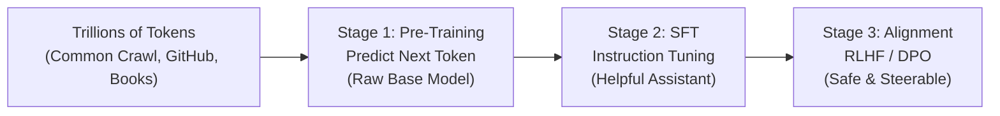
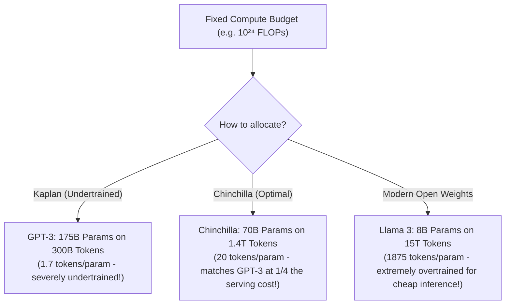
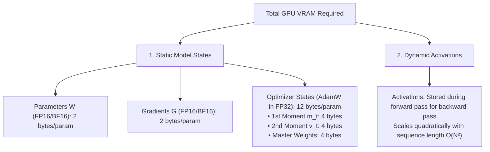
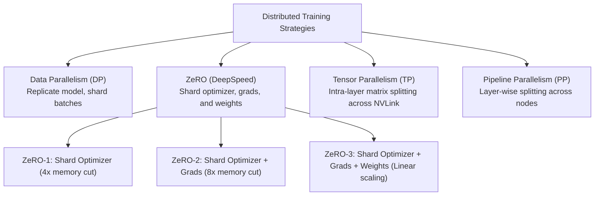
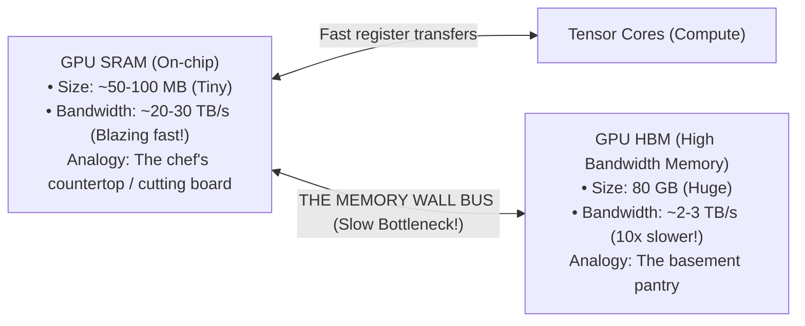
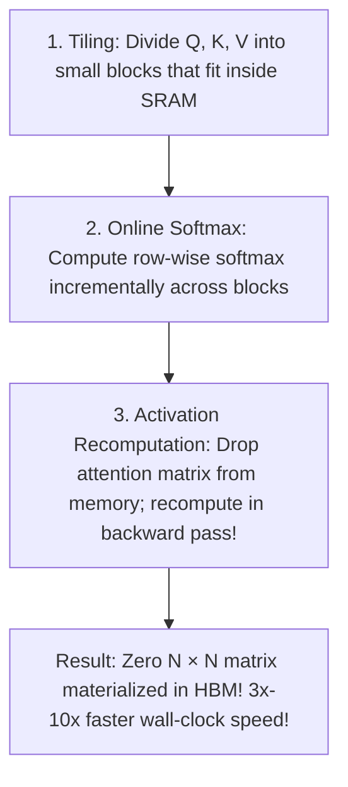
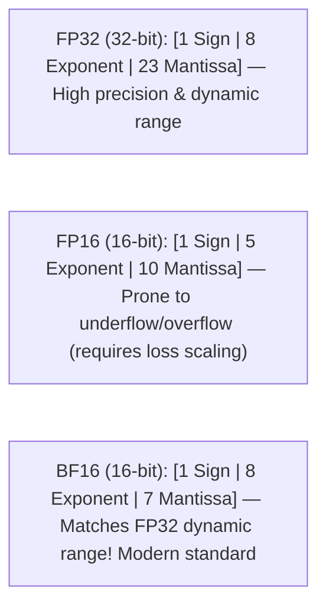
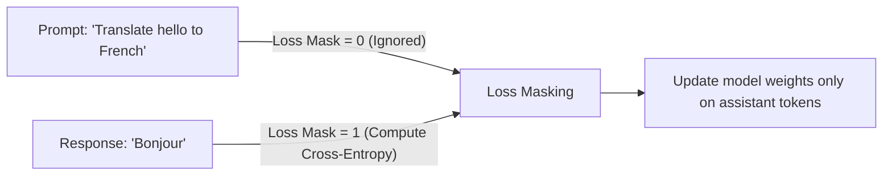
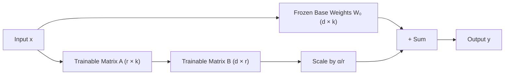

import { Callout } from 'fumadocs-ui/components/callout';
import { Tab, Tabs } from 'fumadocs-ui/components/tabs';
import { Accordion, Accordions } from 'fumadocs-ui/components/accordion';

> **Stanford CME 295: Transformers & Large Language Models** — Lecture 4  
> **Instructors:** Afshine Amidi & Shervine Amidi.

Building modern frontier models is an engineering discipline governed by the laws of physics, silicon memory bandwidth, and distributed systems. Training a 70-billion-parameter model from scratch costs millions of dollars in electricity and cloud compute; a single mistake in scaling ratios or distributed memory management can silently waste months of GPU cluster time.

This lesson unpacks the full training lifecycle: empirical **scaling laws (Kaplan vs. Chinchilla)**, the anatomical breakdown of **GPU VRAM consumption**, distributed training architectures (**ZeRO-1/2/3**, Tensor and Pipeline Parallelism), the memory-wall breakthrough of **FlashAttention**, and Parameter-Efficient Fine-Tuning (**LoRA and QLoRA**).

---

## Learning Objectives

By the end of this lesson you will be able to:

1. **Calculate compute-optimal pre-training budgets** using the Chinchilla scaling law ($D \approx 20 \times N$) and diagnose why early models like GPT-3 were undertrained.
2. **Itemize the GPU memory footprint** during training across model weights, gradients, optimizer states (AdamW), and activations.
3. **Contrast distributed parallelism strategies** — Data Parallelism (DP), ZeRO stages 1–3, Tensor Parallelism (TP), and Pipeline Parallelism (PP).
4. **Explain FlashAttention's IO-aware tiling and online softmax**, resolving the apparent paradox of why performing *more* arithmetic operations yields a $10\times$ faster wall-clock speedup.
5. **Implement and derive LoRA (Low-Rank Adaptation)** and analyze QLoRA's 4-bit NormalFloat (NF4) and Double Quantization mechanisms.

---

## 1. Paradigm Shift & Stage 1: Pre-Training

Modern AI represents a paradigm shift from task-specific models trained on narrow datasets to general foundational models trained on trillions of tokens via self-supervised next-token prediction:



### Pre-Training Corpora Scale

Frontier models ingest incomprehensible volumes of data:
- Common Crawl adds ~3 billion web pages every month.
- Llama 3 was pre-trained on **15 trillion tokens** (over 700 billion words of text and code).

---

### Empirical Scaling Laws: Kaplan vs. Chinchilla

How should an engineering team allocate a fixed budget of compute FLOPs ($C$)? Should you spend your budget making the model wider (more parameters $N$) or training longer (more tokens $D$)?

#### Kaplan et al. (OpenAI, 2020)
Early empirical research suggested that model parameters $N$ mattered far more than token volume $D$:
$$N \propto C^{0.73}, \qquad D \propto C^{0.27}$$
Based on this formula, AI labs built gigantic models trained on relatively small datasets. GPT-3 was released with **175 billion parameters**, but trained on only **300 billion tokens** ($\sim 1.7$ tokens per parameter).

#### The Chinchilla Breakthrough (Hoffmann et al., DeepMind, 2022)
DeepMind trained over 400 models ranging from 70M to 16B parameters to systematically re-evaluate the compute-optimal frontier. They proved that Kaplan's results were biased by learning rate decay schedules, and that parameters and tokens should scale in **equal proportion**:

$$N \propto C^{0.5}, \qquad D \propto C^{0.5}$$

This establishes the golden **Chinchilla Rule of Thumb**:
$$\mathbf{Tokens \ (D) \approx 20 \times Parameters \ (N)}$$



<Callout type="info">
**The Inference Cost Corollary:**  
While Chinchilla optimizes for *training compute*, in production, serving a model occurs millions of times every day. It is often economically advantageous to **overtrain** a smaller model (e.g., training Llama 3 8B on 15T tokens—almost $100\times$ beyond the Chinchilla point). The pre-training compute is higher, but the resulting small model is vastly cheaper to serve to users!
</Callout>

---

## 2. GPU Memory Footprint During Training

A common disaster for ML engineers: *“I have an 80GB NVIDIA H100 GPU. Why can't I train my 14B parameter model without hitting an Out-of-Memory (OOM) error?”*

To understand why, we must calculate the exact memory breakdown during mixed-precision training:



### The AdamW Memory Tax

In mixed-precision training (BF16 forward/backward, FP32 optimizer step):
- **Model Parameters ($W$):** $2 \text{ bytes} \times N$
- **Gradients ($G$):** $2 \text{ bytes} \times N$
- **AdamW Optimizer States:**
  - First momentum vector $m_t$ (FP32): $4 \text{ bytes} \times N$
  - Second momentum vector $v_t$ (FP32): $4 \text{ bytes} \times N$
  - FP32 Master Weights (for numeric stability): $4 \text{ bytes} \times N$
  - **Subtotal for AdamW:** $12 \text{ bytes} \times N$

$$\mathbf{\text{Static Memory per Parameter}} = 2 + 2 + 12 = \mathbf{16 \text{ Bytes per Parameter!}}$$

For a **70-billion-parameter model**:
$$\text{Static VRAM} = 70 \times 10^9 \times 16 \text{ Bytes} \approx \mathbf{1,120 \text{ GB of VRAM!}}$$
You need **fourteen 80GB GPUs** just to hold the model and optimizer in memory before computing a single activation!

---

## 3. Distributed Parallelism & ZeRO

When a model cannot fit on a single GPU, how do we distribute it across a cluster?



### ZeRO (Zero Redundancy Optimizer - Rajbhandari et al., 2020)

Standard Data Parallelism (DP) replicates the entire model, gradients, and optimizer on every GPU, which wastes memory. **ZeRO** eliminates this redundancy:

- **ZeRO Stage 1:** Shards the **optimizer states** across $N_d$ GPUs. Each GPU updates only $1/N_d$ of the parameters. Reduces memory by up to $4\times$ with zero communication overhead.
- **ZeRO Stage 2:** Shards both **optimizer states and gradients**. As gradients are computed in the backward pass, they are reduced directly to the GPU responsible for that parameter. Reduces memory by $8\times$.
- **ZeRO Stage 3:** Shards **optimizer states, gradients, and model parameters**. No GPU stores the full model. During the forward pass, parameters for a layer are gathered just-in-time from peer GPUs via an all-gather operation, used for computation, and immediately discarded from memory!

---

## 4. FlashAttention: Overcoming the Memory Wall

Tri Dao et al. (2022) identified that Transformers are bottlenecked not by arithmetic compute, but by **memory IO** (reading and writing data between GPU memory subsystems).

### The GPU Memory Hierarchy: The Chef's Kitchen Analogy



### The Standard Attention Bottleneck
Standard PyTorch attention computes:
$$S = Q K^T \in \mathbb{R}^{N \times N}$$
$$P = \text{softmax}(S) \in \mathbb{R}^{N \times N}$$
$$O = P V \in \mathbb{R}^{N \times d}$$

1. $Q, K$ are loaded from HBM to SRAM; $S$ is computed.
2. The entire $N \times N$ matrix $S$ is written back to HBM.
3. $S$ is read from HBM to SRAM to compute row-wise maximums.
4. $S$ is read from HBM to SRAM to compute exponentials and sum.
5. $P$ is written back to HBM.
6. $P$ and $V$ are read from HBM to compute $O$.

**The Memory Wall:** The GPU spends over 80% of its time walking to the basement pantry (HBM bus transfers) rather than executing arithmetic!

---

### FlashAttention's Innovations



1. **Tiling:** Divides the sequence into blocks of size $B_r \times B_c$ sized to fit completely within the GPU's fast SRAM.
2. **Online Softmax (Milakov & Gimelshein):** Computes exact softmax incrementally across blocks using running maximum $m(x)$ and running normalization scale $\ell(x)$:
   $$m_{\text{new}} = \max(m_{\text{old}}, m_{\text{block}}), \qquad \ell_{\text{new}} = \ell_{\text{old}} \cdot e^{m_{\text{old}} - m_{\text{new}}} + \ell_{\text{block}} \cdot e^{m_{\text{block}} - m_{\text{new}}}$$
   The entire softmax is computed in a single pass without ever materializing the massive $N \times N$ attention matrix in HBM!
3. **Activation Recomputation (The Efficiency Paradox):** FlashAttention does not save the intermediate attention weights during the forward pass. In the backward pass, it quickly recomputes them on the fly in SRAM.  
   *Even though it performs more total arithmetic operations (FLOPs), it runs up to $10\times$ faster because it completely eliminates HBM memory transfer bottlenecks!*

---

## 5. Numerical Precision: FP32, FP16 & BF16



- **FP16:** Has only 5 exponent bits ($[-14, 15]$ range). Extremely prone to **underflow** (gradients becoming 0) or **overflow** (gradients becoming `NaN`). Requires fragile dynamic loss scaling.
- **BF16 (Bfloat16):** Preserves the full 8-bit exponent of FP32 while reducing mantissa precision to 7 bits. Eliminates overflow risks, requires zero loss scaling, and has become the universal standard for modern LLM training.

---

## 6. Stage 2: Supervised Fine-Tuning (SFT)

Pre-trained models are raw document autocomplete engines. If you ask a pre-trained base model:
> *"What is the capital of France?"*

It might complete the prompt with:
> *"\nWhat is the capital of Germany?\nWhat is the capital of Spain?"*

### Transforming Autocomplete into an Assistant
**Supervised Fine-Tuning (SFT)** trains the model on curated `(Prompt, Response)` conversations to adopt an instruction-following persona.



<Callout type="warn">
**Prompt Loss Masking:**  
During SFT, standard cross-entropy loss is applied **strictly to the response tokens**. Prompt tokens have their loss masked to zero. Penalizing the model for predicting the user's prompt degrades conversational flexibility.
</Callout>

---

## 7. Parameter-Efficient Fine-Tuning: LoRA & QLoRA

Fine-tuning all 70 billion parameters (Full Fine-Tuning) requires thousands of gigabytes of optimizer memory and creates a separate 140GB model checkpoint for every downstream task.

### LoRA (Low-Rank Adaptation - Hu et al., 2021)

Aghajanyan et al. (2020) demonstrated that the weight updates $\Delta W$ during task adaptation have a very low **intrinsic rank**.

Instead of updating the full weight matrix $W_0 \in \mathbb{R}^{d \times k}$, **LoRA freezes $W_0$** and decomposes the update into the product of two low-rank matrices:

$$W = W_0 + \Delta W = W_0 + \frac{\alpha}{r} (B \cdot A)$$

Where:
- $B \in \mathbb{R}^{d \times r}$ (initialized to all zeros).
- $A \in \mathbb{R}^{r \times k}$ (initialized with Gaussian noise).
- Rank $r \ll \min(d, k)$ (typically $r \in [4, 16]$).
- $\alpha$ is a constant scaling hyperparameter.



**Why LoRA is Elegant:**
1. **Zero Serving Latency:** At deployment, you can permanently merge the weights: $W_{\text{merged}} = W_0 + \frac{\alpha}{r}(BA)$.
2. **$99.9\%$ Memory Reduction:** Reduces trainable parameters from 70B to ~50M, allowing fine-tuning on a single workstation.
3. **Stanford CME 295 Finding:** Applying LoRA to the **Feed-Forward Network (FFN)** blocks delivers the vast majority of performance gains compared to adapting attention matrices alone.

---

### QLoRA (Dettmers et al., 2023)

QLoRA pushes efficiency further, enabling fine-tuning of a 70B model on a single 48GB GPU by combining three innovations:

1. **4-bit NormalFloat (NF4):** A mathematically optimal quantile quantization data type for normally distributed weights.
2. **Double Quantization (DQ):** Quantizes the quantization constants themselves, saving ~0.37 bits per parameter.
3. **Paged Optimizers:** Uses CUDA Unified Memory to automatically page optimizer states to CPU RAM during memory spikes, preventing OOM crashes.

---

## 8. Production Python: LoRA Linear Layer from Scratch

```python
"""
lora_implementation.py
Complete, from-scratch implementation of Low-Rank Adaptation (LoRA) in PyTorch.
Demonstrates forward pass, parameter freezing, and zero-latency weight merging.
"""
from __future__ import annotations

import math
import torch
import torch.nn as nn


class LoRALinear(nn.Module):
    """Linear layer augmented with Low-Rank Adaptation (LoRA).

    Forward formulation: y = x W_0^T + (alpha / r) * (x A^T B^T)
    """

    def __init__(
        self,
        in_features: int,
        out_features: int,
        rank: int = 8,
        alpha: float = 16.0,
    ) -> None:
        super().__init__()
        self.in_features = in_features
        self.out_features = out_features
        self.rank = rank
        self.scaling = alpha / rank

        # 1. Base linear layer (frozen during fine-tuning)
        self.base_layer = nn.Linear(in_features, out_features, bias=False)
        self.base_layer.weight.requires_grad = False

        # 2. LoRA low-rank decomposition matrices
        # A: projects from in_features down to rank r
        self.lora_A = nn.Parameter(torch.empty(rank, in_features))
        # B: projects from rank r up to out_features
        self.lora_B = nn.Parameter(torch.zeros(out_features, rank))

        # 3. Initialization: A ~ Gaussian, B = 0 so Delta W starts at exactly 0!
        nn.init.kaiming_uniform_(self.lora_A, a=math.sqrt(5))
        nn.init.zeros_(self.lora_B)

        self.merged = False

    def forward(self, x: torch.Tensor) -> torch.Tensor:
        if self.merged:
            return self.base_layer(x)

        # Compute frozen base forward pass
        base_out = self.base_layer(x)

        # Compute low-rank adapter path: (x @ A^T) @ B^T * scaling
        lora_out = (x @ self.lora_A.T) @ self.lora_B.T * self.scaling

        return base_out + lora_out

    def merge_weights(self) -> None:
        """Permanently merges LoRA weights into base weights for zero-latency inference."""
        if self.merged:
            return
        # W_merged = W_0 + scaling * (B @ A)
        delta_w = (self.lora_B @ self.lora_A) * self.scaling
        self.base_layer.weight.data += delta_w
        self.merged = True
        print("LoRA weights successfully merged into base weight tensor!")


if __name__ == "__main__":
    torch.manual_seed(42)

    in_dim, out_dim = 1024, 4096
    rank = 8

    lora_layer = LoRALinear(in_dim, out_dim, rank=rank, alpha=16.0)

    # Verify parameter counts
    base_params = in_dim * out_dim
    trainable_params = sum(p.numel() for p in lora_layer.parameters() if p.requires_grad)

    print(f"Base Parameters: {base_params:,}")
    print(f"Trainable LoRA Parameters: {trainable_params:,}")
    print(f"Parameter Reduction: {100 * (1 - trainable_params / base_params):.2f}%")

    sample_x = torch.randn(2, in_dim)
    output_before_merge = lora_layer(sample_x)

    lora_layer.merge_weights()
    output_after_merge = lora_layer(sample_x)

    # Check numerical equivalence
    diff = torch.max(torch.abs(output_before_merge - output_after_merge)).item()
    print(f"Max difference between adapter and merged output: {diff:.6e}")
```

---

## 9. Key Takeaways

| Concept | Mathematical Rule | Engineering Significance |
|---|---|---|
| **Chinchilla Law** | $\text{Tokens } D \approx 20 \times \text{Params } N$ | Proved GPT-3 was undertrained; established compute-optimal pre-training budgets. |
| **AdamW Memory Tax** | 16 bytes per parameter | Optimizer states take $3\times$ more VRAM than the model weights themselves! |
| **ZeRO-3** | Shards weights, gradients, and optimizer | Enables training models larger than total single-GPU memory across clusters. |
| **FlashAttention** | Tiling + Online Softmax in SRAM | Solves the memory-bandwidth wall; $10\times$ faster training with exact results. |
| **BF16 Precision** | 8 exponent bits, 7 mantissa bits | Matches FP32 dynamic range, eliminating gradient underflow without loss scaling. |
| **SFT Loss Masking** | Mask prompt tokens from cross-entropy | Prevents model from memorizing user input patterns; trains only responses. |
| **LoRA** | $\Delta W = \frac{\alpha}{r} (B \cdot A)$ | Freezes base weights; fine-tunes low-rank matrices for $99\%$ VRAM reduction. |

---

## 10. Self-Check & Retrieval Practice

<Accordions>
<Accordion title="1. Compute-Optimal Budget Calculation">
**Question:** You have a fixed compute budget of $3 \times 10^{24}$ FLOPs. According to Chinchilla scaling laws, should you train a 100-billion-parameter model on 500 billion tokens, or a 50-billion-parameter model on 1 trillion tokens?

<details>
<summary>Click to view solution</summary>

**Explanation:**  
Under Chinchilla laws, compute is optimal when $\text{Tokens} \approx 20 \times \text{Parameters}$.  
- Model 1: Ratio is $500\text{B} / 100\text{B} = 5$ tokens per parameter (severely undertrained).  
- Model 2: Ratio is $1000\text{B} / 50\text{B} = 20$ tokens per parameter (compute-optimal!).  
The 50B model trained on 1 trillion tokens will outperform the 100B model on every benchmark and will be $2\times$ faster and cheaper to serve in production.
</details>
</Accordion>

<Accordion title="2. The FlashAttention Paradox">
**Question:** FlashAttention performs *more* total floating-point arithmetic operations than standard attention because it recomputes attention in the backward pass. Why is it up to $10\times$ faster?

<details>
<summary>Click to view solution</summary>

**Explanation:**  
Modern GPUs have immense arithmetic compute power (hundreds of TFLOPs), but limited memory bus bandwidth between HBM and on-chip SRAM. Standard attention is **memory-bandwidth bound**, spending most clock cycles reading and writing $N \times N$ matrices to HBM.  
FlashAttention eliminates all HBM memory roundtrips. Executing extra arithmetic cycles directly inside fast SRAM is dramatically faster than waiting for data to travel across the physical HBM memory bus.
</details>
</Accordion>

<Accordion title="3. LoRA Weight Initialization Invariant">
**Question:** In LoRA ($\Delta W = B \cdot A$), matrix $A$ is initialized with Gaussian noise, but matrix $B$ is initialized strictly to zero. Why?

<details>
<summary>Click to view solution</summary>

**Explanation:**  
If both $A$ and $B$ were initialized with random non-zero values, their product $B \cdot A$ would produce a random perturbation $\Delta W \neq 0$ at step 0. This would immediately corrupt the pre-trained model's representations.  
By initializing $B = 0$, the update $\Delta W = 0 \cdot A = 0$ is exactly zero at initialization. The model begins fine-tuning from its exact pre-trained baseline.
</details>
</Accordion>
</Accordions>

---

## Next Steps

Now that we have pre-trained and fine-tuned our model, how do we align its behavior with human preferences, values, and safety constraints? 

In the next lesson, we examine **LLM Tuning & Alignment**: the **Bradley-Terry preference model**, **RLHF with PPO** (and why it requires 4 models in GPU memory), and the mathematical derivation of **Direct Preference Optimization (DPO)**.

[Next: Alignment, RLHF, PPO & Direct Preference Optimization →](/docs/ai-agents/agentic-ai/05-alignment-rlhf-and-dpo)
