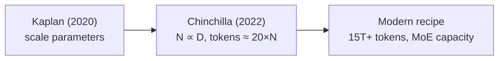
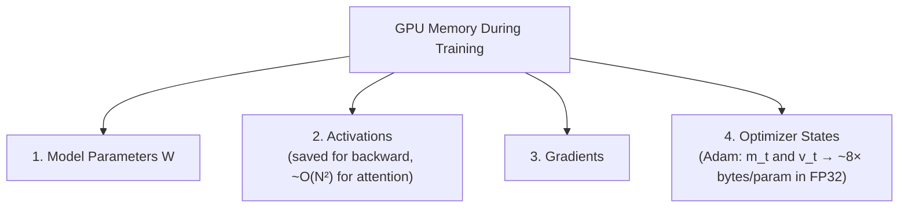
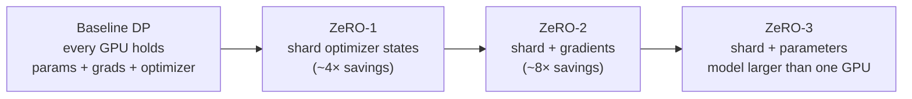
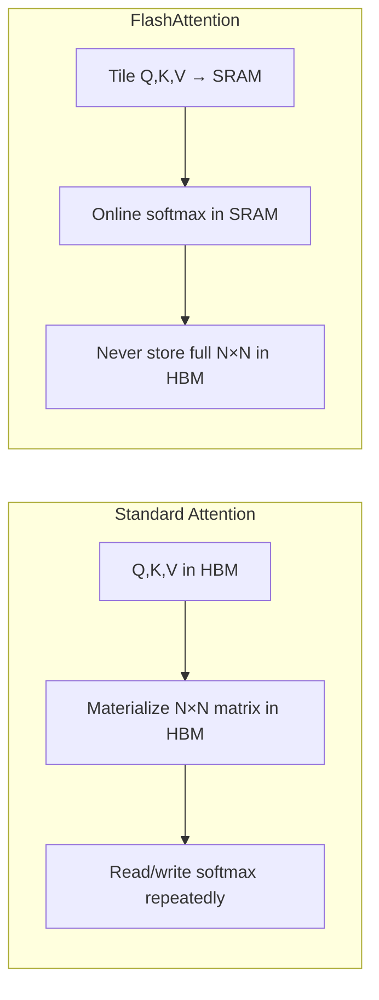
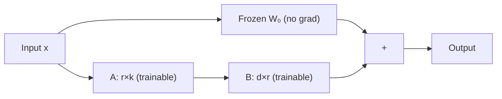

> **Stanford CME 295: Transformers & Large Language Models** — Lecture 4
> **Instructors:** Afshine Amidi & Shervine Amidi.

How does raw next-token prediction turn into world knowledge, and how do you fit a trillion-parameter training run onto a finite cluster? This lecture covers the **pre-training pipeline**, the memory math behind distributed training, **FlashAttention**, and the parameter-efficient fine-tuning methods that let anyone adapt a large model on a small GPU.

---

## Learning Objectives

1. **Apply the Chinchilla scaling law** and explain why GPT-3 was undertrained.
2. **Account for the GPU memory budget** during training (params, activations, gradients, optimizer states).
3. **Compare distributed parallelism strategies** — data, tensor, pipeline, expert — and detail ZeRO stages 1–3.
4. **Explain FlashAttention's** tiling and recomputation tricks and the memory-wall intuition.
5. **Derive LoRA** ($\Delta W = BA$) and explain QLoRA's NF4 quantization and double quantization.

---

## Stage 1: Pre-Training

The paradigm shift of the 2020s: instead of training a model per task, pre-train a foundation model on general corpora, then adapt it. Corpora reach trillions of tokens (Common Crawl ~3B pages/month, Wikipedia, GitHub, Stack Overflow); Llama 3 was trained on ~15T tokens.

### Scaling laws

- **Kaplan et al. (2020):** loss scales as a power law with compute, dataset size, and parameters.
- **Chinchilla (Hoffmann et al., 2022):** the compute-optimal recipe scales parameters and tokens *proportionally*:

$$\text{Tokens} \approx 20 \times \text{Parameters}$$

This proved models like GPT-3 (175B params, ~300B tokens) were **severely undertrained** — they left capability on the table by scaling parameters faster than data.



---

## GPU Memory Footprint During Training

Training needs far more memory than inference. Four consumers:



Adam keeps two momentum buffers per parameter, so optimizer states alone can cost ~$8\times$ the parameter bytes in FP32.

---

## Distributed Parallelism

| Strategy | What is split | Notes |
|---|---|---|
| **Data Parallelism (DP)** | Data batch | Replicate weights; sync gradients via all-reduce |
| **Tensor Parallelism (TP)** | Intra-layer matrices | Splits each layer across devices |
| **Pipeline Parallelism (PP)** | Layers | Splits the model by depth |
| **Expert Parallelism (EP)** | MoE experts | Routes different experts to different devices |

### ZeRO (Zero Redundancy Optimizer)

ZeRO eliminates duplicate copies of training state across data-parallel ranks:



---

## FlashAttention (Dao et al., 2022)

### The GPU memory hierarchy

- **HBM (High Bandwidth Memory):** large (~80 GB on an H100) but slow (~few TB/s).
- **SRAM (on-chip):** tiny (tens of MB) but extremely fast (~10× bandwidth).

### The memory wall

Standard attention materializes the full $N \times N$ attention matrix and repeatedly reads/writes it to HBM during the softmax normalization. At long sequence lengths, this I/O dominates.

### FlashAttention's two ideas

1. **Tiling:** partition $Q, K, V$ into blocks that fit in SRAM; compute an **online softmax** incrementally without ever writing the full $N \times N$ matrix to HBM.
2. **Activation recomputation:** discard intermediate attention activations in the forward pass and recompute them in SRAM during the backward pass.

The paradox: FlashAttention does *more* arithmetic (higher GFLOPs) but is up to **~10× faster** in wall-clock time because it eliminates the HBM bottleneck.



---

## Numerical Precision & Mixed-Precision Training

| Format | Sign | Exponent | Mantissa | Notes |
|---|---|---|---|---|
| **FP32** | 1 | 8 | 23 | Master weights; full range+precision |
| **FP16** | 1 | 5 | 10 | Fast, but limited dynamic range |
| **BF16** | 1 | 8 | 7 | Matches FP32 range — the modern default |

**Mixed precision:** keep master weights in FP32; compute forward/backward in BF16/FP16; accumulate gradients and apply updates in FP32.

---

## Stage 2: Supervised Fine-Tuning (SFT)

SFT turns a raw autocomplete base model into a helpful assistant.

- **Loss masking:** cross-entropy is applied **only to response tokens**; prompt tokens are masked out of the loss.
- **Data scale:** pre-training uses trillions of tokens; SFT uses thousands to low millions of curated examples (Llama 3 used ~10M).
- **Mid-training:** an emerging intermediate phase that continues pre-training on high-quality domain corpora (code, math, science) before SFT.

---

## Parameter-Efficient Fine-Tuning: LoRA & QLoRA

### LoRA (Low-Rank Adaptation, Hu et al. 2021)

Freeze the base weight $W_0$ and learn a low-rank update:

$$W = W_0 + \Delta W = W_0 + B \cdot A$$

with $B \in \mathbb{R}^{d \times r}$, $A \in \mathbb{R}^{r \times k}$, and rank $r \ll \min(d,k)$ (typically $r \in [4, 16]$).



Key finding: applying LoRA to **FFN** blocks yields most of the downstream gains (more than attention-only adaptation).

### QLoRA (Dettmers et al., 2023)

- Quantize the frozen base weights to **4-bit NormalFloat (NF4)** — a quantile-based encoding optimal for normally distributed weights.
- Train adapters in 16-bit (BF16).
- **Double quantization:** quantize the quantization constants too, saving ~0.37 bits/parameter.
- Enables fine-tuning large models on a **single consumer GPU**.

---

## Production Python: LoRA Layer

```python
"""
lora.py
A drop-in LoRA linear layer plus a QLoRA-style NF4 quantization sketch.
"""
from __future__ import annotations

import math
import torch
import torch.nn as nn


class LoRALinear(nn.Module):
    """Wrap a frozen nn.Linear with trainable low-rank B·A adapters."""

    def __init__(self, base: nn.Linear, rank: int = 8, alpha: float = 16.0) -> None:
        super().__init__()
        self.base = base
        for p in self.base.parameters():
            p.requires_grad = False  # freeze W0

        self.rank = rank
        self.scaling = alpha / rank

        in_features = base.in_features
        out_features = base.out_features

        # A is initialized with random Gaussian; B is zero so ΔW starts at 0.
        self.A = nn.Parameter(torch.randn(rank, in_features) / math.sqrt(rank))
        self.B = nn.Parameter(torch.zeros(out_features, rank))

    def forward(self, x: torch.Tensor) -> torch.Tensor:
        frozen = self.base(x)
        adapter = (x @ self.A.T) @ self.B.T * self.scaling   # x·Aᵀ·Bᵀ · (α/r)
        return frozen + adapter


def nf4_quantize(weight: torch.Tensor, block_size: int = 64) -> tuple[torch.Tensor, torch.Tensor]:
    """Block-wise 4-bit NormalFloat quantization.

    Maps each block to 16 quantile levels of a standard normal, then scales.
    Returns (quantized int8 codes, per-block absmax).
    """
    flat = weight.flatten()
    pad = (-flat.numel()) % block_size
    if pad:
        flat = torch.cat([flat, torch.zeros(pad)])
    blocks = flat.view(-1, block_size)

    absmax = blocks.abs().amax(dim=1, keepdim=True).clamp(min=1e-8)
    normalized = blocks / absmax                      # in roughly [-1, 1]

    # 16 evenly spaced quantiles of N(0,1), mapped to [-1, 1]
    levels = torch.linspace(-1.0, 1.0, 16)
    idx = torch.bucketize(normalized, (levels[:-1] + levels[1:]) / 2.0)
    codes = (idx - 8).to(torch.int8)                  # signed 4-bit codes
    return codes, absmax


if __name__ == "__main__":
    torch.manual_seed(0)
    base = nn.Linear(768, 768)
    layer = LoRALinear(base, rank=8, alpha=16.0)

    x = torch.randn(2, 16, 768)
    y = layer(x)
    trainable = sum(p.numel() for p in layer.parameters() if p.requires_grad)
    total = sum(p.numel() for p in layer.parameters())
    print(f"Output: {y.shape} | trainable: {trainable:,} / {total:,} "
          f"({100 * trainable / total:.2f}%)")

    w = torch.randn(1024, 1024)
    codes, absmax = nf4_quantize(w)
    print("NF4 codes:", codes.dtype, codes.shape, "| blocks:", absmax.shape)
```

---

## Key Takeaways

| Concept | Key Point |
|---|---|
| Chinchilla | $\text{Tokens} \approx 20 \times \text{Parameters}$; compute-optimal scaling |
| Memory budget | Params + activations + gradients + optimizer states |
| ZeRO-3 | Shards optimizer states, gradients, *and* parameters |
| FlashAttention | IO-aware tiling + recomputation beats the memory wall |
| BF16 | FP32-like range with half the bytes |
| SFT loss masking | Train only on response tokens |
| LoRA | $\Delta W = BA$ with tiny rank $r$ |
| QLoRA | 4-bit NF4 base + BF16 adapters on one GPU |

---

## Next Steps

Pre-training gives knowledge; SFT gives format. But neither teaches a model *what people prefer*. Next we study **alignment**: preference data, the Bradley-Terry reward model, RLHF with PPO, and the elegant closed-form derivation of Direct Preference Optimization (DPO).

[Next: Alignment, RLHF, PPO & DPO →](/docs/ai-agents/agentic-ai/05-alignment-rlhf-and-dpo)
