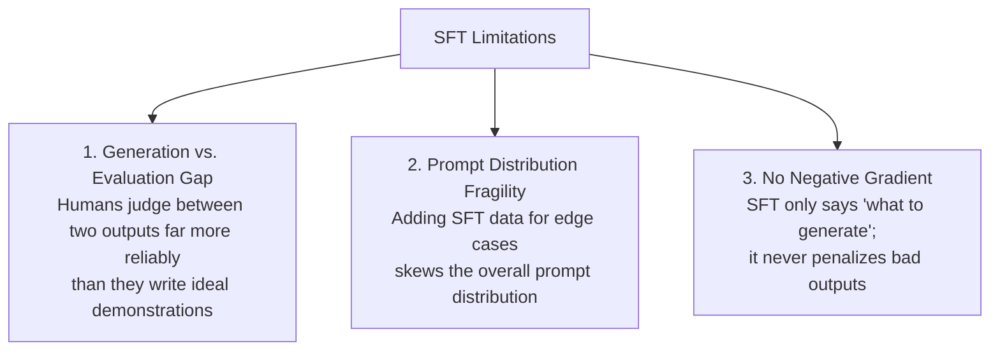
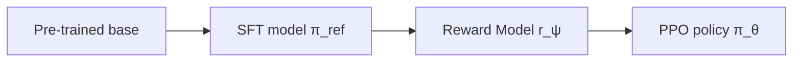
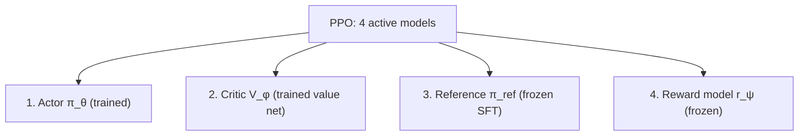
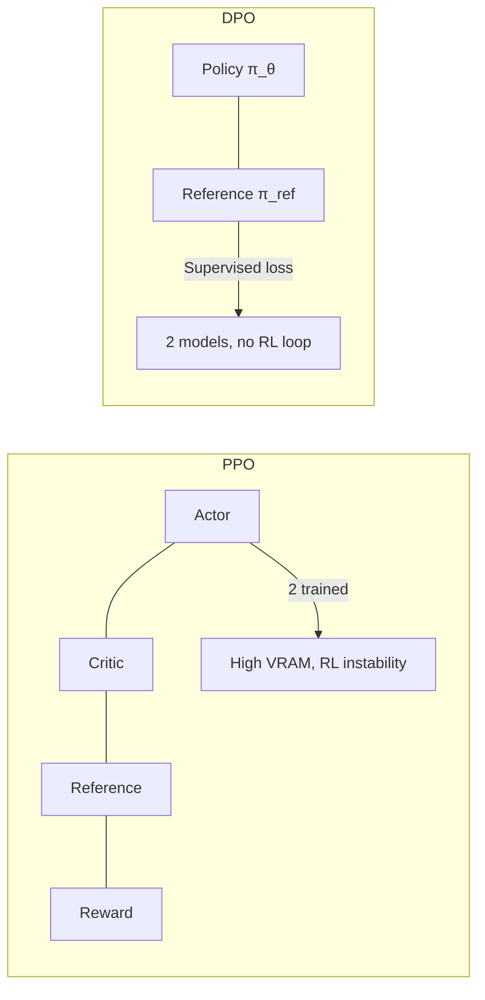

> **Stanford CME 295: Transformers & Large Language Models** — Lecture 5
> **Instructors:** Afshine Amidi & Shervine Amidi.

Supervised fine-tuning teaches a model *what to say*; it cannot teach *what people prefer*. Alignment closes that gap. This lecture derives the two dominant approaches — **RLHF/PPO** and **Direct Preference Optimization (DPO)** — and shows why DPO is "your language model is secretly a reward model."

---

## Learning Objectives

1. **Explain why SFT alone fails for alignment** (evaluation is easier than generation, no negative gradients).
2. **Collect and structure preference data** — pointwise vs. pairwise vs. listwise.
3. **Derive the Bradley-Terry reward model** and its pairwise loss.
4. **Formulate PPO** for LLMs, including the KL penalty's role against reward hacking.
5. **Derive the closed-form DPO loss** from the KL-regularized objective and compare it to PPO.

---

## Why SFT Is Not Enough

The three-stage lifecycle: **Pre-training → SFT → Preference Tuning**.

SFT alone fails for alignment for three reasons:



---

## Preference Data Collection

| Modality | Description | Trade-off |
|---|---|---|
| **Pointwise** | Absolute score per response | Noisy across raters |
| **Pairwise** | Head-to-head `y_w ≻ y_l` | High consistency — the industry standard |
| **Listwise** | Full ranking of $k$ responses | Richest, most expensive |

Pairwise data generation: take prompt $x$, sample two completions $y_1, y_2$ at $T>0$, have annotators (human or LLM-judge) pick the winner $y_w$ and loser $y_l$.

---

## RLHF as an RL Problem

Map the LLM onto a Markov decision process:

- **State $s_t$:** context so far.
- **Action $a_t$:** next token from vocabulary $\mathcal{V}$.
- **Policy $\pi_\theta(a \mid s)$:** the LLM's probability distribution.
- **Reward $R$:** a scalar for the whole completion.



### Stage 1: Reward Modeling (Bradley-Terry)

The Bradley-Terry model expresses the probability that $y_i$ beats $y_j$ as a sigmoid of the reward difference:

$$P(y_i \succ y_j \mid x) = \frac{\exp(r(x, y_i))}{\exp(r(x, y_i)) + \exp(r(x, y_j))} = \sigma\!\left(r(x, y_i) - r(x, y_j)\right)$$

The reward model is trained by minimizing the negative log-likelihood over preference pairs:

$$\mathcal{L}_{\text{RM}}(\psi) = -\mathbb{E}_{(x, y_w, y_l) \sim \mathcal{D}}\left[\log \sigma\!\left(r_\psi(x, y_w) - r_\psi(x, y_l)\right)\right]$$

Note: the reward model is **trained pairwise but used pointwise** — at inference it scores a single response.

### Stage 2: Policy Optimization with PPO

PPO maximizes reward while penalizing drift from the reference policy $\pi_{\text{ref}}$:

$$\max_\theta \; \mathbb{E}_{x \sim \mathcal{D},\, y \sim \pi_\theta}\left[r(x, y)\right] - \beta\, D_{\text{KL}}\!\left(\pi_\theta(y \mid x) \,\|\, \pi_{\text{ref}}(y \mid x)\right)$$

The **KL penalty** is essential: without it, the policy **reward-hacks** — exploiting flaws in the reward model (Goodhart's Law) and catastrophically forgetting its base behavior.

**PPO-clip** restricts the importance ratio $\pi_\theta / \pi_{\text{old}}$ to $[1-\epsilon, 1+\epsilon]$ to prevent destabilizing updates.

The cost is memory: PPO needs **four models in GPU memory at once**:



---

## Inference-Time Alignment: Best-of-N

Instead of training, generate $N$ candidates, score each with the reward model, and return the best. It bypasses RL entirely but costs $N\times$ compute and inflates tail latency (bounded by the slowest sample).

---

## Direct Preference Optimization (DPO)

### The key insight

> *"Your Language Model is Secretly a Reward Model."* — Rafailov et al., 2023

The optimal policy under the KL-regularized RL objective has an exact closed-form solution:

$$\pi^*(y \mid x) = \frac{1}{Z(x)}\,\pi_{\text{ref}}(y \mid x)\,\exp\!\left(\frac{1}{\beta} r(x, y)\right)$$

Inverting for the implicit reward:

$$r(x, y) = \beta \log \frac{\pi^*(y \mid x)}{\pi_{\text{ref}}(y \mid x)} + \beta \log Z(x)$$

Substituting into the Bradley-Terry model, the partition function $Z(x)$ **cancels completely** between winner and loser:

$$r(x, y_w) - r(x, y_l) = \beta \log \frac{\pi^*(y_w \mid x)}{\pi_{\text{ref}}(y_w \mid x)} - \beta \log \frac{\pi^*(y_l \mid x)}{\pi_{\text{ref}}(y_l \mid x)}$$

This yields a pure **supervised** loss over preference pairs:

$$\mathcal{L}_{\text{DPO}}(\theta; \pi_{\text{ref}}) = -\mathbb{E}_{(x, y_w, y_l) \sim \mathcal{D}}\!\left[\log \sigma\!\left(\beta \log \frac{\pi_\theta(y_w \mid x)}{\pi_{\text{ref}}(y_w \mid x)} - \beta \log \frac{\pi_\theta(y_l \mid x)}{\pi_{\text{ref}}(y_l \mid x)}\right)\right]$$



### PPO vs. DPO

| Dimension | PPO (RLHF) | DPO |
|---|---|---|
| Models in memory | 4 (actor, critic, ref, reward) | 2 (policy, ref) |
| Optimization | On-policy RL | Offline supervised |
| Stability | Sensitive, needs tuning | Stable, simple |
| Failure mode | Reward hacking | Offline distribution shift |

---

## Production Python: DPO Loss

```python
"""
dpo.py
The Direct Preference Optimization loss, implemented from the paper.
"""
from __future__ import annotations

import torch
import torch.nn.functional as F


def sequence_logprob(
    logits: torch.Tensor,   # (B, T, V)
    labels: torch.Tensor,   # (B, T)
    mask: torch.Tensor,     # (B, T) 1 for completion tokens, 0 for prompt/pad
) -> torch.Tensor:
    """Sum log P(token) over completion tokens only."""
    log_probs = F.log_softmax(logits, dim=-1)
    token_logp = log_probs.gather(-1, labels.unsqueeze(-1)).squeeze(-1)  # (B, T)
    return (token_logp * mask).sum(dim=-1)                              # (B,)


def dpo_loss(
    policy_chosen_logp: torch.Tensor,     # log π_θ(y_w | x)
    policy_rejected_logp: torch.Tensor,   # log π_θ(y_l | x)
    ref_chosen_logp: torch.Tensor,        # log π_ref(y_w | x)
    ref_rejected_logp: torch.Tensor,      # log π_ref(y_l | x)
    beta: float = 0.1,
) -> tuple[torch.Tensor, torch.Tensor]:
    """Return (loss, implicit reward margin)."""
    # Implicit reward: beta * log(pi / pi_ref)
    chosen_reward = beta * (policy_chosen_logp - ref_chosen_logp)
    rejected_reward = beta * (policy_rejected_logp - ref_rejected_logp)

    # -log sigmoid(chosen_reward - rejected_reward)
    logits = chosen_reward - rejected_reward
    loss = -F.logsigmoid(logits).mean()
    return loss, logits.detach()


if __name__ == "__main__":
    torch.manual_seed(0)
    B = 4
    # Suppose chosen responses have higher policy logprob than rejected ones.
    pol_chosen = torch.tensor([-5.0, -3.0, -8.0, -2.0])
    pol_rejected = torch.tensor([-9.0, -4.0, -7.5, -6.0])
    ref_chosen = torch.tensor([-6.0, -3.5, -8.0, -2.5])
    ref_rejected = torch.tensor([-8.0, -4.0, -7.0, -5.0])

    loss, margin = dpo_loss(pol_chosen, pol_rejected, ref_chosen, ref_rejected, beta=0.1)
    print(f"DPO loss: {loss.item():.4f} | reward margin: {margin.tolist()}")
```

---

## Key Takeaways

| Concept | Key Point |
|---|---|
| Why align | Judging preferences is easier than writing perfect demonstrations |
| Bradley-Terry | $P(y_w \succ y_l) = \sigma(r(y_w) - r(y_l))$ |
| Reward model | Trained pairwise, used pointwise |
| PPO KL penalty | Prevents reward hacking and catastrophic forgetting |
| PPO memory | 4 models in VRAM |
| DPO insight | The optimal policy implicitly *is* a reward model |
| DPO advantage | 2 models, supervised loss, no RL loop |

---

## Next Steps

Alignment shapes *preferences*. Reasoning is a different axis entirely: instead of one forward pass, a model learns to **think longer**. Next we cover test-time compute, the pass@k metric, and the critic-free **GRPO** algorithm that powered DeepSeek-R1.

[Next: LLM Reasoning — Test-Time Compute, GRPO & DeepSeek-R1 →](/docs/ai-agents/agentic-ai/06-llm-reasoning-grpo-and-r1)
