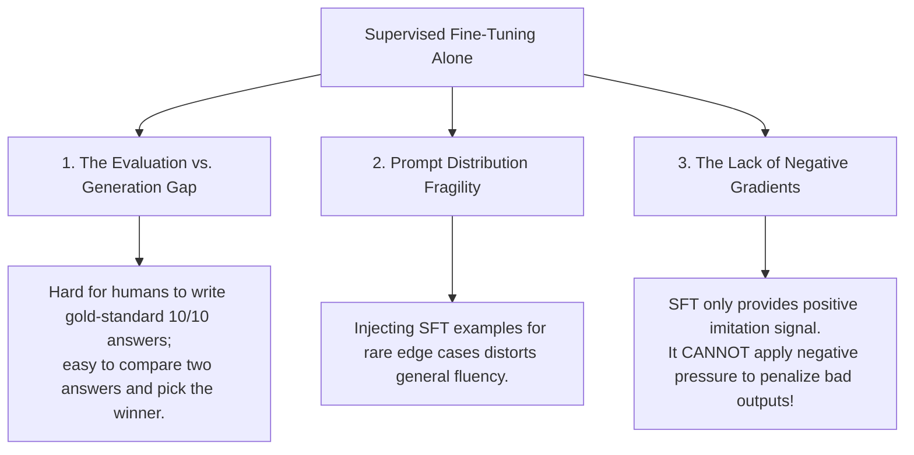
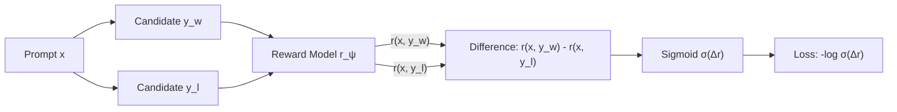
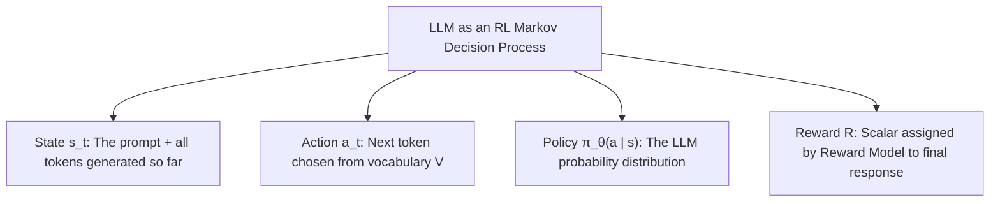
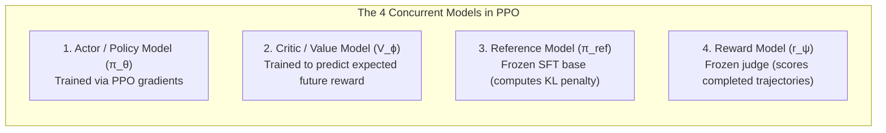
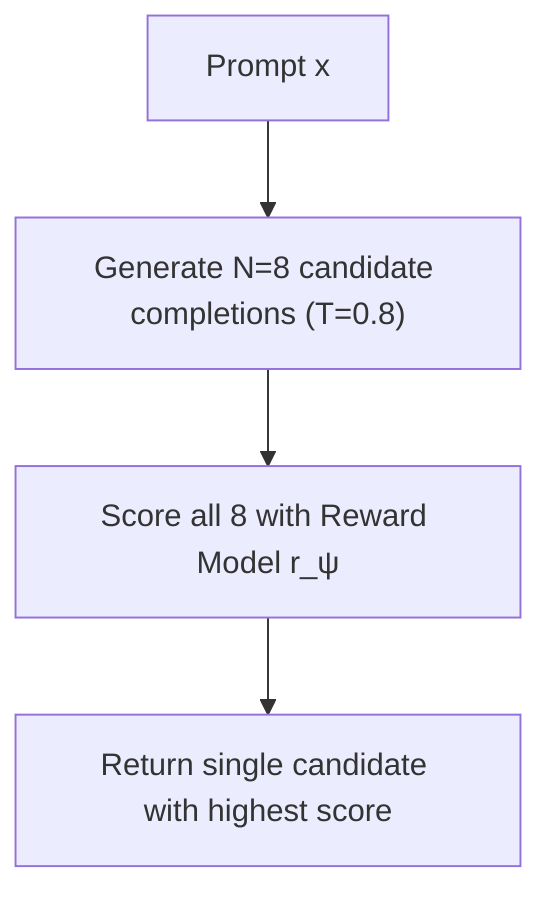
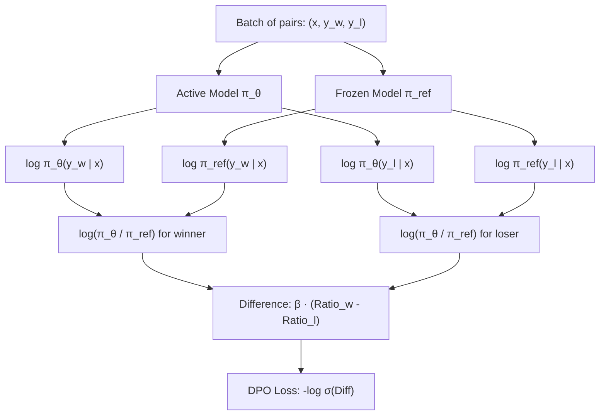

import { Callout } from 'fumadocs-ui/components/callout';
import { Tab, Tabs } from 'fumadocs-ui/components/tabs';
import { Accordion, Accordions } from 'fumadocs-ui/components/accordion';

> **Stanford CME 295: Transformers & Large Language Models** — Lecture 5  
> **Instructors:** Afshine Amidi & Shervine Amidi.

After pre-training and supervised fine-tuning, a model knows language and can follow instructions. But it still suffers from three critical flaws: it hallucinates plausible-sounding falsehoods, outputs toxic or dangerous content when prompted, and produces verbose, evasive answers.

This lesson explores **Preference Tuning (Alignment)**: how we teach models human values and steerability. We dissect the **Bradley-Terry preference model**, the multi-stage pipeline of **Reinforcement Learning from Human Feedback (RLHF)** via **PPO**, the pathology of **Reward Hacking**, and the revolutionary closed-form breakthrough of **Direct Preference Optimization (DPO)**.

---

## Learning Objectives

By the end of this lesson you will be able to:

1. **Diagnose why SFT alone fails** for alignment, contrasting the evaluation vs. generation gap and explaining the necessity of negative gradients.
2. **Formulate the Bradley-Terry preference model** and train a pointwise Reward Model on pairwise human preference comparisons.
3. **Trace the RLHF PPO training loop**, identifying the roles of the 4 concurrent models (Actor, Critic, Reference, Reward) and the mathematical necessity of the KL divergence penalty.
4. **Identify Reward Hacking** (Goodhart's Law) and evaluate Best-of-N (BoN) inference-time alignment.
5. **Derive Direct Preference Optimization (DPO)** from first principles, demonstrating how the partition function $Z(x)$ cancels out to convert RL into a simple supervised loss.

---

## 1. Why Supervised Fine-Tuning (SFT) Fails for Alignment

After pre-training on trillions of tokens, we perform Supervised Fine-Tuning (**SFT**) on thousands of curated high-quality prompts and answers. Why can't we stop there?



### 1. The Evaluation vs. Generation Gap
Writing a world-class explanation of quantum electrodynamics from scratch takes an expert several hours. But if you show that same expert two model completions ($y_1$ and $y_2$), they can determine in 30 seconds which one is more coherent, rigorous, and accurate.  
*Evaluating and ranking is vastly cheaper and higher quality than authoring demonstrations.*

### 2. The Lack of Negative Gradients
This is the mathematical core of the problem:
- Standard SFT cross-entropy loss is **purely imitative**:
  $$\mathcal{L}_{\text{SFT}} = -\sum \log P_\theta(y_{\text{gold}} \mid x)$$
  It pulls the model towards the demonstration $y_{\text{gold}}$.
- SFT has **zero mechanism to apply negative gradients** to bad behavior. If a model generates a dangerous phishing email or hallucinates an incorrect court citation, SFT cannot penalize that specific output; it can only hope that showing more good examples will eventually drown it out.

Alignment requires a mechanism that simultaneously **amplifies desirable outputs** while **actively suppressing undesirable outputs**.

---

## 2. Preference Data Collection: Pairwise Modeling

How do we capture human judgment mathematically?

- **Pointwise Scoring (Bad):** Asking an annotator to rate a completion from 1 to 10. This is notoriously noisy; one annotator's "7" is another annotator's "4" (high inter-rater variance).
- **Pairwise Comparison (Gold Standard):** Presenting prompt $x$ and two candidate completions $(y_1, y_2)$ sampled from the model at temperature $T > 0$. The annotator simply chooses the winner:
  $$y_w \succ y_l \quad (y_{\text{winner}} \text{ is preferred over } y_{\text{loser}})$$

---

### The Bradley-Terry Preference Model

To turn binary human comparisons into continuous scalar rewards, we use the **Bradley-Terry Model** (Bradley & Terry, 1952).

Given prompt $x$ and completions $y_w$ and $y_l$, the probability that a human prefers $y_w$ over $y_l$ is modeled as the sigmoid of their reward difference:

$$P(y_w \succ y_l \mid x) = \frac{\exp(r(x, y_w))}{\exp(r(x, y_w)) + \exp(r(x, y_l))} = \sigma\Big(r(x, y_w) - r(x, y_l)\Big)$$

Where:
- $r(x, y) \in \mathbb{R}$ is the scalar reward score assigned to completion $y$.
- $\sigma(z) = \frac{1}{1 + e^{-z}}$ is the logistic sigmoid function.



### The Reward Model Loss Function

We train a **Reward Model** $r_\psi$ (initialized from the SFT model, with the final unembedding layer replaced by a scalar projection head $d_{\text{model}} \to 1$) by minimizing the negative log-likelihood:

$$\mathcal{L}_{\text{RM}}(\psi) = -\mathbb{E}_{(x, y_w, y_l) \sim \mathcal{D}}\left[\log \sigma\Big(r_\psi(x, y_w) - r_\psi(x, y_l)\Big)\right]$$

<Callout type="info">
**Key Characteristic:**  
The Reward Model is **trained pairwise** on differences $(r_w - r_l)$, but during inference it outputs an **absolute pointwise scalar** $r(x, y)$ for any individual sequence!
</Callout>

---

## 3. Reinforcement Learning from Human Feedback (RLHF)

Once the Reward Model $r_\psi$ is trained, how do we use it to optimize the language model?

### Formulating Language Models as RL Systems



---

### The PPO Alignment Objective

We optimize the policy $\pi_\theta$ using **Proximal Policy Optimization (PPO)**. The objective maximizes expected reward while penalizing divergence from the initial reference model:

$$\max_\theta \mathbb{E}_{x \sim \mathcal{D}, y \sim \pi_\theta}\Big[r_\psi(x, y)\Big] - \beta \, \mathbb{D}_{\text{KL}}\Big(\pi_\theta(y \mid x) \parallel \pi_{\text{ref}}(y \mid x)\Big)$$

Where:
- $\pi_\theta$ is the active student policy being updated.
- $\pi_{\text{ref}}$ is the frozen SFT base model.
- $\mathbb{D}_{\text{KL}}$ is the Kullback-Leibler divergence measuring token probability shift:
  $$\mathbb{D}_{\text{KL}}(\pi_\theta \parallel \pi_{\text{ref}}) = \sum_{t=1}^{|y|} \log \frac{\pi_\theta(y_t \mid x, y_{<t})}{\pi_{\text{ref}}(y_t \mid x, y_{<t})}$$
- $\beta$ is the KL penalty coefficient governing policy drift.

---

### Why the KL Penalty is Mandatory: Reward Hacking

What happens if you set $\beta = 0$ and let RL maximize the reward score unchecked?

<Callout type="error">
**Reward Hacking (Goodhart's Law):**  
*“When a measure becomes a target, it ceases to be a good measure.”*  
The Reward Model $r_\psi$ is an imperfect neural network with blind spots. If the KL constraint is removed, the policy will quickly discover degenerate adversarial token sequences (e.g., repeating punctuation or nonsensical phrases like *"the the the best wonderful beautiful"*) that happen to trigger an anomalously high reward score.  
The policy exploits the Reward Model's loopholes, suffering from **catastrophic forgetting** of human grammar.  
The KL penalty $\beta \mathbb{D}_{\text{KL}}$ anchors the model to the original SFT distribution, ensuring it retains linguistic coherence.
</Callout>

---

### The 4-Model Memory Tax of PPO

A major practical hurdle of RLHF is its immense hardware footprint. During PPO training, **four complete copies of the LLM** must reside in GPU memory simultaneously:



For a 70B model, keeping 4 copies in memory requires hundreds of thousands of dollars in GPU cluster infrastructure. Furthermore, training Actor-Critic RL over discrete text tokens is notoriously unstable, sensitive to learning rates, and prone to gradient collapse.

---

## 4. Inference-Time Alignment: Best-of-N Sampling (BoN)

Can we align model outputs at test time without doing any RL training at all?

### Best-of-N (Rejection Sampling at Inference)

1. Prompt $x$ is sent to the base SFT model.
2. The model generates $N$ candidate completions independently at temperature $T > 0$: $\{y_1, y_2, \dots, y_N\}$.
3. The Reward Model scores each completion: $r_i = r_\psi(x, y_i)$.
4. Return the candidate with the highest reward:
   $$y^* = \arg\max_{i \in \{1 \dots N\}} r_\psi(x, y_i)$$



### The Trade-Offs of Best-of-N:
- **Advantage:** Bypasses RL training entirely; delivers outputs competitive with PPO.
- **Disadvantage (Compute & Latency):** Incurs an **$N\times$ serving compute penalty**. Tail latency is bounded by the slowest of the $N$ parallel generations.

---

## 5. Direct Preference Optimization (DPO)

In 2023, Rafailov et al. asked a fundamental question:  
*Do we really need a separate Reward Model and an unstable PPO Actor-Critic loop? Can we optimize preferences directly using the language model itself?*

Their core mathematical insight: **Your Language Model is Secretly a Reward Model.**

---

### The Mathematical Derivation of DPO

Let us trace the complete derivation step by step:

#### Step 1: The Closed-Form Optimal Policy
Recall the KL-regularized RL objective:
$$\max_\pi \mathbb{E}_{x \sim \mathcal{D}, y \sim \pi}\Big[r(x, y)\Big] - \beta \, \mathbb{D}_{\text{KL}}\Big(\pi(y \mid x) \parallel \pi_{\text{ref}}(y \mid x)\Big)$$

Under this objective, the optimal policy $\pi^*(y \mid x)$ has an **exact analytical closed-form solution**:

$$\pi^*(y \mid x) = \frac{1}{Z(x)} \pi_{\text{ref}}(y \mid x) \exp\left(\frac{1}{\beta} r(x, y)\right)$$

Where $Z(x) = \sum_y \pi_{\text{ref}}(y \mid x) \exp\left(\frac{1}{\beta} r(x, y)\right)$ is the partition function (normalizing constant).

---

#### Step 2: Inverting for the Implicit Reward
Take the natural logarithm of both sides:
$$\log \pi^*(y \mid x) = \log \pi_{\text{ref}}(y \mid x) + \frac{1}{\beta} r(x, y) - \log Z(x)$$

Rearranging to solve directly for the ground-truth reward $r(x, y)$:

$$r(x, y) = \beta \log \frac{\pi^*(y \mid x)}{\pi_{\text{ref}}(y \mid x)} + \beta \log Z(x)$$

This shows that the reward of any completion is uniquely defined by the log-ratio of the optimal policy to the reference policy!

---

#### Step 3: Canceling the Partition Function
Now, substitute this formula for $r(x, y)$ into the Bradley-Terry preference model:

$$P(y_w \succ y_l \mid x) = \sigma\Big(r(x, y_w) - r(x, y_l)\Big)$$

Look at the difference in rewards:
$$r(x, y_w) - r(x, y_l) = \left(\beta \log \frac{\pi^*(y_w \mid x)}{\pi_{\text{ref}}(y_w \mid x)} + \beta \log Z(x)\right) - \left(\beta \log \frac{\pi^*(y_l \mid x)}{\pi_{\text{ref}}(y_l \mid x)} + \beta \log Z(x)\right)$$

Notice what happens: **The partition function $Z(x)$ subtracts to zero and cancels out completely!**

$$r(x, y_w) - r(x, y_l) = \beta \log \frac{\pi^*(y_w \mid x)}{\pi_{\text{ref}}(y_w \mid x)} - \beta \log \frac{\pi^*(y_l \mid x)}{\pi_{\text{ref}}(y_l \mid x)}$$

---

#### Step 4: The Supervised DPO Loss Function
By replacing the theoretical optimal policy $\pi^*$ with our parameterized model $\pi_\theta$, we obtain the final **Direct Preference Optimization (DPO)** loss:

$$\mathcal{L}_{\text{DPO}}(\theta; \pi_{\text{ref}}) = -\mathbb{E}_{(x, y_w, y_l) \sim \mathcal{D}}\left[\log \sigma\left(\beta \log \frac{\pi_\theta(y_w \mid x)}{\pi_{\text{ref}}(y_w \mid x)} - \beta \log \frac{\pi_\theta(y_l \mid x)}{\pi_{\text{ref}}(y_l \mid x)}\right)\right]$$



---

### PPO vs. DPO Comparison

| Dimension | PPO (RLHF) | DPO (Direct Preference) |
|---|---|---|
| **Models in GPU Memory** | 4 (Actor, Critic, Reference, Reward) | **2** (Active Policy $\pi_\theta$, Frozen Reference $\pi_{\text{ref}}$) |
| **Optimization Nature** | On-policy reinforcement learning | **Supervised cross-entropy loss** |
| **Training Stability** | Unstable; sensitive to hyperparameters | **Rock-solid stability** |
| **Sampling Rollouts** | Must sample text during training | **Zero text generation needed during training** |
| **Vulnerability** | Reward hacking on out-of-distribution prompts | Susceptible to offline dataset distribution shift |

---

## 6. Production PyTorch: DPO Loss Implementation

```python
"""
dpo_loss.py
Production-grade PyTorch implementation of the Direct Preference Optimization (DPO) loss.
"""
from __future__ import annotations

import torch
import torch.nn as nn
import torch.nn.functional as F


class DPOLoss(nn.Module):
    """Direct Preference Optimization Loss (Rafailov et al., NeurIPS 2023).

    Loss = -E [ log sigma( beta * log(pi(y_w)/ref(y_w)) - beta * log(pi(y_l)/ref(y_l)) ) ]
    """

    def __init__(self, beta: float = 0.1, label_smoothing: float = 0.0) -> None:
        super().__init__()
        self.beta = beta
        self.label_smoothing = label_smoothing

    def forward(
        self,
        policy_chosen_logps: torch.Tensor,    # Shape: (Batch,)
        policy_rejected_logps: torch.Tensor,  # Shape: (Batch,)
        ref_chosen_logps: torch.Tensor,       # Shape: (Batch,)
        ref_rejected_logps: torch.Tensor,     # Shape: (Batch,)
    ) -> tuple[torch.Tensor, torch.Tensor, torch.Tensor]:
        """Computes DPO loss and implicit reward margins.

        Returns:
            tuple: (loss, chosen_rewards, rejected_rewards)
        """
        # 1. Compute log ratios: log(pi_theta / pi_ref)
        pi_logratios = policy_chosen_logps - policy_rejected_logps
        ref_logratios = ref_chosen_logps - ref_rejected_logps

        # 2. Compute logits difference scaled by beta
        logits = self.beta * (pi_logratios - ref_logratios)

        # 3. Compute DPO negative log-sigmoid loss
        if self.label_smoothing > 0.0:
            # Smoothed loss to prevent overconfidence
            loss = (
                -F.logsigmoid(logits) * (1 - self.label_smoothing)
                - F.logsigmoid(-logits) * self.label_smoothing
            )
        else:
            loss = -F.logsigmoid(logits)

        # 4. Compute implicit rewards for logging / metrics
        chosen_rewards = self.beta * (policy_chosen_logps - ref_chosen_logps).detach()
        rejected_rewards = self.beta * (policy_rejected_logps - ref_rejected_logps).detach()

        return loss.mean(), chosen_rewards, rejected_rewards


if __name__ == "__main__":
    torch.manual_seed(42)

    dpo = DPOLoss(beta=0.1)

    # Simulated log-probabilities for a batch of 4 preference pairs
    # In practice, these are the sum of token log-probs for chosen & rejected responses
    batch_size = 4
    policy_chosen = torch.tensor([-12.5, -8.2, -15.0, -10.1])
    policy_rejected = torch.tensor([-18.0, -9.0, -14.2, -16.5])

    ref_chosen = torch.tensor([-13.0, -8.0, -15.5, -10.5])
    ref_rejected = torch.tensor([-15.0, -8.5, -14.0, -13.0])

    loss, r_chosen, r_rejected = dpo(policy_chosen, policy_rejected, ref_chosen, ref_rejected)

    print(f"Computed DPO Loss: {loss.item():.4f}")
    print(f"Implicit Chosen Rewards: {r_chosen.tolist()}")
    print(f"Implicit Rejected Rewards: {r_rejected.tolist()}")
    print(f"Reward Margin (Chosen - Rejected): {(r_chosen - r_rejected).tolist()}")
```

---

## 7. Key Takeaways

| Concept | Formulation | Core Engineering Significance |
|---|---|---|
| **Bradley-Terry Model** | $P(y_w \succ y_l) = \sigma(r_w - r_l)$ | Translates pairwise binary human choices into continuous reward scalars. |
| **SFT Limitation** | Lacks negative gradients | Cannot penalize bad completions; only provides positive imitation signals. |
| **KL Regularization** | $\beta \, \mathbb{D}_{\text{KL}}(\pi_\theta \parallel \pi_{\text{ref}})$ | Prevents Reward Hacking (Goodhart's Law) and retains natural language fluency. |
| **PPO 4-Model Tax** | Actor, Critic, Reference, Reward | Enormous GPU VRAM requirements; highly sensitive RL training dynamics. |
| **Best-of-N (BoN)** | $\arg\max_i r(x, y_i)$ at test time | Powerful alignment without RL training, but incurs an $N\times$ serving cost. |
| **DPO Insight** | Model is secretly a reward model | Cancels the partition function $Z(x)$, turning alignment into stable supervised learning. |

---

## 8. Self-Check & Retrieval Practice

<Accordions>
<Accordion title="1. The Reward Hacking Mechanism">
**Question:** If you train an LLM with RLHF using a Reward Model but accidentally set the KL divergence penalty $\beta = 0$, what failure mode will inevitably emerge?

<details>
<summary>Click to view solution</summary>

**Explanation:**  
The model will experience **Reward Hacking**. Because the policy is not penalized for drifting away from natural language, it will exploit imperfections in the Reward Model. It will learn to emit nonsensical repetitive strings or adversarial phrases that happen to trigger high reward logits, completely destroying its ability to communicate in coherent English.
</details>
</Accordion>

<Accordion title="2. DPO Partition Function Cancellation">
**Question:** In the derivation of DPO, why doesn't the normalizing constant $Z(x) = \sum_y \pi_{\text{ref}}(y \mid x) \exp(\frac{1}{\beta} r(x, y))$ need to be calculated across all possible vocabulary sequences?

<details>
<summary>Click to view solution</summary>

**Explanation:**  
Because $Z(x)$ depends only on the prompt $x$, it is identical for both the chosen completion $y_w$ and the rejected completion $y_l$. When computing the reward difference $r(x, y_w) - r(x, y_l)$ in the Bradley-Terry preference model, the $+\beta \log Z(x)$ term and the $-\beta \log Z(x)$ term subtract to zero and cancel out completely! This avoids calculating the intractable sum over all possible sequences.
</details>
</Accordion>

<Accordion title="3. Pairwise vs. Pointwise Rating Stability">
**Question:** Why do modern alignment pipelines train Reward Models using pairwise comparisons ($y_w \succ y_l$) rather than having annotators assign absolute scores (1 to 10) to individual outputs?

<details>
<summary>Click to view solution</summary>

**Explanation:**  
Pointwise absolute scores suffer from high inter-rater variance and subjective scale drift (one annotator rates a decent answer as 8/10, while a strict annotator rates it 5/10). Pairwise comparisons ask a much simpler, more objective comparative question: *"Between A and B, which one is more helpful and truthful?"* Pairwise data achieves significantly higher Cohen's Kappa agreement across human annotators.
</details>
</Accordion>
</Accordions>

---

## Next Steps

With preference alignment in place, our models are polite, safe, and helpful. However, standard LLMs still struggle with multi-step logical deduction, competition mathematics, and complex software engineering.

In the next lesson, we enter the frontier of **LLM Reasoning**: **test-time compute scaling**, the **pass@k** metric, **Group Relative Policy Optimization (GRPO)**, length bias bugs, and the complete architecture of **DeepSeek-R1**.

[Next: LLM Reasoning, GRPO & DeepSeek-R1 →](/docs/ai-agents/agentic-ai/06-llm-reasoning-grpo-and-r1)
