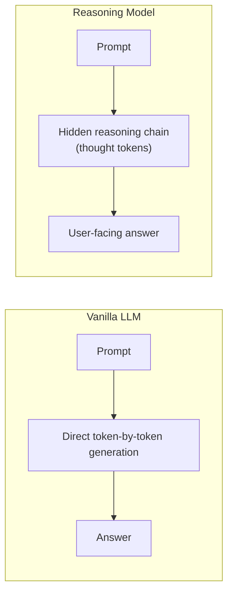
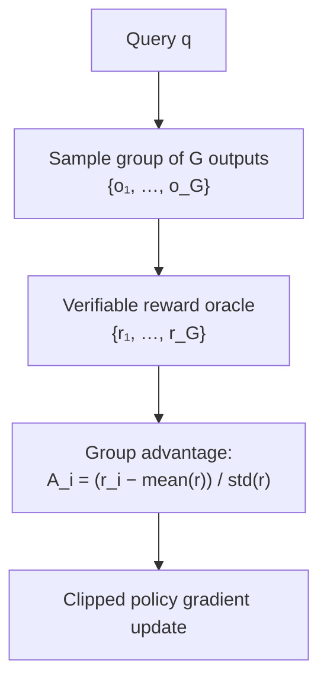
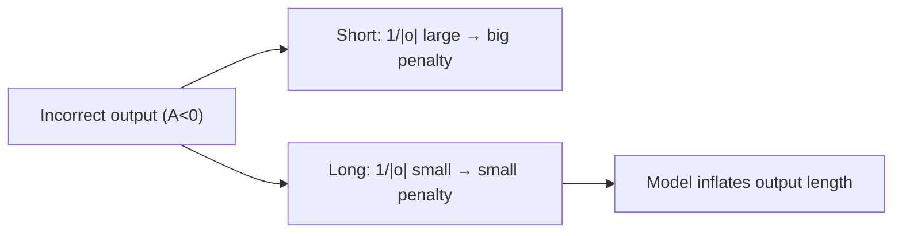
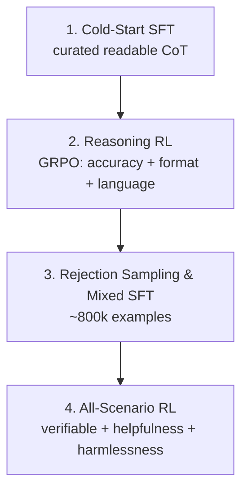

> **Stanford CME 295: Transformers & Large Language Models** — Lecture 6
> **Instructors:** Afshine Amidi & Shervine Amidi.

A vanilla LLM answers immediately: every token costs one fixed forward pass, whether the question is "2+2" or a theorem. **Reasoning models** break that constraint by generating a hidden chain of thought first, spending **test-time compute** before answering. This lecture covers the metric (pass@k) and the algorithm (**GRPO**) that made reasoning scalable.

---

## Learning Objectives

1. **Contrast vanilla and reasoning LLMs** and explain the test-time compute paradigm.
2. **Compute pass@k** with the unbiased hypergeometric estimator and tune temperature/consensus.
3. **Derive Group Relative Policy Optimization (GRPO)** and explain how it eliminates the PPO critic.
4. **Diagnose GRPO's length-bias pathology** and the DAPO / Dr. GRPO mitigations.
5. **Trace the DeepSeek-R1 pipeline** — R1-Zero, the 4-stage recipe, and reasoning distillation.

---

## Vanilla LLMs vs. Reasoning Models



- **Vanilla LLMs** excel at syntax and translation but fail at multi-step math and competitive coding, because local next-token prediction cannot plan ahead.
- **Reasoning Models** generate hidden intermediate "thought tokens" before answering, trading inference compute for accuracy.

Milestones: OpenAI `o1` (Sept 2024), Gemini 2.0 Flash Thinking (Dec 2024), DeepSeek-R1 (Jan 2025).

---

## The pass@k Metric

To measure multi-sample capability, generate $n$ samples per problem, of which $c$ are correct, and evaluate at budget $k$:

$$\text{pass@k} = 1 - \frac{\binom{n-c}{k}}{\binom{n}{k}} = 1 - \prod_{j=0}^{k-1}\frac{n - c - j}{n - j}$$

This is the minimum-variance unbiased estimator: drawing $k$ samples without replacement, pass@k is the probability at least one is correct.

**Hyperparameter dynamics:**
- $T=0$ yields a flat pass@k curve (no diversity to explore).
- $T > 1.2$ degrades token probabilities into noise.
- $T \approx 0.4\text{–}0.8$ balances diversity and correctness.

**consensus@k:** majority vote across $k$ generated reasoning chains.

---

## Group Relative Policy Optimization (GRPO)

### The PPO bottleneck

Standard PPO trains a Critic/Value network comparable in size to the policy, doubling memory. Long mathematical derivations also make the value estimator unstable.

### GRPO's innovation

GRPO **eliminates the critic entirely**, replacing it with a **group baseline**.



For a group of $G$ completions, the relative advantage is:

$$A_i = \frac{r_i - \text{mean}(\{r_1, \dots, r_G\})}{\text{std}(\{r_1, \dots, r_G\})}$$

The GRPO objective maximizes the clipped surrogate, augmented with a KL penalty:

$$\mathcal{J}_{\text{GRPO}}(\theta) = \mathbb{E}\!\left[\frac{1}{G}\sum_{i=1}^{G} \frac{1}{|o_i|}\sum_{t=1}^{|o_i|} \mathcal{L}_{\text{clip}}(t) - \beta\, D_{\text{KL}}(\pi_\theta \| \pi_{\text{ref}})\right]$$

Using **verifiable reward functions** (math answer equivalence, unit-test execution), GRPO needs no learned reward model — so there is no reward hacking.

---

## The Length-Bias Pathology

GRPO's per-token normalizer $1/|o_i|$ creates an unintended incentive. For an incorrect output ($A_i < 0$):

- A **short** response gets a large penalty per token ($1/\text{small}$).
- A **long** response gets a small penalty per token ($1/\text{large}$).

So when uncertain, the model learns to **bloat its reasoning** to hedge.



### 2025 mitigations

- **DAPO (March 2025):** replaces the output-specific normalizer $1/|o_i|$ with a **global token normalizer** $1/\sum_i |o_i|$.
- **Dr. GRPO ("GRPO Done Right"):** removes the length normalization factor entirely.

---

## Case Study: The DeepSeek Recipe

DeepSeek-V3 is a 671B MoE with Multi-Head Latent Attention. Its reasoning model, R1, is built in stages.

### DeepSeek-R1-Zero (pure RL discovery)

Trained directly with GRPO on the base model with **zero prior SFT**, rewarded by rule-based accuracy and formatting. Emergence: spontaneous self-reflection, backtracking, and "aha moments" — but poor readability and language mixing.

### DeepSeek-R1 (full 4-stage pipeline)



### Reasoning distillation

Train small dense models (1.5B–70B) via standard SFT on reasoning trajectories generated by the 671B teacher. This **substantially outperforms** training small models directly with RL from scratch.

---

## Production Python: GRPO Loss and pass@k

```python
"""
grpo.py
A minimal, dependency-light GRPO loss and an unbiased pass@k estimator.
"""
from __future__ import annotations

import math
import torch
import torch.nn.functional as F


def pass_at_k(n: int, c: int, k: int) -> float:
    """Unbiased pass@k via the hypergeometric formulation (numerically stable)."""
    if n - c < k:
        return 1.0
    if c == 0:
        return 0.0
    log_ratio = 0.0
    for j in range(k):
        log_ratio += math.log(n - c - j) - math.log(n - j)
    return 1.0 - math.exp(log_ratio)


def group_advantages(rewards: torch.Tensor, eps: float = 1e-8) -> torch.Tensor:
    """Normalize rewards within each group of size G.

    rewards: (B, G) -> advantages: (B, G)
    Groups with zero variance (all pass / all fail) get zero advantage.
    """
    mean = rewards.mean(dim=1, keepdim=True)
    std = rewards.std(dim=1, keepdim=True, unbiased=True)
    adv = (rewards - mean) / (std + eps)
    return torch.where(std < 1e-6, torch.zeros_like(adv), adv)


def grpo_loss(
    logp_policy: torch.Tensor,   # (B, G, T)
    logp_old: torch.Tensor,      # (B, G, T)
    logp_ref: torch.Tensor,      # (B, G, T)
    advantages: torch.Tensor,    # (B, G)
    mask: torch.Tensor,          # (B, G, T) completion mask
    clip_eps: float = 0.2,
    kl_coeff: float = 0.04,
) -> torch.Tensor:
    ratio = torch.exp(logp_policy - logp_old)
    adv = advantages.unsqueeze(-1)

    surr1 = ratio * adv
    surr2 = torch.clamp(ratio, 1 - clip_eps, 1 + clip_eps) * adv
    policy_loss = -torch.min(surr1, surr2)

    # Unbiased Schulman KL estimator
    log_ref_ratio = logp_ref - logp_policy
    kl = torch.exp(log_ref_ratio) - log_ref_ratio - 1.0

    per_token = policy_loss + kl_coeff * kl
    active = mask.sum().clamp(min=1.0)
    return (per_token * mask).sum() / active


if __name__ == "__main__":
    print("pass@(n=100, c=5, k=20) =", round(pass_at_k(100, 5, 20), 4))

    torch.manual_seed(0)
    B, G, T = 2, 8, 16
    logp_policy = torch.randn(B, G, T, requires_grad=True)
    logp_old = torch.randn(B, G, T)
    logp_ref = torch.randn(B, G, T)
    rewards = (torch.rand(B, G) > 0.5).float()      # verifiable 0/1 rewards
    mask = torch.ones(B, G, T)

    adv = group_advantages(rewards)
    loss = grpo_loss(logp_policy, logp_old, logp_ref, adv, mask)
    loss.backward()
    print("GRPO loss:", round(loss.item(), 4), "| grad norm:",
          round(logp_policy.grad.norm().item(), 4))
```

---

## Key Takeaways

| Concept | Key Point |
|---|---|
| Reasoning models | Spend test-time compute on hidden chains before answering |
| pass@k | Hypergeometric unbiased estimator of coverage |
| GRPO | Critic-free; group-normalized advantages |
| Verifiable rewards | Rule-based oracles avoid reward hacking |
| Length bias | per-token $1/\|o_i\|$ normalization inflates output length |
| DAPO / Dr. GRPO | Fix length bias via global or removed normalization |
| R1-Zero | Pure RL discovers self-reflection with no SFT |
| Distillation | Teacher traces beat RL-from-scratch for small models |

---

## Next Steps

A reasoning model that can think is still isolated. To become an **agent** it needs to reach the outside world. Next we cover the machinery of agency: RAG, tool calling, the Model Context Protocol (MCP), and the ReAct loop.

[Next: Agentic LLMs — RAG, Tool Calling, MCP & Workflows →](/docs/ai-agents/agentic-ai/07-agentic-llms-rag-tools-mcp)
