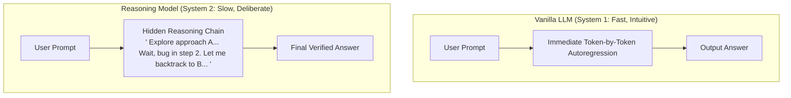
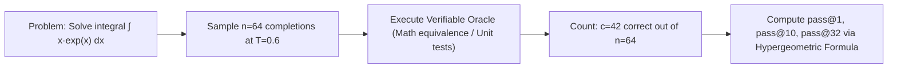
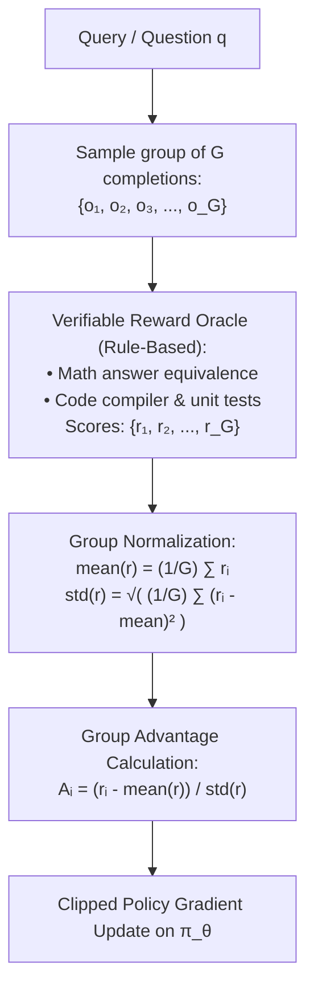
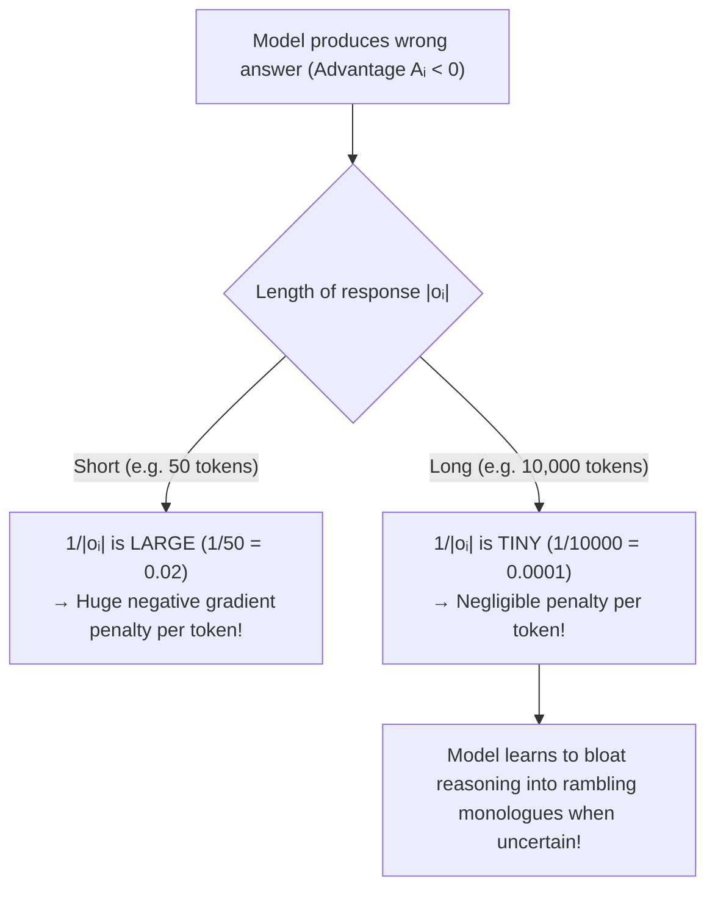
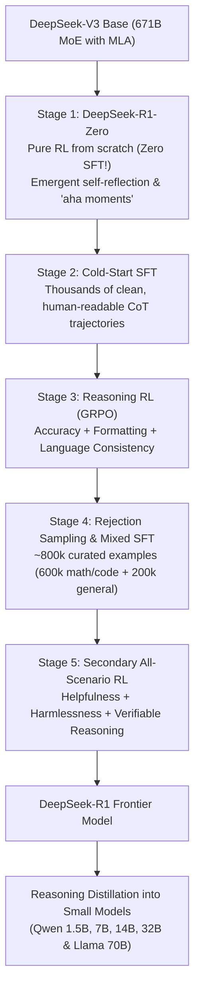

import { Callout } from 'fumadocs-ui/components/callout';
import { Tab, Tabs } from 'fumadocs-ui/components/tabs';
import { Accordion, Accordions } from 'fumadocs-ui/components/accordion';

> **Stanford CME 295: Transformers & Large Language Models** — Lecture 6  
> **Instructors:** Afshine Amidi & Shervine Amidi.

A vanilla LLM answers immediately: every token costs one fixed forward pass. If you ask it `"What is the capital of Spain?"`, it takes 15 milliseconds. If you ask it to solve a complex International Mathematical Olympiad problem, it *also* generates immediately—attempting to predict the next token without planning ahead.

**Reasoning models** dismantle this constraint by generating explicit intermediate reasoning chains (**thought tokens**) before emitting an answer. They trade **test-time compute** for cognitive accuracy.

This lesson explores how reasoning emerges: the **pass@k** evaluation metric, the mathematical derivation of **Group Relative Policy Optimization (GRPO)** which eliminates the RL critic network, the notorious **length bias bug**, and the 4-stage training recipe of **DeepSeek-R1**.

---

## Learning Objectives

By the end of this lesson you will be able to:

1. **Distinguish vanilla LLMs from reasoning models**, formulating the test-time compute scaling frontier.
2. **Compute the pass@k metric** using the unbiased minimum-variance hypergeometric estimator and calibrate temperature for reasoning diversity.
3. **Derive Group Relative Policy Optimization (GRPO)**, explaining how group-normalized relative advantage eliminates the memory-heavy Critic network.
4. **Diagnose GRPO's length-bias pathology** and evaluate modern 2025 mitigations (DAPO and Dr. GRPO).
5. **Trace the DeepSeek-R1 training pipeline**: from pure RL emergence in R1-Zero, through the 4-stage pipeline, to reasoning distillation into small models.

---

## 1. Vanilla LLMs vs. Reasoning Models



### The System 1 vs. System 2 Cognitive Analogy
Daniel Kahneman's cognitive framework mirrors this architectural shift:
- **System 1 (Vanilla LLM):** Fast, automatic, instinctive. Great for writing polite emails, translating French, or summarizing text. But it cannot perform forward tree search.
- **System 2 (Reasoning LLM):** Slow, deliberate, logical. The model allocates test-time compute to explore hypotheses, verify intermediate proofs, detect contradictions, and backtrack before committing to an answer.

### Milestones of Reasoning Models:
- **OpenAI o1 / o3** (Sept 2024): First commercial reasoning models demonstrating test-time compute scaling laws.
- **Gemini 2.0 Flash Thinking** (Dec 2024): Native multimodal reasoning with dynamic thinking budgets.
- **DeepSeek-R1** (Jan 2025): Open-weights architectural breakthrough proving that pure reinforcement learning can induce emergent reasoning behaviors without human demonstrations.

---

## 2. Quantitative Reasoning Metrics: pass@k

When evaluating reasoning, asking whether a model gets the right answer on a single deterministic greedy run is insufficient. We want to know: *If we give the model $k$ attempts, what is the probability that at least one reasoning path reaches the correct solution?*

### The pass@k Formulation

Generating $n$ independent candidate samples per problem ($n \ge k$), where $c$ of the samples pass verification unit tests, evaluating all combinations yields the **unbiased minimum-variance estimator**:

$$\text{pass@k} = 1 - \frac{\binom{n-c}{k}}{\binom{n}{k}} = 1 - \prod_{j=0}^{k-1} \frac{n - c - j}{n - j}$$

Where:
- $n$ is total generated completions (typically $n \ge 100$).
- $c$ is the number of correct completions.
- $k$ is the evaluation budget ($k \in [1, n]$).



### Hyperparameter Dynamics in Reasoning

- **Temperature ($T = 0$):** Flat pass@k curve. Every sample is identical ($\arg\max$). There is zero exploration; if the model is wrong once, it is wrong every time.
- **High Temperature ($T > 1.2$):** Degrades token logits. The model explores chaotic, hallucinated reasoning trajectories that fail unit tests.
- **Optimal Reasoning Range ($T \approx 0.5\text{--}0.7$):** Provides sufficient token diversity to explore diverse reasoning branches while preserving mathematical coherence.

**consensus@k (Majority Voting):**  
Generate $k$ independent reasoning chains, extract the final answer from each, and select the answer that receives the plurality of votes.

---

## 3. Group Relative Policy Optimization (GRPO)

### The PPO Bottleneck in Long-Chain Reasoning

Standard PPO requires training a separate **Critic (Value Model)** $V_\phi$ alongside the Policy $\pi_\theta$. In multi-step reasoning, reasoning chains often reach **10,000 to 30,000 tokens**.
1. **Memory Crisis:** Keeping a 70B Policy and a 70B Critic in VRAM for 32k-token sequences exhausts GPU clusters.
2. **Estimation Noise:** Training a Value model to accurately estimate the future scalar value of token 4,219 in a 25,000-token mathematical derivation is notoriously unstable.

---

### GRPO's Innovation: Critic-Free Group Baselines

DeepSeek introduced **Group Relative Policy Optimization (GRPO)** in the DeepSeekMath and DeepSeek-R1 papers.

**The Core Idea:** GRPO **completely discards the Critic network**. Instead of using a learned value network to estimate advantage, it samples a group of $G$ completions for the same prompt and computes **relative advantage across the group**.



### The Mathematical Formulation of GRPO

For a prompt $q$, sample $G$ outputs $\{o_1, \dots, o_G\}$ from the old policy $\pi_{\theta_{\text{old}}}$. The reward oracle assigns scalar scores $\{r_1, \dots, r_G\}$.

The **relative advantage** for output $o_i$ is normalized strictly across the group:

$$A_i = \frac{r_i - \text{mean}(\{r_1, \dots, r_G\})}{\text{std}(\{r_1, \dots, r_G\}) + \epsilon}$$

The policy is updated by maximizing the GRPO surrogate objective:

$$\mathcal{J}_{\text{GRPO}}(\theta) = \mathbb{E}\left[\frac{1}{G}\sum_{i=1}^{G} \frac{1}{|o_i|}\sum_{t=1}^{|o_i|} \min\left(\frac{\pi_\theta(o_{i,t} \mid \dots)}{\pi_{\text{old}}(o_{i,t} \mid \dots)} A_i, \ \text{clip}\left(\frac{\pi_\theta}{\pi_{\text{old}}}, 1-\epsilon, 1+\epsilon\right) A_i\right) - \beta \, \mathbb{D}_{\text{KL}}(\pi_\theta \parallel \pi_{\text{ref}})\right]$$

<Callout type="info">
**Verifiable Rewards Eliminate Reward Hacking:**  
GRPO uses **rule-based, verifiable rewards** (e.g., executing Python unit tests in a sandbox or checking sympy mathematical equivalence).  
Because the reward is verified by a compiler rather than a neural reward model, **the model cannot hack the reward**. Flattery, excessive politeness, and formatting tricks receive zero reward if the final code fails test cases!
</Callout>

---

## 4. The Length-Bias Pathology in GRPO

Despite its elegance, early GRPO implementations suffered from an unintended engineering pathology: **Length Bias**.

### The Mechanism of the Bug
Notice the per-token normalizer $\frac{1}{|o_i|}$ in the GRPO objective:
$$\text{Token Loss Weight} \propto \frac{1}{|o_i|}$$

Now consider what happens when a model generates an **incorrect answer** ($r_i = 0$, so $A_i < 0$):



The model quickly realizes: *"If I'm not sure of the answer, if I ramble on for 15,000 words, my penalty per token is microscopic. But if I give a concise wrong answer, I get penalized severely."* Models learned to generate bloated, repetitive reasoning chains.

### Modern 2025 Mitigations:
1. **DAPO (Dual-Scale / Global Token Normalization - March 2025):**  
   Replaces the individual sequence normalizer $\frac{1}{|o_i|}$ with a global normalizer summing across all tokens in the entire group: $\frac{1}{\sum_{j=1}^G |o_j|}$.
2. **Dr. GRPO ("GRPO Done Right"):**  
   Completely removes the length divisor, ensuring every incorrect token receives uniform negative gradient feedback regardless of sequence length.

---

## 5. Case Study: The DeepSeek Recipe

The creation of DeepSeek-R1 represents one of the most important milestones in open AI research.



---

### DeepSeek-R1-Zero: The Pure RL Experiment
DeepSeek took their raw base model (DeepSeek-V3 Base) and trained it directly with GRPO with **zero prior human demonstrations (Zero SFT)**.

**Emergence of Native Thinking:**
- Without being taught how to think, the model spontaneously learned to allocate more test-time compute.
- It learned to write `<think> ... </think>` blocks.
- It exhibited emergent **self-reflection and backtracking**: *"Wait, that calculation doesn't satisfy the boundary condition. Let me reconsider from equation (3)..."*
- **The Shortcoming:** R1-Zero suffered from severe language mixing (switching between Chinese and English mid-sentence) and messy formatting.

---

### DeepSeek-R1 (The Full Production Pipeline)

1. **Cold-Start SFT:** Fine-tuned on several thousand curated, readable Chain-of-Thought examples to establish formatting standards and language consistency.
2. **Reasoning RL:** Trained with GRPO using verifiable accuracy rewards, formatting rewards, and a language-consistency penalty.
3. **Rejection Sampling & Large-Scale SFT:** Generated hundreds of thousands of candidate reasoning paths from the checkpoint, filtered out wrong answers via verification oracles, and fine-tuned on ~800,000 synthetic examples.
4. **All-Scenario RL:** Secondary alignment pass ensuring safety, helpfulness, and tone on non-reasoning conversational tasks.

---

### Reasoning Distillation: The Small Model Revolution

A critical finding from the CME 295 curriculum:  
*Can you teach a small 7-billion-parameter model to reason using GRPO from scratch?*

**The Answer:** No! Small models do not have sufficient internal parameter capacity to discover deep reasoning trees spontaneously via pure RL.  
**The Solution (Distillation):**  
Take the reasoning trajectories emitted by the 671B teacher model and train small dense models (1.5B, 7B, 14B, 32B) via standard **Supervised Fine-Tuning (SFT)**!  
Distilled small models dramatically outperform small models trained directly with RL from scratch, matching or beating models $10\times$ their size on math and coding benchmarks.

---

## 6. Production Python: GRPO Advantage & pass@k

```python
"""
grpo_and_metrics.py
Self-contained implementation of GRPO relative advantage computation and the unbiased pass@k metric.
"""
from __future__ import annotations

import math
import torch


def compute_pass_at_k(n: int, c: int, k: int) -> float:
    """Computes the unbiased minimum-variance estimator for pass@k.

    pass@k = 1 - [comb(n - c, k) / comb(n, k)]
           = 1 - prod_{j=0}^{k-1} (n - c - j) / (n - j)

    Args:
        n: Total number of generated completions per problem (n >= k).
        c: Number of completions that passed verification (0 <= c <= n).
        k: Sample budget size (k >= 1).
    """
    assert n >= k, f"Total samples n={n} must be >= k={k}"
    assert 0 <= c <= n, f"Passed count c={c} must be between 0 and n={n}"

    if n - c < k:
        return 1.0  # More correct samples than needed to guarantee a hit

    # Compute product to avoid overflow from large factorials
    prod = 1.0
    for j in range(k):
        prod *= (n - c - j) / (n - j)

    return 1.0 - prod


def compute_grpo_advantages(rewards: torch.Tensor, eps: float = 1e-8) -> torch.Tensor:
    """Computes Group Relative Policy Optimization (GRPO) advantages.

    A_i = (r_i - mean(group)) / (std(group) + eps)

    Args:
        rewards: Tensor of shape (BatchSize, GroupSize) representing scores
                 evaluated by verifiable oracles.

    Returns:
        Tensor of shape (BatchSize, GroupSize) with group-normalized advantages.
    """
    # 1. Compute mean reward per group
    mean_r = rewards.mean(dim=-1, keepdim=True)

    # 2. Compute unbiased standard deviation per group
    std_r = rewards.std(dim=-1, keepdim=True, unbiased=False)

    # 3. Compute relative advantage
    advantages = (rewards - mean_r) / (std_r + eps)
    return advantages


if __name__ == "__main__":
    torch.manual_seed(42)

    # 1. Verification of pass@k metric
    total_samples = 64
    correct_samples = 8

    p1 = compute_pass_at_k(n=total_samples, c=correct_samples, k=1)
    p10 = compute_pass_at_k(n=total_samples, c=correct_samples, k=10)
    p32 = compute_pass_at_k(n=total_samples, c=correct_samples, k=32)

    print("--- pass@k Metric Evaluation ---")
    print(f"Total: {total_samples}, Correct: {correct_samples}")
    print(f"pass@1:  {p1 * 100:.2f}% (Chance of 1 random attempt passing)")
    print(f"pass@10: {p10 * 100:.2f}% (Chance of hitting correct answer within 10 attempts)")
    print(f"pass@32: {p32 * 100:.2f}% (Chance of hitting correct answer within 32 attempts)")

    # 2. Verification of GRPO Advantage Normalization
    # Batch of 2 prompts, each with G=4 completions scored by a math verifier
    # Prompt 1: completions got [0, 1, 0, 1]
    # Prompt 2: completions got [0, 0, 0, 1]
    mock_rewards = torch.tensor([
        [0.0, 1.0, 0.0, 1.0],
        [0.0, 0.0, 0.0, 1.0]
    ])

    advantages = compute_grpo_advantages(mock_rewards)
    print("\n--- GRPO Group Advantages ---")
    print("Raw Rewards:\n", mock_rewards)
    print("Group-Normalized Relative Advantages:\n", advantages.round(decimals=3))
```

---

## 7. Key Takeaways

| Concept | Formulation / Rule | Practical Impact |
|---|---|---|
| **Test-Time Compute** | Trade inference FLOPs for accuracy | Allows models to brainstorm, verify, and backtrack before answering. |
| **pass@k Estimator** | $1 - \prod_{j=0}^{k-1}\frac{n-c-j}{n-j}$ | Numerically stable evaluation metric for multi-sample mathematical capabilities. |
| **GRPO Innovation** | Eliminates RL Critic network | Solves PPO's memory bottleneck by normalizing advantage across sampled completion groups. |
| **Verifiable Oracles** | Sympy / Unit tests replace neural reward models | Eliminates reward hacking; flattery and formatting cannot game a compiler. |
| **Length-Bias Pathology** | $1/|o_i|$ penalty scaling | Causes models to bloat response length when uncertain; resolved by DAPO and Dr. GRPO. |
| **DeepSeek-R1 Recipe** | Cold-Start $\to$ GRPO $\to$ Mixed SFT $\to$ Distillation | Proved open-weight models can match proprietary reasoning leaders. |

---

## 8. Self-Check & Retrieval Practice

<Accordions>
<Accordion title="1. How GRPO Eliminates the Value Network">
**Question:** In PPO, why is a Critic network required to estimate advantage $A(s, a) = Q(s, a) - V(s)$, and how does GRPO bypass this without a Value model?

<details>
<summary>Click to view solution</summary>

**Explanation:**  
PPO updates a single completion rollout at a time. To determine whether an action was better or worse than expected, it needs a trained Value network $V_\phi(s)$ to provide the baseline.  
GRPO samples a **group of $G$ completions** for the exact same prompt simultaneously. The average reward of the group $\text{mean}(r)$ serves as the empirical baseline. If completion $i$ achieves a reward above the group average, its advantage is positive ($A_i > 0$); if below, its advantage is negative ($A_i < 0$). This eliminates the memory and instability of training a Critic.
</details>
</Accordion>

<Accordion title="2. The Root Cause of GRPO Length Bias">
**Question:** Why did early GRPO models output excessively long, rambling thought chains when prompted with difficult questions?

<details>
<summary>Click to view solution</summary>

**Explanation:**  
The GRPO loss scaled per-token policy gradients by $\frac{1}{|o_i|}$. For wrong answers ($A_i < 0$), short responses had a large multiplier ($\frac{1}{\text{small}}$), resulting in massive negative gradient penalties per token. Long responses had a tiny multiplier ($\frac{1}{\text{large}}$), resulting in negligible penalties per token. The model adapted by generating artificially long reasoning chains whenever it was uncertain, minimizing the penalty gradient.
</details>
</Accordion>

<Accordion title="3. Reasoning Distillation vs. Direct RL on Small Models">
**Question:** Why does distilling DeepSeek-R1's reasoning trajectories into a 7B model using standard SFT work much better than training that same 7B model directly with GRPO from scratch?

<details>
<summary>Click to view solution</summary>

**Explanation:**  
Pure RL requires the model to spontaneously explore and stumble upon the correct multi-step reasoning pathway before the verifier can reward it. A small 7B model has low initial probability of solving complex Olympiad-level problems, meaning its reward is almost always zero ($c=0$), starving the RL algorithm of learning signal.  
In contrast, distillation directly provides the small model with gold-standard reasoning paths discovered by the 671B teacher, allowing it to learn reasoning structures via efficient supervised imitation.
</details>
</Accordion>
</Accordions>

---

## Next Steps

We now understand how models think in isolation. But real-world intelligence requires acting on the physical world: connecting to databases, calling external APIs, executing bash code, and collaborating across multi-agent workflows.

In the next lesson, we master **Agentic LLMs**: **Retrieval-Augmented Generation (RAG)**, **Function Calling**, Anthropic's **Model Context Protocol (MCP)**, the **ReAct** loop, and the practical security vulnerabilities of autonomous agents.

[Next: Agentic LLMs, RAG, Tools & MCP →](/docs/ai-agents/agentic-ai/07-agentic-llms-rag-tools-mcp)
