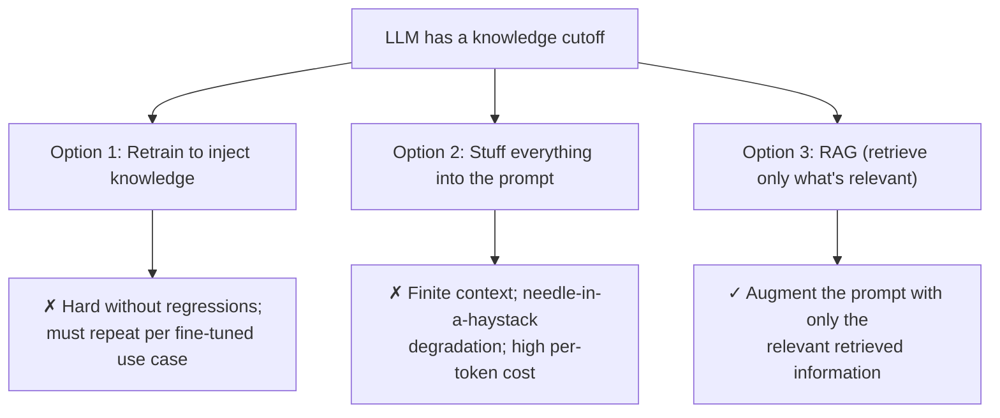
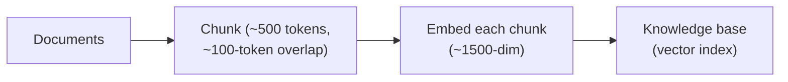
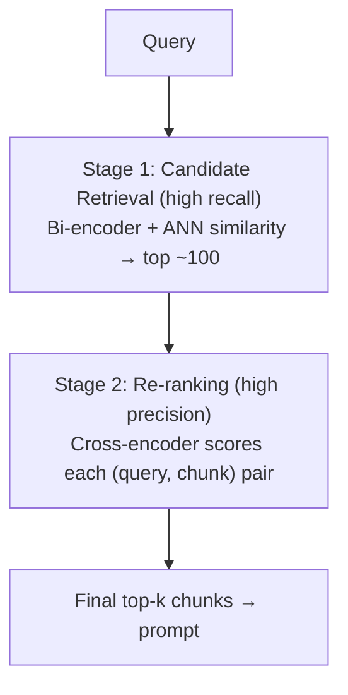
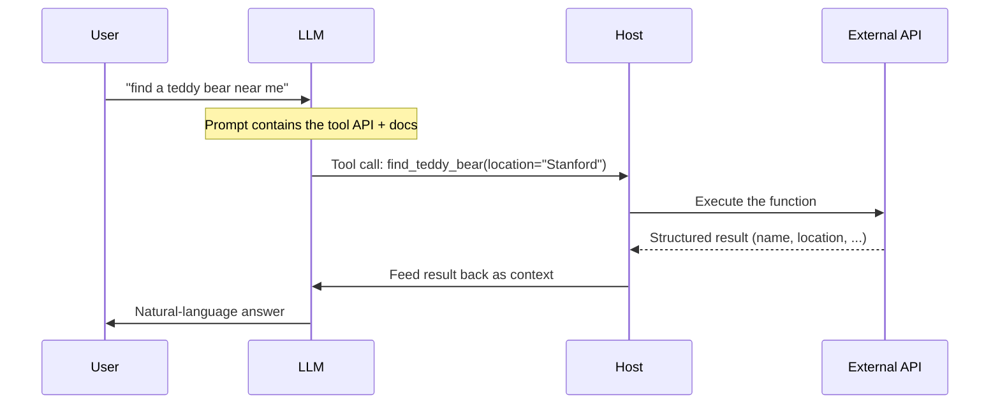
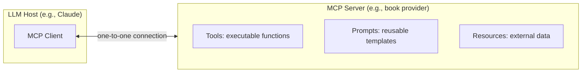
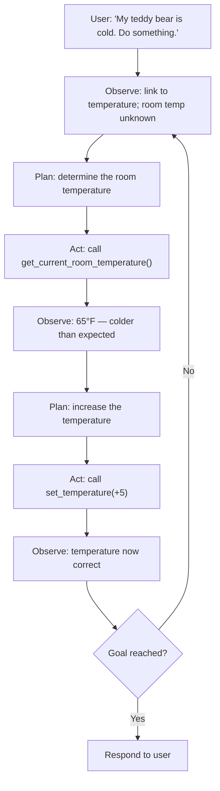
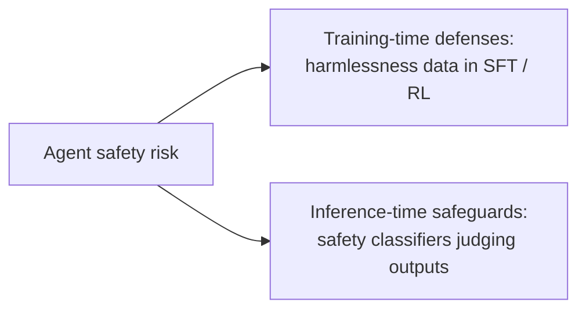

> **Stanford CME 295: Transformers & Large Language Models** — Lecture 7
> **Instructors:** Afshine Amidi & Shervine Amidi.

Up to now the LLM has been isolated: trained weights and nothing else. This lecture connects it to the outside world. We cover **RAG** (retrieving knowledge), **tool calling** (performing actions), **MCP** (standardizing tools), and **agents** (reasoning across loops with ReAct).

---

## Learning Objectives

1. **Explain why RAG exists** — knowledge cutoff, context limits, needle-in-a-haystack degradation, and per-token cost.
2. **Build the RAG pipeline**: chunking, embeddings, **two-stage retrieval** (bi-encoder → cross-encoder), and advanced techniques (BM25 hybrid, HyDE, contextual retrieval, prompt caching).
3. **Evaluate retrieval** with NDCG, MRR, Precision@k, Recall@k, and MTEB.
4. **Describe tool/function calling** as a 3-stage workflow and train it via SFT or prompt engineering.
5. **Explain MCP** (server/client/tools/prompts/resources) and the **ReAct** loop.
6. **Identify agent safety risks** — data exfiltration via indirect prompt injection.

---

## Why RAG Exists

An LLM only knows what it was trained on. GPT-5's card, for instance, lists a knowledge cutoff of September 30, 2024; anything after that is invisible to the base model.

Three naive fixes all fail:



### The needle-in-a-haystack (NIAH) test

Place a fact (the *needle*) somewhere in a long prompt (the *haystack*) and ask the model to retrieve it. Heat-map studies on GPT-4 showed accuracy drops for long prompts, especially when the fact sits in the **first half**. So even an unlimited context window does not solve retrieval.

**RAG = Retrieve → Augment → Generate.** The retrieved evidence is placed *into* the prompt, so the model answers from grounded context.

---

## The RAG Pipeline

### Step 0: Build the knowledge base



Key hyperparameters:
- **Embedding size:** larger for nuanced documents, but costs space and compute. Typically ~1,500 dims.
- **Chunk size:** too small loses context; too large dilutes the embedding. Typically ~500 tokens.
- **Chunk overlap:** carries context across boundaries. Typically low hundreds of tokens.

### Step 1: Two-stage retrieval



- **Stage 1 — Candidate retrieval:** encode the query and each chunk *independently* with a **bi-encoder** (e.g., Sentence-BERT), then compare with cosine similarity. Because the knowledge base is huge, use **approximate nearest neighbor (ANN)** indexing instead of a linear scan. Optimized for **recall**.
- **Stage 2 — Re-ranking:** a **cross-encoder** takes the query and a candidate chunk *together*, letting attention capture their interaction, and outputs a relevance score. Because there are only ~100 candidates, this can be more expensive. Optimized for **precision**.

> **Intuition:** a bi-encoder compares two independent embeddings (fast, rough); a cross-encoder reads both jointly (slow, precise).

### Advanced retrieval techniques

- **BM25 + dense hybrid:** BM25 is a lexical keyword-overlap heuristic. Combined with dense semantic search, it guarantees keyword matches when you need them (e.g., searching for "Cuddly" should return documents that literally contain it).
- **HyDE (Hypothetical Document Embeddings):** the query (a short question) and documents (long passages) live in different regimes. HyDE has the LLM first generate a *fake answer document*, then embeds that to search — closing the query/document gap.
- **Contextual retrieval:** before embedding, prepend an LLM-generated summary that situates each chunk in its source document, so out-of-context chunks remain interpretable.
- **Prompt caching:** decoder-only models compute identical activations for identical prefixes. Cache the static prefix once and look it up — providers charge ~1/10 the price for cached input tokens.

### Retrieval metrics

| Metric | Meaning |
|---|---|
| **NDCG@k** | Discounted cumulative gain, normalized by the ideal ranking; rewards relevant docs near the top |
| **MRR** | $1/\text{rank}$ of the first relevant document |
| **Precision@k** | Of the top-$k$ retrieved, how many are relevant |
| **Recall@k** | Of all relevant documents, how many are in the top-$k$ |

These are evaluated on the **MTEB** (Massive Text Embedding Benchmark).

### NDCG in detail

$$\text{DCG}@k = \sum_{i=1}^{k} \frac{\text{rel}_i}{\log_2(i+1)}, \qquad \text{NDCG}@k = \frac{\text{DCG}@k}{\text{IDCG}@k}$$

where IDCG is the DCG of the ideal (perfectly ordered) ranking — so a perfect ranking scores 1.0.

---

## Tool Calling & Function Calling

RAG injects *unstructured* data. Tool calling injects *structured* behavior: it lets the model invoke functions that read or mutate the world.

> **Tool calling** allows autonomous systems to complete complex tasks by dynamically accessing and acting upon external resources. — IBM

### A worked example: "find a teddy bear near me"

An LLM without tools cannot know real-time teddy-bear availability. With a `find_teddy_bear(location)` tool, it can.

### The 3-stage workflow



1. **Tool prediction:** the model reads the prompt plus tool **API schemas** and emits structured arguments. It sees only the signature, parameter schema, and docstring — never the implementation.
2. **Tool execution:** the host runs the function and returns structured data (JSON/dataclass).
3. **Final response:** the model synthesizes a natural-language answer from the conversation history plus the tool output.

### How it is trained

Two SFT example types are typically needed:
1. **Query → tool call:** map a user query to the correct function and arguments.
2. **Tool result → final response:** the second pair actually includes the *whole conversation history* so the model knows the original intent and that the results correspond to the tool call.

Modern models, pre-trained on abundant code, can often skip bespoke SFT. Instead, you write a fixed **explanation prompt** (offline, then reused at inference) that teaches the tool. To craft it, use SFT pairs as an **evaluation set**, score candidate explanations, and let a strong reasoning model propose improvements — a form of prompt optimization.

### Tool routing / selection

A large tool catalog causes context loss (the same needle-in-a-haystack problem) and conflicts. A lightweight **tool selector** (or router) takes the query plus a *short* list of tool names/descriptions, picks the promising tools, and only those full schemas are placed in context for the main model to use. This can itself be implemented with RAG over tool descriptions.

---

## The Model Context Protocol (MCP)

Every provider historically defined tools in its own bespoke way, forcing duplicated implementations per model. **MCP** (Anthropic) is an open standard that decouples LLM clients from tool servers. Its vocabulary:



- **MCP server:** the instance that serves tools.
- **Tools:** executable function implementations.
- **Prompts:** templates showing a user how to use the tools.
- **Resources:** external data the tools can anchor on.
- **MCP client:** the host-side counterpart, one-to-one with a server.

**Example:** a book provider exposes an MCP server with `find_book` and `recommend_book` tools, prompts for retrieving a title, and resources like a user's personal collection.

---

## Agents and the ReAct Loop

An **agent** is a system that autonomously pursues a goal and completes tasks on a user's behalf. Unlike a single tool call, it involves **reasoning and iteration**.

### ReAct (Reason + Act)

The hallmark paper **ReAct** (Yao et al., 2022) decomposes complex goals into loops of atomic steps:

$$\text{Observe / Think} \longrightarrow \text{Plan} \longrightarrow \text{Act} \longrightarrow \text{Repeat}$$

Naming varies across papers (think/observe/act), but the structure is stable.



At each step the model checks whether the goal is reached; if not, it loops. This loop is what makes a workflow *agentic*.

### Multi-agent: Agent2Agent (A2A)

Multiple agents (thermostat, air-quality, energy) communicate under one user request. Google's **A2A** protocol standardizes this: an agent exposes a set of **skills**, gives examples so other agents know its capabilities, and defines execution semantics — status reporting and a **cancel** method.

---

## Agent Safety

New capabilities bring new attack surfaces. The canonical risk is **data exfiltration via indirect prompt injection**: untrusted content (a web page, an email) contains instructions that trick an agent with tool access into leaking private data (e.g., writing a password to an external address).

Two classes of remediation:



Benchmarks: **ToolSword** and **Agent Safety Bench**. Note also the growing concern of compounding error — a wrong argument or ungrounded output at any loop step can derail the whole task. Start small, start with the most capable model to find the headroom, then optimize for latency.

---

## Production Python: A Minimal ReAct Agent

```python
"""
react_agent.py
A dependency-free sketch of the ReAct loop with a tool registry.
"""
from __future__ import annotations

from dataclasses import dataclass, field
from typing import Callable


@dataclass
class Tool:
    name: str
    description: str
    func: Callable[..., str]


@dataclass
class Agent:
    tools: dict[str, Tool] = field(default_factory=dict)
    max_steps: int = 6

    def register(self, tool: Tool) -> None:
        self.tools[tool.name] = tool

    def tool_manifest(self) -> str:
        """Only names + descriptions — the schema the model actually sees."""
        return "\n".join(f"- {t.name}: {t.description}" for t in self.tools.values())

    def run(self, goal: str) -> str:
        # In production, `policy` is an LLM call producing (thought, action, args).
        # Here we hard-code a plan to illustrate the loop structure.
        scratchpad: list[str] = []
        plan = [
            ("Observe", "room temperature is unknown", None, {}),
            ("Act", "read temperature", "get_room_temperature", {}),
            ("Observe", "temperature is 65F, colder than expected", None, {}),
            ("Act", "raise temperature", "set_temperature", {"delta": 5}),
            ("Observe", "temperature is now correct", None, {}),
        ]

        for step in range(self.max_steps):
            if step >= len(plan):
                break
            phase, thought, tool_name, kwargs = plan[step]
            if phase == "Act" and tool_name:
                result = self.tools[tool_name].func(**kwargs)
                scratchpad.append(f"Thought: {thought}\nAction: {tool_name}({kwargs})\nObservation: {result}")
            else:
                scratchpad.append(f"Thought: {thought}")

            if "now correct" in scratchpad[-1]:
                return "Done: I raised the room temperature by 5F.\n\n" + "\n".join(scratchpad)

        return "Max steps reached.\n\n" + "\n".join(scratchpad)


if __name__ == "__main__":
    agent = Agent()
    agent.register(Tool("get_room_temperature", "Read current room temperature",
                        lambda: "65F"))
    agent.register(Tool("set_temperature", "Adjust the thermostat by a delta",
                        lambda delta: f"set to {65 + delta}F"))
    print("Tool manifest:")
    print(agent.tool_manifest())
    print("\n--- Run ---")
    print(agent.run("My teddy bear is cold. Do something."))
```

---

## Key Takeaways

| Concept | Key Point |
|---|---|
| Why RAG | Knowledge cutoff + context limits + NIAH degradation + cost |
| Two-stage retrieval | Bi-encoder recall → cross-encoder precision |
| Hybrid search | Dense semantics + BM25 lexical guarantee |
| HyDE | Embed a hypothetical answer to bridge query/document gap |
| Prompt caching | Reuse prefix activations; ~10× cheaper input |
| Tool calling | Predict args → execute → synthesize response |
| MCP | Standard: server/client, tools, prompts, resources |
| ReAct | Observe/Think → Plan → Act → repeat |
| A2A | Standard for agent-to-agent skills + status + cancel |
| Agent safety | Indirect prompt injection → data exfiltration |

---

## Next Steps

We can now build an agent — but can we trust it? Next we cover **evaluation**: inter-rater reliability, the LLM-as-a-Judge framework, atomic factuality, the seven practical agent failure modes, and the benchmark landscape.

[Next: Evaluation — LLM-as-a-Judge & Agent Benchmarks →](/docs/ai-agents/agentic-ai/08-llm-evaluation-and-benchmarks)
