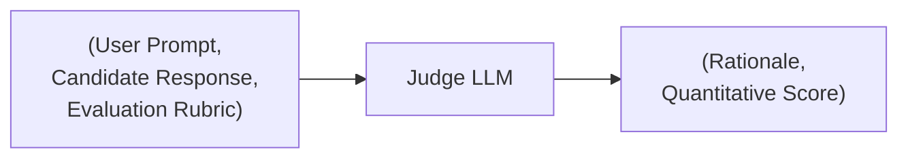
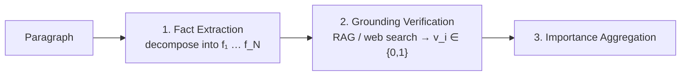
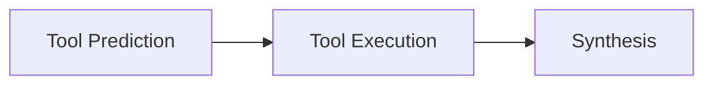
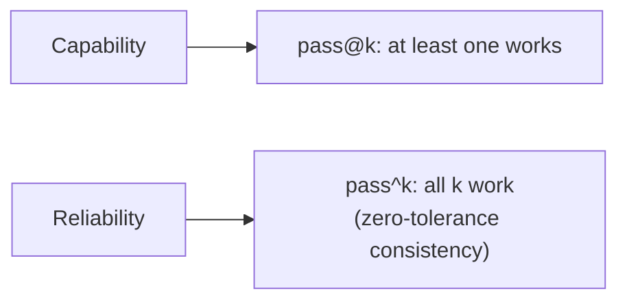

> **Stanford CME 295: Transformers & Large Language Models** — Lecture 8
> **Instructors:** Afshine Amidi & Shervine Amidi.

You cannot improve what you cannot measure. This lecture covers how to evaluate open-ended LLM outputs: **human agreement statistics**, the **LLM-as-a-Judge** framework, **atomic factuality** for long-form text, the **seven practical agent failure modes**, and the benchmark landscape.

---

## Learning Objectives

1. **Compute chance-adjusted agreement** (Cohen's $\kappa$, Fleiss's $\kappa$, Krippendorff's $\alpha$) and explain the raw-agreement fallacy.
2. **Explain why rule-based metrics** (BLEU, ROUGE, METEOR) fail on LLM outputs.
3. **Design an LLM-as-a-Judge** with rationale-first generation and structured output, and mitigate position, verbosity, and self-enhancement biases.
4. **Score long-form factuality** with the atomic-fact verification pipeline.
5. **Diagnose the 7 agent failure modes** and choose reliability metrics (`pass@k` vs. `pass^k`).

---

## Human Evaluation & Inter-Rater Reliability

Raw agreement is misleading. If two raters score a binary outcome independently and guess, they still agree 50% of the time:

$$\text{Agreement}_{\text{chance}} = P(A=1)P(B=1) + P(A=0)P(B=0) = (0.5)^2 + (0.5)^2 = 50\%$$

So we need **chance-adjusted** coefficients:

$$ \kappa = \frac{P_o - P_e}{1 - P_e} $$

where $P_o$ is observed agreement and $P_e$ is chance agreement.

| Coefficient | Use case |
|---|---|
| **Cohen's $\kappa$** | Two raters |
| **Fleiss's $\kappa$** | More than two raters |
| **Krippendorff's $\alpha$** | Missing data, arbitrary scales |

When $\kappa$ falls below an acceptable threshold, teams run **calibration sessions** to align scoring criteria.

---

## Rule-Based Metrics and Their Limits

- **BLEU:** n-gram *precision* with a brevity penalty.
- **ROUGE:** n-gram *recall*.
- **METEOR:** unigram F-score with stem/synonym matching, penalized by chunk fragmentation:

$$\text{Score} = F_{\text{mean}} \cdot (1 - \text{Penalty})$$

**Why they fail on LLMs:** they cannot handle semantic paraphrasing, correlate poorly with human judgment, and depend on expensive reference texts.

---

## The LLM-as-a-Judge Framework

An evaluator model receives a tuple and returns a rationale plus a score:



### Design principles

- **Rationale-first generation:** forcing the judge to *verbalize critiques before scoring* improves calibration and accuracy.
- **Enforcing structure:** use constraint-guided decoding (Lesson 3) to guarantee the output matches the score schema.

### Judge biases and mitigations

| Bias | Description | Mitigation |
|---|---|---|
| **Position bias** | Prefers the first option in pairwise comparison | Swap order, average scores |
| **Verbosity bias** | Prefers longer responses | Explicit conciseness instructions; length penalties |
| **Self-enhancement bias** | Prefers outputs from its own model family | Use a disjoint evaluator — never judge a model with itself |

---

## Atomic Factuality Verification

For long-form text, decompose the output into discrete **atomic propositions** and verify each independently:



$$\text{Factuality Score} = \frac{\sum_{i=1}^{N} \alpha_i \cdot v_i}{\sum_{i=1}^{N} \alpha_i}$$

The importance weights $\alpha_i$ preserve nuanced partial correctness rather than flattening everything to a single binary verdict.

---

## The 7 Practical Agent Failure Modes

Agents fail in specific, diagnosable ways across three stages:



| Stage | Failure Mode | Root Cause | Remedy |
|---|---|---|---|
| **Tool Prediction** | **1. Tool underutilization / punting** | Router recall error; model fails to recognize intent | Tune router for high recall; add SFT triggers |
| | **2. Tool hallucination** | Model calls an undefined API name | Strengthen docstrings; constrain via system prompt schema |
| | **3. Wrong tool selection** | Overlapping or ambiguous tool definitions | Disambiguate API contracts; sharpen boundaries |
| | **4. Incorrect arguments** | Missing context; model invents defaults | Maintain state in context; add prerequisite fetch tools |
| **Tool Execution** | **5. Execution bug / crash** | Backend runtime crash | Standardized error handling; structured error objects |
| | **6. Silent / void action** | Backend returns `None` with no confirmation | Always return structured confirmation payloads; `{}` not `None` |
| **Synthesis** | **7. Grounding / synthesis failure** | Context drowned by raw tool output | Trim payloads; use typed dataclasses / Pydantic schemas |

---

## Reliability Metrics & Benchmarks

### pass@k vs. pass^k

- **$\text{pass}@k$:** does *at least one* of $k$ attempts succeed? (capability)
- **$\text{pass}^{\wedge}k$** ("pass hat k"): do *all* $k$ attempts succeed consistently? (reliability — essential for enterprise agents)



### The benchmark landscape

| Domain | Benchmark |
|---|---|
| Knowledge | MMLU |
| Reasoning & math | AIME, GSM8K |
| Coding | SWE-bench, HumanEval, Codeforces |
| Safety | HarmBench, Agent Safety Bench, ToolSword |
| Agents | τ-bench (airline/retail simulated environments) |
| Retrieval & embeddings | MTEB |

---

## Production Python: Cohen's Kappa and a Judge Pipeline

```python
"""
evaluation.py
Cohen's kappa, the atomic factuality score, and a structured judge prompt.
"""
from __future__ import annotations

from collections import Counter
from typing import Sequence


def cohens_kappa(ratings_a: Sequence[int], ratings_b: Sequence[int]) -> float:
    """Cohen's kappa for two raters over categorical labels."""
    assert len(ratings_a) == len(ratings_b) > 0
    n = len(ratings_a)
    labels = set(ratings_a) | set(ratings_b)

    # Observed agreement
    agree = sum(1 for a, b in zip(ratings_a, ratings_b) if a == b)
    p_o = agree / n

    # Chance agreement
    ca, cb = Counter(ratings_a), Counter(ratings_b)
    p_e = sum((ca[k] / n) * (cb[k] / n) for k in labels)

    return 0.0 if p_e == 1.0 else (p_o - p_e) / (1 - p_e)


def atomic_factuality(
    verdicts: Sequence[int], importance: Sequence[float] | None = None
) -> float:
    """Weighted fraction of verified atomic facts. verdicts: 1=supported, 0=not."""
    assert len(verdicts) == (len(importance) if importance else len(verdicts))
    if importance is None:
        return sum(verdicts) / len(verdicts)
    denom = sum(importance)
    return sum(v * w for v, w in zip(verdicts, importance)) / denom if denom else 0.0


JUDGE_PROMPT = """You are a strict evaluator.

USER PROMPT:
{user_prompt}

CANDIDATE RESPONSE:
{response}

RUBRIC:
{rubric}

First write a concise critique (2-4 sentences). Then output ONLY a JSON object:
{{"rationale": "<your critique>", "score": <integer 1-5>}}
"""


if __name__ == "__main__":
    # Raters on a binary task
    a = [1, 1, 0, 1, 0, 0, 1, 1, 1, 0]
    b = [1, 0, 0, 1, 0, 1, 1, 1, 0, 0]
    print(f"Cohen's kappa: {cohens_kappa(a, b):.4f}")

    # Atomic factuality with importance weights
    verdicts = [1, 0, 1, 1, 0]
    weights = [3.0, 1.0, 2.0, 1.0, 2.0]
    print(f"Factuality (weighted): {atomic_factuality(verdicts, weights):.4f}")

    print("\nJudge prompt template ready:")
    print(JUDGE_PROMPT[:120], "...")
```

---

## Key Takeaways

| Concept | Key Point |
|---|---|
| Raw agreement | Misleading — correct for chance with $\kappa$ |
| Cohen's $\kappa$ | $(P_o - P_e)/(1 - P_e)$ |
| Rule-based metrics | Cannot handle paraphrase; weak human correlation |
| LLM-as-a-Judge | Rationale-first + structured output |
| Judge biases | Position, verbosity, self-enhancement — all mitigable |
| Atomic factuality | Decompose → verify → weighted aggregate |
| 7 failure modes | Tool prediction, execution, synthesis |
| pass@k vs. pass^k | Capability vs. reliability |

---

## Next Steps

We have covered foundations, scaling, alignment, reasoning, agency, and evaluation. In the final lesson we look ahead: **Vision Transformers**, **diffusion language models**, **2D-RoPE**, the **Muon optimizer**, synthetic-data collapse, and analog hardware.

[Next: Recap & Current Trends →](/docs/ai-agents/agentic-ai/09-recap-and-current-trends)
