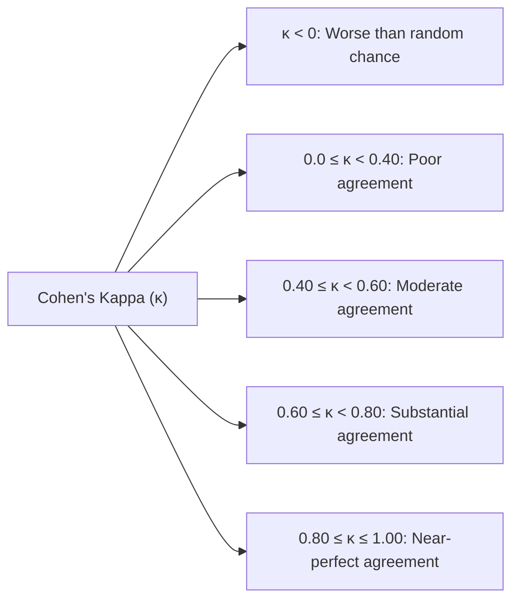
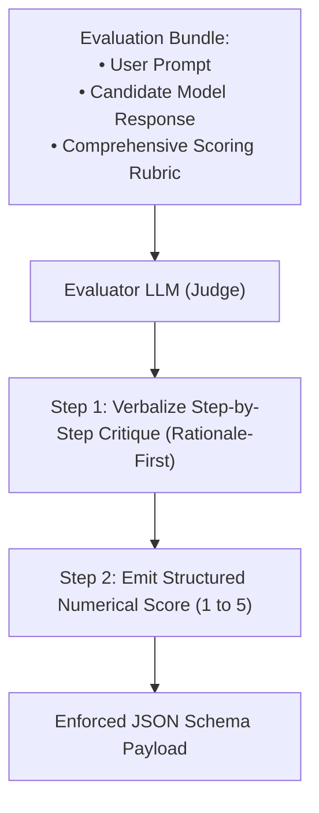
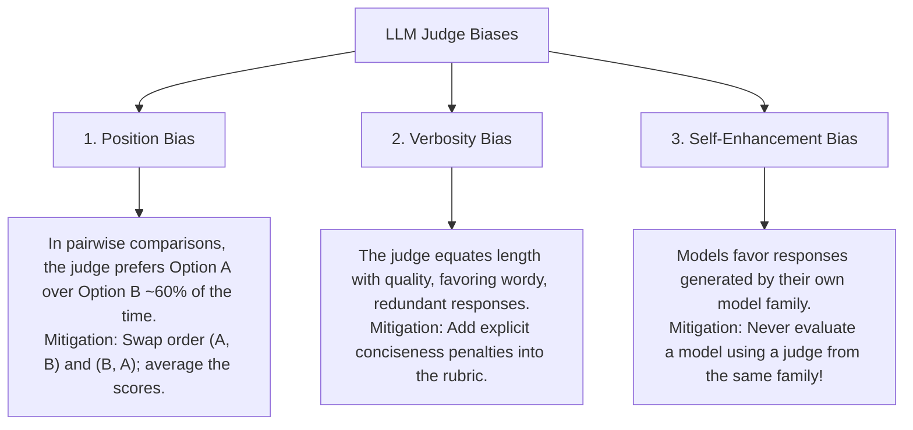
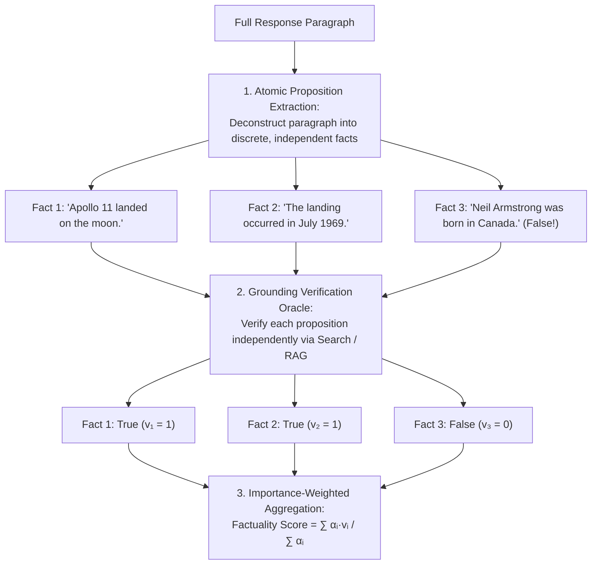
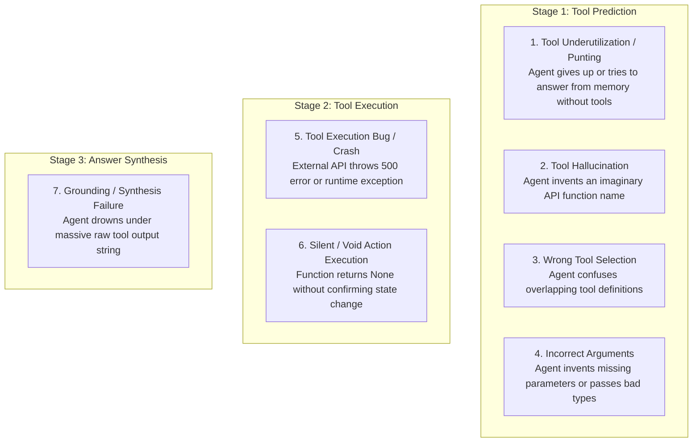
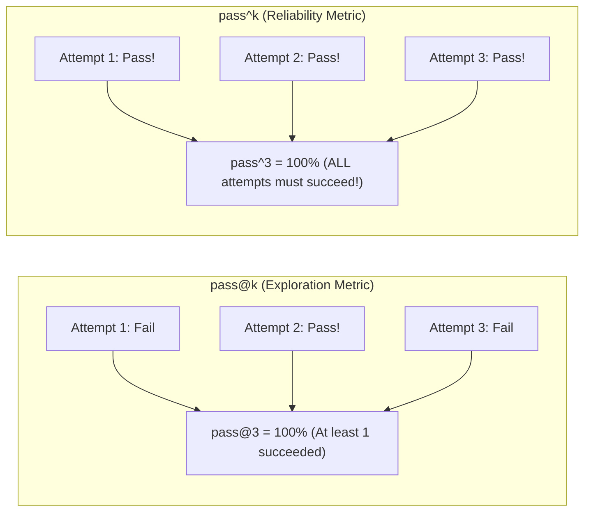

import { Callout } from 'fumadocs-ui/components/callout';
import { Tab, Tabs } from 'fumadocs-ui/components/tabs';
import { Accordion, Accordions } from 'fumadocs-ui/components/accordion';

> **Stanford CME 295: Transformers & Large Language Models** — Lecture 8  
> **Instructors:** Afshine Amidi & Shervine Amidi.

*"If you cannot measure it, you cannot improve it."* In classical machine learning, evaluation was simple: calculate accuracy on a test set, or compute root-mean-squared error on validation curves.

In generative and agentic AI, evaluation is one of the hardest open problems in computer science. Language is open-ended, human evaluators disagree with each other, automated LLM judges harbor subtle psychological biases, and multi-step autonomous agents can fail in subtle, cascading ways.

This lesson explores the science of evaluation: **inter-rater agreement statistics (Cohen's and Fleiss's Kappa)**, the **LLM-as-a-Judge** framework and its mitigations, **atomic factuality verification**, the **7 Practical Agent Failure Modes** from Stanford CME 295, and enterprise reliability metrics ($\text{pass}@k$ vs. $\text{pass}^\wedge k$).

---

## Learning Objectives

By the end of this lesson you will be able to:

1. **Calculate Cohen's Kappa ($\kappa$)** and explain why raw percentage agreement produces dangerously misleading conclusions due to chance agreement.
2. **Implement the LLM-as-a-Judge pattern** with rationale-first generation, diagnosing and mitigating position bias, verbosity bias, and self-enhancement bias.
3. **Decompose long-form text into atomic factual propositions** and score grounded verification using weighted importance aggregation.
4. **Identify and remediate the 7 Practical Agent Failure Modes** across tool prediction, tool execution, and answer synthesis stages.
5. **Contrast pass@k with $\text{pass}^\wedge k$ ($p^k$)**, calculating enterprise multi-turn reliability across agent workflows.

---

## 1. Human Evaluation & Inter-Rater Reliability

When evaluating whether an LLM summary is good, teams often employ human raters. But how do you know if your human raters are actually reliable?

### The Raw Percentage Agreement Fallacy

Suppose two annotators evaluate 100 model responses on whether they are safe (`1`) or unsafe (`0`).  
They agree on 70 out of 100 responses. The team reports: *"Our annotators agree 70% of the time!"*

<Callout type="error">
**The Illusion of Agreement:**  
If both raters simply flip an unbiased coin for each response:
$$P(\text{Both say 1}) = 0.5 \times 0.5 = 0.25$$
$$P(\text{Both say 0}) = 0.5 \times 0.5 = 0.25$$
$$\text{Expected Chance Agreement} = 0.25 + 0.25 = \mathbf{50\%}$$
Two completely blind monkeys flipping coins will agree **50% of the time by pure random chance!** A raw agreement of 70% is barely better than chance.
</Callout>

---

### Cohen's Kappa ($\kappa$)

To measure real human consensus, we must use chance-adjusted statistics. **Cohen's Kappa** normalizes observed agreement ($P_o$) against expected random chance agreement ($P_e$):

$$\kappa = \frac{P_o - P_e}{1 - P_e}$$

Where:
- $P_o$ is the observed percentage agreement.
- $P_e$ is the hypothetical probability of chance agreement calculated from the marginal distributions of both raters:
  $$P_e = \sum_{k} P(\text{Rater 1 selects category } k) \times P(\text{Rater 2 selects category } k)$$



### Multi-Rater Generalizations:
- **Fleiss's Kappa:** Generalizes Cohen's Kappa to fixed panels of three or more raters.
- **Krippendorff's Alpha ($\alpha$):** The gold standard for social science and NLP annotation; handles missing ratings and arbitrary measurement scales (nominal, ordinal, interval, ratio).
- **Calibration Sessions:** If $\kappa < 0.60$, stop data collection immediately. Conduct interactive rubric calibration sessions where annotators discuss disagreement edge cases until criteria align.

---

## 2. Legacy NLP Metrics vs. LLM-as-a-Judge

### Why Rule-Based Metrics Fail on LLMs

Before 2023, NLP relied on n-gram overlap metrics:
- **BLEU:** Precision-oriented n-gram matching with brevity penalty.
- **ROUGE:** Recall-oriented n-gram matching (ROUGE-1, ROUGE-2, ROUGE-L).
- **METEOR:** Unigram F-score incorporating stemming and WordNet synonyms, penalized by sentence fragmentation.

**The Breaking Point:**  
If a user asks: *"Summarize the theory of general relativity"*, and the reference says:  
> *"Mass curves spacetime, causing gravity."*

And the model outputs:  
> *"Gravity is the geometric curvature of four-dimensional spacetime induced by energy and momentum."*

The model's explanation is brilliant, but BLEU and ROUGE will assign it near-zero scores because almost none of the exact n-grams match! Rule-based metrics cannot evaluate semantic paraphrasing, reasoning depth, or factual truth.

---

### The LLM-as-a-Judge Framework (Zheng et al., 2023)

Instead of counting n-grams, we employ a frontier reasoning model (e.g., GPT-4o, Claude 3.5 Sonnet) as an **automated judge**:



### The Rationale-First Principle
<Callout type="tip">
**Never Ask for the Score First:**  
If you ask an LLM judge: `"Give a score from 1 to 5, then explain why"`, the model emits a number on its very first forward pass before performing any self-reflection! It is then forced to spend the rest of its response rationalizing that initial guess.  
Always instruct the judge: **"First, analyze the response thoroughly against each rubric criterion. Then, output your numerical score."** Rationale-first prompting dramatically increases scoring correlation with human domain experts.
</Callout>

---

### The Three Cognitive Biases of LLM Judges

LLM judges are not objective calculators; they suffer from predictable systematic biases:



---

## 3. Atomic Factuality Verification (Long-Form Text)

When evaluating a 5-paragraph factual essay, assigning a single global score is useless. If 95% of the essay is true, but one sentence contains a fabricated medical claim, the entire response is dangerous.

### The 3-Step Atomic Verification Pipeline:



$$\text{Factuality Score} = \frac{\sum_{i=1}^{N} \alpha_i \cdot v_i}{\sum_{i=1}^{N} \alpha_i}$$

Where $\alpha_i \in [1, 5]$ is an importance weight (a mistake about an astronaut's birthplace is penalized less severely than a fabricated dosage in medical advice).

---

## 4. The 7 Practical Agent Failure Modes

When evaluating multi-step autonomous agents, failures rarely look like clean syntax errors. Stanford CME 295 codifies the **7 Practical Agent Failure Modes** across the agent lifecycle:



### Detailed Breakdown & Engineering Remedies:

| Stage | Failure Mode | Root Cause | Engineering Remedy |
|:---|:---|:---|:---|
| **Prediction** | **1. Tool Underutilization / Punting** | Router recall failure; model refuses to invoke tool or apologizes. | Fine-tune system prompt; add few-shot SFT demonstrations of tool invocation triggers. |
| | **2. Tool Hallucination** | Model calls undefined function (e.g., `download_file` when only `fetch_url` exists). | Enforce strict schema constraints via Guided Decoding; validate tool name against registry. |
| | **3. Wrong Tool Selection** | Overlapping or ambiguous tool docstrings (e.g., `search_web` vs `query_knowledge_base`). | Clarify tool docstrings; sharpen mutually exclusive functional boundaries. |
| | **4. Incorrect Arguments** | Missing required parameters; model invents hallucinated default values. | Use Pydantic schemas with type enforcement; provide prerequisite context-gathering tools. |
| **Execution** | **5. Tool Execution Crash** | Unhandled exception or HTTP error in host backend. | Catch all exceptions; return standardized, informative structured error JSON to the model. |
| | **6. Silent / Void Action** | Backend mutation returns `None` or `204 No Content`. The agent assumes it failed and repeats it! | Never return `None`. Always return structured confirmation objects: `{"status": "success", "id": 123}`. |
| **Synthesis** | **7. Context Drowning** | Tool returns a 100,000-character raw HTML/JSON string, drowning out the prompt. | Truncate and filter tool payloads at the runtime host; extract only required fields. |

---

## 5. Enterprise Reliability Metrics: $\text{pass}@k$ vs. $\text{pass}^\wedge k$

In an enterprise workflow, an agent must execute **10 consecutive actions** without a single failure to complete a task. How do we measure this?



- **$\text{pass}@k$:** Measures whether *at least one* of $k$ independent attempts succeeds. Useful for code generation where an engineer can pick the best sample.
- **$\text{pass}^\wedge k$ ($p^k$, "pass hat k"):** Measures whether the system succeeds **$k$ times in a row without a single error**:
  $$\text{pass}^\wedge k = (P_{\text{success}})^k$$

<Callout type="warn">
**The Multi-Step Reliability Collapse:**  
If an individual tool call has an impressive **95% accuracy** ($p = 0.95$), what is the probability that an autonomous agent successfully completes an 8-step workflow?
$$\text{Reliability} = (0.95)^8 \approx \mathbf{66.3\%!}$$
One out of every three user requests will fail! This is why error recovery loops, self-correction, and defensive schema validation are mandatory in production agent systems.
</Callout>

---

## 6. Production Python: Cohen's Kappa & LLM Judge Parser

```python
"""
evaluation_toolkit.py
Production tools for inter-rater reliability (Cohen's Kappa) and LLM-as-a-Judge schema validation.
"""
from __future__ import annotations

import json
from typing import Sequence


def compute_cohens_kappa(rater1: Sequence[int], rater2: Sequence[int], num_classes: int = 2) -> float:
    """Computes Cohen's Kappa coefficient between two raters.

    kappa = (P_observed - P_expected) / (1 - P_expected)
    """
    assert len(rater1) == len(rater2), "Rater arrays must be of identical length"
    n = len(rater1)

    # 1. Build contingency confusion matrix
    matrix = [[0] * num_classes for _ in range(num_classes)]
    for r1, r2 in zip(rater1, r2):
        matrix[r1][r2] += 1

    # 2. Compute observed agreement P_o
    observed_agreement = sum(matrix[i][i] for i in range(num_classes)) / n

    # 3. Compute marginal probabilities and expected chance agreement P_e
    row_sums = [sum(matrix[i][j] for j in range(num_classes)) for i in range(num_classes)]
    col_sums = [sum(matrix[i][j] for i in range(num_classes)) for j in range(num_classes)]

    expected_agreement = sum((row_sums[k] / n) * (col_sums[k] / n) for k in range(num_classes))

    # 4. Handle edge case: perfect agreement baseline
    if expected_agreement == 1.0:
        return 1.0

    kappa = (observed_agreement - expected_agreement) / (1.0 - expected_agreement)
    return kappa


def parse_judge_evaluation(judge_raw_output: str) -> dict[str, any]:
    """Parses and validates a rationale-first LLM Judge JSON output."""
    try:
        data = json.loads(judge_raw_output)
        required_keys = {"critique", "score", "confidence"}
        if not required_keys.issubset(data.keys()):
            raise ValueError(f"Missing required keys: {required_keys - set(data.keys())}")

        score = data["score"]
        if not (1 <= score <= 5):
            raise ValueError(f"Score {score} out of valid range [1, 5]")

        return data
    except Exception as e:
        return {"error": f"Failed to parse judge output: {e}", "raw": judge_raw_output}


if __name__ == "__main__":
    # Test 1: Cohen's Kappa on two annotators rating 20 responses (0 = Bad, 1 = Good)
    annotator_A = [1, 1, 0, 1, 0, 1, 1, 1, 0, 0, 1, 1, 0, 1, 1, 1, 0, 1, 0, 1]
    annotator_B = [1, 1, 0, 1, 0, 0, 1, 1, 0, 1, 1, 1, 0, 1, 1, 0, 0, 1, 0, 1]

    raw_matches = sum(a == b for a, b in zip(annotator_A, annotator_B))
    raw_acc = raw_matches / len(annotator_A)
    kappa_val = compute_cohens_kappa(annotator_A, annotator_B, num_classes=2)

    print(f"Raw Percentage Agreement: {raw_acc * 100:.1f}%")
    print(f"Cohen's Kappa (Chance-Adjusted): {kappa_val:.3f}")
    if kappa_val >= 0.6:
        print("Inter-rater consensus: Substantial / Reliable.")
    else:
        print("Inter-rater consensus: Poor / Unreliable. Calibration needed.")

    # Test 2: Rationale-First Judge Output Verification
    mock_judge_response = """
    {
        "critique": "The explanation correctly defines RoPE and explains the clock analogy. However, it omitted the 10000 base parameter in the equation.",
        "score": 4,
        "confidence": 0.95
    }
    """
    parsed = parse_judge_evaluation(mock_judge_response)
    print("\nParsed Judge Evaluation:")
    print(f"Score: {parsed['score']}/5 | Critique: {parsed['critique']}")
```

---

## 7. Key Takeaways

| Concept | Mathematical Metric / Rule | Practical Impact |
|---|---|---|
| **Raw Agreement Fallacy** | Baseline chance is $\sim 50\%$ | Always use Cohen's Kappa $\kappa = \frac{P_o - P_e}{1 - P_e}$ for human rating consensus. |
| **Rationale-First Prompting** | Verbalize critique *before* score | Eliminates anchor bias where models defend uncalibrated first guesses. |
| **Judge Biases** | Position, Verbosity, Self-Enhancement | Counteracted via pairwise swapping, length penalties, and cross-family evaluators. |
| **Atomic Factuality** | Paragraph $\to$ Propositions $\to$ Verifier | Enables nuanced, importance-weighted truth verification for complex documents. |
| **The 7 Agent Failure Modes** | Underutilization, Hallucination, Bad Args, etc. | Identifies exact structural fixes across tool prediction, execution, and synthesis. |
| **$\text{pass}^\wedge k$ ($p^k$)** | $(P_{\text{success}})^k$ compounding probability | Explains why multi-step agents fail even when individual tool calls are 95% accurate. |

---

## 8. Self-Check & Retrieval Practice

<Accordions>
<Accordion title="1. Why Raw Agreement Misleads Teams">
**Question:** Two annotators review 100 outputs for toxic content. Because toxic content is rare, Annotator A flags 5 items as toxic, while Annotator B flags 3 items as toxic. They agree on 94 items (mostly agreeing that items are safe). Their raw agreement is 94%. What is the danger of relying on this 94% figure?

<details>
<summary>Click to view solution</summary>

**Explanation:**  
Because the dataset is heavily imbalanced (safe content comprises $>95\%$ of all data), two raters could agree on 95% of cases simply by rating *every single item as safe without even reading it*!  
Cohen's Kappa accounts for the marginal class distribution. In heavily imbalanced datasets, high raw agreement can coincide with a very low Cohen's Kappa ($\kappa < 0.2$), revealing that the raters actually have near-zero consensus on the rare positive class (toxicity).
</details>
</Accordion>

<Accordion title="2. The Compounding Multi-Step Reliability Fallacy">
**Question:** If an autonomous coding agent must execute a sequence of 12 distinct steps (e.g., git branch, search code, edit file, run pytest, fix lint, git push), and each individual step has a 96% success probability, what is the chance the complete workflow completes successfully without intervention?

<details>
<summary>Click to view solution</summary>

**Explanation:**  
The overall probability is $(0.96)^{12} \approx \mathbf{61.27\%}$.  
Nearly $40\%$ of all user requests will fail! This demonstrates why agents require automated backtracking, retry mechanisms with exponential backoff, and state checkpointers rather than linear scripts.
</details>
</Accordion>

<Accordion title="3. The Silent Void Action Remedy">
**Question:** An agent calls an internal API tool `archive_customer_ticket(ticket_id=402)`. The API executes the database update and returns HTTP 204 with an empty body (`None`). How does the agent react, and how do you fix it?

<details>
<summary>Click to view solution</summary>

**Explanation:**  
When the agent receives an empty string or `None` in its observation scratchpad, it interprets the void return as an unconfirmed or failed action. It will often invoke the exact same tool again in a redundant loop!  
**Remedy:** Wrap all tool endpoints so they return an explicit, strongly typed JSON confirmation payload:  
`{"status": "success", "ticket_id": 402, "state": "archived", "timestamp": "2026-10-06T12:00:00Z"}`.
</details>
</Accordion>
</Accordions>

---

## Next Steps

We now understand architecture, training, alignment, reasoning, agency, and rigorous evaluation. Where is the frontier heading next?

In the next lesson, we synthesize the entire course in **Recap & Current Trends**: **Vision Transformers (ViT)**, **Discrete Masked Diffusion Language Models (dLLMs)**, **Muon optimization**, **synthetic model collapse**, and future hardware co-design.

[Next: Recap & Current Trends: Multimodal, Diffusion & Frontiers →](/docs/ai-agents/agentic-ai/09-recap-and-current-trends)
