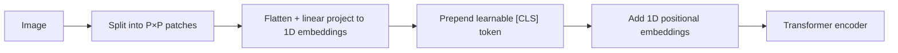
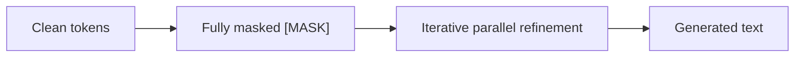
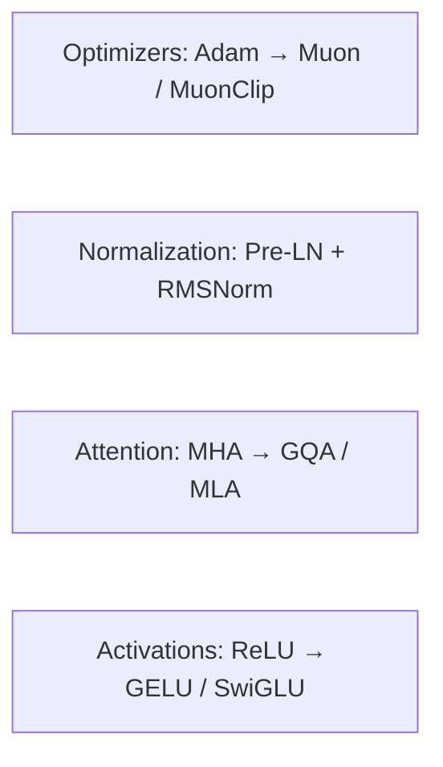
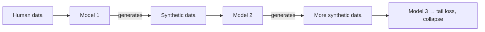

> **Stanford CME 295: Transformers & Large Language Models** — Lecture 9
> **Instructors:** Afshine Amidi & Shervine Amidi.

The closing lecture recaps the course and surveys the frontier: multimodal Transformers, **diffusion language models**, architectural shifts, the synthetic-data dilemma, and hardware co-design.

---

## Learning Objectives

1. **Explain Vision Transformers (ViT)** and compare early- vs. late-fusion vision-language models.
2. **Describe masked diffusion language models (dLLMs)** and why they enable parallel generation and fill-in-the-middle.
3. **List the architectural shifts** of 2025 (Muon, RMSNorm, GQA/MLA, SwiGLU, 2D-RoPE).
4. **Analyze synthetic-data collapse** and the modern training pipeline.
5. **Explain hardware co-design** and the analog-computing proof of concept.

---

## Multimodal Transformers (Vision)

### Vision Transformers (ViT, Dosovitskiy et al. 2020)

ViT treats an image exactly like a sequence of tokens:



- **Inductive bias:** CNNs carry strong local bias (translation invariance, locality); ViTs have minimal bias, so they need more data but scale to higher performance.

### Vision-Language Models (VLMs)

- **Token concatenation (early fusion, e.g., LLaVA):** encode image patches and concatenate them directly into the text token sequence of a decoder-only LLM.
- **Cross-attention injection (late fusion, e.g., Llama 3 Multimodal):** inject visual representations through cross-attention layers while text streams autoregressively.

### Generative vision

**Diffusion Transformers (DiT) and MMDiT** replace traditional convolutional U-Nets for image generation.

---

## Diffusion-Based Language Models (dLLMs / MDMs)

### The autoregressive bottleneck

Autoregressive models require $O(N)$ sequential forward passes at inference — training is parallel, but generation is not.

### Discrete masked diffusion



- **Forward process:** incrementally replace tokens with `[MASK]` across timesteps $t \in [0, T]$ until fully masked.
- **Reverse process:** predict all tokens in parallel across a fixed budget of refinement steps.

**Analogy:** drafting a speech — establish global structure first, then refine details in parallel (coarse-to-fine).

### Advantages and challenges

- **Decoupled latency:** $K$ diffusion steps $\ll N$ tokens, yielding up to ~10× speedups.
- **Bidirectional context:** naturally suited to **Fill-in-the-Middle (FIM)** code completion.
- **Frontier challenges:** adapting multi-step reasoning to diffusion; closing the accuracy gap with autoregressive frontier models.

---

## Cross-Pollination & Architectural Shifts

- **DeepSeek-OCR:** encodes dense text into minimal visual patch tokens, bypassing subword tokenization.
- **2D-RoPE:** decomposes rotary angles into orthogonal spatial coordinates for multimodal tokens.



The optimizer transition is exemplified by **Kimi K2**, which pioneered **Muon/MuonClip**.

---

## The Data Dilemma & Synthetic Collapse

The public web is saturating: synthetic text is estimated at ~80% of new web content. Recursively training on model-generated outputs causes **model collapse** — progressive loss of distribution tails, degraded diversity, and eventual functional collapse.



The modern pipeline adds a stage to combat this:

```
Pre-training → Mid-training (massive high-quality curated data) → SFT → Preference Tuning
```

---

## Hardware-Software Co-Design & Analog Computing

- **Digital bottleneck:** GPUs are optimized for General Matrix Multiply (GEMM), while self-attention introduces memory round-trips ($QK^T$ scaling between HBM and SRAM).
- **Analog proof of concept:** compute vector-matrix multiplications directly through analog circuit laws (e.g., Kirchhoff's current law summing currents across crossbar arrays), driven by physical voltage pulses — bypassing digital clock cycles and drastically reducing power.

---

## Open Frontiers

- Multi-step agent fragility and compounding error divergence.
- Security: indirect prompt injection and the need for "HTTPS-like" AI safety certification for autonomous web navigation.
- Continuous lifelong learning without static parameter freezing.
- Disambiguating hallucinations from ordinary probabilistic next-token generation.
- Mechanistic interpretability of internal representation dynamics.

---

## Production Python: ViT Patch Embedding

```python
"""
vit_patch_embed.py
A minimal Vision Transformer patch-embedding layer (Dosovitskiy et al., 2020).
"""
from __future__ import annotations

import torch
import torch.nn as nn


class PatchEmbedding(nn.Module):
    """Split an image into P×P patches and linearly project each to d_model."""

    def __init__(self, img_size: int = 224, patch_size: int = 16, in_chans: int = 3, d_model: int = 768):
        super().__init__()
        assert img_size % patch_size == 0, "img_size must be divisible by patch_size"
        self.num_patches = (img_size // patch_size) ** 2

        # A single conv with stride = patch_size is equivalent to flatten+project.
        self.proj = nn.Conv2d(in_chans, d_model, kernel_size=patch_size, stride=patch_size)
        # Learnable [CLS] token and positional embeddings (as in ViT).
        self.cls_token = nn.Parameter(torch.zeros(1, 1, d_model))
        self.pos_embed = nn.Parameter(torch.zeros(1, self.num_patches + 1, d_model))

    def forward(self, x: torch.Tensor) -> torch.Tensor:
        B = x.size(0)
        x = self.proj(x).flatten(2).transpose(1, 2)      # (B, num_patches, d_model)
        cls = self.cls_token.expand(B, -1, -1)           # (B, 1, d_model)
        x = torch.cat([cls, x], dim=1)                   # (B, num_patches+1, d_model)
        return x + self.pos_embed


if __name__ == "__main__":
    pe = PatchEmbedding()
    img = torch.randn(2, 3, 224, 224)
    tokens = pe(img)
    print(f"Tokens: {tokens.shape}  (2 images, {pe.num_patches} patches + 1 CLS, d_model=768)")
```

---

## Course-Wide Recap

| Lecture | One-line takeaway |
|---|---|
| **01 Architecture** | Scaled dot-product attention + positional encoding replaced recurrence |
| **02 Tricks** | RoPE, RMSNorm, Pre-LN, KV cache, GQA made Transformers scalable |
| **03 MoE & Inference** | Sparse experts decouple capacity from compute; PagedAttention/MLA/speculation accelerate serving |
| **04 Training** | Chinchilla, ZeRO, FlashAttention, and LoRA/QLoRA make training tractable |
| **05 Alignment** | Bradley-Terry + PPO, and DPO as its closed-form supervised equivalent |
| **06 Reasoning** | Test-time compute, pass@k, GRPO, and DeepSeek-R1 |
| **07 Agency** | RAG, tool calling, MCP, and the ReAct loop |
| **08 Evaluation** | Kappa, LLM-as-a-Judge, atomic factuality, and agent failure modes |
| **09 Frontiers** | ViT, diffusion LLMs, synthetic collapse, and hardware co-design |

---

## Closing

> Generating code is cheap; judging whether it is correct is the hard part. Start small, start correct, then optimize.

This completes the Stanford CME 295 curriculum. Return to the [course overview](/docs/ai-agents/agentic-ai) to jump to any lesson.
