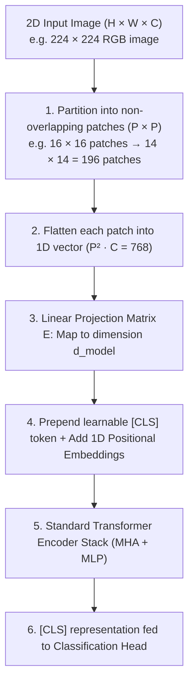
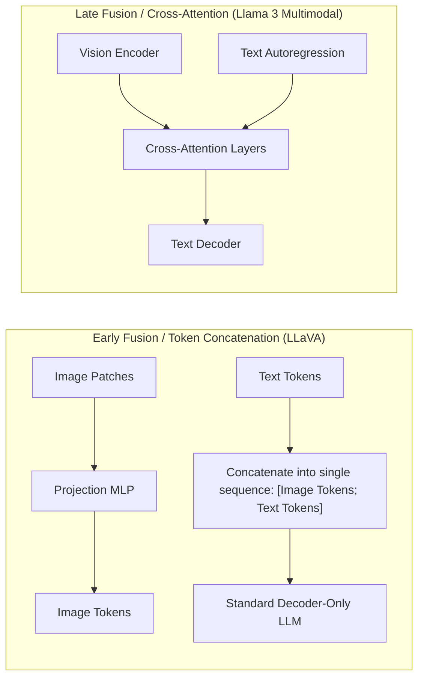
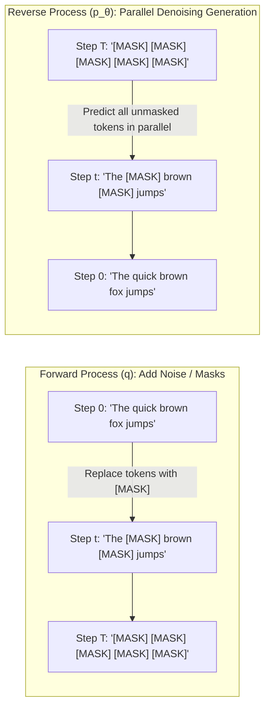
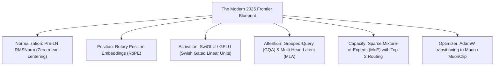
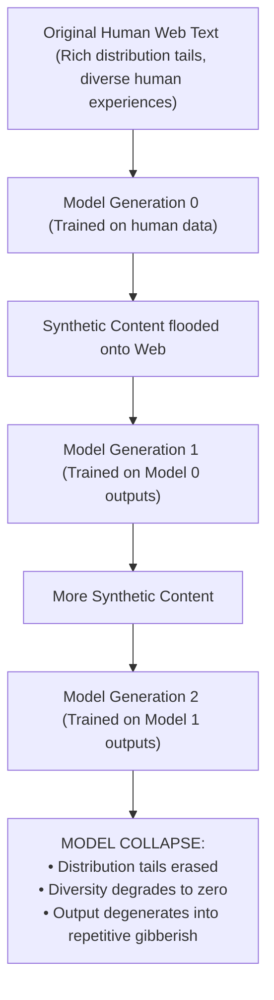
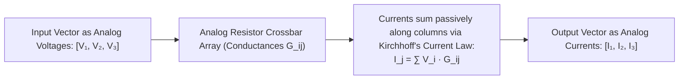

import { Callout } from 'fumadocs-ui/components/callout';
import { Tab, Tabs } from 'fumadocs-ui/components/tabs';
import { Accordion, Accordions } from 'fumadocs-ui/components/accordion';

> **Stanford CME 295: Transformers & Large Language Models** — Lecture 9  
> **Instructors:** Afshine Amidi & Shervine Amidi.

We have traversed the entire continuum of modern AI: from tokenization and self-attention in 2017 to the reasoning and agentic revolutions of 2025. In this capstone synthesis lecture, we examine **where the field is heading next**.

We analyze the expansion of Transformers into **multimodal vision (ViTs and VLMs)**, the emerging challenge to autoregression posed by **Discrete Masked Diffusion Language Models (dLLMs)**, new optimization algorithms like **Muon**, the existential threat of **synthetic data model collapse**, and the frontier of **analog optical and crossbar computing**.

---

## Learning Objectives

By the end of this lesson you will be able to:

1. **Deconstruct Vision Transformers (ViT)**, contrasting convolution's local inductive bias with the Transformer's global patch attention.
2. **Formulate Discrete Masked Diffusion for text (dLLMs)**, explaining how parallel non-autoregressive decoding breaks the $O(N)$ sequential inference bottleneck.
3. **Trace the modern architectural convergence**: RMSNorm, SwiGLU, RoPE, MLA, and the Muon optimizer.
4. **Diagnose Model Collapse** caused by recursive training on synthetic web data and explain why "mid-training" emerged as an essential phase.
5. **Analyze the physics of hardware co-design**: the memory-wall ceiling on digital GPUs and how analog crossbar arrays compute vector-matrix products via Kirchhoff's laws.

---

## 1. Multimodal Transformers: Vision as Sequences

For decades, computer vision was dominated by **Convolutional Neural Networks (CNNs)**. In 2020, Dosovitskiy et al. asked: *Can we process an image using a standard Transformer Encoder with zero convolutional layers?*

### Vision Transformers (ViT - Dosovitskiy et al., 2020)

#### Inductive Bias: CNNs vs. ViTs

- **CNNs have strong Inductive Bias:** They assume pixels close together are related (locality) and that features are identical regardless of spatial location (translation invariance). They learn quickly on small datasets.
- **ViTs have near-zero Inductive Bias:** Self-attention allows any patch to attend to any other patch across the entire image on layer 1. When trained on massive corpora (e.g., JFT-300M), ViTs completely surpass CNNs.

---

### Vision-Language Models (VLMs)

How do modern models like GPT-4o, Claude 3.5 Sonnet, and Gemini process images alongside text?

- **Early Fusion (LLaVA):** Image patches are projected into text embedding space and concatenated directly into the token sequence. Simple, flexible, but inflates sequence length.
- **Cross-Attention Injection:** Image representations are held in a separate vision encoder and injected into the text decoder via cross-attention layers. Preserves text KV cache efficiency.

---

## 2. Diffusion-Based Language Models (dLLMs)

### The Fatal Bottleneck of Autoregression

Every model discussed so far has been **autoregressive**:
$$P(w_1, \dots, w_N) = \prod_{t=1}^{N} P(w_t \mid w_{<t})$$

Generating 2,000 tokens requires **2,000 sequential forward passes**. Because GPUs cannot parallelize sequential time steps, inference latency scales linearly with output length ($O(N)$).

---

### Discrete Masked Diffusion (Text Diffusion)

Can we generate text the way image models generate pictures—**in parallel, refining all tokens simultaneously?**

#### Physical Analogy: The Author's Rough Draft
- **Autoregression:** Like a typewriter. You must type word 1, then word 2, then word 3. You can never go back, look ahead, or edit.
- **Diffusion LLM:** Like a writer creating a speech. First, you draft a rough global outline with placeholder blanks (`[MASK]`). In step 2, you fill in key structural concepts across all paragraphs simultaneously. In step 3, you polish the grammar everywhere at once.

#### Production Advantages of Diffusion LLMs:
1. **Decoupled Latency ($O(K)$ vs $O(N)$):** A diffusion model can generate a 1,000-token document in **16 or 32 parallel refinement steps**, delivering a **$5\times\text{--}10\times$ speedup** over autoregression.
2. **Native Bidirectional Context & Fill-in-the-Middle (FIM):** Because the model sees future context and past context simultaneously, it excels at code refactoring and filling in missing code inside existing files.

---

## 3. The 2025 Architectural Convergence

By 2025, the open-source and proprietary AI ecosystem has converged on a clear architectural blueprint:

### The Muon Optimizer (2025)
For a decade, AdamW was the undisputed king of deep learning optimizers. In 2024–2025, Keller Jordan and the Kimi K2 team introduced **Muon (Momentum Orthogonalized by Newton-schulz)**:
- Instead of scaling weight updates element-wise via diagonal second moments ($v_t$), Muon orthogonalizes 2D weight updates using rapid Newton-Schulz matrix iterations.
- Muon updates the spectral properties of weight matrices directly, achieving **$20\%\text{--}30\%$ faster training convergence** than AdamW with zero additional hyperparameter tuning.

---

## 4. The Data Dilemma: Model Collapse & Mid-Training

### The Web Saturation Crisis

Pre-training requires trillions of tokens of human-written text. However, by 2025, an estimated **60%–80% of all newly published content on the public internet is generated by LLMs**.

<Callout type="error">
**Model Collapse ("Mad Cow Disease for AI"):**  
Shumailov et al. (Nature, 2024) proved mathematically that when generative models are trained recursively on data generated by earlier models, statistical information about the **tails of the underlying distribution is permanently lost**. Over generations, the models collapse into uniform, hallucinatory degeneration.
</Callout>

### The Modern Defense: The Mid-Training Phase
To avoid poisoned synthetic web crawl data, AI labs introduced **Mid-Training**:
$$\text{Pre-Training (Trillions of web tokens)} \longrightarrow \mathbf{\text{Mid-Training (100B–500B high-quality curated tokens)}} \longrightarrow \text{SFT} \longrightarrow \text{RL}$$
Mid-training continues training the base model exclusively on verified textbooks, verified GitHub repositories, peer-reviewed scientific papers, and synthesized reasoning datasets verified by programmatic compilers.

---

## 5. Hardware-Software Co-Design: Analog Computing

Modern AI is hitting the thermal and energetic limits of digital silicon:
- Training a frontier model consumes gigawatt-hours of electricity.
- Digital GPUs spend over 70% of energy moving bits back and forth across memory buses rather than performing math.

### The Analog Crossbar Array Frontier

Can we compute matrix multiplications without digital clock cycles and memory buses?

#### Physical Analogy: Ohm's Law and Kirchhoff's Law
- **Ohm's Law ($I = V \cdot G$):** Passing voltage $V_i$ through a memristor of conductance $G_{ij}$ produces a current proportional to their product!
- **Kirchhoff's Current Law ($I_{\text{total}} = \sum I_k$):** Connecting the output wires physically sums the currents passively with **zero digital clock cycles and zero memory transfers**!

While analog computing currently faces challenges in precision, temperature drift, and ADC/DAC conversion costs, analog accelerators offer the potential for **$100\times$ higher energy efficiency** for inference in the decade ahead.

---

## 6. Comprehensive Curriculum Summary Matrix

| Lecture | Core Subject | Primary Breakthrough | Key Failure Mode / Bottleneck |
|---|---|---|---|
| **01** | Architecture Foundations | Scaled Dot-Product Attention & MHA | RNN information bottleneck; $O(N^2)$ memory |
| **02** | Models & Tricks | RoPE, RMSNorm, Pre-LN, GQA | Post-LN instability; KV cache VRAM exhaustion |
| **03** | MoE & Inference | Sparse Top-$k$ Routing, PagedAttention, MLA | Routing collapse; memory fragmentation |
| **04** | Training & PEFT | Chinchilla Laws, FlashAttention, LoRA | GPU memory wall; undertrained models |
| **05** | Alignment & Tuning | Bradley-Terry Model, RLHF, DPO | Reward hacking; PPO 4-model memory tax |
| **06** | LLM Reasoning | Test-Time Compute, GRPO, DeepSeek-R1 | Length bias bug; Critic network memory |
| **07** | Agentic Systems | Two-stage RAG, Tools, MCP, ReAct | Indirect prompt injection; tool hallucination |
| **08** | Evaluation | Cohen's Kappa, Rationale-First, Agent Failure Modes | Raw agreement fallacy; compounding step failure |
| **09** | Recap & Frontiers | ViTs, Masked Text Diffusion, Muon, Analog | Synthetic model collapse; digital energy ceiling |

---

## 7. Self-Check & Retrieval Practice

<Accordions>
<Accordion title="1. CNN Locality vs. ViT Global Attention">
**Question:** Why do Convolutional Neural Networks (CNNs) outperform Vision Transformers when trained on very small datasets (e.g., 5,000 images), while ViTs massively outperform CNNs when trained on 300 million images?

Click to view solution

**Explanation:**  
CNNs possess a strong **hard-coded inductive bias**: they assume local spatial structure (nearby pixels belong together) and translation invariance. On small datasets, this hard-coded assumption guides learning and prevents overfitting.  
ViTs have **minimal inductive bias**: every image patch can attend to every other patch across the entire image on layer 1. On small datasets, ViTs overfit because they have to learn spatial geometry from scratch. But on massive datasets, the rigid assumptions of CNNs become a performance ceiling, whereas the unconstrained attention of ViTs learns richer, globally optimal visual representations.

</Accordion>

<Accordion title="2. The Root Cause of Model Collapse">
**Question:** Why does recursively training an LLM on synthetic text generated by earlier LLMs cause the model to degenerate over multiple generations?

Click to view solution

**Explanation:**  
When an LLM samples text, it samples primarily from high-probability regions of its distribution, trimming or undersampling the rare long-tail events (unusual vocabulary, rare edge cases, niche human perspectives).  
When Model 2 is trained on Model 1's outputs, its training distribution has narrower tails. Model 2 trims those tails further. Over several generations, the tails disappear completely, variance shrinks to zero, and the model collapses into a degenerate state emitting repetitive, nonsensical text.

</Accordion>

<Accordion title="3. Autoregressive Typewriter vs. Diffusion Speechwriter">
**Question:** Why does Discrete Masked Diffusion for text offer up to a $10\times$ latency advantage over standard autoregressive models for generating long code files?

Click to view solution

**Explanation:**  
Autoregressive decoding is strictly sequential: generating 1,000 tokens of code requires 1,000 separate sequential forward passes through the GPU.  
Discrete Masked Diffusion starts with a fully masked file and denoises/predicts all 1,000 tokens in parallel across a small, fixed budget of refinement steps (e.g., 20 steps). Because $20 \ll 1000$, inference latency is dramatically lower, while bidirectional context allows the model to reconcile syntax between the top and bottom of the file simultaneously.

</Accordion>
</Accordions>

---

## Next Steps

Congratulations on completing the theoretical and engineering curriculum of **Stanford CME 295**! 

To bridge all these concepts into a production application, continue to our hands-on capstone: **Building Production Autonomous Agents: End-to-End Architecture, Multi-Agent Orchestration & Self-Correction Loops**.

[Next: Capstone: Building Production Autonomous Agents →](/docs/ai-agents/agentic-ai/10-building-autonomous-agents-end-to-end)
