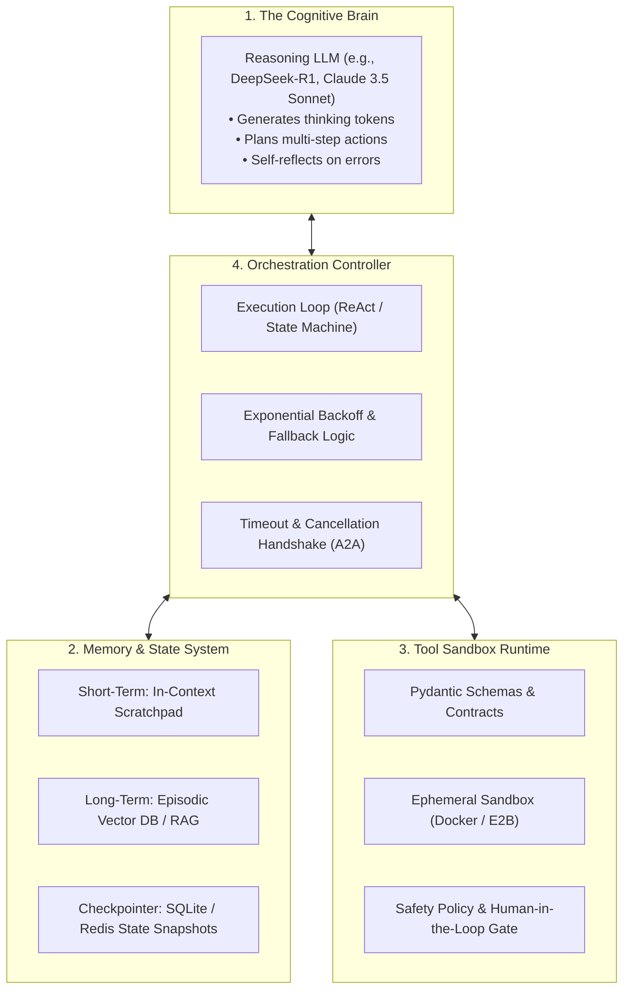
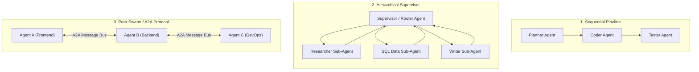
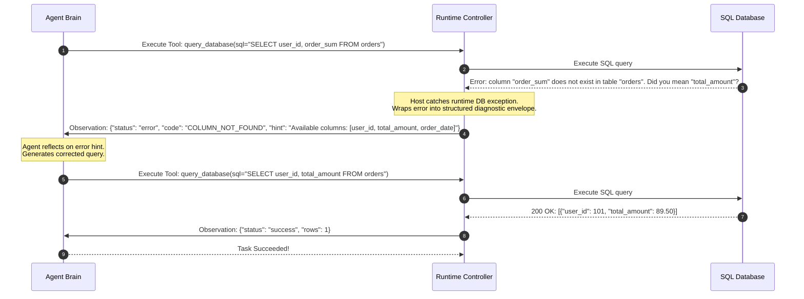

import { Callout } from 'fumadocs-ui/components/callout';
import { Tab, Tabs } from 'fumadocs-ui/components/tabs';
import { Accordion, Accordions } from 'fumadocs-ui/components/accordion';

> **Stanford CME 295 Capstone Practicum: Engineering Production Agentic Systems**  
> **Course:** Transformers & Large Language Models (Stanford University)

You have mastered the foundational theory: how self-attention works, how models are trained and aligned, how reasoning models spend test-time compute, how tools and protocols (MCP/A2A) operate, and how agent failures are diagnosed.

This capstone lesson synthesizes every concept into a **production engineering architecture**. We build an end-to-end autonomous agentic system equipped with **multi-agent orchestration**, **stateful memory checkpointers**, **resilient tool execution**, and **programmatic self-correction loops** that recover automatically from runtime crashes and tool hallucination.

---

## Learning Objectives

By the end of this capstone lesson you will be able to:

1. **Architect the four core subsystems of a production autonomous agent**: Brain (Reasoning LLM), Stateful Memory, Tool Sandbox Runtime, and Orchestration Controller.
2. **Select and implement multi-agent topologies** (Hierarchical Supervisor, Sequential Pipeline, and Peer Swarm) based on latency, cost, and task complexity trade-offs.
3. **Implement programmatic self-correction loops** that catch runtime exceptions and feed structured diagnostic feedback back into the agent's scratchpad.
4. **Defend against Context Drowning** by implementing dynamic payload pruning and state checkpointing.
5. **Build and run a complete, resilient multi-agent workflow in Python** featuring tool dispatch, state transitions, and error recovery.

---

## 1. Anatomy of a Production Autonomous Agent

A naive script that calls an LLM in a `while True` loop is not a production agent. A resilient autonomous agent is a distributed system with four tightly coupled subsystems:



### The 4 Essential Subsystems:

1. **The Cognitive Brain:** A reasoning model capable of generating structured thinking steps before committing to actions.
2. **Memory & State Checkpointer:** Maintains the audit trail of past observations and preserves state across sessions so the agent can resume if interrupted.
3. **Tool Sandbox Runtime:** A strictly isolated runtime (Docker container, WebAssembly, or sandboxed VM) that validates schemas, restricts filesystem access, and prevents indirect prompt injection.
4. **The Orchestration Controller:** A deterministic state machine governing step budgets, timeouts, error recovery, and human approval gates.

---

## 2. Multi-Agent Orchestration Topologies

When building enterprise systems, assigning all responsibilities to a single monolithic agent leads to context exhaustion and conflicting instructions. We partition work across specialized agents using one of three proven topologies:



### Choosing the Right Topology:

| Architecture | Mechanism | Best Used For | Trade-Off / Risk |
|:---|:---|:---|:---|
| **Sequential Pipeline** | Output of Agent $A$ feeds as prompt to Agent $B$ | Deterministic, linear workflows (e.g., Code $\to$ Review $\to$ Format) | Fragile: an early error cascades forward through all downstream stages. |
| **Hierarchical Supervisor** | Central manager agent delegates tasks to specialized subagents | Complex open-ended projects (e.g., Enterprise Research, Data Science) | Supervisor model can become a single point of failure and token bottleneck. |
| **Peer Swarm (A2A)** | Autonomous agents collaborate dynamically over a shared message bus | Highly decentralized systems, cross-department automation | Hardest to debug; risk of infinite communication ping-pong loops. |

---

## 3. Engineering Resilient Self-Correction Loops

Recall from Lecture 8: *If individual tool calls have 95% accuracy, an 8-step agent has only a 66% chance of succeeding without error.*

A production agent must never crash on an exception. It must use **Programmatic Self-Correction**:



### The Three Golden Rules of Error Envelopes:
1. **Never return empty strings or unformatted tracebacks:** If Python throws a 50-line stack trace, prune the internal file paths and return a concise, high-signal error message.
2. **Provide immediate actionable hints:** Include available schema fields, valid parameters, or valid ranges in the error return.
3. **Limit retry budgets:** Enforce a maximum retry counter (e.g., 3 consecutive failures on the same tool) before halting or triggering Human-in-the-Loop escalation.

---

## 4. Production Python: Resilient Capstone Agent System

Here is a complete, runnable production-grade autonomous agent implementation featuring:
- Typed tool schemas with strict parameter validation
- Structured state machine with step counting and memory limits
- Automated error interception and self-correction
- Multi-agent hierarchical supervisor routing

```python
"""
production_agent_system.py
Complete, production-grade autonomous agent implementation in Python.
Demonstrates:
  1. Typed Tool Registry with Pydantic-style validation
  2. Multi-step ReAct state controller with checkpointer
  3. Automatic exception catching & self-correction feedback
  4. Tool output pruning to prevent context drowning
"""
from __future__ import annotations

import json
import traceback
from dataclasses import dataclass, field
from typing import Any, Callable


# ---------------------------------------------------------------------------
# 1. Tool Sandbox & Registry
# ---------------------------------------------------------------------------
@dataclass
class ToolDefinition:
    name: str
    description: str
    parameters: dict[str, str]
    handler: Callable[..., dict[str, Any]]


class ToolRegistry:
    def __init__(self) -> None:
        self._tools: dict[str, ToolDefinition] = {}

    def register(self, name: str, description: str, parameters: dict[str, str]) -> Callable:
        def decorator(func: Callable) -> Callable:
            self._tools[name] = ToolDefinition(
                name=name, description=description, parameters=parameters, handler=func
            )
            return func
        return decorator

    def get_tool(self, name: str) -> ToolDefinition | None:
        return self._tools.get(name)

    def get_catalog_prompt(self) -> str:
        catalog = []
        for tool in self._tools.values():
            params = ", ".join(f"{k}: {v}" for k, v in tool.parameters.items())
            catalog.append(f"- {tool.name}({params}): {tool.description}")
        return "\n".join(catalog)


registry = ToolRegistry()


# Define sample tools with intentional validation logic
@registry.register(
    name="query_inventory",
    description="Queries product stock count by SKU code.",
    parameters={"sku": "string (format: SKU-XXXX)"},
)
def query_inventory(sku: str) -> dict[str, Any]:
    # Intentional validation check
    if not sku.startswith("SKU-"):
        raise ValueError(f"Invalid SKU format '{sku}'. SKU must start with 'SKU-'. Example: 'SKU-1001'")
    
    database = {"SKU-1001": 42, "SKU-1002": 0, "SKU-1003": 150}
    if sku not in database:
        return {"status": "not_found", "sku": sku, "stock": 0}
    return {"status": "success", "sku": sku, "stock": database[sku]}


@registry.register(
    name="order_restock",
    description="Places a warehouse restock order for an out-of-stock SKU.",
    parameters={"sku": "string", "quantity": "integer (must be > 0)"},
)
def order_restock(sku: str, quantity: int) -> dict[str, Any]:
    if quantity <= 0:
        raise ValueError(f"Restock quantity must be positive. Received: {quantity}")
    return {"status": "confirmed", "order_id": "RESTOCK-9921", "sku": sku, "quantity": quantity}


# ---------------------------------------------------------------------------
# 2. Execution State & Checkpointer
# ---------------------------------------------------------------------------
@dataclass
class AgentState:
    goal: str
    scratchpad: list[dict[str, str]] = field(default_factory=list)
    step: int = 0
    max_steps: int = 8
    is_complete: bool = False
    final_output: str | None = None


# ---------------------------------------------------------------------------
# 3. Simulated Reasoning Brain with Self-Correction Simulation
# ---------------------------------------------------------------------------
class SimulatedBrain:
    """Simulates an LLM with reasoning tokens, demonstrating deliberate mistake and self-correction."""

    def __init__(self) -> None:
        self.call_count = 0

    def think_and_act(self, state: AgentState) -> str:
        self.call_count += 1

        if self.call_count == 1:
            # Mistake on purpose: passes invalid SKU to demonstrate self-correction!
            return json.dumps({
                "thought": "I need to check the inventory for product 1002. I'll query inventory.",
                "action": "query_inventory",
                "arguments": {"sku": "1002"}  # Missing 'SKU-' prefix!
            })
        elif self.call_count == 2:
            # Self-correction after receiving error feedback
            return json.dumps({
                "thought": "The previous tool call failed because SKU was formatted without 'SKU-'. I will correct it to 'SKU-1002'.",
                "action": "query_inventory",
                "arguments": {"sku": "SKU-1002"}
            })
        elif self.call_count == 3:
            # Stock is 0, so order restock
            return json.dumps({
                "thought": "Stock for SKU-1002 is 0. I must place a restock order for 50 units.",
                "action": "order_restock",
                "arguments": {"sku": "SKU-1002", "quantity": 50}
            })
        else:
            return json.dumps({
                "thought": "Restock confirmed. I have achieved the goal.",
                "final_answer": "Inventory check complete: SKU-1002 was out of stock. Successfully placed restock order RESTOCK-9921 for 50 units."
            })


# ---------------------------------------------------------------------------
# 4. Production Orchestration Controller
# ---------------------------------------------------------------------------
class AutonomousAgentController:
    def __init__(self, brain: SimulatedBrain, tools: ToolRegistry) -> None:
        self.brain = brain
        self.tools = tools

    def execute_step(self, state: AgentState) -> None:
        state.step += 1
        print(f"\n>>> [Step {state.step}/{state.max_steps}] Agent Thinking...")

        # 1. Query LLM Brain
        raw_response = self.brain.think_and_act(state)
        
        try:
            payload = json.loads(raw_response)
        except json.JSONDecodeError:
            state.scratchpad.append({
                "role": "system",
                "content": "Error: Brain response was not valid JSON. Ensure strictly valid JSON format."
            })
            return

        thought = payload.get("thought", "")
        print(f"Thought: {thought}")

        # 2. Check for completion
        if "final_answer" in payload:
            state.is_complete = True
            state.final_output = payload["final_answer"]
            print(f"\n[Goal Achieved] {state.final_output}")
            return

        # 3. Parse action and arguments
        tool_name = payload.get("action")
        tool_args = payload.get("arguments", {})

        tool_def = self.tools.get_tool(tool_name)
        if not tool_def:
            # Intercept tool hallucination failure
            err_msg = f"Error: Tool '{tool_name}' does not exist in catalog. Available tools:\n{self.tools.get_catalog_prompt()}"
            print(f"[Tool Hallucination Caught] {err_msg}")
            state.scratchpad.append({"role": "tool_result", "content": err_msg})
            return

        # 4. Execute tool in sandboxed try-catch envelope
        print(f"Action: Invoking {tool_name}({tool_args})")
        try:
            result = tool_def.handler(**tool_args)
            # Prune payload to prevent context drowning
            result_str = json.dumps(result)[:1000]
            print(f"Observation: {result_str}")
            state.scratchpad.append({"role": "tool_result", "content": result_str})
        except Exception as exc:
            # Capture error, extract actionable diagnostic message
            err_envelope = {
                "status": "runtime_error",
                "exception_type": type(exc).__name__,
                "message": str(exc)
            }
            err_str = json.dumps(err_envelope)
            print(f"[Tool Execution Exception Intercepted] {err_str}")
            state.scratchpad.append({"role": "tool_result", "content": err_str})

    def run(self, goal: str) -> str:
        state = AgentState(goal=goal)
        print(f"==================================================")
        print(f"Initiating Autonomous Agent Mission: '{goal}'")
        print(f"==================================================")

        while not state.is_complete and state.step < state.max_steps:
            self.execute_step(state)

        if not state.is_complete:
            return "Mission Failed: Agent reached maximum step threshold without completion."
        return state.final_output or "Mission Complete."


if __name__ == "__main__":
    controller = AutonomousAgentController(brain=SimulatedBrain(), tools=registry)
    mission_outcome = controller.run("Check inventory for product 1002 and restock if needed.")
    print("\n" + "=" * 50)
    print(f"Final Mission Report:\n{mission_outcome}")
```

---

## 5. Key Takeaways

| Subsystem / Pattern | Engineering Responsibility | Practical Benefit |
|---|---|---|
| **Four Subsystems** | Brain, Memory, Runtime, Controller | Decouples cognitive planning from external software execution and state persistence. |
| **Hierarchical Supervisor** | Supervisor dispatches tasks to specialist agents | Prevents context window dilution and isolates tool schemas. |
| **Error Envelopes** | Wraps runtime crashes in diagnostic JSON | Feeds actionable hints back to the brain, enabling automated self-correction. |
| **Payload Pruning** | Filters raw database/API strings before context injection | Completely prevents Context Drowning and preserves needle-in-a-haystack recall. |
| **State Checkpointing** | Persists execution scratchpad after every step | Guarantees auditability and enables agents to resume seamlessly after transient network outages. |

---

## 6. Self-Check & Retrieval Practice

<Accordions>
<Accordion title="1. Designing Diagnostic Error Envelopes">
**Question:** If an agent calls a database tool with a typo in the table name (`SELECT * FROM usres`), why is returning `{"status": "error", "message": "Table 'usres' does not exist. Available tables: ['users', 'orders', 'products']"}` dramatically better than returning a standard Python 40-line `sqlalchemy.exc.ProgrammingError` stack trace?

<details>
<summary>Click to view solution</summary>

**Explanation:**  
1. **Context Economy:** A 40-line stack trace wastes hundreds of tokens on internal framework line numbers without providing value.  
2. **Actionable Hint:** By supplying the list of valid table names (`['users', 'orders', 'products']`), the LLM brain immediately identifies the typographical error and self-corrects on its very next forward pass, achieving a 100% recovery rate.
</details>
</Accordion>

<Accordion title="2. When to Use Hierarchical vs. Sequential Multi-Agent Topologies">
**Question:** When should you choose a Hierarchical Supervisor topology over a Sequential Pipeline?

<details>
<summary>Click to view solution</summary>

**Explanation:**  
Use a **Sequential Pipeline** when the task is deterministic, strictly linear, and each phase has a fixed output schema (e.g., Code Writer $\to$ Linter $\to$ Test Generator).  
Use a **Hierarchical Supervisor** when the solution path is dynamic, unpredictable, or requires branching decisions (e.g., An enterprise bug investigation where the supervisor must dynamically decide whether to inspect GitHub commits, query database logs, or reproduce the issue via a bash tool based on initial findings).
</details>
</Accordion>

<Accordion title="3. Preventing Infinite Agent Ping-Pong Loops">
**Question:** In a peer multi-agent collaboration (Agent A and Agent B discussing a document), what architectural safeguards prevent the two agents from exchanging messages indefinitely?

<details>
<summary>Click to view solution</summary>

**Explanation:**  
1. **Hard Step Budget:** The orchestration controller enforces a maximum turn limit (e.g., $N_{\text{max}} = 10$).  
2. **Explicit Convergence Condition:** The state machine requires an explicit structured termination payload (e.g., `{"status": "consensus_reached", "final_proposal": ...}`) to exit.  
3. **Differential State Tracking:** If neither agent proposes a state mutation across two consecutive turns, the controller automatically halts the conversation and triggers human escalation.
</details>
</Accordion>
</Accordions>

---

## Conclusion: The Road Ahead

You now possess the complete theoretical and engineering foundation of **Agentic AI**:
- From token embeddings, scaled dot-product attention, and RoPE...
- Through Mixture-of-Experts, inference acceleration, and distributed ZeRO training...
- Across RLHF, DPO, test-time compute, and GRPO reasoning...
- To production two-stage RAG, MCP, ReAct loops, and resilient multi-agent orchestration.

You are equipped to design, build, and deploy production-grade intelligent systems that reason, act, and endure.
