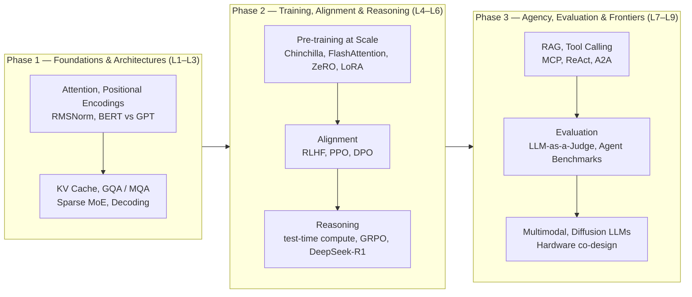
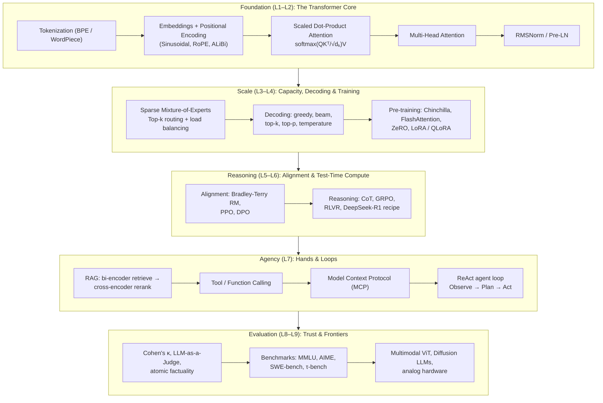

Welcome to the definitive curriculum on **Transformers & Large Language Models**, based on the landmark **Stanford CME 295** course (Autumn 2025) taught by **Afshine Amidi** and **Shervine Amidi**.

This track charts the entire continuum of modern AI: from the raw mechanics of scaled dot-product attention, through petabyte-scale pre-training and alignment, all the way to the 2025 frontier of **agentic systems** — retrieval, tool calling, the Model Context Protocol (MCP), ReAct loops, and reasoning via Reinforcement Learning (GRPO & DeepSeek-R1).

---

## The Core Thesis: From Text Predictor to Autonomous Agent

The course is organized around one arc: a next-token predictor becomes an agent when it can **retrieve knowledge**, **call tools**, and **reason across loops**. Every lesson is a rung on that ladder — architecture gives it capacity, training gives it knowledge, alignment gives it intent, reasoning gives it deliberation, and agency gives it hands.



---

## Master Architecture of the Course

The blueprint below traces what each lecture contributes to a production reasoning agent, from base weights to an autonomous, verified loop.



---

## Curriculum Matrix & Syllabus

The course spans **9 lectures** covering theory, algorithmic derivations, benchmark analysis, and production code.

| Lecture | Title | Core Concepts | Math & Code |
|---|---|---|---|
| **[01](/docs/ai-agents/agentic-ai/01-transformer-architecture-foundations)** | **Transformer Architecture & Foundations** | Tokenization (BPE), word embeddings (Word2Vec), RNN failures, scaled dot-product attention, MHA, positional encoding, encoder-decoder | Attention formula, softmax stability, PyTorch scaled attention |
| **[02](/docs/ai-agents/agentic-ai/02-transformer-models-and-tricks)** | **Transformer-Based Models & Tricks** | RoPE, ALiBi, relative position bias, RMSNorm, Pre-LN, KV cache, MQA/GQA, BERT (MLM/NSP) | RoPE rotation matrix, RMSNorm, KV-cache size model |
| **[03](/docs/ai-agents/agentic-ai/03-moe-decoding-and-inference)** | **MoE, Decoding & Inference Acceleration** | Sparse MoE & load balancing, decoding strategies, temperature, guided decoding, in-context learning, PagedAttention, MLA, speculative decoding | MoE gating, top-p sampling, speculative acceptance |
| **[04](/docs/ai-agents/agentic-ai/04-llm-training-and-peft)** | **LLM Training, Distributed Systems & PEFT** | Chinchilla scaling, GPU memory budget, ZeRO-1/2/3, FlashAttention, mixed precision, SFT, LoRA & QLoRA | Chinchilla tokens≈20×params, LoRA ΔW=BA, NF4 |
| **[05](/docs/ai-agents/agentic-ai/05-alignment-rlhf-and-dpo)** | **Alignment, RLHF, PPO & DPO** | Preference data, Bradley-Terry reward model, PPO with KL penalty, reward hacking, Best-of-N, DPO derivation | RM loss, PPO-clip objective, closed-form DPO loss |
| **[06](/docs/ai-agents/agentic-ai/06-llm-reasoning-grpo-and-r1)** | **Reasoning: Test-Time Compute, GRPO & DeepSeek-R1** | Reasoning vs vanilla LLMs, pass@k, GRPO (critic-free), length bias, DAPO, DeepSeek-R1 4-stage recipe, distillation | pass@k hypergeometric, group advantage, GRPO loss |
| **[07](/docs/ai-agents/agentic-ai/07-agentic-llms-rag-tools-mcp)** | **Agentic LLMs: RAG, Tool Calling, MCP & Workflows** | RAG pipeline, bi/cross-encoders, BM25 hybrid, HyDE, contextual retrieval, prompt caching, tool calling, MCP, ReAct, A2A, agent safety | NDCG/MRR/Precision@k, tool schema, ReAct pseudocode |
| **[08](/docs/ai-agents/agentic-ai/08-llm-evaluation-and-benchmarks)** | **Evaluation: LLM-as-a-Judge & Agent Benchmarks** | Inter-rater reliability (κ), METEOR/BLEU/ROUGE, LLM-as-a-Judge biases, atomic factuality, 7 agent failure modes, pass@k vs pass^k | Cohen's κ, factuality score, judge pipeline |
| **[09](/docs/ai-agents/agentic-ai/09-recap-and-current-trends)** | **Recap & Current Trends** | Vision Transformers, VLMs, diffusion LLMs, 2D-RoPE, Muon optimizer, synthetic data collapse, analog hardware, open frontiers | ViT patch embedding, masked diffusion process |

---

## How to Study This Course

Three learning tracks map the lectures to your goals:

```
┌─────────────────────────────────────────────────────────────────────────────┐
│                            LEARNING TRACKS                                  │
├──────────────────────┬──────────────────────┬───────────────────────────────┤
│   The Builder        │  The ML Researcher   │  The Systems Engineer         │
│      (Track A)       │      (Track B)       │           (Track C)           │
├──────────────────────┼──────────────────────┼───────────────────────────────┤
│ Focus: Agents, RAG,  │ Focus: Attention,    │ Focus: Distributed training,  │
│ tool calling, MCP,   │ alignment math, RL   │ inference engines, KV cache,  │
│ reasoning loops,     │ objectives, scaling  │ MoE routing, quantization,    │
│ evaluation.          │ laws, evaluation.    │ hardware co-design.           │
│                      │                      │                               │
│ Primary Lectures:    │ Primary Lectures:    │ Primary Lectures:             │
│ 06, 07, 08           │ 01, 02, 05, 06, 08   │ 03, 04, 09                    │
└──────────────────────┴──────────────────────┴───────────────────────────────┘
```

### Track A: The Builder Track
*Goal: Ship a production agent with retrieval, tools, and reliable evaluation.*
1. Start with **[06: Reasoning & GRPO](/docs/ai-agents/agentic-ai/06-llm-reasoning-grpo-and-r1)** to understand how models learn to deliberate before acting.
2. Build hands-on capability in **[07: Agentic LLMs](/docs/ai-agents/agentic-ai/07-agentic-llms-rag-tools-mcp)** — RAG, tool schemas, MCP, and the ReAct loop.
3. Harden your system with **[08: Evaluation](/docs/ai-agents/agentic-ai/08-llm-evaluation-and-benchmarks)** — judge design and the 7 agent failure modes.

### Track B: The ML Researcher Track
*Goal: Understand the mathematics of attention, alignment, and reasoning.*
1. Ground yourself in the core algebra: **[01](/docs/ai-agents/agentic-ai/01-transformer-architecture-foundations)** and **[02](/docs/ai-agents/agentic-ai/02-transformer-models-and-tricks)**.
2. Derive the alignment objectives in **[05: RLHF & DPO](/docs/ai-agents/agentic-ai/05-alignment-rlhf-and-dpo)**.
3. Master the reasoning RL objective in **[06: GRPO](/docs/ai-agents/agentic-ai/06-llm-reasoning-grpo-and-r1)**.

### Track C: The Systems Engineer Track
*Goal: Train and serve models efficiently.*
1. Master inference acceleration in **[03: MoE & Decoding](/docs/ai-agents/agentic-ai/03-moe-decoding-and-inference)** — PagedAttention, MLA, speculative decoding.
2. Master distributed training in **[04: Training & PEFT](/docs/ai-agents/agentic-ai/04-llm-training-and-peft)** — ZeRO, FlashAttention, QLoRA.
3. Look ahead in **[09: Current Trends](/docs/ai-agents/agentic-ai/09-recap-and-current-trends)** — analog hardware and diffusion LLMs.

---

## Complete Lesson Directory

### 01. Transformer Architecture & Foundations
*Why recurrence failed, how dot-product attention replaced it, and the full encoder-decoder blueprint of "Attention Is All You Need."*

[Open Lesson 1 &rarr;](/docs/ai-agents/agentic-ai/01-transformer-architecture-foundations)

### 02. Transformer-Based Models & Architectural Tricks
*The engineering that made Transformers trainable and scalable: RoPE, ALiBi, RMSNorm, Pre-LN, KV cache, MQA/GQA, and the BERT family.*

[Open Lesson 2 &rarr;](/docs/ai-agents/agentic-ai/02-transformer-models-and-tricks)

### 03. MoE, Decoding & Inference Acceleration
*Mixture-of-Experts, decoding strategies and temperature, in-context learning, and the engines that make inference fast — vLLM PagedAttention, MLA, and speculative decoding.*

[Open Lesson 3 &rarr;](/docs/ai-agents/agentic-ai/03-moe-decoding-and-inference)

### 04. LLM Training, Distributed Systems & PEFT
*Chinchilla scaling laws, the GPU memory budget, ZeRO, FlashAttention, mixed precision, SFT, and LoRA/QLoRA.*

[Open Lesson 4 &rarr;](/docs/ai-agents/agentic-ai/04-llm-training-and-peft)

### 05. Alignment, RLHF, PPO & DPO
*Preference data, the Bradley-Terry reward model, PPO with a KL penalty, reward hacking, and the closed-form derivation of Direct Preference Optimization.*

[Open Lesson 5 &rarr;](/docs/ai-agents/agentic-ai/05-alignment-rlhf-and-dpo)

### 06. Reasoning: Test-Time Compute, GRPO & DeepSeek-R1
*How models learn to think: test-time compute, the pass@k metric, critic-free Group Relative Policy Optimization, length bias, DAPO, and the DeepSeek-R1 recipe.*

[Open Lesson 6 &rarr;](/docs/ai-agents/agentic-ai/06-llm-reasoning-grpo-and-r1)

### 07. Agentic LLMs: RAG, Tool Calling, MCP & Workflows
*Giving the model hands: the two-stage RAG pipeline, tool calling, the Model Context Protocol, the ReAct loop, Agent2Agent, and agent safety.*

[Open Lesson 7 &rarr;](/docs/ai-agents/agentic-ai/07-agentic-llms-rag-tools-mcp)

### 08. Evaluation: LLM-as-a-Judge & Agent Benchmarks
*Measuring quality: inter-rater reliability, the LLM-as-a-Judge framework, atomic factuality, the 7 practical agent failure modes, and the benchmark landscape.*

[Open Lesson 8 &rarr;](/docs/ai-agents/agentic-ai/08-llm-evaluation-and-benchmarks)

### 09. Recap & Current Trends
*Where the field is heading: Vision Transformers, diffusion language models, 2D-RoPE, the Muon optimizer, synthetic data collapse, and analog hardware.*

[Open Lesson 9 &rarr;](/docs/ai-agents/agentic-ai/09-recap-and-current-trends)
