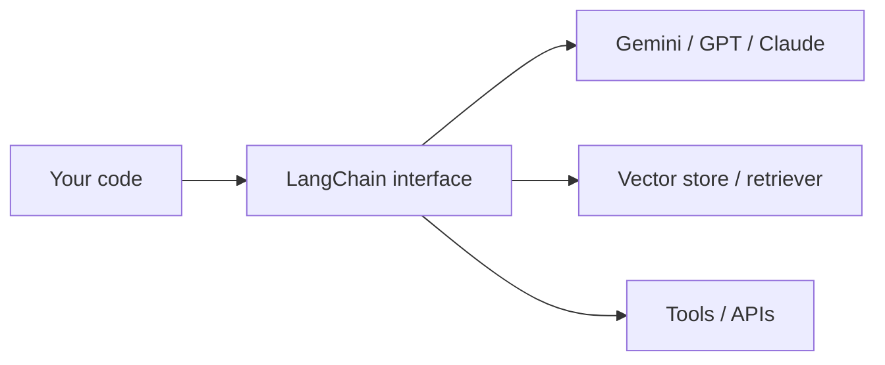

> **Learning goals:** Place LangChain in the stack; list what it standardises; know when to leave it for LangGraph.
> **Prerequisites:** [Agent Engineer 01](/docs/ai-agents/agent-engineer/01-what-are-ai-agents).

## LangChain in one sentence

LangChain is a **standard interface** over models, prompts, parsers, retrievers, and tools — so swapping a model or store does not rewrite your app.

## What belongs in LangChain

| Piece | Why standardise it |
|---|---|
| Chat models + message types | One call shape across vendors |
| Prompt templates | Versionable, testable prompts |
| Output parsers | JSON / pydantic out, no regex soup |
| Retrievers + loaders | Same API over PDFs, docs, DBs |
| Tools + toolkits | One schema for function calling |

What does **not** belong: durable state, approvals, multi-actor orchestration. That is [LangGraph](/docs/ai-agents/langgraph).

## Mental model: library, not runtime

- LangChain **runs in your process** — a script you call.
- LangGraph **runs your process** — a runtime with checkpoints and interrupts.

Start with the library. Graduate when crashes lose work or humans need a gate.

## Key takeaways

1. LangChain = portable glue for models, prompts, parsers, retrieval, tools.
2. It does not checkpoint, pause, or coordinate — by design.
3. Keep prompts in files and tools behind clean schemas so migration is cheap.

---

[Next: Prompts, models, and output parsers →](/docs/ai-agents/langchain/02-prompts-models-and-output-parsers)
