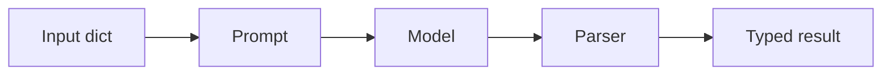

> **Learning goals:** Write LCEL pipes; run independent branches in parallel; add fallbacks and streaming.
> **Prerequisites:** [Prompts, models, parsers](/docs/ai-agents/langchain/02-prompts-models-and-output-parsers).

## The pipe

```python
chain = prompt | model | parser
result = chain.invoke({"audience": "on-call", "commits": "..."})
```

Each stage is a **Runnable**: sync/async, batch, and stream for free.



## Parallelism for independent reads

```python
from langchain_core.runnables import RunnableParallel

parallel = RunnableParallel(
  summary=summary_chain,
  risks=risk_chain,
  costs=cost_chain,
)
# wall-clock = slowest branch, not the sum
```

Parallelise only independent reads. Parallel writes need a reducer — that is a graph problem.

## Fallbacks and streaming

```python
robust = primary.with_fallbacks([secondary])  # frontier -> flash
async for chunk in chain.astream(payload):
  render(chunk)  # live UI for long tasks
```

Fallbacks ride through transient errors; streaming keeps long chains feeling alive.

## Key takeaways

1. LCEL `|` composes testable, streamable units.
2. `RunnableParallel` for reads; graphs for merging writes.
3. Fallbacks + streaming are production defaults, not extras.

---

[Previous: Prompts and parsers](/docs/ai-agents/langchain/02-prompts-models-and-output-parsers) | [Next: Tools and tool calling →](/docs/ai-agents/langchain/04-tools-and-tool-calling)
