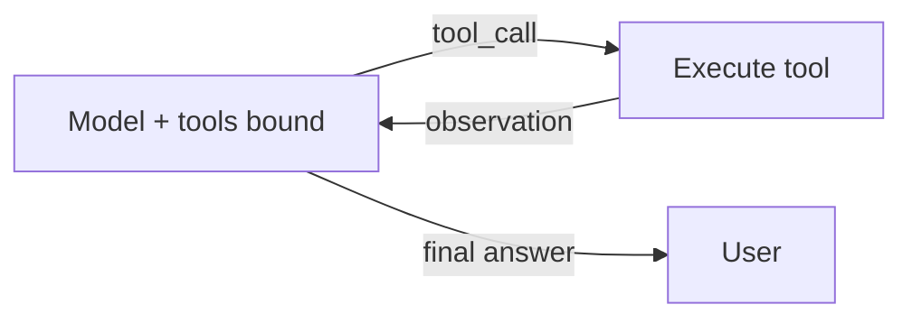

> **Learning goals:** Define a tool with a strict schema; run a tool-calling loop; keep tools portable behind MCP.
> **Prerequisites:** [Chains and LCEL](/docs/ai-agents/langchain/03-chains-and-lcel).

## A good tool is small and honest

```python
from langchain_core.tools import tool

@tool
def lookup_order(order_id: str) -> str:
  """Look up order status by ID. Use exact IDs like #12345."""
  return db.get_status(order_id)
```

Rules: one job, verb-named, description with when-to-use, typed args, string or JSON out, no side effects unless the name says so.

## The calling loop (ReAct, library form)



```python
llm_with_tools = model.bind_tools([lookup_order])
# 1. invoke -> 2. if tool_calls: run them, append ToolMessages, repeat
# 3. else: return answer. Cap at 5 rounds.
```

## Errors and portability

| Failure | Fix |
|---|---|
| Bad args | Return validation error to the model, let it retry once |
| Tool down | Fallback tool or honest "unavailable" — never invent data |
| Locked to LangChain | Put the impl behind MCP; LangChain holds only the adapter |

See [MCP vs Tools](/docs/ai-agents/agent-engineer/mcp-vs-tools) and [Agent harnesses](/docs/ai-agents/agent-engineer/19-agent-harnesses).

## Key takeaways

1. Small typed tools beat mega-tools.
2. Bound the loop; return errors as observations.
3. MCP adapters keep tools swappable when you graduate to graphs.

---

[Previous: Chains and LCEL](/docs/ai-agents/langchain/03-chains-and-lcel) | [Next: RAG with LangChain →](/docs/ai-agents/langchain/05-rag-with-langchain)
