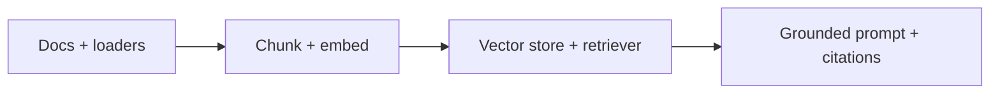

> **Learning goals:** Build a minimal RAG chain; choose chunking; enforce citations and UNKNOWN-when-missing.
> **Prerequisites:** [Tools and tool calling](/docs/ai-agents/langchain/04-tools-and-tool-calling).

## Minimal RAG in three parts



```python
retriever = vectorstore.as_retriever(search_kwargs={"k": 5})
rag = (
  {"context": retriever, "question": lambda x: x["question"]}
  | grounded_prompt | model | parser
)
```

## Chunking that works

| Choice | Default | When to change |
|---|---|---|
| Size | 500–800 tokens, 10–15% overlap | Smaller for FAQs, larger for design docs |
| Metadata | source, page, date on every chunk | Always — citations need it |
| Recency | Boost recent docs | When "current" matters (changelogs, incidents) |

## Grounded generation contract

- Cite every claim: `[source:page]`.
- Say **UNKNOWN** when retrieval is empty — never invent.
- Eval with recall@k + faithfulness (does the answer follow the chunks?).

## Key takeaways

1. RAG = retrieve well, then generate with a citation contract.
2. Chunk metadata is what makes answers verifiable.
3. When RAG needs branching, retries, or approvals, host it in LangGraph.

## Further reading

- [Agentic RAG](/docs/ai-agents/agent-engineer/08-agentic-rag)
- [LangGraph track](/docs/ai-agents/langgraph)

---

[Previous: Tools and tool calling](/docs/ai-agents/langchain/04-tools-and-tool-calling)
