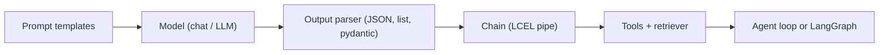

LangChain is the **glue layer**: a standard way to talk to models, format prompts, parse outputs, chain steps, call tools, and ground answers in your own data. You outgrow it the moment you need durable state and approvals — that is when you graduate to [LangGraph](/docs/ai-agents/langgraph).

> **Prerequisites:** [Agent Engineer](/docs/ai-agents/agent-engineer) lessons 1–3 (what agents are, how they think, tools). No LangChain version assumed; all examples use LCEL, the stable core.

## Lessons

1. [What is LangChain?](/docs/ai-agents/langchain/01-what-is-langchain)
2. [Prompts, models, and output parsers](/docs/ai-agents/langchain/02-prompts-models-and-output-parsers)
3. [Chains and LCEL](/docs/ai-agents/langchain/03-chains-and-lcel)
4. [Tools and tool calling](/docs/ai-agents/langchain/04-tools-and-tool-calling)
5. [RAG with LangChain](/docs/ai-agents/langchain/05-rag-with-langchain)

## Where LangChain sits

If your workflow is one path with no branching, LangChain alone is enough. If you need cycles, checkpoints, or human gates, keep the LangChain pieces and run them inside LangGraph nodes.
