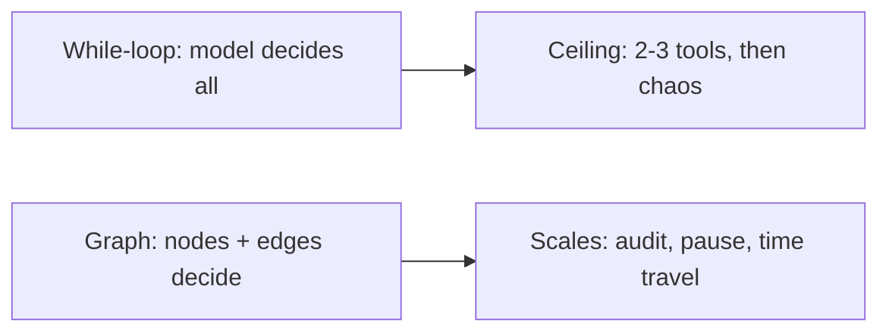

> **Learning goals:** Name the three ceilings of while-loops; map any SOP to nodes and edges; decide loop vs graph.
> **Prerequisites:** [LangChain](/docs/ai-agents/langchain) + [Graph engineering](/docs/ai-agents/agent-engineer/22-graph-engineering).

## The ceiling

While-loops hide routing inside the model prompt: opaque, hard to audit, painful to pause. Graphs move control flow into code.

| While-loop | Graph |
|---|---|
| Route lives in the transcript | Route lives in edges you can read |
| State is a message list | State is a typed schema |
| Resume = replay the chat | Resume = load a checkpoint |

## ELI5: railway vs off-road buggy

Loops are a buggy in the desert — free but easy to flip. Graphs are a railway — stations (nodes), tracks (edges), signals (checkpoints). Loops still exist (a beltway line), but a train cannot derail into an illegal state.

## When to switch

- Same workflow, 3rd production incident from "the model skipped a step" → graph it.
- You need pause-for-approval, resume-after-crash, or who-changed-what → graph it.
- One path, no branches, no humans → stay in LangChain.

## Key takeaways

1. Graphs trade a little freedom for a lot of predictability.
2. Any SOP with gates and retries is already a graph — draw it.
3. The rest of this track builds that drawing into running code.

---

[Next: State schemas and reducers →](/docs/ai-agents/langgraph/02-state-schemas-and-reducers)
