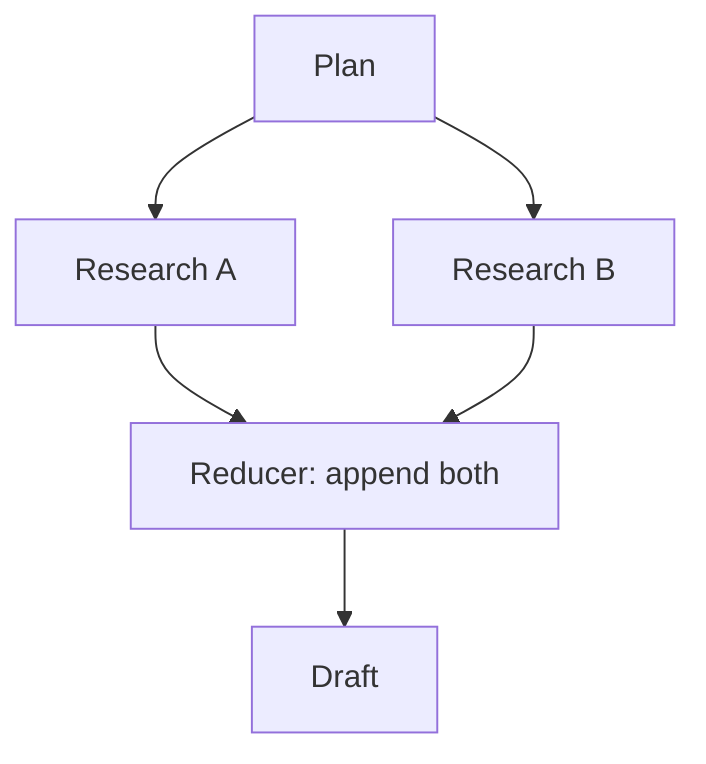

> **Learning goals:** Define typed state; write reducers for parallel branches; keep nodes pure.
> **Prerequisites:** [Why graphs for agents?](/docs/ai-agents/langgraph/01-why-graphs-for-agents).

## Typed state first

```python
from typing import TypedDict, List, Optional

class ReviewState(TypedDict):
  draft: Optional[str]
  comments: List[str]
  score: int
  tries: int
  approved: bool
```

Every node reads this, returns a partial update. Nothing else is shared.

## Reducers: how updates merge

| Strategy | Use for | Example |
|---|---|---|
| Overwrite | Single-writer fields | `draft = new_draft` |
| Append | Multi-writer lists | `comments += [c]` |
| Merge / sum | Counters, dicts | `tries += 1` |

Without reducers, parallel branches clobber each other. With them, fan-out / fan-in is safe:



## Node purity rule

Nodes read state, return a dict diff. No global writes, no hidden I/O outside declared tools. Pure nodes are testable, replayable, and time-travel friendly.

## Key takeaways

1. Schema the state before you code a node.
2. Every list or counter written by 2+ branches needs a reducer.
3. Pure nodes make the whole graph debuggable.

---

[Previous: Why graphs?](/docs/ai-agents/langgraph/01-why-graphs-for-agents) | [Next: Nodes, edges, routing →](/docs/ai-agents/langgraph/03-nodes-edges-and-conditional-routing)
