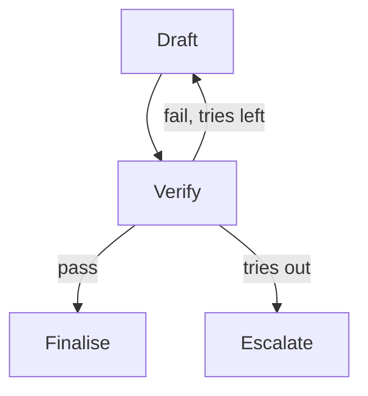

> **Learning goals:** Write single-purpose nodes; route with conditional edges; guard every cycle.
> **Prerequisites:** [State schemas and reducers](/docs/ai-agents/langgraph/02-state-schemas-and-reducers).

## Nodes do one job

- **LLM nodes:** draft, critique, plan — prompt in, state out.
- **Code nodes:** lint, test, query — deterministic, fast.
- **Human nodes:** approve, edit — pause points (next lessons).

Contract each node: inputs it reads, outputs it writes, what must hold before/after, what happens on error.

## Edges decide the journey

```python
def route_after_review(state: ReviewState) -> str:
  if state["score"] >= 90:
    return "deploy"
  if state["tries"] >= 3:
    return "escalate"
  return "revise"
```



## Guard every cycle

Every back-edge needs `tries < N` plus a terminal escape (`escalate`). Unbounded cycles are the #1 graph outage.

| Anti-pattern | Fix |
|---|---|
| Giant do-everything node | Split: generate → test → review |
| Untyped dict state | TypedDict / pydantic schema |
| Cycle without counter | `tries` guard + escalate node |

## Key takeaways

1. Nodes work; edges govern.
2. Conditional edges are small pure functions over state.
3. No cycle ships without a counter and an exit.

---

[Previous: State and reducers](/docs/ai-agents/langgraph/02-state-schemas-and-reducers) | [Next: Loops, memory, checkpointing →](/docs/ai-agents/langgraph/04-loops-memory-and-checkpointing)
