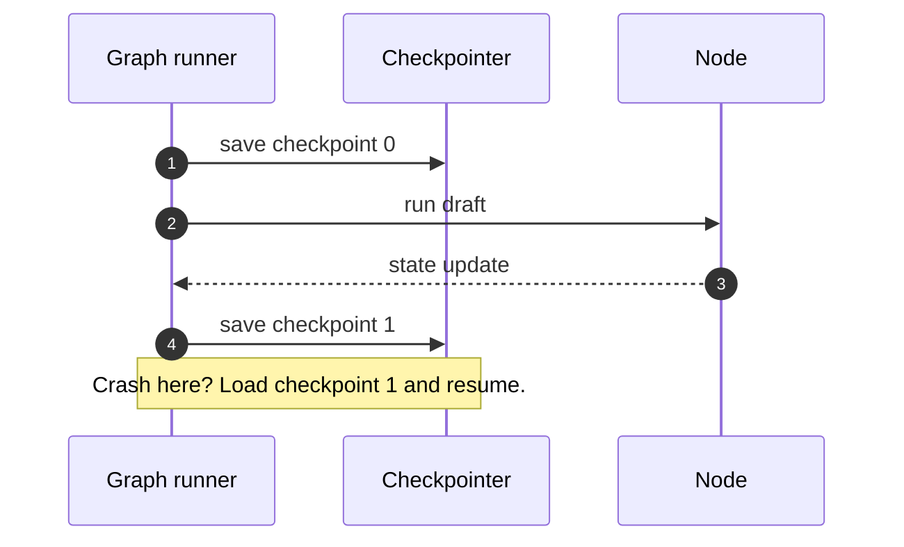

> **Learning goals:** Persist every step with a checkpointer; isolate runs with threads; rewind with time travel.
> **Prerequisites:** [Nodes, edges, routing](/docs/ai-agents/langgraph/03-nodes-edges-and-conditional-routing).

## Checkpointer: memory that survives crashes

After every node, the graph serialises state to SQLite / Postgres. Crash mid-run? Reload the latest checkpoint for that `thread_id` and continue — no replayed LLM calls.

## Threads isolate work

One `thread_id` per user, ticket, or deploy. Parallel runs never share state. Streaming (`astream_events`) keeps long graphs feeling live.

## Time travel for debugging

Load checkpoint N, tweak a field, replay forward down a new branch, compare outcomes. It is `git` for agent runs — and the reason graphs beat loops for postmortems.

| Without checkpointer | With checkpointer |
|---|---|
| Crash restarts everything | Resume from last node |
| "Why did it do that?" is guesswork | Rewind and inspect each state diff |
| HITL needs custom plumbing | Pause is native (next lesson) |

## Key takeaways

1. Checkpointer from day one — persistence is not an optimisation.
2. Threads = isolation; streaming = responsiveness.
3. Time travel turns debugging from archaeology into replay.

---

[Previous: Nodes and routing](/docs/ai-agents/langgraph/03-nodes-edges-and-conditional-routing) | [Next: Human-in-the-loop →](/docs/ai-agents/langgraph/05-human-in-the-loop-and-interrupts)
